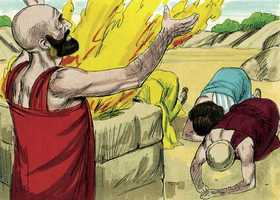
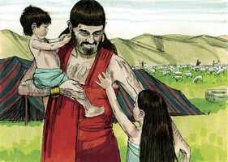

# Jó Cap 42

**1** 	ENTÃO respondeu Jó ao Senhor, dizendo:

> **Cmt MHenry**: *Vv. 1-6.* Agora, jó entende a sua culpa; ele já não fala mais para escusar-se, mas aborrece a si próprio por ser pecador de coração e vida, especialmente por murmurar contra Deus, e assume a vergonha. Quando o entendimento é iluminado pelo Espírito da graça, nosso conhecimento sobre as coisas divinas excedem em muito ao que possuíamos antes, assim como o enxergar com os nossos olhos excede o que nos é informado e o que é de conhecimento comum. Através dos ensinos humanos, Deus revela o seu Filho a nós; porém, através do ensino de seu Espírito, revela o seu Filho em nós (G1 1,16) e transforma-nos, para que tenhamos a mesma imagem dEle ([2 Co 5.18](../47N-2Co/05.md#18)). Devemos nos humilhar profundamente pelos pecados dos quais somos convictos. Aborrecer-se a si mesmo é sempre a companhia do verdadeiro arrependimento, o Senhor levará os que o amam a que o adorem, aborrecendo-se a si mesmos, enquanto a graça verdadeira sempre os levará a confessar seus pecados sem justificar-se.

**2** 	Bem sei eu que tudo podes, e que nenhum dos teus propósitos pode ser impedido.

 

**3** 	Quem é este, que sem conhecimento encobre o conselho? Por isso relatei o que não entendia; coisas que para mim eram inescrutáveis, e que eu não entendia.

**4** 	Escuta-me, pois, e eu falarei; eu te perguntarei, e tu me ensinarás.

**5** 	Com o ouvir dos meus ouvidos ouvi, mas agora te vêem os meus olhos.

**6** 	Por isso me abomino e me arrependo no pó e na cinza.

**7** 	Sucedeu que, acabando o Senhor de falar a Jó aquelas palavras, o Senhor disse a Elifaz, o temanita: A minha ira se acendeu contra ti, e contra os teus dois amigos, porque não falastes de mim o que era reto, como o meu servo Jó.

**8** 	Tomai, pois, sete bezerros e sete carneiros, e ide ao meu servo Jó, e oferecei holocaustos por vós, e o meu servo Jó orará por vós; porque deveras a ele aceitarei, para que eu não vos trate conforme a vossa loucura; porque vós não falastes de mim o que era reto como o meu servo Jó.

**9** 	Então foram Elifaz, o temanita, e Bildade, o suíta, e Zofar, o naamatita, e fizeram como o Senhor lhes dissera; e o Senhor aceitou a face de Jó.

 

**10** 	E o Senhor virou o cativeiro de Jó, quando orava pelos seus amigos; e o Senhor acrescentou, em dobro, a tudo quanto Jó antes possuía.

> **Cmt MHenry**: *Vv. 10-17.* No inicio deste livro, tivemos como exemplo a paciência de Jó submetida a muitas adversidades; aqui, como uma exortação a seguirmos este exemplo, temos o seu final feliz, suas lutas começaram com a maldade de Satanás, a qual Deus limitou; a sua restauração começou com a misericórdia de Deus, à qual Satanás não pôde se opor. A misericórdia não retomou quando Jó disputava com seus "amigos, mas quando orou por eles. sirvamos e agrademos a Deus com a nossa calorosa devoção, e não com as nossas discussões. Deus duplicou as possessões de Jó. Podemos perder muito por amor ao Senhor; porém nada perderemos por estar com Ele. Mesmo que o Senhor nos dê ou não nos conceda saúde e bênçãos temporais, se sofrermos pacientemente conforme a sua vontade, ao final seremos felizes. A fortuna de Jó aumentou, pois a bênção do Senhor enriquece; Ele é quem nos dá poder para alcançarmos riquezas, e nos dá êxito em nossos trabalhos honestos. Os últimos dias de um homem bom às vezes resultam ser os melhores; as suas últimas obras, as melhores; as suas últimas consolações, também as melhores; a sua senda é como a luz da aurora, que aumenta até ser dia perfeito. "

**11** 	Então vieram a ele todos os seus irmãos, e todas as suas irmãs, e todos quantos dantes o conheceram, e comeram com ele pão em sua casa, e se condoeram dele, e o consolaram acerca de todo o mal que o Senhor lhe havia enviado; e cada um deles lhe deu uma peça de dinheiro, e um pendente de ouro.

**12** 	E assim abençoou o Senhor o último estado de Jó, mais do que o primeiro; pois teve catorze mil ovelhas, e seis mil camelos, e mil juntas de bois, e mil jumentas.

 

**13** 	Também teve sete filhos e três filhas.

**14** 	E chamou o nome da primeira Jemima, e o nome da segunda Quezia, e o nome da terceira Quéren-Hapuque.

**15** 	E em toda a terra não se acharam mulheres tão formosas como as filhas de Jó; e seu pai lhes deu herança entre seus irmãos.

**16** 	E depois disto viveu Jó cento e quarenta anos; e viu a seus filhos, e aos filhos de seus filhos, até à quarta geração.

**17** 	Então morreu Jó, velho e farto de dias.

> **Cmt MHenry** Intro: *[Jó 42](../18A-Jo/42.md#0)*> *Versículos 1-6: Jó submete-se com humildade a Deus; 7-9: Jó intercede por seus amigos; 10-17: A renovação de sua prosperidade.*> *Vv.* 7-9. Depois que o Senhor convenceu e humilhou Jó, levou-o ao arrependimento, reconheceu-o, consolou-o e concedeu-lhe honras. O Diabo propôs a mostrar que Jó era hipócrita, e seus três amigos o condenaram como homem mau. Porém, se Deus disse: "Bem está, servo bom e fiel", de pouca importância terá se alguém disser o contrário. Os amigos de Jó praticaram o mal diante de Deus, ao fazer da prosperidade de Jó uma marca da Igreja e da aflição, a prova certa da ira de Deus. Jó, muito mais do que os seus amigos, relacionara os acontecimentos ao juízo e ao estado futuro. Portanto, falou de Deus o que era bom, melhor do que o que tinham feito os seus amigos. E como Jó orou e ofereceu sacrifícios pelos que o contristaram e feriram o seu espírito, assim Cristo orou por seus perseguidores, e sempre intercede pelos transgressores, os amigos de Jó eram homens bons e tementes a Deus, e o Senhor não ia deixá-los em seu erro, não mais que a Jó; porém, após humilhar Jó com o seu discurso desde o redemoinho, toma outro caminho para humilhar seus amigos.\ Eles não têm que discutir o assunto novamente; devem colocar-se de acordo para um sacrifício e uma oração, e isto é o suficiente para reconciliá-los. os que diferem em seu juízo sobre coisas menores, quando são um em Cristo, nosso sacrifício, devem em conseqüência amar-se e suportar-se uns aos outros. Quando Deus se irou com os amigos de Jó, colocou-os a caminho de fazer a paz com Ele. Nossas pelejas com Deus sempre começam de nossa parte; porém, o fazer a paz começa da parte do Senhor. A paz com Deus somente é obtida segundo a sua maneira e as suas condições. Isto nunca parecerá difícil para os que sabem valorizar esta bênção; como os amigos de Jó, alegrar-se-ão com qualquer condição, por mais humilhante que seja. Jó não se ofendeu com seus amigos, mas, por estar Deus bondosamente reconciliado com ele, foi facilmente reconciliado com eles. Em todas as nossas orações e serviços, devemos procurar ser aceitos pelo Senhor; jamais devemos buscar o elogio dos homens, mas, sim, agradar a Deus.