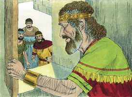

# Salmos Cap 23

**1** 	O SENHOR é o meu pastor, nada me faltará.

 

**2** 	Deitar-me faz em verdes pastos, guia-me mansamente a águas tranqüilas.

**3** 	Refrigera a minha alma; guia-me pelas veredas da justiça, por amor do seu nome.

**4** 	Ainda que eu andasse pelo vale da sombra da morte, não temeria mal algum, porque tu estás comigo; a tua vara e o teu cajado me consolam.

**5** 	Preparas uma mesa perante mim na presença dos meus inimigos, unges a minha cabeça com óleo, o meu cálice transborda.

 

**6** 	Certamente que a bondade e a misericórdia me seguirão todos os dias da minha vida; e habitarei na casa do Senhor por longos dias.

 

> **Cmt MHenry** Intro: *[Salmo 23](../19A-Sl/23.md#0)*> *A confiança na graça e no cuidado de Deus.* "O Senhor é o meu pastor". Estas palavras ensinam o crente a experimentar a satisfação através do cuidado do grandioso Pastor do universo, o Redentor e Preservador dos homens. Quando sente alegria, sabe que tem um Pastor e este Pastor é Jeová.\ Um rebanho de ovelhas, dóceis e inofensivas, que se alimenta em pastos verdejantes sob os cuidados de um temo pastor, hábil e vigilante, constitui um símbolo dos crentes que são trazidos de volta ao Pastor de suas almas.\ Para os ímpios, que se comprazem somente nos sentidos, a maior abundância é somente um pasto seco; porém, para os santos, que através da fé saboreiam a bondade de Deus em tudo o que desfmtam, ainda que tenham pouco no mundo, consideram-no como um pasto verdejante. O Senhor dá paz e satisfação mental, aconteça o que acontecer, somos abençoados com os verdes pastos dos mandamentos. Porém, não pensemos que é o suficiente passarmos por eles, mas permaneçamos neles.\ As consolações do Espírito Santo são as águas de repouso, às quais os santos são conduzidos; os ribeiros que fluem da Fonte de águas vivas.\ Os que andam na senda da justiça são conduzidos às águas de repouso e consolo. O caminho do dever é verdadeiramente prazeroso. A obra da justiça é paz. Não podemos andar nestas sendas se Deus não nos guiar a elas e não prosseguir conosco. A angústia e a desconfiança procedem da incredulidade; a conseqüência é um caminho instável. Então, confiemos simplesmente no cuidado de nosso Pastor e obedeçamos a sua voz.\ O vale da sombra da morte pode indicar a aflição mais severa e terrível, ou a sombria dispensação da providência sob a qual o salmista provavelmente chegou. Entre a parte do rebanho que está na terra e a que foi para o céu, a morte jaz como um vale escuro, que deve ser atravessado de uma à outra parte; porém, ainda nisto, existem palavras que diminuirão o terror. Esta é somente a "sombra" da morte, e a sombra de uma serpente não pica.\ Tampouco a sombra da espada é capaz de matar. E um "vale", sem dúvida, profundo, tenebroso e lamacento; porém, os vales são muitas vezes férteis e, assim, a própria morte é cheia de consolações para o povo de Deus. E um caminho que atravessa; não se perderão neste vale, mas chegarão a salvo à montanha do outro lado. A morte é um rei de terrores; porém, não para as ovelhas de Cristo. Quando chegam à morte, Deus repreende o inimigo; Ele guiará as suas ovelhas com a sua vara, e as sustentará com o seu cajado. No Evangelho há consolação suficiente para os santos quando morrem, e sob eles estão os braços eternos.\ O povo do Senhor tem um banquete em sua mesa com as provisões de seu amor. Satanás e os maus não são capazes de destruir as suas consolações quando eles estão ungidos com o Espírito santo, e bebem do cálice da salvação que sempre está cheio.\ As experiências do passado ensinam aos crentes a confiar que o bem e a misericórdia de Jeová os seguirão todos os dias de sua vida, e o seu desejo e determinação aqui é buscar a sua felicidade no serviço a Deus, e esperam desfrutar de seu amor no céu para sempre. Enquanto estiverem aqui, o Senhor é capaz de tomar grata qualquer situação através da unção do seu Espírito, e pelos benefícios de sua salvação. Porém, os que se satisfarão com as bênçãos de sua casa, devem estar próximos aos deveres desta. "