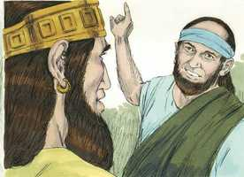

# Isaías Cap 38

**1** 	NAQUELES dias Ezequias adoeceu de uma enfermidade mortal; e veio a ele o profeta Isaías, filho de Amós, e lhe disse: Assim diz o Senhor: Põe em ordem a tua casa, porque morrerás, e não viverás.

> **Cmt MHenry**: *Vv. 1-8.* Quando oramos em nossa enfermidade, ainda que Deus não nos mande uma resposta como a que enviou a Ezequias, nos insta, por seu Espírito, a termos bom animo, nos assegura que nossos pecados são perdoados e que, quer morramos quer vivamos, somos seus e não oramos em vão. Veja [2 Reis 20.1-11](../12A-2Rs/20.md#1).

**2** 	Então virou Ezequias o seu rosto para a parede, e orou ao Senhor.

**3** 	E disse: Ah! Senhor, peço-te, lembra-te agora, de que andei diante de ti em verdade, e com coração perfeito, e fiz o que era reto aos teus olhos. E chorou Ezequias muitíssimo.

**4** 	Então veio a palavra do Senhor a Isaías, dizendo:

**5** 	Vai, e dize a Ezequias: Assim diz o Senhor, o Deus de Davi teu pai: Ouvi a tua oração, e vi as tuas lágrimas; eis que acrescentarei aos teus dias quinze anos.

**6** 	E livrar-te-ei das mãos do rei da Assíria, a ti, e a esta cidade, e defenderei esta cidade.

**7** 	E isto te será da parte do Senhor como sinal de que o Senhor cumprirá esta palavra que falou.

 

**8** 	Eis que farei retroceder dez graus a sombra lançada pelo sol declinante no relógio de Acaz. Assim retrocedeu o sol os dez graus que já tinha declinado.

**9** 	O escrito de Ezequias, rei de Judá, de quando adoeceu e sarou de sua enfermidade:

> **Cmt MHenry**: *Vv. 9-22.* Aqui temos a ação de graças de Ezequias. E bom que recordemos as misericórdias que recebemos durante as enfermidades. Ezequias narra a condição em que se encontrava, e insiste nisto: já não mais verei a Jeová na terra dos viventes. o homem bom não deseja viver para nenhum outro fim, que não seja para servir a Deus e ter comunhão com Ele. A nossa residência presente é como a de um pastor de ovelhas em sua cabana: um alojamento pobre, baixo e frio, e com uma obrigação que pesa sobre nós, como tem o pastor. Nossos dias são comparados com o tear do tecelão ([Jó 7.6](../18A-Jo/07.md#6)). Passa e repassa velozmente, e em cada fileira deixa um fio; e quando está terminada, corta-se a peça, tira-se do tear e é mostrada ao Senhor Jesus para ser julgada. Quando a vida do homem bom é cortada, seus cuidados e fatigas são cortados também, e ele repousa de seus labores. Porém, os nossos dias estão nas mãos de Deus; Ele tem designado qual será a extensão da nossa vida. Quando estamos enfermos, somos bons para calcular os nossos dias, mas de forma incerta. Deveriamos nos preocupar mais em como chegarmos salvos ao outro mundo. Quanto mais saboreamos a paciência amorosa de Deus, mais o nosso coração o amará e viverá para Ele. Cristo livrou, com amor, as nossas pobres almas da morte, o perdão não faz com que o pecado deixe de ser pecado, mas é castigado como merece. E agradável pensar em nossa recuperação da enfermidade quando a vemos fluir do perdão do pecado. A oportunidade de Ezequias para glorificar a Deus neste mundo foi convertida na atividade, prazer e finalidade de sua vida. Estando recuperado, resolve abundar em louvores e em servir a Deus. As promessas de Deus não são para eliminar o uso de remédios, mas para vivificar e estimular o seu uso. A vida e a saúde nos são dadas para que glorifiquemos a Deus e façamos o bem.

**10** 	Eu disse: No cessar de meus dias ir-me-ei às portas da sepultura; já estou privado do restante de meus anos.

**11** 	Disse: Não verei ao Senhor, o Senhor na terra dos viventes; jamais verei o homem com os moradores do mundo.

**12** 	Já o tempo da minha vida se foi, e foi arrebatada de mim, como tenda de pastor; cortei a minha vida como tecelão; ele me cortará do tear; desde a manhã até à noite me acabarás.

**13** 	Esperei com paciência até à madrugada; como um leão quebrou todos os meus ossos; desde a manhã até à noite me acabarás.

**14** 	Como o grou, ou a andorinha, assim eu chilreava, e gemia como a pomba; alçava os meus olhos ao alto; ó Senhor, ando oprimido, fica por meu fiador.

**15** 	Que direi? Como me prometeu, assim o fez; assim passarei mansamente por todos os meus anos, por causa da amargura da minha alma.

**16** 	Senhor, por estas coisas se vive, e em todas elas está a vida do meu espírito, portanto cura-me e faze-me viver.

**17** 	Eis que foi para a minha paz que tive grande amargura, mas a ti agradou livrar a minha alma da cova da corrupção; porque lançaste para trás das tuas costas todos os meus pecados.

**18** 	Porque não te louvará a sepultura, nem a morte te glorificará; nem esperarão em tua verdade os que descem à cova.

**19** 	O vivente, o vivente, esse te louvará, como eu hoje o faço; o pai aos filhos fará notória a tua verdade.

**20** 	O Senhor veio salvar-me; por isso, tangendo em meus instrumentos, nós o louvaremos todos os dias de nossa vida na casa do Senhor.

**21** 	E dissera Isaías: Tomem uma pasta de figos, e a ponham como emplastro sobre a chaga; e sarará.

**22** 	Também dissera Ezequias: Qual será o sinal de que hei de subir à casa do Senhor?

> **Cmt MHenry** Intro: *[Isaías 38](../23A-Is/38.md#0)*> *Versículos 1-8: A enfermidade e a recuperação de Ezequias; 9-22: Sua ação de graças.*