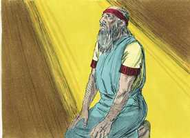
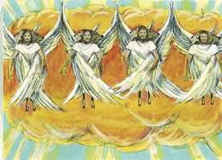
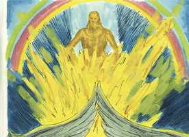
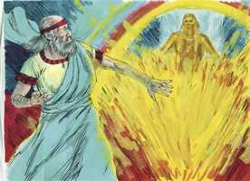

# Ezequiel Cap 01

**1** 	E ACONTECEU no trigésimo ano, no quarto mês, no quinto dia do mês, que estando eu no meio dos cativos, junto ao rio Quebar, se abriram os céus, e eu tive visões de Deus.

> **Cmt MHenry**: *Vv. 1-14.* E um ato de misericórdia quando nos trazem a Palavra de Deus, e é nosso dever atendê-la com diligência quando estamos aflitos. A voz de Deus veio com plenitude de luz e poder pelo Espírito Santo. Estas visões parecem ter sido enviadas para possuir a mente do profeta com grandes e elevados pensamentos de Deus, para golpear os pecadores com terror e falar de consolo àqueles que temiam a Deus e se humilhavam. Nos versículos 4-14, está a primeira parte da visão; representa a Deus atendido e servido por uma vasta companhia de anjos, todos seus mensageiros, ministros que executam as suas ordens. Esta visão impressionaria a mente com exagero e temor solene do descontentamento divino, ainda que suscitando expectativas de bênçãos, o fogo está rodeado de glória. Ainda que o busquemos, não poderiamos contemplar a Deus em toda a sua plenitude, mas vemos o esplendor que o rodeia. A semelhança dos seres viventes sai do meio do fogo; os anjos recebem de Deus tanto o seu ser como o seu poder; têm o entendimento do homem e muito mais. Um leão se destaca em força e ousadia. Um boi se destaca em diligência e paciência, no cumprimento infatigável do trabalho que faz. A águia se destaca pela rapidez, ótima visão e por voar muito alto, e os anjos, que superam os homens em todos estes aspectos, são representados com este parecer, os anjos têm asas, e qualquer coisa que Deus lhes ordena fazem prontamente. Eles estão elevados, firmes e constantes. Não tinham asas somente para se locomoverem, mas tinham mãos para agir. Muitas pessoas são rápidas, alas não ativas; se apressam, porém, sem fazer nada com propósito; têm asas, mas faltam-lhes mãos. Contudo, onde quer que as asas dos anjos os levassem, tinham suas mãos consigo, para fazer o que o seu dever requeria. Qualquer que fosse o serviço que os ocupava, iam direto a eles, um de cada vez. Quando andamos direito, vamos adiante, e quando servimos a Deus com um só coração fazemos a obra. Eles não se voltavam quando iam; não cometiam erros, e a sua obra não precisava ser feita novamente. Não deixavam o seu trabalho para se entreterem com qualquer outra coisa, e iam aonde o Espírito de Deus queria que fossem. O profeta viu a estes seres viventes por sua própria luz, porque o seu aspecto era como brasas de fogo; são serafins ou "ardentes" o que denota o ardor de seu amor por Deus e o fervente zelo por seu serviço. Podemos aprender proveitosas lições dos temas a que podemos ter acesso ou entender completamente. Atendamos as coisas relacionadas à nossa paz e dever, e deixemos as coisas secretas ao único Senhor ao qual pertencem.

> **Cmt MHenry**: *[Ezequiel 1](../26A-Ez/01.md#0)*

 

**2** 	No quinto dia do mês, no quinto ano do cativeiro do rei Jeoiaquim,

**3** 	Veio expressamente a palavra do Senhor a Ezequiel, filho de Buzi, o sacerdote, na terra dos caldeus, junto ao rio Quebar, e ali esteve sobre ele a mão do Senhor.

**4** 	Olhei, e eis que um vento tempestuoso vinha do norte, uma grande nuvem, com um fogo revolvendo-se nela, e um resplendor ao redor, e no meio dela havia uma coisa, como de cor de âmbar, que saía do meio do fogo.

**5** 	E do meio dela saía a semelhança de quatro seres viventes. E esta era a sua aparência: tinham a semelhança de homem.

 

**6** 	E cada um tinha quatro rostos, como também cada um deles quatro asas.

**7** 	E os seus pés eram pés direitos; e as plantas dos seus pés como a planta do pé de uma bezerra, e luziam como a cor de cobre polido.

**8** 	E tinham mãos de homem debaixo das suas asas, aos quatro lados; e assim todos quatro tinham seus rostos e suas asas.

**9** 	Uniam-se as suas asas uma à outra; não se viravam quando andavam, e cada qual andava continuamente em frente.

**10** 	E a semelhança dos seus rostos era como o rosto de homem; e do lado direito todos os quatro tinham rosto de leão, e do lado esquerdo todos os quatro tinham rosto de boi; e também tinham rosto de águia todos os quatro.

**11** 	Assim eram os seus rostos. As suas asas estavam estendidas por cima; cada qual tinha duas asas juntas uma a outra, e duas cobriam os corpos deles.

**12** 	E cada qual andava para adiante de si; para onde o espírito havia de ir, iam; não se viravam quando andavam.

**13** 	E, quanto à semelhança dos seres viventes, o seu aspecto era como ardentes brasas de fogo, com uma aparência de lâmpadas; o fogo subia e descia por entre os seres viventes, e o fogo resplandecia, e do fogo saíam relâmpagos;

**14** 	E os seres viventes corriam, e voltavam, à semelhança de um clarão de relâmpago.

**15** 	E vi os seres viventes; e eis que havia uma roda sobre a terra junto aos seres viventes, uma para cada um dos quatro rostos.

> **Cmt MHenry**: *Vv. 15-25.* A providência, representada pelas rodas, produz mudanças. As vezes um raio da roda está acima, às vezes outro, mas o movimento da roda sobre o seu próprio eixo é uniforme e constante. Não devemos desfalecer quando estivermos em adversidades; as rodas giram e nos levantarão no momento devido, enquanto aqueles que presumem que serão prósperos não sabem quão sujeitos estão a serem repentinamente derrubados. A roda está próxima dos seres viventes; os anjos são encarregados como ministros da providência de Deus. O Espírito dos seres viventes estava nas rodas; a mesma sabedoria, poder e santidade de Deus, que dirige e governa os anjos, ordena por eles tudo o que acontece no mundo. As rodas tinham quatro rostos; isso denotava que a providência de Deus é exercida em todas as partes. Observe que a roda da providência tem, de todos os ângulos, um rosto voltado para você. Seu aspecto e obra eram como de uma roda em meio a outra roda. As disposições da providência nos parecem obscuras, confusas e são inumeráveis, mas todas estão sabiamente ordenadas para o melhor. O movimento das rodas era uniforme, regular e constante. Andavam conforme o Espírito lhes mandava, portanto não retomavam. Se seguirmos a direção do Espírito Santo, não precisaremos desfazer aquilo que fizemos de forma errada, por nos arrependermos, os aros e as bordas das rodas eram tão grandes, que, quando se movimentaram, o profeta temeu olhar para eles. A consideração da altura e da profundidade dos conselhos de Deus deve nos deixar perplexos e com assombro. Estavam cheias de olhos em seus contornos, os movimentos da providência, são todos dirigidos pela sabedoria infinita. Todas as ações estão determinadas pelos olhos do Senhor, que estão em todas as partes contemplando o mal e o bem; não existe algo tal como a sorte e a fortuna, o firmamento de cima era como cristal, glorioso, mas de forma terrível, isto que consideramos ser uma nuvem negra, para Deus é claro como o cristal, através do qual Ele vê todos os habitantes da terra. Quando os anjos despertaram para um mundo desconsiderado, eles baixaram as suas asas para que se ouvisse claramente a voz de Deus. A voz da providência serve para abrir os ouvidos dos homens para a voz da Palavra. Os sons da terra devem despertar a nossa atenção para a voz do céu, pois como escaparemos se nos afastarmos daquEle que fala de lá?

**16** 	O aspecto das rodas, e a obra delas, era como a cor de berilo; e as quatro tinham uma mesma semelhança; e o seu aspecto, e a sua obra, era como se estivera uma roda no meio de outra roda.

**17** 	Andando elas, andavam pelos seus quatro lados; não se viravam quando andavam.

**18** 	E os seus aros eram tão altos, que faziam medo; e estas quatro tinham as suas cambotas cheias de olhos ao redor.

**19** 	E, andando os seres viventes, andavam as rodas ao lado deles; e, elevando-se os seres viventes da terra, elevavam-se também as rodas.

**20** 	Para onde o espírito queria ir, eles iam; para onde o espírito tinha de ir; e as rodas se elevavam defronte deles, porque o espírito do ser vivente estava nas rodas.

**21** 	Andando eles, andavam elas e, parando eles, paravam elas e, elevando-se eles da terra, elevavam-se também as rodas defronte deles; porque o espírito do ser vivente estava nas rodas.

**22** 	E sobre as cabeças dos seres viventes havia uma semelhança de firmamento, com a aparência de cristal terrível, estendido por cima, sobre as suas cabeças.

**23** 	E debaixo do firmamento estavam as suas asas direitas uma em direção à outra; cada um tinha duas, que lhe cobriam o corpo de um lado; e cada um tinha outras duas asas, que os cobriam do outro lado.

**24** 	E, andando eles, ouvi o ruído das suas asas, como o ruído de muitas águas, como a voz do Onipotente, um tumulto como o estrépito de um exército; parando eles, abaixavam as suas asas.

**25** 	E ouviu-se uma voz vinda do firmamento, que estava por cima das suas cabeças; parando eles, abaixavam as suas asas.

**26** 	E por cima do firmamento, que estava por cima das suas cabeças, havia algo semelhante a um trono que parecia de pedra de safira; e sobre esta espécie de trono havia uma figura semelhante à de um homem, na parte de cima, sobre ele.

> **Cmt MHenry**: *Vv. 26-28. O* Filho eterno, a Segunda Pessoa da Trindade, que um dia tomou a natureza humana, é denotado aqui. A primeira coisa que se observa é um trono; um trono de glória, de graça, de triunfo, um trono de governo e de juízo. E bom para os homens que o trono, acima do firmamento, esteja repleto com a presença de alguém que mesmo ali se mostre exteriormente semelhante ao homem. O trono está rodeado por um arco-íris, o bem conhecido sacramento do pacto, que representa a misericórdia e o amor pactuado de Deus com o seu povo. O fogo da ira de Deus estava irrompendo contra Jerusalém, mas seriam colocados (imites a ele; Ele olharia por cima do arco e se lembraria do pacto. Tudo o que o profeta contemplou serviu somente a fim de prepará- lo para o que iria ouvir. Quando caiu prostrado sobre o seu rosto, ouviu a voz de Deus. Deus se deleita em ensinar o humilde. Então, que os pecadores se humilhem diante dEle. Que os crentes pensem em sua glória para serem, aos poucos, transformados à sua imagem pelo Espírito do Senhor. "

 

**27** 	E vi-a como a cor de âmbar, como a aparência do fogo pelo interior dele ao redor, desde o aspecto dos seus lombos, e daí para cima; e, desde o aspecto dos seus lombos e daí para baixo, vi como a semelhança de fogo, e um resplendor ao redor dele.

**28** 	Como o aspecto do arco que aparece na nuvem no dia da chuva, assim era o aspecto do resplendor em redor. Este era o aspecto da semelhança da glória do Senhor; e, vendo isto, caí sobre o meu rosto, e ouvi a voz de quem falava.

 

> **Cmt MHenry** Intro: *Versículos 1-14: A visão que Ezequiel tem de Deus e da hoste angelical; 15-25: A conduta da divina providência; 26-28: A revelação do Filho do Homem em seu trono celestial.*