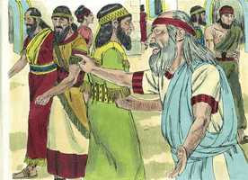

# Ezequiel Cap 02

**1** 	E DISSE-ME: Filho do homem, põe-te em pé, e falarei contigo.

> **Cmt MHenry**: *Vv. 1-5.* Para que Ezequiel não se envaidecesse com a abundância de revelações, é chamado de filho do homem, criatura fraca e mortal. Como Cristo era habitualmente chamado de Filho do homem, esta também foi para Ezequiel uma distinção honrosa. A postura de Ezequiel mostra reverência, mas levantar-se seria uma postura de maior aptidão e vontade para entrar em ação. Deus falará conosco quando estivermos prontos para fazer aquilo que Ele nos ordena. Como Ezequiel não possuía força própria, o Espírito entrou nele. Deus, por sua graça, se agrada em realizar em nós aquilo que requer de nós. O Espírito Santo nos coloca de pé, inclinando as nossas vontades ao nosso dever. Assim, pois, quando o Senhor chama o pecador para que se desperte e atenda os interesses de sua alma, o Espírito de vida e graça traz o chamado. Ezequiel é enviado aos filhos de Israel com uma mensagem. Muitos poderíam tratar esta mensagem com desprezo, mas deveríam saber, pelo acontecimento, que um profeta lhes fora enviado. Deus será glorificado e a sua Palavra honrada, para que seja sabor de vida para a vida, ou de morte para a morte.

 

**2** 	Então entrou em mim o Espírito, quando ele falava comigo, e me pôs em pé, e ouvi o que me falava.

> **Cmt MHenry**: *[Ezequiel 2](../26A-Ez/02.md#0)*

**3** 	E disse-me: Filho do homem, eu te envio aos filhos de Israel, às nações rebeldes que se rebelaram contra mim; eles e seus pais transgrediram contra mim até este mesmo dia.

 

**4** 	E os filhos são de semblante duro, e obstinados de coração; eu te envio a eles, e lhes dirás: Assim diz o Senhor Deus.

**5** 	E eles, quer ouçam quer deixem de ouvir (porque eles são casa rebelde), hão de saber, contudo, que esteve no meio deles um profeta.

**6** 	E tu, ó filho do homem, não os temas, nem temas as suas palavras; ainda que estejam contigo sarças e espinhos, e tu habites entre escorpiões, não temas as suas palavras, nem te assustes com os seus semblantes, porque são casa rebelde.

> **Cmt MHenry**: *Vv. 6-10.* Aqueles que desejam servir a Deus não devem temer aos homens, os ímpios são como cardos e espinhos, mas estão preparados para a maldição, e o seu fim é serem queimados. O profeta deve ser fiel às almas daqueles para os quais foi enviado. Todos aqueles que falam da parte de Deus ao próximo devem obedecer a sua voz. Tomar consciência do pecado e das advertências da ira deve ser motivo de lamento. Aqueles que estão familiarizados com a Palavra de Deus perceberão claramente que ela está cheia de ais para os pecadores não arrependidos; e que todas as promessas preciosas do Evangelho são para os servos crentes e arrependidos do Senhor.

**7** 	Mas tu lhes dirás as minhas palavras, quer ouçam quer deixem de ouvir, pois são rebeldes.

**8** 	Mas tu, ó filho do homem, ouve o que eu te falo, não sejas rebelde como a casa rebelde; abre a tua boca, e come o que eu te dou.

**9** 	Então vi, e eis que uma mão se estendia para mim, e eis que nela havia um rolo de livro.

**10** 	E estendeu-o diante de mim, e ele estava escrito por dentro e por fora; e nele estavam escritas lamentações, e suspiros e ais.

> **Cmt MHenry** Intro: *Versículos 1-5: E ordenado ao profeta aquilo que deve fazer. 6-10: Ele é exortado a ser corajoso, fiel e devoto.*