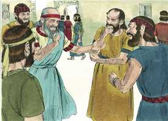

# Ezequiel Cap 11

**1** 	ENTÃO me levantou o Espírito, e me levou à porta oriental da casa do Senhor, a qual olha para o oriente; e eis que estavam à entrada da porta vinte e cinco homens; e no meio deles vi a Jaazanias, filho de Azur, e a Pelatias, filho de Benaia, príncipes do povo.

> **Cmt MHenry**: *Vv. 1-13.* Onde Satanás não pode convencer os homens a considerarem os juízos vindouros como incertos, ganha o seu argumento persuadindo-os para que os considerem distantes. Estes reis perversos ousam dizer: Estamos tão seguros nesta cidade como a carne em uma panela que ferve; os muros da cidade serão para nós como muros de bronze, não receberemos mais danos dos sitiadores do que o caldeirão do fogo. Quando os pecadores se afagam para a sua própria destruição, é hora de dizer-lhes que não terão paz se continuarem agindo assim. Ninguém terá posse da cidade, a não ser os que estão enterrados nela. Aqueles que se sentem mais seguros são os que menos estão a salvo. Deus costuma se comprazer em apartar alguns pecadores para advertência de outros. Não se sabe ao certo se Pelatias morreu nessa época em Jerusalém, ou quando se aproximava o cumprimento da profecia. Como Ezequiel, também devemos nos sentir afetados pela morte súbita do próximo a ponto de implorar ao Senhor que tenha misericórdia daqueles que ficam.

**2** 	E disse-me: Filho do homem, estes são os homens que maquinam perversidade, e dão mau conselho nesta cidade.

**3** 	Os quais dizem: Não está próximo o tempo de edificar casas; esta cidade é o caldeirão, e nós a carne.

**4** 	Portanto, profetiza contra eles; profetiza, ó filho do homem.

**5** 	Caiu, pois, sobre mim o Espírito do Senhor, e disse-me: Fala: Assim diz o Senhor: Assim haveis falado, ó casa de Israel, porque, quanto às coisas que vos sobem ao espírito, eu as conheço.

**6** 	Multiplicastes os vossos mortos nesta cidade, e enchestes as suas ruas de mortos.

**7** 	Portanto, assim diz o Senhor Deus: Vossos mortos, que deitastes no meio dela, esses são a carne e ela é o caldeirão; a vós, porém, vos tirarei do meio dela.

**8** 	Temestes a espada, e a espada trarei sobre vós, diz o Senhor Deus.

**9** 	E vos farei sair do meio dela, e vos entregarei na mão de estrangeiros, e exercerei os meus juízos entre vós.

**10** 	Caireis à espada, e nos confins de Israel vos julgarei; e sabereis que eu sou o Senhor.

**11** 	Esta cidade não vos servirá de caldeirão, nem vós servireis de carne no meio dela; nos confins de Israel vos julgarei.

> **Cmt MHenry**: *[Ezequiel 11](../26A-Ez/11.md#0)*

**12** 	E sabereis que eu sou o Senhor, porque não andastes nos meus estatutos, nem cumpristes os meus juízos; antes fizestes conforme os juízos dos gentios que estão ao redor de vós.

**13** 	E aconteceu que, profetizando eu, morreu Pelatias, filho de Benaia; então caí sobre o meu rosto, e clamei com grande voz, e disse: Ah! Senhor Deus! Porventura darás tu fim ao remanescente de Israel?

**14** 	Então veio a mim a palavra do Senhor, dizendo:

> **Cmt MHenry**: *Vv. 14-21.* Os cativos piedosos da Babilônia foram insultados pelos judeus que continuavam em Jerusalém; porém, Deus lhes fez promessas de graça. E prometido a eles que Deus lhes dará um coração firmemente estabelecido nEle, e não inconstante. Todos os que são feitos santos têm um espírito novo, um temperamento novo e uma nova disposição; eles agem a partir de novos princípios, andam de acordo com novas regras e apontam para novos objetivos. Um novo homem, ou um novo semblante, para nada servem sem um espírito novo. Se um homem está em Cristo, nova criatura é. Não se pode tornar sensível um coração carnal, duro como pedra, os homens vivem entre os mortos, e aqueles que estão morrendo nunca se preocupam nem se humilham. Ele fará que os seus corações sejam temos e aptos para receberem novas impressões: esta é a obra de Deus, seu dom pela promessa; e uma mudança feliz e maravilhosa acontece devido a ela, da morte para a vida, os seus costumes serão coerentes com estes princípios, os dois devem estar e estarão de acordo. Quando o pecador sente a necessidade destas bênçãos, deve apresentar estas promessas em oração no nome de Cristo, e elas se cumprirão.

**15** 	Filho do homem, teus irmãos, sim, teus irmãos, os homens de teu parentesco, e toda a casa de Israel, todos eles são aqueles a quem os habitantes de Jerusalém disseram: Apartai-vos para longe do Senhor; esta terra nos foi dada em possessão.

**16** 	Portanto, dize: Assim diz o Senhor Deus: Ainda que os lancei para longe entre os gentios, e ainda que os espalhei pelas terras, todavia lhes serei como um pequeno santuário, nas terras para onde forem.

**17** 	Portanto, dize: Assim diz o Senhor Deus: Hei de ajuntar-vos do meio dos povos, e vos recolherei das terras para onde fostes lançados, e vos darei a terra de Israel.

**18** 	E virão ali, e tirarão dela todas as suas coisas detestáveis e todas as suas abominações.

**19** 	E lhes darei um só coração, e um espírito novo porei dentro deles; e tirarei da sua carne o coração de pedra, e lhes darei um coração de carne;

**20** 	Para que andem nos meus estatutos, e guardem os meus juízos, e os cumpram; e eles me serão por povo, e eu lhes serei por Deus.

**21** 	Mas, quanto àqueles cujo coração andar conforme o coração das suas coisas detestáveis, e as suas abominações, farei recair nas suas cabeças o seu caminho, diz o Senhor Deus.

**22** 	Então os querubins elevaram as suas asas, e as rodas os acompanhavam; e a glória do Deus de Israel estava em cima sobre eles.

> **Cmt MHenry**: *Vv. 22-25.* Aqui está a partida da presença de Deus da cidade e do templo. A visão subiu do Monte das Oliveiras, tipificando a ascensão de Cristo ao céu deste mesmo monte. Ainda que o Senhor não abandone o seu povo, pode, contudo, se afastar de qualquer parte da sua igreja pelos pecados dela, e o "ai" cairá sobre eles quando retirar a sua presença, glória e proteção. "

**23** 	E a glória do Senhor se alçou desde o meio da cidade; e se pôs sobre o monte que está ao oriente da cidade.

**24** 	Depois o Espírito me levantou, e me levou à Caldéia, para os do cativeiro, em visão, pelo Espírito de Deus; e subiu de sobre mim a visão que eu tinha tido.

**25** 	E falei aos do cativeiro todas as coisas que o Senhor me havia mostrado.

 

> **Cmt MHenry** Intro: *Versículos 1-13: Os juízos divinos contra o ímpio de Jerusalém; 14­21: O favor divino para os do cativeiro; 22-25: A presença divina abandona a cidade.*