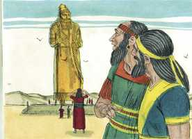
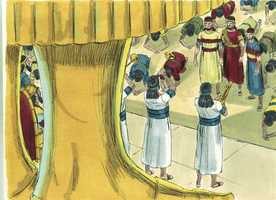
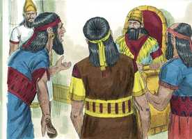
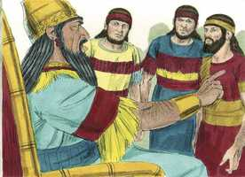
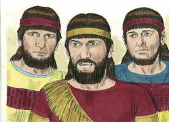
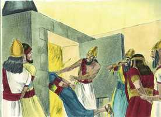
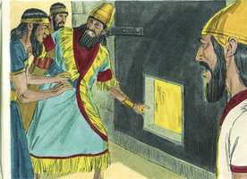
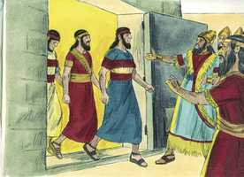
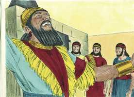
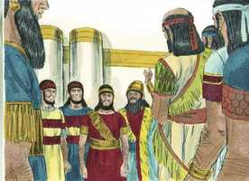

# Daniel Cap 03

**1** 	O REI Nabucodonosor fez uma estátua de ouro, cuja altura era de sessenta côvados, e a sua largura de seis côvados; levantou-a no campo de Dura, na província de Babilônia.

> **Cmt MHenry**: *Vv. 1-7.* Provavelmente a altura da imagem, cerca de vinte e sete metros, incluía um pedestal e, provavelmente estava adornada com placas de ouro, não sendo uma massa sólida deste metal precioso. O orgulho e o fanatismo fazem os homens exigirem que os seus súditos sigam a sua reli­gião, seja boa, seja má, e poucos se negam quando o interesse mundano e o castigo os opri­mem. Isto é fácil para o indolente, o sensual e o infiel, que constituem a grande maioria, e muitos seguirão por estes caminhos. Nada é tão mau que impeça o mundo negligente de se deixar atrair por um concerto musical, ao invés de ser lançado em uma fornalha ardente. A falsa adoração tem se estabelecido e se mantido por meio de métodos como este.

 

**2** 	Então o rei Nabucodonosor mandou reunir os príncipes, os prefeitos, os governadores, os conselheiros, os tesoureiros, os juízes, os capitães, e todos os oficiais das províncias, para que viessem à consagração da estátua que o rei Nabucodonosor tinha levantado.

**3** 	Então se reuniram os príncipes, os prefeitos e governadores, os capitães, os juízes, os tesoureiros, os conselheiros, e todos os oficiais das províncias, à consagração da estátua que o rei Nabucodonosor tinha levantado; e estavam em pé diante da imagem que Nabucodonosor tinha levantado.

> **Cmt MHenry**: *CAPÍTULO 30A-Am 31A-Ob 32A-Jn 33A-Mq 34A-Na 35A-Hc 36A-Sf 37A-Ag 38A-Zc 39A-Ml

**4** 	E o arauto apregoava em alta voz: Ordena-se a vós, ó povos, nações e línguas:

 

**5** 	Quando ouvirdes o som da buzina, da flauta, da harpa, da sambuca, do saltério, da gaita de foles, e de toda a espécie de música, prostrar-vos-eis, e adorareis a estátua de ouro que o rei Nabucodonosor tem levantado.

**6** 	E qualquer que não se prostrar e não a adorar, será na mesma hora lançado dentro da fornalha de fogo ardente.

**7** 	Portanto, no mesmo instante em que todos os povos ouviram o som da buzina, da flauta, da harpa, da sambuca, do saltério e de toda a espécie de música, prostraram-se todos os povos, nações e línguas, e adoraram a estátua de ouro que o rei Nabucodonosor tinha levantado.

 

**8** 	Por isso, no mesmo instante chegaram perto alguns caldeus, e acusaram os judeus.

> **Cmt MHenry**: *Vv. 8-18.* A verdadeira devoção acalma, aquieta e abranda o espírito, mas a superstição e a devoção para com falsos deuses inflamam as paixões dos homens. Há poucas alternativas: ou se converte ou arderá. Os soberbos ainda estão dispostos a pensar como Nabucodonosor: Quem é Jeová para que eu deva temê-lo? Sadraque, Mesaque e Abede-Nego não vacilaram, considerando se deveríam ou não obedecer. A consideração não era a vida ou a morte. Aque­les que evitam o pecado não devem negociar com a tentação quando aquilo que procura os seduzir é abertamente mau. Não devemos nos deter a pensar, mas, assim como o Senhor Jesus Cristo fez, devemos dizer: Vai-te, Satanás! Eles não pensaram em uma resposta evasiva na ocasião em que uma resposta direta foi requerida. Aqueles que colocam o seu principal interesse em seu dever não devem angustiar- se nem temer. Os fiéis servos de Deus sabem que Ele é poderoso para controlar e dominar a todas as potestades armadas contra eles. Senhor, se images-old_bible_pictures.csv Notas Bíblia de Estudo NVI-out_images.txt quiseres, tu podes. Se Ele está a *nosso* favor, não temamos o que o homem nos possa fazer. Deus nos livrará da morte ou “por meio” da morte. Eles devem obedecer a Deus, e não ao homem; melhor ainda, devem sofrer ao invés de pecar; e não devem fazer o mal para que recebam o bem. Portanto, nenhuma destas coisas os comoveu. Salvá-los de cometer pecados foi um milagre tão grande no reino da graça, quanto foi tirá-los sãos e salvos da fornalha ardente, no reino da natureza. O temor ao homem e o amor ao mundo, especialmente a falta de fé, fazem com que os homens rendam-se à tentação, enquanto que uma firme convicção da verdade os livrará de negarem a Cristo ou de envergo­nharem-se dEle. Temos que ser mansos para responder, mas devemos ser decididos para obedecer antes a Deus do que ao homem.

**9** 	E responderam, dizendo ao rei Nabucodonosor: Ó rei, vive eternamente!

 

**10** 	Tu, ó rei, fizeste um decreto, pelo qual todo homem que ouvisse o som da buzina, da flauta, da harpa, da sambuca, do saltério, e da gaita de foles, e de toda a espécie de música, se prostrasse e adorasse a estátua de ouro;

**11** 	E, qualquer que não se prostrasse e adorasse, seria lançado dentro da fornalha de fogo ardente.

**12** 	Há uns homens judeus, os quais constituíste sobre os negócios da província de Babilônia: Sadraque, Mesaque e Abednego; estes homens, ó rei, não fizeram caso de ti; a teus deuses não servem, nem adoram a estátua de ouro que levantaste.

**13** 	Então Nabucodonosor, com ira e furor, mandou trazer a Sadraque, Mesaque e Abednego. E trouxeram a estes homens perante o rei.

**14** 	Falou Nabucodonosor, e lhes disse: É de propósito, ó Sadraque, Mesaque e Abednego, que vós não servis a meus deuses nem adorais a estátua de ouro que levantei?

 

**15** 	Agora, pois, se estais prontos, quando ouvirdes o som da buzina, da flauta, da harpa, da sambuca, do saltério, da gaita de foles, e de toda a espécie de música, para vos prostrardes e adorardes a estátua que fiz, bom é; mas, se não a adorardes, sereis lançados, na mesma hora, dentro da fornalha de fogo ardente. E quem é o Deus que vos poderá livrar das minhas mãos?

**16** 	Responderam Sadraque, Mesaque e Abednego, e disseram ao rei Nabucodonosor: Não necessitamos de te responder sobre este negócio.

 

**17** 	Eis que o nosso Deus, a quem nós servimos, é que nos pode livrar; ele nos livrará da fornalha de fogo ardente, e da tua mão, ó rei.

**18** 	E, se não, fica sabendo ó rei, que não serviremos a teus deuses nem adoraremos a estátua de ouro que levantaste.

**19** 	Então Nabucodonosor se encheu de furor, e mudou-se o aspecto do seu semblante contra Sadraque, Mesaque e Abednego; falou, e ordenou que a fornalha se aquecesse sete vezes mais do que se costumava aquecer.

> **Cmt MHenry**: *Vv. 19-27.* Que Nabucodonosor aqueça a sua fornalha tão fortemente quanto possa, por­que dentro de poucos minutos terminará o tormento daqueles que foram lançados dentro dela. Já o fogo do inferno tortura, e não mata. Aqueles que adoram a besta e a sua imagem não têm descanso, pausa, nem um momento livre de sua dor ([Ap 14.10](../66N-Ap/14.md#10),[11](../66N-Ap/14.md#11)). Esta grande promessa se cumpria agora ao pé da letra ([Is 43.2](../23A-Is/43.md#2)): “Quando passares pelo fogo, não te queimarás”. Deixando a escolha de livrá-los a critério deste Deus, que preservou-os em meio ao fogo, os jovens caminhavam de um lado para outro em meio ao fogo, sustentados e animados pela presença do Filho de Deus. Aqueles que sofrem por causa do Senhor Jesus Cristo têm a sua presença até dentro de uma fornalha ardente, e no vale da sombra da morte. Nabucodonosor reconhece-os como servos do Deus Altíssimo; um Deus capaz de livrá-los de sua mão. O nosso Deus é o único Fogo Consumidor ([Hb 12.29](../58N-Hb/12.md#29)). Se tão somente pudésse­mos contemplar o mundo eterno, veriamos ali, a salvo da maldade de seus inimigos, o crente que é perseguido na terra; enquanto que os seus inimigos estão ali expostos à ira de Deus, e atormentados com o fogo que jamais se apaga.

**20** 	E ordenou aos homens mais poderosos, que estavam no seu exército, que atassem a Sadraque, Mesaque e Abednego, para lançá-los na fornalha de fogo ardente.

**21** 	Então estes homens foram atados, vestidos com as suas capas, suas túnicas, e seus chapéus, e demais roupas, e foram lançados dentro da fornalha de fogo ardente.

 

**22** 	E, porque a palavra do rei era urgente, e a fornalha estava sobremaneira quente, a chama do fogo matou aqueles homens que carregaram a Sadraque, Mesaque, e Abednego.

**23** 	E estes três homens, Sadraque, Mesaque e Abednego, caíram atados dentro da fornalha de fogo ardente.

**24** 	Então o rei Nabucodonosor se espantou, e se levantou depressa; falou, dizendo aos seus conselheiros: Não lançamos nós, dentro do fogo, três homens atados? Responderam e disseram ao rei: É verdade, ó rei.

 

**25** 	Respondeu, dizendo: Eu, porém, vejo quatro homens soltos, que andam passeando dentro do fogo, sem sofrer nenhum dano; e o aspecto do quarto é semelhante ao Filho de Deus.

**26** 	Então chegando-se Nabucodonosor à porta da fornalha de fogo ardente, falou, dizendo: Sadraque, Mesaque e Abednego, servos do Deus Altíssimo, saí e vinde! Então Sadraque, Mesaque e Abednego saíram do meio do fogo.

 

**27** 	E reuniram-se os príncipes, os capitães, os governadores e os conselheiros do rei e, contemplando estes homens, viram que o fogo não tinha tido poder algum sobre os seus corpos; nem um só cabelo da sua cabeça se tinha queimado, nem as suas capas se mudaram, nem cheiro de fogo tinha passado sobre eles.

**28** 	Falou Nabucodonosor, dizendo: Bendito seja o Deus de Sadraque, Mesaque e Abednego, que enviou o seu anjo, e livrou os seus servos, que confiaram nele, pois violaram a palavra do rei, preferindo entregar os seus corpos, para que não servissem nem adorassem algum outro deus, senão o seu Deus.

> **Cmt MHenry**: *Vv. 28-30.* Aquilo que o Senhor Deus fez por estes servos ajudou a manter os judeus em sua religião enquanto estiveram no cativeiro, e a curá-los da idolatria. Este milagre produziu uma profunda convicção em Nabucodonosor. Entretanto, não houve uma transformação permanente em sua conduta. Aquele que preservou estes judeus piedosos dentro da fornalha é capaz de sustentá-los na hora da tentação, e de impedir que caiamos em pecado.

 

**29** 	Por mim, pois, é feito um decreto, pelo qual todo o povo, e nação e língua que disser blasfêmia contra o Deus de Sadraque, Mesaque e Abednego, seja despedaçado, e as suas casas sejam feitas um monturo; porquanto não há outro Deus que possa livrar como este.

**30** 	Então o rei fez prosperar a Sadraque, Mesaque e Abednego, na província de Babilônia.

 

> **Cmt MHenry** Intro: *Versículos 1-7: A imagem de ouro de Nabucodonozor*; *8-18: Sadraque e os seus companheiros*> *recusam-se a adorá-la; 19-27: Sãolançadosnafomalha,porémsãomilagrosamenteguardados;*> *28-30: Nabucodonosor da a glória ao Senhor.*