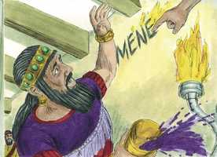
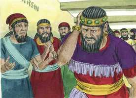
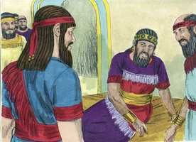
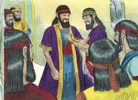

# Daniel Cap 05

**1** 	O REI Belsazar deu um grande banquete a mil dos seus senhores, e bebeu vinho na presença dos mil.

> **Cmt MHenry**: *Vv. 1-9.* Belsazar desafiou os juízos de Deus. A maioria dos historiadores considera que nesta circunstância Ciro sitiou a Babilônia. A segurança trazida pelo sentimento de auto-confiança e a sensualidade são tristes provas de uma ruína iminente. A alegria que profana as coisas sagradas é pecaminosa, e muitas das canções utilizadas nas festas modernas não são melho­res do que os louvores cantados pelos pagãos aos seus deuses! Observemos como Deus aterrorizou Belsazar e os seus senhores. A Palavra de Deus escrita é suficiente para assustar o pecador mais orgulhoso e atrevido. Aquilo que vemos de Deus — a parte da mão que escreve diante das criaturas — e o livro das Escrituras deve encher-nos de pensamentos reverentes a respeito daquilo que vemos. Se este é o dedo de Deus, o que é o seu braço quando se desnuda? E o que poderiamos dizer sobre Ele mesmo? A consciência culpável do rei disse-lhe que não teria razões para esperar por qualquer boa notícia vinda do céu. Deus pode, em um momento, fazer com que o coração do pecador mais endurecido trema; é necessário somente que solte os seus pensamentos sobre si — estes lhes trarão muitos problemas. Nenhuma dor física é capaz de igualar-se à agonia interior que às vezes sobrevêm ao pecador em meio às suas alegrias, prazeres carnais e pompa mundana. Às vezes, o terror faz com que os homens fujam a Cristo em busca de perdão e paz; porém, muitos daqueles que clamam com medo da ira, não estão humilhados por seus pecados, e buscam somente o alívio por meio de atitudes vãs e mentirosas. A ignorância e a incerteza mostradas em relação às Sagradas Escrituras, por muitos homens que se dizem sábios, apenas tendem a levar os pecadores ao desespero, como fez a ignorância destes homens suposta­mente sábios.

**2** 	Havendo Belsazar provado o vinho, mandou trazer os vasos de ouro e de prata, que Nabucodonosor, seu pai, tinha tirado do templo que estava em Jerusalém, para que bebessem neles o rei, os seus príncipes, as suas mulheres e concubinas.

 

**3** 	Então trouxeram os vasos de ouro, que foram tirados do templo da casa de Deus, que estava em Jerusalém, e beberam neles o rei, os seus príncipes, as suas mulheres e concubinas.

 

**4** 	Beberam o vinho, e deram louvores aos deuses de ouro, de prata, de bronze, de ferro, de madeira, e de pedra.

**5** 	Na mesma hora apareceram uns dedos de mão de homem, e escreviam, defronte do castiçal, na caiadura da parede do palácio real; e o rei via a parte da mão que estava escrevendo.

> **Cmt MHenry**: *CAPÍTULO 50N-Fp 51N-Cl 52N-1Ts 53N-2Ts 54N-1Tm 55N-2Tm 56N-Tt 57N-Fm 58N-Hb 59N-Tg

 

**6** 	Mudou-se então o semblante do rei, e os seus pensamentos o turbaram; as juntas dos seus lombos se relaxaram, e os seus joelhos batiam um no outro.

**7** 	E gritou o rei com força, que se introduzissem os astrólogos, os caldeus e os adivinhadores; e falou o rei, dizendo aos sábios de Babilônia: Qualquer que ler este escrito, e me declarar a sua interpretação, será vestido de púrpura, e trará uma cadeia de ouro ao pescoço e, no reino, será o terceiro governante.

 

**8** 	Então entraram todos os sábios do rei; mas não puderam ler o escrito, nem fazer saber ao rei a sua interpretação.

**9** 	Então o rei Belsazar perturbou-se muito, e mudou-se-lhe o semblante; e os seus senhores estavam sobressaltados.

 

**10** 	A rainha, por causa das palavras do rei e dos seus senhores, entrou na casa do banquete, e respondeu, dizendo: Ó rei, vive para sempre! Não te perturbem os teus pensamentos, nem se mude o teu semblante.

> **Cmt MHenry**: *Vv. 10-17.* Daniel estava esquecido na corte; vivia de forma reservada e já era da idade de noventa anos. Muitos consultam os servos de Deus por causa de assuntos curiosos, ou para que lhes expliquem temas difíceis, mas não perguntam pelo caminho da salvação ou pela senda do dever. Daniel rejeitou a oferta de recompensa. Dirigiu-se a Belsazar como a um criminoso conde­nado. Devemos desprezar todos os presentes e recompensas que este mundo é capaz de dar, contemplando pela fé como podemos fazer para que o seu final se apresse. Porém, cumpra­mos o nosso dever no mundo, e desempenhemos todo o serviço que nos é ordenado.

 

**11** 	Há no teu reino um homem, no qual há o espírito dos deuses santos; e nos dias de teu pai se achou nele luz, e inteligência, e sabedoria, como a sabedoria dos deuses; e teu pai, o rei Nabucodonosor, sim, teu pai, o rei, o constituiu mestre dos magos, dos astrólogos, dos caldeus e dos adivinhadores;

**12** 	Porquanto se achou neste Daniel um espírito excelente, e conhecimento, e entendimento, interpretando sonhos e explicando enigmas, e resolvendo dúvidas, ao qual o rei pôs o nome de Beltessazar. Chame-se, pois, agora Daniel, e ele dará a interpretação.

**13** 	Então Daniel foi introduzido à presença do rei. Falou o rei, dizendo a Daniel: És tu aquele Daniel, um dos filhos dos cativos de Judá, que o rei, meu pai, trouxe de Judá?

 

**14** 	Tenho ouvido dizer a teu respeito que o espírito dos deuses está em ti, e que em ti se acham a luz, e o entendimento e a excelente sabedoria.

**15** 	Agora mesmo foram introduzidos à minha presença os sábios e os astrólogos, para lerem este escrito, e me fazerem saber a sua interpretação; mas não puderam dar a interpretação destas palavras.

**16** 	Eu, porém, tenho ouvido dizer de ti que podes dar interpretação e resolver dúvidas. Agora, se puderes ler este escrito, e fazer-me saber a sua interpretação, serás vestido de púrpura, e terás cadeia de ouro ao pescoço e no reino serás o terceiro governante.

**17** 	Então respondeu Daniel, e disse na presença do rei: As tuas dádivas fiquem contigo, e dá os teus prêmios a outro; contudo lerei ao rei o escrito, e far-lhe-ei saber a interpretação.

 

**18** 	Ó rei! Deus, o Altíssimo, deu a Nabucodonosor, teu pai, o reino, e a grandeza, e a glória, e a majestade.

> **Cmt MHenry**: *Vv. 18-31.* Daniel lê a condenação de Belsazar. Não havia tomado como advertência os juízos de Nabucodonosor. Havia insultado a Deus. Os pecadores se comprazem com deuses que não vêm, nem ouvem, nem têm conhecimento algum; porém, serão julgados por aquEle ante cujos olhos todas as coisas estão patentes. Daniel lê a sentença escrita na parede. Toda esta situação pode ser bem aplicada ao futuro de todo o pecador. Ao morrerem, estão contados e terminados os dias do pecador; após a morte vem o juízo, quando será pesado na balança e encontrado em falta. E, após o juízo, o pecador será cortado e banido, e entregue como presa ao diabo e aos seus demônios. Enquanto estas coisas aconteciam no palácio, o exército de Ciro estava entrando na cida­de ; e quando Belsazar foi morto, seguiu-se um domínio geral. Cada pecador impenitente reconhecerá logo que a Palavra de Deus está sendo aplicada a ele, seja que o pesem na balança da lei como um fariseu, que tem a sua justiça própria, seja que o pesem na balança do Evangelho como hipócrita, como sepulcro caiado.

 

**19** 	E por causa da grandeza, que lhe deu, todos os povos, nações e línguas tremiam e temiam diante dele; a quem queria matava, e a quem queria conservava em vida; e a quem queria engrandecia, e a quem queria abatia.

**20** 	Mas quando o seu coração se exaltou, e o seu espírito se endureceu em soberba, foi derrubado do seu trono real, e passou dele a sua glória.

**21** 	E foi tirado dentre os filhos dos homens, e o seu coração foi feito semelhante ao dos animais, e a sua morada foi com os jumentos monteses; fizeram-no comer a erva como os bois, e do orvalho do céu foi molhado o seu corpo, até que conheceu que Deus, o Altíssimo, tem domínio sobre o reino dos homens, e a quem quer constitui sobre ele.

**22** 	E tu, Belsazar, que és seu filho, não humilhaste o teu coração, ainda que soubeste tudo isto.

**23** 	E te levantaste contra o Senhor do céu, pois foram trazidos à tua presença os vasos da casa dele, e tu, os teus senhores, as tuas mulheres e as tuas concubinas, bebestes vinho neles; além disso, deste louvores aos deuses de prata, de ouro, de bronze, de ferro, de madeira e de pedra, que não vêem, não ouvem, nem sabem; mas a Deus, em cuja mão está a tua vida, e de quem são todos os teus caminhos, a ele não glorificaste.

**24** 	Então dele foi enviada aquela parte da mão, que escreveu este escrito.

**25** 	Este, pois, é o escrito que se escreveu: MENE, MENE, TEQUEL, UFARSIM.

 

**26** 	Esta é a interpretação daquilo: MENE: Contou Deus o teu reino, e o acabou.

**27** 	TEQUEL: Pesado foste na balança, e foste achado em falta.

**28** 	PERES: Dividido foi o teu reino, e dado aos medos e aos persas.

**29** 	Então mandou Belsazar que vestissem a Daniel de púrpura, e que lhe pusessem uma cadeia de ouro ao pescoço, e proclamassem a respeito dele que havia de ser o terceiro no governo do seu reino.

 

**30** 	Naquela noite foi morto Belsazar, rei dos caldeus.

**31** 	E Dario, o medo, ocupou o reino, sendo da idade de sessenta e dois anos.

> **Cmt MHenry** Intro: *Versículos 1 -9: A festa ímpia de Belsazar; a escritura na parede; 10-17: Daniel é trazido para interpretá-la; 18-31: Daniel anuncia ao rei a sua destruição.*