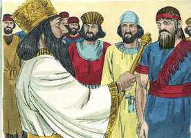
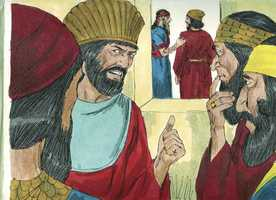
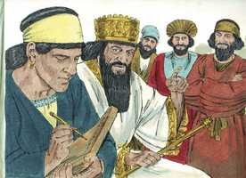
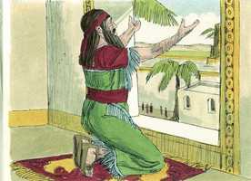
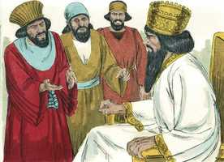
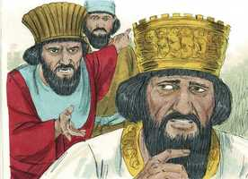
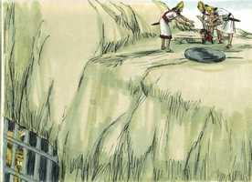
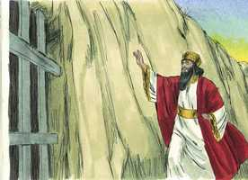
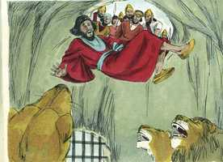
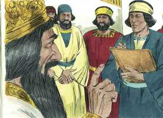

# Daniel Cap 06

**1** 	E PARECEU bem a Dario constituir sobre o reino cento e vinte príncipes, que estivessem sobre todo o reino;

> **Cmt MHenry**: *Vv. 1-5.* Para a glória de Deus nos damos conta de que, mesmo estando Daniel muito velho, era capaz de trabalhar, e havia perseverado fielmente em sua fé. É para a glória de Deus que aqueles que professam a fé comportem-se de tal forma que os seus inimigos mais vigilantes não possam encontrar ocasião para culpá-los, exceto naquilo que se refere ao seu Deus, pois neste assunto andam conforme a sua consciência.

**2** 	E sobre eles três presidentes, dos quais Daniel era um, aos quais estes príncipes dessem conta, para que o rei não sofresse dano.

**3** 	Então o mesmo Daniel sobrepujou a estes presidentes e príncipes; porque nele havia um espírito excelente; e o rei pensava constituí-lo sobre todo o reino.

 

**4** 	Então os presidentes e os príncipes procuravam achar ocasião contra Daniel a respeito do reino; mas não podiam achar ocasião ou culpa alguma; porque ele era fiel, e não se achava nele nenhum erro nem culpa.

 

**5** 	Então estes homens disseram: Nunca acharemos ocasião alguma contra este Daniel, se não a acharmos contra ele na lei do seu Deus.

**6** 	Então estes presidentes e príncipes foram juntos ao rei, e disseram-lhe assim: Ó rei Dario, vive para sempre!

> **Cmt MHenry**: *Vv. 6-10.* Proibir a oração por tanto tempo, trinta dias, é roubar de Deus todo o tributo que Ele recebe do homem, e rouba do homem todo o consolo que recebe da parte de Deus. Não se dirige a Deus o coração de todo homem quando, em meio a necessidades ou angústias, clama a Deus? Não podemos viver sequer um dia sem a presença de Deus; e os homens da­quela época poderíam viver trinta dias sem orar? Porém, sintamos temor por aqueles que, sem nenhum decreto que lhes proíba, não apresentam a Deus petições sérias, de todo o seu co­ração, por mais de trinta dias; e que ao todo, estes sejam mais numerosos do que aqueles que continuamente servem a Deus com corações humildes e agradecidos. As leis perseguidoras são sempre elaboradas sob falsos pretextos, mas os cristãos não devem queixar-se amargamente ou cair em impropérios. Bom é que tenhamos horários para orar. Daniel orava de forma aberta e reconhecida, e mesmo sendo um homem extremamente ata­refado, não pensava que este motivo fosse capaz de escusá-lo de exercer a sua devoção di­ária. Quão inescusáveis são aqueles que têm pouco a fazer no mundo, e não farão isto nem sequer por suas almas! Em momentos de provas devemos ter cuidado para que não suceda que, sob o pretexto da prudência, tornemo-nos culpáveis de covardia na obra de Deus. Todos aqueles que desprezam a sua alma, como certamente fazem aqueles que vivem sem orar, no final serão considerados como néscios, ainda que coloquem a sua vida em segurança. Daniel não somente orava, mas também não deixava de lado as ações de graça, para que pudesse diminuir o seu devocional e reduzir o tempo em que estava exposto ao perigo, mas cumpria tudo como se não houvesse qualquer risco. De forma resumida, o dever da oração se funda­menta na suficiência de Deus como o Todo-Poderoso Criador e Redentor, e em nossas neces­sidades como criaturas pecadoras. Devemos voltar os nossos olhos ao Senhor Jesus Cristo. Que todos os cristãos mantenham o seu olhar fixo nEle, e que a Ele orem enquanto estiverem nesta terra, que é o seu cativeiro.

> **Cmt MHenry**: *CAPÍTULO 60N-1Pe 61N-2Pe 62N-1Jo 63N-2Jo 64N-3Jo 65N-Jd 66N-Ap

 

**7** 	Todos os presidentes do reino, os capitães e príncipes, conselheiros e governadores, concordaram em promulgar um edito real e confirmar a proibição que qualquer que, por espaço de trinta dias, fizer uma petição a qualquer deus, ou a qualquer homem, e não a ti, ó rei, seja lançado na cova dos leões.

**8** 	Agora, pois, ó rei, confirma a proibição, e assina o edito, para que não seja mudado, conforme a lei dos medos e dos persas, que não se pode revogar.

**9** 	Por esta razão o rei Dario assinou o edito e a proibição.

**10** 	Daniel, pois, quando soube que o edito estava assinado, entrou em sua casa (ora havia no seu quarto janelas abertas do lado de Jerusalém), e três vezes no dia se punha de joelhos, e orava, e dava graças diante do seu Deus, como também antes costumava fazer.

 

**11** 	Então aqueles homens foram juntos, e acharam a Daniel orando e suplicando diante do seu Deus.

> **Cmt MHenry**: *Vv. 11-17.* Não é novidade que atos praticados em conformidade a uma consciência fiel a Deus, sejam falsamente considerados como atos de obstinação e desprezo aos poderes cíveis. Por falta do devido raciocínio, costumamos fazer aquilo que, como Dario, faz-nos desejar mil vezes voltar atrás e desfazer. Daniel, este homem venerável, é levado como o mais vil dos malfeitores, e violentamente lançado à cova dos leões, para que seja devorado sob a única acusação de adorar o seu Deus. Não há dúvida de que a colocação da pedra fora ordenada por Deus, para que o milagre da libertação de Daniel fosse ainda mais evidente; e o rei selou-a com o seu próprio selo, provavelmente para que os inimigos de Daniel não o matassem. Encomendemos a nossa vida e a nossa alma a Deus, fazendo o bem. Não podemos depositar toda a nossa confiança em algum ser humano, nem mesmo naqueles a quem servimos fielmente; porém, em todas as situações, os crentes podem ter a segurança do favor e do consolo divino.

**12** 	Então se apresentaram ao rei e, a respeito do edito real, disseram-lhe: Porventura não assinaste o edito, pelo qual todo o homem que fizesse uma petição a qualquer deus, ou a qualquer homem, por espaço de trinta dias, e não a ti, ó rei, fosse lançado na cova dos leões? Respondeu o rei, dizendo: Esta palavra é certa, conforme a lei dos medos e dos persas, que não se pode revogar.

 

**13** 	Então responderam ao rei, dizendo-lhe: Daniel, que é dos filhos dos cativos de Judá, não tem feito caso de ti, ó rei, nem do edito que assinaste, antes três vezes por dia faz a sua oração.

 

**14** 	Ouvindo então o rei essas palavras, ficou muito penalizado, e a favor de Daniel propôs dentro do seu coração livrá-lo; e até ao pôr do sol trabalhou para salvá-lo.

**15** 	Então aqueles homens foram juntos ao rei, e disseram-lhe: Sabe, ó rei, que é lei dos medos e dos persas que nenhum edito ou decreto, que o rei estabeleça, se pode mudar.

**16** 	Então o rei ordenou que trouxessem a Daniel, e lançaram-no na cova dos leões. E, falando o rei, disse a Daniel: O teu Deus, a quem tu continuamente serves, ele te livrará.

 

**17** 	E foi trazida uma pedra e posta sobre a boca da cova; e o rei a selou com o seu anel e com o anel dos seus senhores, para que não se mudasse a sentença acerca de Daniel.

**18** 	Então o rei se dirigiu para o seu palácio, e passou a noite em jejum, e não deixou trazer à sua presença instrumentos de música; e fugiu dele o sono.

> **Cmt MHenry**: *Vv. 18-24.* A melhor maneira de passar uma boa noite é manter um boa consciência. Te­mos certeza naquilo em que o rei tinha dúvidas, que os servos do Deus vivo têm um Senhor completamente capaz de protegê-los. Podemos ver o poder de Deus sobre as criaturas mais ferozes, e crer nEle para deter nosso adversário, aquele que, como o leão que ruge, anda continuamente buscando a quem devorar. Daniel foi mantido perfeitamente a salvo porque cria em seu Deus. Aqueles que confiam de modo ousado e jubiloso na proteção de Deus no caminho do dever, sempre o encontrarão como um auxílio bem presente. Assim, pois, o justo é liberto dos problemas, e o ímpio é colocado em seu lugar. O breve e curto triunfo dos maus terminará em sua ruína.

**19** 	Pela manhã, ao romper do dia, levantou-se o rei, e foi com pressa à cova dos leões.

 

**20** 	E, chegando-se à cova, chamou por Daniel com voz triste; e disse o rei a Daniel: Daniel, servo do Deus vivo, dar-se-ia o caso que o teu Deus, a quem tu continuamente serves, tenha podido livrar-te dos leões?

**21** 	Então Daniel falou ao rei: Ó rei, vive para sempre!

 

**22** 	O meu Deus enviou o seu anjo, e fechou a boca dos leões, para que não me fizessem dano, porque foi achada em mim inocência diante dele; e também contra ti, ó rei, não tenho cometido delito algum.

**23** 	Então o rei muito se alegrou em si mesmo, e mandou tirar a Daniel da cova. Assim foi tirado Daniel da cova, e nenhum dano se achou nele, porque crera no seu Deus.

**24** 	E ordenou o rei, e foram trazidos aqueles homens que tinham acusado a Daniel, e foram lançados na cova dos leões, eles, seus filhos e suas mulheres; e ainda não tinham chegado ao fundo da cova quando os leões se apoderaram deles, e lhes esmigalharam todos os ossos.

 

**25** 	Então o rei Dario escreveu a todos os povos, nações e línguas que moram em toda a terra: A paz vos seja multiplicada.

> **Cmt MHenry**: *Vv. 25-28.* Se vivermos com temor a Deus e andarmos conforme esta regra, a paz estará sobre nós. O reino, o poder e a glória pertencem ao Senhor para todo o sempre; porém, muitos são empregados para que as suas obras maravilhosas sejam dadas a conhecer aos demais, que permanecem alheios à sua graça salvadora. Sejamos crentes e praticantes de sua Palavra, para que não suceda que ao final concluamos que nos enganamos.

 

**26** 	Da minha parte é feito um decreto, pelo qual em todo o domínio do meu reino os homens tremam e temam perante o Deus de Daniel; porque ele é o Deus vivo e que permanece para sempre, e o seu reino não se pode destruir, e o seu domínio durará até o fim.

**27** 	Ele salva, livra, e opera sinais e maravilhas no céu e na terra; ele salvou e livrou Daniel do poder dos leões.

**28** 	Este Daniel, pois, prosperou no reinado de Dario, e no reinado de Ciro, o persa.

> **Cmt MHenry** Intro: *Versículos 1-5: A maldade dos inimigos de Daniel; 6-10: A sua constância na oração; 11­17: Daniel é lançado à cova dos leões; 18-24: Daniel é guardado de modo miraculoso; 25-28: O decreto de Dario.*