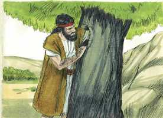
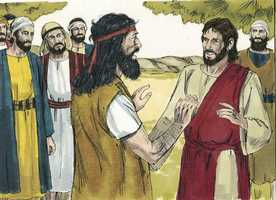

# Mateus Cap 03

**1** 	E, NAQUELES dias, apareceu João o Batista pregando no deserto da Judéia,

 

**2** 	E dizendo: Arrependei-vos, porque é chegado o reino dos céus.

**3** 	Porque este é o anunciado pelo profeta Isaías, que disse: Voz do que clama no deserto: Preparai o caminho do Senhor, Endireitai as suas veredas.

 

**4** 	E este João tinha as suas vestes de pelos de camelo, e um cinto de couro em torno de seus lombos; e alimentava-se de gafanhotos e de mel silvestre.

**5** 	Então ia ter com ele Jerusalém, e toda a Judéia, e toda a província adjacente ao Jordão;

 

**6** 	E eram por ele batizados no rio Jordão, confessando os seus pecados.

**7** 	E, vendo ele muitos dos fariseus e dos saduceus, que vinham ao seu batismo, dizia-lhes: Raça de víboras, quem vos ensinou a fugir da ira futura?

 

**8** 	Produzi, pois, frutos dignos de arrependimento;

**9** 	E não presumais, de vós mesmos, dizendo: Temos por pai a Abraão; porque eu vos digo que, mesmo destas pedras, Deus pode suscitar filhos a Abraão.

**10** 	E também agora está posto o machado à raiz das árvores; toda a árvore, pois, que não produz bom fruto, é cortada e lançada no fogo.

 

**11** 	E eu, em verdade, vos batizo com água, para o arrependimento; mas aquele que vem após mim é mais poderoso do que eu; cujas alparcas não sou digno de levar; ele vos batizará com o Espírito Santo, e com fogo.

**12** 	Em sua mão tem a pá, e limpará a sua eira, e recolherá no celeiro o seu trigo, e queimará a palha com fogo que nunca se apagará.

**13** 	Então veio Jesus da Galiléia ter com João, junto do Jordão, para ser batizado por ele.

 

**14** 	Mas João opunha-se-lhe, dizendo: Eu careço de ser batizado por ti, e vens tu a mim?

**15** 	Jesus, porém, respondendo, disse-lhe: Deixa por agora, porque assim nos convém cumprir toda a justiça. Então ele o permitiu.

 

**16** 	E, sendo Jesus batizado, saiu logo da água, e eis que se lhe abriram os céus, e viu o Espírito de Deus descendo como pomba e vindo sobre ele.

 

**17** 	E eis que uma voz dos céus dizia: Este é o meu Filho amado, em quem me comprazo.

> **Cmt MHenry** Intro: As condescendências da graça de Cristo são tão assombrosas que ainda os crentes mais firmes podem apenas acreditar nelas no princípio; tão profundas e misteriosas que ainda os que conhecem bem sua mente estão prontos a oferecer objeções contra a vontade de Cristo. Os que têm muito do Espírito de Deus, enquanto estão aqui vêem que necessitam pedir mais de Cristo. Não nega que João tinha necessidade de ser batizado por Ele, porém declara que deve ser batizado por João. Cristo está *agora* em estado de humilhação. Nosso Senhor Jesus considerou conveniente, para cumprir toda justiça, apropriar-se de cada instituição divina, e mostrar sua disposição para cumprir com todos os preceitos justos de Deus. Em Cristo e por meio dEle, os céus estão abertos para os filhos dos homens. Esta descida do Espírito sobre Cristo demonstra que estava dotado sem medida com seus poderes sagrados. O fruto do Espírito Santo é amor, gozo, paz, paciência, benignidade, bondade, fé, mansidão e temperança. No batismo de Cristo houve uma manifestação das três Pessoas da Santa Trindade. O Pai confirmando o Filho como Mediador; o Filho que solenemente se encarrega da obra; o Espírito Santo que desce sobre Ele para ser comunicado ao povo por seu intermédio. NEle são aceitáveis nossos sacrifícios espirituais, porque Ele é o altar que santifica todo dom ([1 Pedro 2.5](../60N-1Pe/02.md#5)). Fora de Cristo, Deus é fogo consumidor; em Cristo, um Pai reconciliado. Este é o resumo do evangelho, o qual devemos abraçar jubilosamente pela fé.> Dar aplicação para as almas dos ouvintes é a vida da pregação; assim foi a de João. os fariseus davam ênfase principal às observâncias externas, descuidando os assuntos de mais peso da lei moral, e o significado espiritual de suas cerimônias legais. Outros eram hipócritas detestáveis que faziam, com suas pretensões de santidade, um manto para a iniqüidade. Os saduceus estavam no extremo oposto, negando a existência dos espíritos e o estado futuro. Eles eram os infiéis zombadores daquela época e daquele país. Existe uma grande ira vindoura. O grande interesse de cada um é fugir da ira. Deus, que não se deleita em nossa ruína, já nos tem advertido; adverte pela palavra escrita, pelos ministros, pela consciência. Não são dignos do nome de penitentes, nem de seus privilégios, os que dizem lamentar seus pecados, porém continuam neles. Convém aos penitentes ser humildes e baixos a seus próprios olhos, agradecer a mínima misericórdia, ser pacientes nas grandes aflições, estar alerta contra toda aparência de mal, abundar em todo dever, e ser caridosos ao julgar o próximo. Aqui há uma palavra de cautela, não confiar nos privilégios externos. Existem muitos cujos corações carnais são dados a seguir o que eles mesmos dizem dentro de si, e deixar de lado o poder da palavra de Deus que convence do pecado, e sua autoridade. Existem multidões que não chegam ao céu por descansar nas honras e nas simples vantagens de serem membros de uma igreja externa. Eis aqui uma palavra de terror para o negligente e confiado. Nossos corações corruptos não podem dar bons frutos a menos que o Espírito regenerador de Cristo implante a boa palavra de Deus neles. Contudo, toda árvore que tenha muitos dons e honras, por verde que pareça em sua profissão e desempenho externo, se não der bom fruto, frutos dignos de arrependimento, é cortada e lançada no fogo da ira de Deus, o lugar mais apto para as árvores estéreis; para que outra coisa servem? Se não dão fruto, são boas como combustível. João mostra o propósito e a intenção da aparição de Cristo; a qual eles agora esperavam com prontidão. Não existem formas externas que possam limpar-nos. Nenhuma ordenança, seja quem for que a ministre, ou não importa a modalidade, pode suprir a necessidade do batismo do Espírito Santo e do fogo. Somente o poder purificador e limpador do Espírito Santo pode produzir a pureza de coração, e os santos afetos que acompanham a salvação. Cristo é quem batiza com o Espírito Santo. Isso fez com os extraordinários dons do Espírito enviados aos apóstolos ([Atos 2.4](../44N-At/02.md#4)). isto faz com as graças e consolações do Espírito, entregues aos que as pedem ([Lucas 11.13](../42N-Lc/11.md#13); [João 7.38-39](../43N-Joa/07.md#38); [Atos 11.16](../44N-At/11.md#16)). Observe-se aqui a igreja externa na era de Cristo ([Isaias 21.10](../23A-Is/21.md#10)). os crentes verdadeiros são o trigo, substanciais, úteis e valiosos; os hipócritas são palha, ligeiros e vazios, inúteis, sem valor, levados por qualquer vento; estão misturados, bom e mau, na mesma comunhão externa. Vem o dia em que serão separados a palha do trigo. O juízo final será o dia que faça a diferença, quando os santos e os pecadores sejam separados para sempre. no céu os santos são reunidos, e não mais espalhados; estão a salvo e não mais expostos; separados do próximo corrompido por fora e com afetos corruptos por dentro, e não há palha entre eles. O inferno é o fogo inextinguível que certamente será a porção e o castigo dos hipócritas e incrédulos. Aqui a vida e a morte, o bem e o mal, são colocados ante nós: segundo somos agora no campo, seremos então na eira.> " Depois de Malaquias, não houve profeta até João Batista. Apareceu primeiro no deserto da Judéia. Não era um deserto desabitado, senão parte do país, não densamente povoado nem muito isolado. Nenhum lugar é tão remoto como para excluir-nos das visitações da graça divina. Pregava a doutrina do arrependimento: "Arrependei-vos". A palavra aqui usada implica uma mudança total de modo de pensar: uma mudança de juízo, da disposição e dos afetos, uma inclinação diferente e melhor da alma. Considerem seus caminhos, mudem seus pensamentos: pensaram errado; comecem de novo e pensem certo. Os penitentes verdadeiros têm pensamentos de Deus e de Cristo, do pecado e da santidade, deste mundo e do outro, diferentes dos que tinham. A mudança do pensamento produz uma mudança de caminho. Este é o arrependimento do evangelho, o qual se produz ao ver a Cristo, ao captar seu amor, e da esperança de perdão por meio dEle. É um grande estímulo para que nós nos arrependamos; arrependam-se, porque seus pecados serão perdoados se vocês se arrependem. Voltem-se a Deus pelo caminho do dever, e Ele, por meio de Cristo, se voltará a vocês pelo caminho da misericórdia. Agora é tão necessário que nos arrependamos e nos humilhemos para preparar o caminho do Senhor como o era então. Há muito que fazer para abrir caminho para Cristo numa alma, e nada mais necessário que o descobrimento do pecado, e a convicção de que não podemos ser salvos por nossa própria justiça. O caminho do pecado e de Satanás é um caminho retorcido, mas para preparar um caminho para Cristo é necessário endireitar as veredas ([Hebreus 12.13](../58N-Hb/12.md#13)). Os que têm por atividade chamar os outros a lamentar o pecado e a mortificá-lo, devem levar uma vida séria, uma vida de abnegação e desprezo do mundo. Dando aos outros este exemplo, João preparou o caminho para Cristo. Muitos foram ao batismo de João, mas poucos mantiveram a profissão que fizeram. Talvez haja muitos ouvintes interessados, mas poucos crentes verdadeiros. A curiosidade e o amor pela novidade e variedade podem levar a muitos a ouvir uma boa pregação, sendo afetados momentaneamente muitos que nunca se submetem a sua autoridade. Os que receberam a doutrina de João testemunharam seu arrependimento confessando seus pecados. Estão prontos para receber a Jesus Cristo como sua Jz somente os que são levados com tristeza e vergonha a reconhecer sua culpa. Os benefícios do reino dos céus, agora já muito perto, foram selados pelo batismo. João os purificou com água, em sinal de que Deus os limparia de todas suas iniqüidades, dando a entender com isto que, por natureza e costume, todos estavam contaminados e não podiam ser recebidos no povo de Deus a menos que fossem lavados de seus pecados no manancial que Cristo abriria ([Zacarias 13.1](../38A-Zc/13.md#1)). "> *• Versículos 1-6*> *João Batista - Sua pregação, seu estilo de vida, e o*> *• Versículos 7-12*> *João reprova os fariseus e os saduceus*> *• Versículos 13-17*> *O batismo de Jesus*