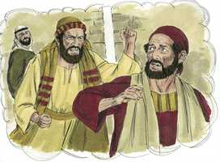
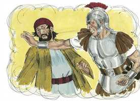
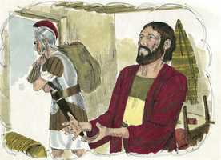

# Mateus Cap 05

**1** 	E JESUS, vendo a multidão, subiu a um monte, e, assentando-se, aproximaram-se dele os seus discípulos;

**2** 	E, abrindo a sua boca, os ensinava, dizendo:

 

**3** 	Bem-aventurados os pobres de espírito, porque deles é o reino dos céus;

**4** 	Bem-aventurados os que choram, porque eles serão consolados;

**5** 	Bem-aventurados os mansos, porque eles herdarão a terra;

 

**6** 	Bem-aventurados os que têm fome e sede de justiça, porque eles serão fartos;

**7** 	Bem-aventurados os misericordiosos, porque eles alcançarão misericórdia;

**8** 	Bem-aventurados os limpos de coração, porque eles verão a Deus;

**9** 	Bem-aventurados os pacificadores, porque eles serão chamados filhos de Deus;

 

**10** 	Bem-aventurados os que sofrem perseguição por causa da justiça, porque deles é o reino dos céus;

**11** 	Bem-aventurados sois vós, quando vos injuriarem e perseguirem e, mentindo, disserem todo o mal contra vós por minha causa.

 

**12** 	Exultai e alegrai-vos, porque é grande o vosso galardão nos céus; porque assim perseguiram os profetas que foram antes de vós.

**13** 	Vós sois o sal da terra; e se o sal for insípido, com que se há de salgar? Para nada mais presta senão para se lançar fora, e ser pisado pelos homens.

**14** 	Vós sois a luz do mundo; não se pode esconder uma cidade edificada sobre um monte;

**15** 	Nem se acende a candeia e se coloca debaixo do alqueire, mas no velador, e dá luz a todos que estão na casa.

**16** 	Assim resplandeça a vossa luz diante dos homens, para que vejam as vossas boas obras e glorifiquem a vosso Pai, que está nos céus.

**17** 	Não cuideis que vim destruir a lei ou os profetas: não vim ab-rogar, mas cumprir.

**18** 	Porque em verdade vos digo que, até que o céu e a terra passem, nem um jota ou um til jamais passará da lei, sem que tudo seja cumprido.

**19** 	Qualquer, pois, que violar um destes mandamentos, por menor que seja, e assim ensinar aos homens, será chamado o menor no reino dos céus; aquele, porém, que os cumprir e ensinar será chamado grande no reino dos céus.

**20** 	Porque vos digo que, se a vossa justiça não exceder a dos escribas e fariseus, de modo nenhum entrareis no reino dos céus.

**21** 	Ouvistes que foi dito aos antigos: Não matarás; mas qualquer que matar será réu de juízo.

**22** 	Eu, porém, vos digo que qualquer que, sem motivo, se encolerizar contra seu irmão, será réu de juízo; e qualquer que disser a seu irmão: Raca, será réu do sinédrio; e qualquer que lhe disser: Louco, será réu do fogo do inferno.

**23** 	Portanto, se trouxeres a tua oferta ao altar, e aí te lembrares de que teu irmão tem alguma coisa contra ti,

**24** 	Deixa ali diante do altar a tua oferta, e vai reconciliar-te primeiro com teu irmão e, depois, vem e apresenta a tua oferta.

**25** 	Concilia-te depressa com o teu adversário, enquanto estás no caminho com ele, para que não aconteça que o adversário te entregue ao juiz, e o juiz te entregue ao oficial, e te encerrem na prisão.

**26** 	Em verdade te digo que de maneira nenhuma sairás dali enquanto não pagares o último ceitil.

**27** 	Ouvistes que foi dito aos antigos: Não cometerás adultério.

**28** 	Eu, porém, vos digo, que qualquer que atentar numa mulher para a cobiçar, já em seu coração cometeu adultério com ela.

**29** 	Portanto, se o teu olho direito te escandalizar, arranca-o e atira-o para longe de ti; pois te é melhor que se perca um dos teus membros do que seja todo o teu corpo lançado no inferno.

**30** 	E, se a tua mão direita te escandalizar, corta-a e atira-a para longe de ti, porque te é melhor que um dos teus membros se perca do que seja todo o teu corpo lançado no inferno.

**31** 	Também foi dito: Qualquer que deixar sua mulher, dê-lhe carta de divórcio.

**32** 	Eu, porém, vos digo que qualquer que repudiar sua mulher, a não ser por causa de fornicação, faz que ela cometa adultério, e qualquer que casar com a repudiada comete adultério.

**33** 	Outrossim, ouvistes que foi dito aos antigos: Não perjurarás, mas cumprirás os teus juramentos ao Senhor.

**34** 	Eu, porém, vos digo que de maneira nenhuma jureis; nem pelo céu, porque é o trono de Deus;

**35** 	Nem pela terra, porque é o escabelo de seus pés; nem por Jerusalém, porque é a cidade do grande Rei;

**36** 	Nem jurarás pela tua cabeça, porque não podes tornar um cabelo branco ou preto.

**37** 	Seja, porém, o vosso falar: Sim, sim; Não, não; porque o que passa disto é de procedência maligna.

**38** 	Ouvistes que foi dito: Olho por olho, e dente por dente.

**39** 	Eu, porém, vos digo que não resistais ao mau; mas, se qualquer te bater na face direita, oferece-lhe também a outra;

 

**40** 	E, ao que quiser pleitear contigo, e tirar-te a túnica, larga-lhe também a capa;

**41** 	E, se qualquer te obrigar a caminhar uma milha, vai com ele duas.

**42** 	Dá a quem te pedir, e não te desvies daquele que quiser que lhe emprestes.

 

**43** 	Ouvistes que foi dito: Amarás o teu próximo, e odiarás o teu inimigo.

**44** 	Eu, porém, vos digo: Amai a vossos inimigos, bendizei os que vos maldizem, fazei bem aos que vos odeiam, e orai pelos que vos maltratam e vos perseguem; para que sejais filhos do vosso Pai que está nos céus;

**45** 	Porque faz que o seu sol se levante sobre maus e bons, e a chuva desça sobre justos e injustos.

**46** 	Pois, se amardes os que vos amam, que galardão tereis? Não fazem os publicanos também o mesmo?

**47** 	E, se saudardes unicamente os vossos irmãos, que fazeis de mais? Não fazem os publicanos também assim?

**48** 	Sede vós pois perfeitos, como é perfeito o vosso Pai que está nos céus.

> **Cmt MHenry** Intro: " Os mestres judeus entendiam por "próximo" somente os que eram de seu próprio país, nação e religião, aos que se compraziam em considerar amigos. O Senhor Jesus ensina que devemos fazer toda a bondade verdadeira que pudermos para todos, especialmente por suas almas. Devemos orar por eles. Enquanto muitos devolverão bem por bem, devemos devolver bem por mal; e isto falará de um princípio mais nobre que no que se baseia a maioria dos homens para agir. Outros saúdam a seus irmãos, e abraçam os de seu próprio partido, costume e opinião, porém nós não devemos limitar assim nosso respeito. Dever dos cristãos é desejar e apontar à perfeição, e seguir adiante em graça e santidade. Ali devemos ter a intenção de conformar-nos no exemplo de nosso Pai celestial ([1 Pe 1.15-16](../60N-1Pe/01.md#15)). Seguramente se espera mais dos seguidores de Cristo que dos outros; seguramente se achará mais neles que nos outros. Roguemos a Deus que nos capacite para demonstrar-nos como filhos dEle. "> A simples instrução é: Suporta qualquer injúria que possas sofrer por amor à paz, encomendando tuas preocupações ao cuidado do Senhor. O resumo de tudo é que os cristãos devem evitar as disputas e as questões. Se alguém disser que carne e sangue não podem passar por tal afronta, que se lembrem que carne e sangue não herdarão o Reino de Deus, e os que agem sobre a base dos princípios justos terão suma paz e consolo.> Não há razão para considerar que sejam maus os votos solenes num tribunal de justiça ou em outras ocasiões apropriadas, sempre e quando sejam formulados com a devida reverência. Mas todos os votos feitos sem necessidade ou na conversação corriqueira são pecaminosos, como assim também todas as expressões que apelam a Deus, embora as pessoas achem que assim evadem a culpa por jurar. Enquanto piores sejam os homens, menos comprometidos estão pelos votos; enquanto melhores sejam, menor necessidade há dos votos. Nosso Senhor não indica os termos precisos com que temos que afirmar ou negar, senão que o cuidado constante da verdade faz desnecessários os votos e juramentos.> A vitória sobre os desejos do coração deve ir acompanhada com exercícios dolorosos, mas deve ser feita. Toda coisa é dada para salvar-nos Notas Bíblia de Estudo NVI-out_images.txt Simple_Bible_Reader_v2.9-bible_converter.exe nossos pecados, não *neles*. Todos nossos sentidos e faculdades devem evitar as coisas que conduzem a transgredir. Os que levam outrem z tentação de pecar, pela roupa ou em qualquer outra forma, ou os deixam nisso, ou os expõem a isso, se fazem culpados de seu pecado, e serão considerados responsáveis de render contar por isso. Se alguém se submeter às operações dolorosas para salvarmos a vida, de que deveria refrear-se nossa mente quando o que está em jogo é a salvação de nossa alma? Há doce misericórdia trás todos os requisitos divinos, e as graças e consolos do Espírito nos facultarão para satisfazê-los.> " Os mestres judeus ensinaram que nada, salvo o homicídio, era proibido pelo sexto mandamento. Assim, eliminavam seu significado espiritual. Cristo mostrou o significado completo deste mandamento; conforme ao qual devemos ser julgados no além e, portanto, deveria ser obedecido agora. Toda ira precipitada é homicídio no coração. Por nosso irmão, aqui descrito, devemos entender a qualquer pessoa, ainda que muito por embaixo de nós, pois somos todos feitos de um mesmo sangue. "Néscio" é uma palavra de zombaria que vem do orgulho; "Você é um néscio" é a palavra depreciativa que provém do ódio. A calúnia e as censuras maliciosas são veneno que mata secreta e lentamente. Cristo disse que por leves que considerassem esses pecados, certamente seriam chamados a juízo por eles. Devemos conservar cuidadosamente o amor e a paz cristãs com todos nossos irmãos; e, se em algum momento há uma briga, devemos confessar nossa falta, humilhar-nos a nosso irmão, fazendo ou oferecendo satisfação pelo mal feito de palavra ou obra; e devemos fazer isto rapidamente, pois até que não o façamos, não seremos aptos para nossa comunhão com Deus nas santas ordenanças. Quando nos estamos preparando para algum exercício religioso, bom será que façamos disto uma ocasião para refletir e examinarmos com seriedade. O que aqui se diz é muito aplicável ao fato de sermos reconciliados com Deus por meio de Cristo. Enquanto estejamos vivos, estamos a caminho de seu trono de juízo, e depois da morte será demasiado tarde. Quando consideramos a importância do caso, e a incerteza da vida, quão necessário se torna buscar a paz com Deus sem demora! "> Que ninguém ache que Cristo permite que seu povo brinque com qualquer dos mandamentos da santa lei de Deus. Nenhum pecador participa da justiça justificadora de Cristo até que se arrependa de suas más obras. A misericórdia revelada no evangelho conduz o crente a um aborrecimento de si mesmo ainda mais profundo. A lei é a regra do dever do cristão, e este se deleita nela. Se alguém que pretende ser discípulo de Cristo se permitir qualquer desobediência à lei de Deus, ou ensinar o próximo a fazê-lo, qualquer seja sua situação ou reputação entre os homens, não pode ser verdadeiro discípulo. A justiça de Cristo, que nos é imputada pela só fé, é necessária para todos os que entram no reino da graça ou da glória, mas a nova criação do coração para santidade produz uma mudança radical no temperamento e na conduta do homem.> Vocês são o sal da terra. A humanidade, na ignorância e maldade, era como um monte enorme, prestes a apodrecer, mas Cristo enviou seus discípulos para sazoná-la, por suas vidas e doutrinas, com o conhecimento e a graça. Se não são como deveriam ser, são como sal que perdeu seu sabor. Se um homem pode adotar a confissão de Cristo e, contudo, permanecer sem graça, nenhuma outra doutrina, nenhum outro médio o faz proveitoso. Nossa luz deve brilhar fazendo obras tais que os homens possam vê-las. O que há entre Deus e nossas almas deve ser guardado para nós mesmos, mas o que, de si mesmo, fica aberto à vista dos homens, devemos procurar que se conforme a nossa profissão e que seja elogiável. Devemos apontar à glória de Deus.> Aqui nosso Salvador dá oito características da gente bem-aventurada que para nós representam as graças principais do cristão.\ 1) Os pobres de espírito são bem-aventurados. Estes levam suas mentes a sua condição quando é baixa. São humildes e pequenos segundo seu próprio critério. Vêem sua necessidade, se lamentam por sua culpa e têm sede de um Redentor. O reino da graça é desses tais; o reino da glória é para eles. 2\) Os que choram são bem-aventurados. Parece ser que aqui se trata dessa tristeza santa que opera verdadeiro arrependimento, vigilância, mente humilde e dependência contínua para ser aceito pela misericórdia de Deus em Cristo Jesus, com busca constante do Espírito Santo para limpar o mal residual. O céu é o gozo de nosso Senhor; um monte de gozo, rumo ao qual o nosso caminho atravessa um vale de lágrimas. Tais doentes serão consolados por seu Deus. 3\) Os mansos são bem-aventurados. Os mansos são os que se submetem silenciosamente a Deus; os que podem suportar insultos; são calados ou devolvem uma resposta branda; os que, em sua paciência, conservam o domínio de suas almas, quando escassamente têm possessão de alguma outra coisa. Estes mansos são bem-aventurados ainda neste mundo. A mansidão fomenta a riqueza, o consolo e a segurança, ainda neste mundo. 4\) Os que têm fome e sede de justiça são bem-aventurados. A justiça está aqui colocada por todas as bênçãos espirituais. Estas são compradas para nós pela justiça de Cristo, confirmadas pela fidelidade de Deus. nossos desejos de bênçãos espirituais devem ser fervorosos. Embora todos os desejos de graça não são graça, contudo, um desejo como este é um desejo dos que são criados por Deus, e Ele não abandonará a obra de Suas mãos. 5\) Os misericordiosos são bem-aventurados. Devemos não somente suportar nossas aflições com paciência, senão que devemos fazer tudo o que pudermos por ajudar os que estejam passando misérias. Devemos ter compaixão pelas almas dos próximos, e ajudá-los; compadecer-nos dos que estão em pecado, e tratar de tirá-los como brasas fora do fogo. 6\) Os limpos de coração são bem-aventurados, porque verão a Deus. aqui são plenamente descritas e unidas a santidade e a felicidade. Os corações devem ser purificados pela fé e mantidos para Deus. Cria em mim, oh Deus, um coração limpo. Ninguém senão o limpo é capaz de ver a Deus, nem o céu é prometido para o impuro. Como Deus não tolera olhar para a iniqüidade, assim eles não podem olhar para Sua pureza. 7\) Os pacificadores são bem-aventurados. Eles amam, desejam e se deleitam na paz; e lhes agrada ter quietude. Mantêm a paz para que não seja perdida e a recuperam quando é quebrantada. Se os pacificadores são bem-aventurados, aí dos que quebrantam a paz! 8\) Os perseguidos por causa da justiça são bem-aventurados. Este ditado é peculiar do cristianismo; e se enfatiza com maior intensidade que o resto. Contudo, nada há em nossos sofrimentos que possa ser mérito ante Deus, mas Ele verá que os que perdem *por* Ele, ainda a própria vida, não percam finalmente *por causa* dEle. Bendito Jesus, quão diferentes são tuas máximas das dos homens do mundo! Eles chamam ditoso ao orgulhoso, e admiram o alegre, o rico, o poderoso e o vitorioso. Alcancemos nós misericórdia do Senhor; que possamos ser reconhecidos como seus filhos, e herdemos o reino. Com estes deleites e esperanças, podemos dar as boas-vindas com alegria às circunstâncias baixas e dolorosas.