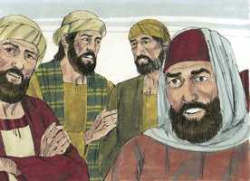
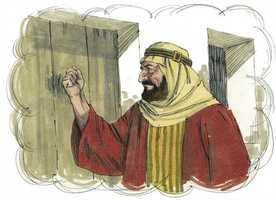
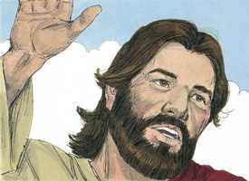

# Mateus Cap 07

**1** 	NÃO julgueis, para que não sejais julgados.

 

**2** 	Porque com o juízo com que julgardes sereis julgados, e com a medida com que tiverdes medido vos hão de medir a vós.

**3** 	E por que reparas tu no argueiro que está no olho do teu irmão, e não vês a trave que está no teu olho?

**4** 	Ou como dirás a teu irmão: Deixa-me tirar o argueiro do teu olho, estando uma trave no teu?

**5** 	Hipócrita, tira primeiro a trave do teu olho, e então cuidarás em tirar o argueiro do olho do teu irmão.

**6** 	Não deis aos cães as coisas santas, nem deiteis aos porcos as vossas pérolas, não aconteça que as pisem com os pés e, voltando-se, vos despedacem.

**7** 	Pedi, e dar-se-vos-á; buscai, e encontrareis; batei, e abrir-se-vos-á.

 

**8** 	Porque, aquele que pede, recebe; e, o que busca, encontra; e, ao que bate, abrir-se-lhe-á.

**9** 	E qual dentre vós é o homem que, pedindo-lhe pão o seu filho, lhe dará uma pedra?

**10** 	E, pedindo-lhe peixe, lhe dará uma serpente?

**11** 	Se vós, pois, sendo maus, sabeis dar boas coisas aos vossos filhos, quanto mais vosso Pai, que está nos céus, dará bens aos que lhe pedirem?

**12** 	Portanto, tudo o que vós quereis que os homens vos façam, fazei-lho também vós, porque esta é a lei e os profetas.

**13** 	Entrai pela porta estreita; porque larga é a porta, e espaçoso o caminho que conduz à perdição, e muitos são os que entram por ela;

 

**14** 	E porque estreita é a porta, e apertado o caminho que leva à vida, e poucos há que a encontrem.

**15** 	Acautelai-vos, porém, dos falsos profetas, que vêm até vós vestidos como ovelhas, mas, interiormente, são lobos devoradores.

**16** 	Por seus frutos os conhecereis. Porventura colhem-se uvas dos espinheiros, ou figos dos abrolhos?

**17** 	Assim, toda a árvore boa produz bons frutos, e toda a árvore má produz frutos maus.

**18** 	Não pode a árvore boa dar maus frutos; nem a árvore má dar frutos bons.

**19** 	Toda a árvore que não dá bom fruto corta-se e lança-se no fogo.

**20** 	Portanto, pelos seus frutos os conhecereis.

**21** 	Nem todo o que me diz: Senhor, Senhor! entrará no reino dos céus, mas aquele que faz a vontade de meu Pai, que está nos céus.

**22** 	Muitos me dirão naquele dia: Senhor, Senhor, não profetizamos nós em teu nome? e em teu nome não expulsamos demônios? e em teu nome não fizemos muitas maravilhas?

**23** 	E então lhes direi abertamente: Nunca vos conheci; apartai-vos de mim, vós que praticais a iniqüidade.

**24** 	Todo aquele, pois, que escuta estas minhas palavras, e as pratica, assemelhá-lo-ei ao homem prudente, que edificou a sua casa sobre a rocha;

**25** 	E desceu a chuva, e correram rios, e assopraram ventos, e combateram aquela casa, e não caiu, porque estava edificada sobre a rocha.

**26** 	E aquele que ouve estas minhas palavras, e não as cumpre, compará-lo-ei ao homem insensato, que edificou a sua casa sobre a areia;

**27** 	E desceu a chuva, e correram rios, e assopraram ventos, e combateram aquela casa, e caiu, e foi grande a sua queda.

**28** 	E aconteceu que, concluindo Jesus este discurso, a multidão se admirou da sua doutrina;

**29** 	Porquanto os ensinava como tendo autoridade; e não como os escribas.

> **Cmt MHenry** Intro: Aqui Cristo mostra que não bastará reconhecê-lo como nosso Amo somente de palavra e língua. É necessário para nossa felicidade que acreditemos em Cristo, que nos arrependamos do pecado, que vivamos uma vida santa, que nos amemos os uns aos outros. Esta é sua vontade, nossa santificação. Tenhamos cuidado de não apoiar-nos nos privilégios e obras externas, não seja que nos enganemos e pereçamos eternamente com uma mentira a nossa direita, como o fazem multidões. Que cada um que invoca o nome de Cristo se afaste de todo pecado. existem outros cuja religião descansa no puro ouvir, sem ir além; suas cabeças estão cheias de noções vazias. Essas duas classes de ouvintes estão representados pelos dois construtores. Esta parábola nos ensina a ouvir os ditados do Senhor Jesus: alguns podem parecer duros para carne e sangue, mas devem ser feitos. Cristo está colocado como fundamento e toda outra coisa fora de Cristo é areia. Alguns constroem suas esperanças na prosperidade mundana; outros, numa profissão externa de religião. Sobre estas se aventuram, mas estas são só areia, demasiado fracas para suportar uma trama como nossas esperanças do céu. Há uma tormenta que vem e provará a obra de todo homem. Quando Deus tira a alma, onde está a esperança do hipócrita? A casa desabou na tormenta, quando mais a necessitava o construtor, e esperava que lhe servisse de refúgio. Caiu quando era demasiado tarde para edificar outra. O Senhor nos faça construtores sábios para a eternidade. Então, nada nos separará do amor de Cristo Jesus. As multidões ficavam atônitas ante a sabedoria e o poder da doutrina de Cristo. Este sermão, tão freqüentemente lido, sempre resulta novo. Cada palavra prova que seu Autor é divino. Sejamos cada vez mais decididos e fervorosos, e façamos de uma ou de outra destas bem-aventuranças e graças cristãs o tema principal de nossos pensamentos, por semanas seguidas. Não descansemos em desejos gerais e confusos, pelos quais possamos captá-lo tudo, porém sem reter nada.> Nada impede tanto aos homens de passar pela porta estreita e chegar a ser verdadeiros seguidores de Cristo como as doutrinas carnais, apaziguadoras e aduladoras dos que se opõem à verdade. Estes podem ser conhecidos pelo arrasto e os efeitos de suas doutrinas. Uma parte de seus temperamentos e condutas resulta contrária à mente de Cristo. As opiniões que levam a pecar não vêm de Deus.> Cristo veio a ensinar-nos não somente o que devemos saber e acreditar, senão o que devemos fazer; não só para com Deus, senão para com os homens; não só para com os que são de nosso partido e denominação, senão para com os homens em geral, com todos aqueles que nos relacionemos. Devemos fazer a nosso próximo o que nós mesmos reconhecemos que é bom e razoável. Em nossos tratos com os homens devemos colocar-nos no mesmo lugar e nas circunstâncias daqueles com os que nos relacionamos, e agir em conformidade com isso. Não há senão dois caminhos: o correto e o errado, o bom e o mau; o caminho ao céu e o caminho ao inferno; todos vamos andando por um ou por outro; não há um lugar intermédio no além; não há um caminho neutro. Todos os filhos dos homens somos santos ou pecadores, bons ou maus. Vejam o caminho do pecado e dos pecadores, que a porta é larga e está aberta. Podem entrar por esta porta com todas as luxúrias que a rodeiam; não freia apetites nem paixões. É um caminho largo; existem muitas sendas nele, há opções de caminhos pecaminosos. Há multidões neste caminho. Mas que proveito há em estar disposto a ir para o inferno com os outros, porque eles não irão ao céu conosco? O caminho da vida eterna é estreito. Não estamos no céu tão logo como passamos pela porta estreita. Devemos negar o enérgico, manter o corpo sob controle, e mortificar as corrupções. Devemos resistir as tentações diárias; devemos cumprir os deveres. Devemos velar em todas as coisas e andar com cuidado; e devemos passar por muita tribulação. Não obstante, este caminho nos convida a todos; conduz à vida, ao consolo presente no favor de Deus, que é a vida da alma; à bênção eterna, cuja esperança no final de nosso caminho deve facilitar-nos todas as dificuldades do caminho. Esta simples declaração de Cristo tem sido descartada por muitos que se deram ao trabalho de fazê-la desaparecer com explicações, porém em todas as épocas o discípulo verdadeiro de Cristo tem sido visto como uma personalidade singular, que não está na moda; e todos os que ficaram do lado da grande maioria, se foram pelo caminho amplo rumo a destruição. Se servirmos a Deus, devemos ser firmes em nossa religião. Podemos ouvir repetidas vezes sobre a porta estreita e o caminho apertado, e que são poucos o que o acham, sem condoer-nos por nós mesmos ou sem considerar se entramos no caminho estreito e qual o avanço que estamos fazendo nele?> A oração é o meio designado para conseguir o que necessitamos. Orem; orem freqüentemente; façam da oração sua ocupação e sejam sérios e fervorosos nela. Peçam, como um mendigo pede esmola. Peçam como o viajante pergunta pelo caminho. Busquem como se busca uma coisa de valor que perdemos; ou como o mercador que procura por pérolas boas. Chamem como bate à porta o que deseja entrar em casa. O pecado colocou chave e fechou a porta contra nós; pela oração chamamos. Seja o que for pelo que orem, conforme com a promessa, será dado se Deus vê que é bom para vocês, e que mais poderiam desejar? Isto é para aplicá-lo a todos os que oram bem; todo o que pede, recebe, seja judeu ou gentio, jovem ou velho, rico ou pobre, alto ou baixo, amo ou servo, douto ou inculto, todos por igual são bem-aventurados ao trono da graça, se vão pela fé.\ É explicado comparando-o com os pais terrenos e sua aptidão para darem a seus filhos o que pedem. Os pais costumam ser nesciamente afetuosos, mas Deus é onisciente. Ele sabe o que necessitamos, o que desejamos, e o que é bom para nós. Nunca achemos que nosso Pai celestial nos pediria que oremos e depois se negaria a ouvir ou a dar-nos o que não nos prejudica.> Devemos julgar-nos a nós mesmos, e julgar nossos próprios atos, porém sem fazer de nossa palavra uma lei para ninguém. Não devemos julgar duramente os nossos irmãos sem ter base. Não devemos fazer o pior da gente. Aqui há uma repreensão justa para todos os que brigam com seus irmãos por faltas pequenas, enquanto eles se permitem as grandes. Alguns pecados são como ciscos, enquanto que outros são como vigas; alguns são como um mosquito, e outros são como um camelo. Não é que haja pecado pequeno; se for como um cisco ou um argueiro, está no olho; se for um mosquito, está na garganta; ambos são dolorosos e perigosos, e não podemos estar nem cômodos até que saiam. O que a caridade nos ensina a chamar não mais que palha no olho alheio, o arrependimento e a santa tristeza nos ensinará a chamá-lo de viga no nosso. Estranho é que um homem possa estar num estado pecaminoso e miserável, e não percebê-lo, como um homem que tem uma viga em seu olho e não a leva em conta; mas o deus deste mundo lhes cega o entendimento. Aqui há uma boa regra para os que julgam: primeiro reformem-se a vocês mesmos.> *• Versículos 1-6*> *Cristo reprova o juízo apressado*> *• Versículos 7-11*> *Exortações à oração*> *• Versículos 12-14*> *O caminho estreito e o largo*> *• Versículos 15-20*> *Contra os falsos profetas*> *• Versículos 21-29*> *Sejam fazedores da palavra, não somente ouvintes*