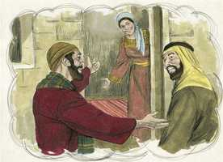
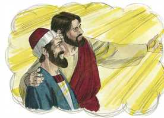

# Mateus Cap 10

**1** 	E, CHAMANDO os seus doze discípulos, deu-lhes poder sobre os espíritos imundos, para os expulsarem, e para curarem toda a enfermidade e todo o mal.

 

**2** 	Ora, os nomes dos doze apóstolos são estes: O primeiro, Simão, chamado Pedro, e André, seu irmão; Tiago, filho de Zebedeu, e João, seu irmão;

  

**3** 	Filipe e Bartolomeu; Tomé e Mateus, o publicano; Tiago, filho de Alfeu, e Lebeu, apelidado Tadeu;

 

**4** 	Simão, o Cananita, e Judas Iscariotes, aquele que o traiu.

**5** 	Jesus enviou estes doze, e lhes ordenou, dizendo: Não ireis pelo caminho dos gentios, nem entrareis em cidade de samaritanos;

 

**6** 	Mas ide antes às ovelhas perdidas da casa de Israel;

 

**7** 	E, indo, pregai, dizendo: É chegado o reino dos céus.

**8** 	Curai os enfermos, limpai os leprosos, ressuscitai os mortos, expulsai os demônios; de graça recebestes, de graça dai.

 

**9** 	Não possuais ouro, nem prata, nem cobre, em vossos cintos,

**10** 	Nem alforjes para o caminho, nem duas túnicas, nem alparcas, nem bordões; porque digno é o operário do seu alimento.

**11** 	E, em qualquer cidade ou aldeia em que entrardes, procurai saber quem nela seja digno, e hospedai-vos aí, até que vos retireis.

**12** 	E, quando entrardes nalguma casa, saudai-a;

**13** 	E, se a casa for digna, desça sobre ela a vossa paz; mas, se não for digna, torne para vós a vossa paz.

 

**14** 	E, se ninguém vos receber, nem escutar as vossas palavras, saindo daquela casa ou cidade, sacudi o pó dos vossos pés.

 

**15** 	Em verdade vos digo que, no dia do juízo, haverá menos rigor para o país de Sodoma e Gomorra do que para aquela cidade.

**16** 	Eis que vos envio como ovelhas ao meio de lobos; portanto, sede prudentes como as serpentes e inofensivos como as pombas.

**17** 	Acautelai-vos, porém, dos homens; porque eles vos entregarão aos sinédrios, e vos açoitarão nas suas sinagogas;

 

**18** 	E sereis até conduzidos à presença dos governadores, e dos reis, por causa de mim, para lhes servir de testemunho a eles, e aos gentios.

**19** 	Mas, quando vos entregarem, não vos dê cuidado como, ou o que haveis de falar, porque naquela mesma hora vos será ministrado o que haveis de dizer.

**20** 	Porque não sois vós quem falará, mas o Espírito de vosso Pai é que fala em vós.

**21** 	E o irmão entregará à morte o irmão, e o pai o filho; e os filhos se levantarão contra os pais, e os matarão.

 

**22** 	E odiados de todos sereis por causa do meu nome; mas aquele que perseverar até ao fim, esse será salvo.

**23** 	Quando pois vos perseguirem nesta cidade, fugi para outra; porque em verdade vos digo que não acabareis de percorrer as cidades de Israel sem que venha o Filho do homem.

**24** 	Não é o discípulo mais do que o mestre, nem o servo mais do que o seu senhor.

**25** 	Basta ao discípulo ser como seu mestre, e ao servo como seu senhor. Se chamaram Belzebu ao pai de família, quanto mais aos seus domésticos?

**26** 	Portanto, não os temais; porque nada há encoberto que não haja de revelar-se, nem oculto que não haja de saber-se.

**27** 	O que vos digo em trevas dizei-o em luz; e o que escutais ao ouvido pregai-o sobre os telhados.

**28** 	E não temais os que matam o corpo e não podem matar a alma; temei antes aquele que pode fazer perecer no inferno a alma e o corpo.

**29** 	Não se vendem dois passarinhos por um ceitil? e nenhum deles cairá em terra sem a vontade de vosso Pai.

**30** 	E até mesmo os cabelos da vossa cabeça estão todos contados.

**31** 	Não temais, pois; mais valeis vós do que muitos passarinhos.

**32** 	Portanto, qualquer que me confessar diante dos homens, eu o confessarei diante de meu Pai, que está nos céus.

**33** 	Mas qualquer que me negar diante dos homens, eu o negarei também diante de meu Pai, que está nos céus.

**34** 	Não cuideis que vim trazer a paz à terra; não vim trazer paz, mas espada;

**35** 	Porque eu vim pôr em dissensão o homem contra seu pai, e a filha contra sua mãe, e a nora contra sua sogra;

**36** 	E assim os inimigos do homem serão os seus familiares.

**37** 	Quem ama o pai ou a mãe mais do que a mim não é digno de mim; e quem ama o filho ou a filha mais do que a mim não é digno de mim.

**38** 	E quem não toma a sua cruz, e não segue após mim, não é digno de mim.

**39** 	Quem achar a sua vida perdê-la-á; e quem perder a sua vida, por amor de mim, achá-la-á.

**40** 	Quem vos recebe, a mim me recebe; e quem me recebe a mim, recebe aquele que me enviou.

 

**41** 	Quem recebe um profeta em qualidade de profeta, receberá galardão de profeta; e quem recebe um justo na qualidade de justo, receberá galardão de justo.

**42** 	E qualquer que tiver dado só que seja um copo de água fria a um destes pequenos, em nome de discípulo, em verdade vos digo que de modo algum perderá o seu galardão.

 

> **Cmt MHenry** Intro: Nosso Senhor adverte a seus discípulos que se preparem para a perseguição. Eles deviam evitar todas as coisas que dessem vantagem a seus inimigos, toda intromissão nos esforços políticos ou mundanos, toda aparência de mal ou egoísmo, e todas as medidas clandestinas. Cristo padece dificuldades não só para que os transtornos não sejam surpresa, senão para que eles possam confirmar sua fé. Diz-lhes que devem sofrer e de parte de quem. Assim, Cristo nos tem tratado fiel e eqüitativamente, dizendo-nos o pior que podemos achar em seu serviço; e quer que assim nos tratemos a nós mesmos, ao sentar-nos a calcular o custo. Os perseguidores são piores que as bestas, porque fazem presa dos mesmos de sua espécie. Os laços de amor e dever mais sólidos se romperam por inimizade contra Cristo. Os sofrimentos de parte de amizades e parentes são muito dolorosos; nada fere mais. Simplesmente parece que todos os que desejam viver piamente em Cristo Jesus padecerão perseguição; e devemos esperar que através de muitas tribulações entremos no Reino de Deus. Nesta predição de problemas, há conselhos e consolo para os momentos de provação. Os discípulos de Cristo são odiados e perseguidos como serpentes, e se procura sua ruína, e necessitam a sabedoria da serpente, mas a simplicidade das pombas. Não somente não danifiquem a ninguém, senão que não tenham má vontade contra ninguém. Deve haver cuidado prudente, porém não devem deixar-se dominar por pensamentos de angústia e confusão; que esta preocupação seja lançada sobre Deus. os discípulos de Cristo devem pensar mais em realizar o bem que em falar bem. No caso de grande perigo, os discípulos de Cristo podem sair do caminho perigoso, ainda quando não devam sair-se do caminho do dever. Não se devem usar meios pecaminosos e ilícitos para fugir; porque então não se trata de uma porta que Deus tenha aberto. O temor ao homem lhe coloca uma armadilha, uma cilada de confusão que perturba nossa paz; uma armadilha que enreda, pela qual somos atraídos ao pecado; e portanto, se deve lutar e orar em sua contra. A tribulação, a angústia e a perseguição não podem eliminar o amor de Deus por eles ou o deles por Ele. Temam Àquele que pode destruir o corpo e a alma no inferno. Eles devem dar sua mensagem publicamente, porque todos estão profundamente preocupados da doutrina do Evangelho. Deve dar-se a conhecer todo o conselho de Deus ([Atos 20.27](../44N-At/20.md#27)). Cristo lhes mostra por que devem estar de bom ânimo. Seus sofrimentos testemunham contra os que se opõem a seu Evangelho. Quando Deus nos chama para falarmos por Ele, podemos depender dEle para que nos ensine o que dizer. Uma perspectiva fiel do final de nossas aflições será muito útil para sustentar-nos quando estejamos submetidos a elas. O poder será conforme ao dia. De grande ânimo para os que estão realizando a obra de Deus é que seja uma obra que certamente será feita. Veja-se como o cuidado da providência se estende a todas as criaturas, ainda aos pardais. Isto deve silenciar todos os temores do povo de Deus: Vocês valem mais que muitos pardais. Os próprios cabelos de suas cabeças estão todos contados. Isto denota a cristã que Deus faz e mantém de seu povo. nosso dever é não só crer em Cristo, senão professar essa fé, sofrendo por Ele, quando somos chamados a isso, assim como também a servi-lo. aqui somente se alude à negação de Cristo que é persistente, e essa confissão só pode ter a bendita recompensa aqui prometida, que é a linguagem verdadeira e constante do amor e da fé. A religião vale tudo; todos os que crêem sua verdade, chegarão ao prêmio e farão que todos o resto se renda a isso. Cristo nos conduzirá através dos sofrimentos para gloriar-nos nEle. Os melhores preparados para a vida vindoura são os que estão mais livres desta vida presente. Embora a bondade feita aos discípulos de Cristo seja sumamente pequena, será aceita quando haja ocasião para ela e não exista capacidade de fazer mais. Cristo não diz que mereçam recompensa, porque não podemos merecer nada da mão de Deus; porém receberão um prêmio da dádiva gratuita de Deus. confessemos ousadamente a Cristo e mostremos nosso amor por Ele em todas as coisas.> " Não se deve levar o evangelho aos gentios até que os judeus o tenham rejeitado. Esta limitação aos apóstolos foi somente para sua primeira missão. Onde quer que fossem deviam pregar esta mensagem: "O Reino dos Céus está próximo". Eles *pregaram* para estabelecer a fé; o *reino* para animar a esperança; *dos céus* para inspirar o amor às coisas celestiais e o desprezo pelas terrenas; que estava *próximo*, para que os homens se preparassem sem demora. Cristo lhes deu poder para realizar milagres como confirmação de sua doutrina. Isto não é necessário agora que o Reino de Deus veio. Mostra que a intenção da doutrina que pregavam era curar almas enfermas e ressuscitar os que estavam mortos no pecado. Ao proclamar o evangelho da graça nas cidades e povos desconhecidos, o servo de Cristo é embaixador da paz em qualquer parte aonde seja enviado., sua mensagem é até para os pecadores mais vis, embora lhes corresponda buscar as melhores pessoas de cada lugar. não convém orar de todo coração por todos e conduzirmos cortesmente com todos. Deu-lhes instruções sobre como agir com os que os rejeitem. Todo o conselho de Deus deve ser declarado, e aos que não ouçam a mensagem da graça, se deve demonstrar que seu estado é perigoso. Isto deve ser levado muito a serio por todos os que ouvem o evangelho, não seja que seus privilégios lhes sirvam somente para aumentar sua condena. "> " A palavra "apóstolo" significa "mensageiro"; eles eram os mensageiros de Cristo enviados a proclamar seu reino. Cristo lhes deu poder para sarar toda classe de doenças. Na graça do Evangelho há um balsamo para cada chaga, um remédio para cada doença. Não há enfermidade espiritual se não há poder em Cristo para curá-la. Seus nomes estão escritos e isso é sua honra; mas eles tinham maior razão para regozijar-se em que seus nomes estivessem escritos no céu, enquanto os nomes elevados e poderosos dos grandes da terra estão soterrados no pó. "