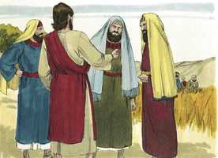
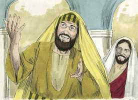
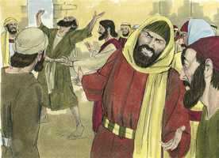

# Mateus Cap 12

**1** 	NAQUELE tempo passou Jesus pelas searas, em um sábado; e os seus discípulos, tendo fome, começaram a colher espigas, e a comer.

 

**2** 	E os fariseus, vendo isto, disseram-lhe: Eis que os teus discípulos fazem o que não é lícito fazer num sábado.

 

**3** 	Ele, porém, lhes disse: Não tendes lido o que fez Davi, quando teve fome, ele e os que com ele estavam?

 

**4** 	Como entrou na casa de Deus, e comeu os pães da proposição, que não lhe era lícito comer, nem aos que com ele estavam, mas só aos sacerdotes?

**5** 	Ou não tendes lido na lei que, aos sábados, os sacerdotes no templo violam o sábado, e ficam sem culpa?

 

**6** 	Pois eu vos digo que está aqui quem é maior do que o templo.

**7** 	Mas, se vós soubésseis o que significa: Misericórdia quero, e não sacrifício, não condenaríeis os inocentes.

**8** 	Porque o Filho do homem até do sábado é Senhor.

**9** 	E, partindo dali, chegou à sinagoga deles.

 

**10** 	E, estava ali um homem que tinha uma das mãos mirrada; e eles, para o acusarem, o interrogaram, dizendo: É lícito curar nos sábados?

 

**11** 	E ele lhes disse: Qual dentre vós será o homem que tendo uma ovelha, se num sábado ela cair numa cova, não lançará mão dela, e a levantará?

 

**12** 	Pois, quanto mais vale um homem do que uma ovelha? É, por conseqüência, lícito fazer bem nos sábados.

 

**13** 	Então disse àquele homem: Estende a tua mão. E ele a estendeu, e ficou sã como a outra.

 

**14** 	E os fariseus, tendo saído, formaram conselho contra ele, para o matarem.

**15** 	Jesus, sabendo isso, retirou-se dali, e acompanharam-no grandes multidões, e ele curou a todas.

**16** 	E recomendava-lhes rigorosamente que o não descobrissem,

**17** 	Para que se cumprisse o que fora dito pelo profeta Isaías, que diz:

**18** 	Eis aqui o meu servo, que escolhi, o meu amado, em quem a minha alma se compraz; Porei sobre ele o meu espírito, E anunciará aos gentios o juízo.

**19** 	Não contenderá, nem clamará, Nem alguém ouvirá pelas ruas a sua voz;

**20** 	Não esmagará a cana quebrada, E não apagará o morrão que fumega, Até que faça triunfar o juízo;

**21** 	E no seu nome os gentios esperarão.

**22** 	Trouxeram-lhe, então, um endemoninhado cego e mudo; e, de tal modo o curou, que o cego e mudo falava e via.

**23** 	E toda a multidão se admirava e dizia: Não é este o Filho de Davi?

**24** 	Mas os fariseus, ouvindo isto, diziam: Este não expulsa os demônios senão por Belzebu, príncipe dos demônios.

 

**25** 	Jesus, porém, conhecendo os seus pensamentos, disse-lhes: Todo o reino dividido contra si mesmo é devastado; e toda a cidade, ou casa, dividida contra si mesma não subsistirá.

 

**26** 	E, se Satanás expulsa a Satanás, está dividido contra si mesmo; como subsistirá, pois, o seu reino?

**27** 	E, se eu expulso os demônios por Belzebu, por quem os expulsam então vossos filhos? Portanto, eles mesmos serão os vossos juízes.

**28** 	Mas, se eu expulso os demônios pelo Espírito de Deus, logo é chegado a vós o reino de Deus.

**29** 	Ou, como pode alguém entrar na casa do homem valente, e furtar os seus bens, se primeiro não maniatar o valente, saqueando então a sua casa?

**30** 	Quem não é comigo é contra mim; e quem comigo não ajunta, espalha.

**31** 	Portanto, eu vos digo: Todo o pecado e blasfêmia se perdoará aos homens; mas a blasfêmia contra o Espírito não será perdoada aos homens.

**32** 	E, se qualquer disser alguma palavra contra o Filho do homem, ser-lhe-á perdoado; mas, se alguém falar contra o Espírito Santo, não lhe será perdoado, nem neste século nem no futuro.

**33** 	Ou fazei a árvore boa, e o seu fruto bom, ou fazei a árvore má, e o seu fruto mau; porque pelo fruto se conhece a árvore.

**34** 	Raça de víboras, como podeis vós dizer boas coisas, sendo maus? Pois do que há em abundância no coração, disso fala a boca.

**35** 	O homem bom tira boas coisas do bom tesouro do seu coração, e o homem mau do mau tesouro tira coisas más.

**36** 	Mas eu vos digo que de toda a palavra ociosa que os homens disserem hão de dar conta no dia do juízo.

**37** 	Porque por tuas palavras serás justificado, e por tuas palavras serás condenado.

**38** 	Então alguns dos escribas e dos fariseus tomaram a palavra, dizendo: Mestre, quiséramos ver da tua parte algum sinal.

**39** 	Mas ele lhes respondeu, e disse: Uma geração má e adúltera pede um sinal, porém, não se lhe dará outro sinal senão o sinal do profeta Jonas;

 

**40** 	Pois, como Jonas esteve três dias e três noites no ventre da baleia, assim estará o Filho do homem três dias e três noites no seio da terra.

**41** 	Os ninivitas ressurgirão no juízo com esta geração, e a condenarão, porque se arrependeram com a pregação de Jonas. E eis que está aqui quem é maior do que Jonas.

**42** 	A rainha do sul se levantará no dia do juízo com esta geração, e a condenará; porque veio dos confins da terra para ouvir a sabedoria de Salomão. E eis que está aqui quem é maior do que Salomão.

**43** 	E, quando o espírito imundo tem saído do homem, anda por lugares áridos, buscando repouso, e não o encontra.

**44** 	Então diz: Voltarei para a minha casa, de onde saí. E, voltando, acha-a desocupada, varrida e adornada.

**45** 	Então vai, e leva consigo outros sete espíritos piores do que ele e, entrando, habitam ali; e são os últimos atos desse homem piores do que os primeiros. Assim acontecerá também a esta geração má.

**46** 	E, falando ele ainda à multidão, eis que estavam fora sua mãe e seus irmãos, pretendendo falar-lhe.

**47** 	E disse-lhe alguém: Eis que estão ali fora tua mãe e teus irmãos, que querem falar-te.

**48** 	Ele, porém, respondendo, disse ao que lhe falara: Quem é minha mãe? E quem são meus irmãos?

**49** 	E, estendendo a sua mão para os seus discípulos, disse: Eis aqui minha mãe e meus irmãos;

**50** 	Porque, qualquer que fizer a vontade de meu Pai que está nos céus, este é meu irmão, e irmã e mãe.

> **Cmt MHenry** Intro: A pregação de Cristo era simples e familiar, e adequada para seus ouvintes. sua mãe e seus irmãos estavam dentro, desejando ouvi-lo. Freqüentemente os que estão mais perto dos meios de conhecimento e de graça são os mais negligentes. Somos bons para descuidar o que pensamos que podemos ter um dia, esquecendo que o amanhã não é nosso. Amiúde nos encontramos com obstáculos a nossa obra, de parte de amigos que nos rodeiam, e somos tirados dos cuidados pelas coisas desta vida, das preocupações de nossa alma. Cristo estava tão dedicado a sua obra que nenhum poder natural ou de outra índole o afastava dela. Não se trata de que, sob pretexto de religião, sejamos insolentes com os pais ou maus com eles, senão que o menor dever deve ficar à espera enquanto se realiza o maior. Deixemos os homens e aferremo-nos a Cristo; olhemos a todo cristão, em qualquer condição de vida, como irmão, irmã, ou mãe do Senhor da glória; amemos, respeitemos e sejamos amáveis com eles por amor dEle e seguindo seu exemplo.> Embora Cristo esteja sempre preste a ouvir e responder os desejos e as orações santas, os que pedem mal, pedem e, contudo, não obtêm. Foram dados sinais aos que os desejavam para confirmar sua fé, como a Abraão e a Gideão; porém foram negados aos que os exigiam para escusar sua incredulidade. A ressurreição de Cristo dentre os mortos por seu poder aqui é chamada de sinal de Jonas, o profeta, e é a grande prova de que Cristo era o Messias. Como Jonas esteve três dias e três noites no grande peixe, e depois tornou a sair vivo, assim estaria Cristo esse tempo no túmulo e ressuscitaria. Os ninivitas envergonhariam os judeus por não se arrependerem; a rainha de Sabá os envergonharia por não acreditar em Cristo. Nós não temos esses impedimentos, não vamos a Cristo com essas inseguranças. Esta parábola representa o caso da igreja e a nação judaica. Também é aplicável a todos os que ouvem a palavra de Deus e se reformam em parte, porém não se convertem de verdade. o espírito imundo se vá por algum tempo, mas quando volta, encontra que Cristo não está ali para impedi-lo de entrar; o coração está varrido pela reforma externa, porém enfeitado pelos preparativos para cumprir as más sugestões, e o homem se torna inimigo mais decidido da verdade. todo coração é a residência de espíritos imundos, salvo os que são templo do Espírito Santo, pela fé em Cristo.> O idioma do homem descobre de que país procede, igualmente de que classe de espírito é. O coração é a fonte, as palavras são os riachos. Uma fonte turva e uma corrente corrupta devem produzir riachos lamacentos e desagradáveis. Nada curará as águas, sazonará a fala nem purificará a comunicação corrupta senão o sal da graça, lançado na correnteza. O homem mau tem um mal tesouro em seu coração, do qual o pecador tira as más palavras e as más ações para desonrar a Deus e ferir o próximo. Vigiemos continuamente sobre nós mesmos para que possamos falar palavras conformes ao caráter cristão.> Eis aqui uma bondosa certeza do perdão de todo pecado nas condições do evangelho. Cristo assenta aqui o exemplo para que os filhos dos homens estejam dispostos a perdoar as palavras que se dizem contra eles. Mas os crentes humildes e cientes são tentados, às vezes, para que pensem que cometeram o pecado imperdoável, enquanto os que mais se aproximam a isso rara vez têm algum temor por isso. podemos ter a certeza de que os que indubitavelmente se arrependem e crêem no evangelho, não cometeram este pecado ou algum outro da mesma classe; porque o arrependimento e a fé são dons especiais de Deus que não outorgaria a nenhum homem se estiver decidido a não perdoá-lo; os que temem ter cometido este pecado, somente por isso já dão um bom sinal de que não é assim. O pecador tremente e contrito tem em si mesmo o testemunho de que não é assim em seu caso.> Uma alma submetida ao poder de Satanás e cativada por ele, está cega para as coisas de Deus e muda ante o trono da graça; nada vê e nada diz a propósito. Satanás cega os olhos com a incredulidade; e sela os lábios da oração. Quanto mais gente magnificava a Cristo, mais desejosos de injuriá-lo estavam os fariseus. Era evidente que se Satanás ajudava a Jesus a expulsar demônios, o reino do inferno estava dividido contra si mesmo, então, como poderia resistir! E se diziam que Jesus expulsava demônios pelo príncipe dos demônios, não podiam provar que seus filhos os expulsassem por algum outro poder. Há dois grandes interesses no mundo; e quando os espíritos imundos são expulsos pelo Espírito Santo, na conversão dos pecadores a uma vida de fé e obediência, tem chegado a nós o reino de Deus. todos os que não ajudam nem se regozijam com essa classe de mudança, estão contra Cristo.> Os fariseus fizeram consulta para achar alguma acusação contra Jesus para condená-lo a morte. Ciente da intenção deles, Ele se retirou desse lugar, pois seu tempo não tinha chegado. O rosto não corresponde mais exatamente ao rosto refletido na água que o caráter de Cristo esboçado pelo profeta se corresponde com seu temperamento e conduta, descritos pelos evangelistas. Encomendemos com alegre confiança nossas almas a um Amigo tão bom e fiel. Longe de rompê-lo, fortalecerá o caniço rachado; longe de apagar o pavio fumegante, ou quase extinto, antes Ele soprará para avivar a chama. Afastemos as contendas e os debates irados; recebamos-nos uns a outros como Cristo nos recebe. E enquanto estejamos animados pela bondade da graça de nosso Senhor, devemos orar para que seu Espírito repouse em nós e nos faça capazes de imitar seu exemplo.> Cristo demonstra que as obras de misericórdia são lícitas e próprias para fazê-las no dia do Senhor. Existem outras maneiras de fazer o bem nos dias de repouso além dos deveres da adoração: atender o doente, aliviar o pobre, ajudar os que necessitam alívio urgente, ensinar os jovens a cuidar suas almas; estas obras fazem o bem; e devem fazer-se por amor e caridade, com humildade e abnegação, e serão aceitas ([Gênesis 4.7](../01A-Gn/04.md#7)). Isto tem um significado espiritual, como outras sanidades que operou Cristo. Por natureza nossas mãos estão ressequidas e por nós mesmos somos incapazes de fazer nada que seja bom. Somente Cristo nos cura com o poder de sua graça; Ele cura a mão ressequida dando vida na alma morta; opera em nós tanto o querer como o fazer: porque, com o mandamento, há uma promessa de graça dada pela palavra.> Estando nos campos de trigo, os discípulos começaram a tirar trigo: a lei de Deus o permitia ([Deuteronômio 23.25](../05A-Dt/23.md#25)). Esta era uma magra provisão para Cristo e seus discípulos, porém se contentavam com isso. os fariseus não discutiram com eles por cortar o trigo de outro homem, senão por fazê-lo no dia de repouso. Cristo veio para libertar seus seguidores, não só das corrupções dos fariseus, senão de suas regras anti-bíblicas, e justificou o que eles fizeram. O maior não verá satisfeitas suas concupiscências, mas o menor verá que há consideração por suas necessidades. Os trabalho no dia do repouso são legítimos se necessários, e o dia de repouso é para fomentar, e não para obstaculizar a adoração. Deve ser feita a provisão necessária para a saúde e a comida, más o caso é muito diferente quando se têm servos na casa, e as famílias viram cenário de apressamentos e confusão no dia do Senhor, para dar um festim aos visitantes ou para dar-se um gosto eles mesmos. Cabe condenar coisas como essas e muitas outras que são comuns entre os professantes. O descanso do dia do repouso foi ordenado para bem do homem (Deuteronômio v 14). Não deve entender-se nenhuma lei em forma tal que contradiga sua própria finalidade. Como Cristo é o Senhor do dia do repouso, é apropriado que dedique para sim o dia e sua obra.