# Mateus Cap 13

**1** 	TENDO Jesus saído de casa, naquele dia, estava assentado junto ao mar;

**2** 	E ajuntou-se muita gente ao pé dele, de sorte que, entrando num barco, se assentou; e toda a multidão estava em pé na praia.

**3** 	E falou-lhe de muitas coisas por parábolas, dizendo: Eis que o semeador saiu a semear.

**4** 	E, quando semeava, uma parte da semente caiu ao pé do caminho, e vieram as aves, e comeram-na;

 

**5** 	E outra parte caiu em pedregais, onde não havia terra bastante, e logo nasceu, porque não tinha terra funda;

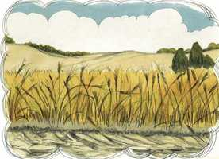 

**6** 	Mas, vindo o sol, queimou-se, e secou-se, porque não tinha raiz.

**7** 	E outra caiu entre espinhos, e os espinhos cresceram e sufocaram-na.

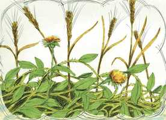 

**8** 	E outra caiu em boa terra, e deu fruto: um a cem, outro a sessenta e outro a trinta.

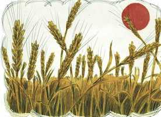 

**9** 	Quem tem ouvidos para ouvir, ouça.

**10** 	E, acercando-se dele os discípulos, disseram-lhe: Por que lhes falas por parábolas?

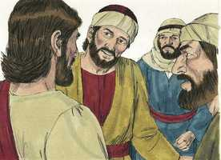 

**11** 	Ele, respondendo, disse-lhes: Porque a vós é dado conhecer os mistérios do reino dos céus, mas a eles não lhes é dado;

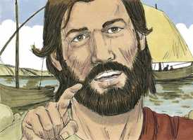 

**12** 	Porque àquele que tem, se dará, e terá em abundância; mas àquele que não tem, até aquilo que tem lhe será tirado.

**13** 	Por isso lhes falo por parábolas; porque eles, vendo, não vêem; e, ouvindo, não ouvem nem compreendem.

**14** 	E neles se cumpre a profecia de Isaías, que diz: Ouvindo, ouvireis, mas não compreendereis, E, vendo, vereis, mas não percebereis.

**15** 	Porque o coração deste povo está endurecido, E ouviram de mau grado com seus ouvidos, E fecharam seus olhos; Para que não vejam com os olhos, E ouçam com os ouvidos, E compreendam com o coração, E se convertam, E eu os cure.

**16** 	Mas, bem-aventurados os vossos olhos, porque vêem, e os vossos ouvidos, porque ouvem.

 

**17** 	Porque em verdade vos digo que muitos profetas e justos desejaram ver o que vós vedes, e não o viram; e ouvir o que vós ouvis, e não o ouviram.

**18** 	Escutai vós, pois, a parábola do semeador.

**19** 	Ouvindo alguém a palavra do reino, e não a entendendo, vem o maligno, e arrebata o que foi semeado no seu coração; este é o que foi semeado ao pé do caminho.

 

**20** 	O que foi semeado em pedregais é o que ouve a palavra, e logo a recebe com alegria;

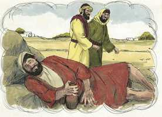 

**21** 	Mas não tem raiz em si mesmo, antes é de pouca duração; e, chegada a angústia e a perseguição, por causa da palavra, logo se ofende;

**22** 	E o que foi semeado entre espinhos é o que ouve a palavra, mas os cuidados deste mundo, e a sedução das riquezas sufocam a palavra, e fica infrutífera;

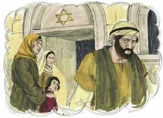 

**23** 	Mas, o que foi semeado em boa terra é o que ouve e compreende a palavra; e dá fruto, e um produz cem, outro sessenta, e outro trinta.

 

**24** 	Propôs-lhes outra parábola, dizendo: O reino dos céus é semelhante ao homem que semeia a boa semente no seu campo;

**25** 	Mas, dormindo os homens, veio o seu inimigo, e semeou joio no meio do trigo, e retirou-se.

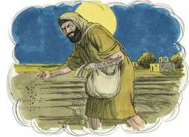 

**26** 	E, quando a erva cresceu e frutificou, apareceu também o joio.

**27** 	E os servos do pai de família, indo ter com ele, disseram-lhe: Senhor, não semeaste tu, no teu campo, boa semente? Por que tem, então, joio?

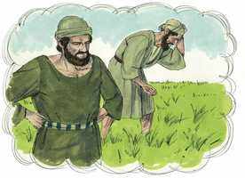 

**28** 	E ele lhes disse: Um inimigo é quem fez isso. E os servos lhe disseram: Queres pois que vamos arrancá-lo?

**29** 	Ele, porém, lhes disse: Não; para que, ao colher o joio, não arranqueis também o trigo com ele.

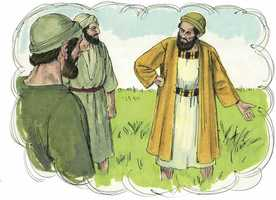 

**30** 	Deixai crescer ambos juntos até à ceifa; e, por ocasião da ceifa, direi aos ceifeiros: Colhei primeiro o joio, e atai-o em molhos para o queimar; mas, o trigo, ajuntai-o no meu celeiro.

**31** 	Outra parábola lhes propôs, dizendo: O reino dos céus é semelhante ao grão de mostarda que o homem, pegando nele, semeou no seu campo;

 

**32** 	O qual é, realmente, a menor de todas as sementes; mas, crescendo, é a maior das plantas, e faz-se uma árvore, de sorte que vêm as aves do céu, e se aninham nos seus ramos.

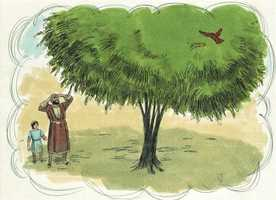 

**33** 	Outra parábola lhes disse: O reino dos céus é semelhante ao fermento, que uma mulher toma e introduz em três medidas de farinha, até que tudo esteja levedado.

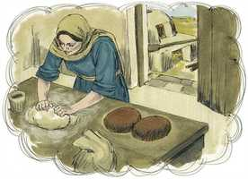 

**34** 	Tudo isto disse Jesus, por parábolas à multidão, e nada lhes falava sem parábolas;

 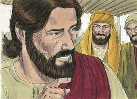 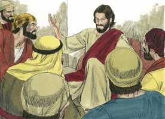 

**35** 	Para que se cumprisse o que fora dito pelo profeta, que disse: Abrirei em parábolas a minha boca; Publicarei coisas ocultas desde a fundação do mundo.

**36** 	Então, tendo despedido a multidão, foi Jesus para casa. E chegaram ao pé dele os seus discípulos, dizendo: Explica-nos a parábola do joio do campo.

 

**37** 	E ele, respondendo, disse-lhes: O que semeia a boa semente, é o Filho do homem;

**38** 	O campo é o mundo; e a boa semente são os filhos do reino; e o joio são os filhos do maligno;

**39** 	O inimigo, que o semeou, é o diabo; e a ceifa é o fim do mundo; e os ceifeiros são os anjos.

**40** 	Assim como o joio é colhido e queimado no fogo, assim será na consumação deste mundo.

**41** 	Mandará o Filho do homem os seus anjos, e eles colherão do seu reino tudo o que causa escândalo, e os que cometem iniqüidade.

**42** 	E lançá-los-ão na fornalha de fogo; ali haverá pranto e ranger de dentes.

**43** 	Então os justos resplandecerão como o sol, no reino de seu Pai. Quem tem ouvidos para ouvir, ouça.

**44** 	Também o reino dos céus é semelhante a um tesouro escondido num campo, que um homem achou e escondeu; e, pelo gozo dele, vai, vende tudo quanto tem, e compra aquele campo.

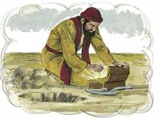 

**45** 	Outrossim, o reino dos céus é semelhante ao homem, negociante, que busca boas pérolas;

 

**46** 	E, encontrando uma pérola de grande valor, foi, vendeu tudo quanto tinha, e comprou-a.

**47** 	Igualmente o reino dos céus é semelhante a uma rede lançada ao mar, e que apanha toda a qualidade de peixes.

**48** 	E, estando cheia, a puxam para a praia; e, assentando-se, apanham para os cestos os bons; os ruins, porém, lançam fora.

**49** 	Assim será na consumação dos séculos: virão os anjos, e separarão os maus de entre os justos,

**50** 	E lançá-los-ão na fornalha de fogo; ali haverá pranto e ranger de dentes.

**51** 	E disse-lhes Jesus: Entendestes todas estas coisas? Disseram-lhe eles: Sim, Senhor.

**52** 	E ele disse-lhes: Por isso, todo o escriba instruído acerca do reino dos céus é semelhante a um pai de família, que tira do seu tesouro coisas novas e velhas.

**53** 	E aconteceu que Jesus, concluindo estas parábolas, se retirou dali.

**54** 	E, chegando à sua pátria, ensinava-os na sinagoga deles, de sorte que se maravilhavam, e diziam: De onde veio a este a sabedoria, e estas maravilhas?

**55** 	Não é este o filho do carpinteiro? e não se chama sua mãe Maria, e seus irmãos Tiago, e José, e Simão, e Judas?

**56** 	E não estão entre nós todas as suas irmãs? De onde lhe veio, pois, tudo isto?

**57** 	E escandalizavam-se nele. Jesus, porém, lhes disse: Não há profeta sem honra, a não ser na sua pátria e na sua casa.

**58** 	E não fez ali muitas maravilhas, por causa da incredulidade deles.

> **Cmt MHenry** Intro: Cristo repete seu oferecimento aos que o rejeitaram. Eles o repreendem: Não é este o filho do carpinteiro? Sim, é verdade que tinha fama de sê-lo; e não é desgraça ser o filho de um comerciante honesto; deviam tê-lo respeitado mais porque era um deles mesmos; tdv, por isso mesmo o desprezaram. Não fez muitas obras poderosas ali devido à incredulidade deles. A incredulidade é o grande estorvo para os favores de Cristo. Mantenhamo-nos fiéis a Ele como o Salvador que fez nossa paz com Deus.> Eis aqui quatro parábolas:\ 1) A do tesouro escondido no campo. Muitos levam com leveza o evangelho porque olham somente a superfície do campo. Mas todos os que esquadrinham as Escrituras, para achar nelas a Cristo e a vida eterna (João v 39), descobrirão tal tesouro, que torna este campo indizivelmente valioso; se apropriam dele a qualquer custo. Embora nada possa dar-se como preço pela salvação, contudo, muito deve dar-se por amor a ela. 2\) Todos os filhos dos homens estão ocupados; um será rico, outro será honorável, ainda um outro será douto; porém a maioria está enganada e tomam as falsificações por pérolas legítimas. Jesus Cristo é a pérola de grande preço; tendo a Ele temos suficiente para fazer-nos felizes aqui e para sempre. o homem pode comprar ouro muito caro, mas não esta Pérola de grande preço. Quando o pecador convicto vê a Cristo como o Salvador da graça, tudo o resto perde valor para seus pensamentos. 3\) O mundo é um mar largo, e em seu estado natural os homens são como os peixes. Pregar o evangelho é lançar uma rede neste mar para pescar algo para glória de Quem tem a soberania sobre este mar. Os hipócritas e os cristãos verdadeiros serão separados; desgraçada é a condição dos que, então, serão lançados fora. 4\) O fiel e destro ministro do evangelho é um escriba bem versado nas coisas do evangelho e capaz de ensiná-las. Cristo o compara com um bom dono de casa, que traz os frutos da colheita do ano anterior e o recolhido este ano, abundante e variado, para atender a seus amigos. Todas as experiências antigas e as observações novas têm sua utilidade. Nosso lugar está aos pés de Cristo, e devemos aprender diariamente de novo as velhas lições, e também as novas.> " Esta parábola representa o estado presente e o futuro da Igreja do evangelho; o cuidado de Cristo por ela, a inimizade do diabo contra ela; a mistura de bons e maus que tem neste mundo, e a separação entre eles no outro mundo. Tão propenso a pecar é o homem caído que se o inimigo semeia, pode continuar seu caminho, e o joio brotará e fará dano; enquanto que quando se semeia boa semente, deve cuidar-se, regar-se e proteger-se. Os servos se queixam a seu amo: *"O senhor não semeou boa semente em seu campo?".* Sem dúvida que sim; o que seja que está errado na igreja podemos ter a certeza de que não é de Cristo. Embora os transgressores grosseiros, e outros que se opõem abertamente ao evangelho, deveriam ser separados da sociedade dos fiéis; contudo, não há destreza humana que possa efetuar uma separação precisa. Os que se opõem não devem ser tirados senão instruídos, e com mansidão. E ainda que os bons e os maus estejam juntos neste mundo, contudo, no dia grande do juízo serão separados; então serão claramente conhecidos o justo e o ímpio; às vezes aqui custa muito distinguir entre eles. Não façamos iniqüidade se conhecemos o temor do Senhor. Na morte os crentes brilharão por si mesmos; no grande dia, brilharão ante todo o mundo. Brilharão por reflexo, com luz emprestada da Fonte de Luz. A santificação deles será aperfeiçoada e sua justificação, publicada. Que sejamos achados nesse feliz número. "> O alcance da parábola da semente de mostarda é mostrar que os começos do evangelho são pequenos, mas seu final será grande; deste modo será executada a obra da graça no coração, o Reino de Deus dentro de nós. Na alma onde verdadeiramente está a graça, crescerá em realidade, ainda que, talvez no começo, não seja discernida, mas afinal terá grande força e utilidade. A pregação do evangelho opera como fermento no coração dos que o recebem. O fermento opera certamente, assim o faz a palavra, porém gradativamente. Opera silenciosamente e sem visto, mas sem falhar. Assim foi com o *mundo*. Os apóstolos, pregando o evangelho, esconderam um pouco de fermento na grande massa da humanidade. Foi feito poderoso pelo Espírito de Jeová dos Exércitos, que opera e nada pode impedi-lo. no *coração* é assim. Quando o evangelho chega a alma, opera uma mudança radical; se espalha a todos os poderes e faculdades da alma, e altera a propriedade ainda dos membros do corpo ([Romanos 6.13](../45N-Rm/06.md#13)). Nestas parábolas se nos ensina a esperar um processo gradual; portanto, perguntemos, estamos crescendo em graça e nos santos princípios e costumes?> " Esta parábola representa o estado presente e o futuro da Igreja do evangelho; o cuidado de Cristo por ela, a inimizade do diabo contra ela; a mistura de bons e maus que tem neste mundo, e a separação entre eles no outro mundo. Tão propenso a pecar é o homem caído que se o inimigo semeia, pode continuar seu caminho, e o joio brotará e fará dano; enquanto que quando se semeia boa semente, deve cuidar-se, regar-se e proteger-se. Os servos se queixam a seu amo: *"O senhor não semeou boa semente em seu campo?".* Sem dúvida que sim; o que seja que está errado na igreja podemos ter a certeza de que não é de Cristo. Embora os transgressores grosseiros, e outros que se opõem abertamente ao evangelho, deveriam ser separados da sociedade dos fiéis; contudo, não há destreza humana que possa efetuar uma separação precisa. Os que se opõem não devem ser tirados senão instruídos, e com mansidão. E ainda que os bons e os maus estejam juntos neste mundo, contudo, no dia grande do juízo serão separados; então serão claramente conhecidos o justo e o ímpio; às vezes aqui custa muito distinguir entre eles. Não façamos iniqüidade se conhecemos o temor do Senhor. Na morte os crentes brilharão por si mesmos; no grande dia, brilharão ante todo o mundo. Brilharão por reflexo, com luz emprestada da Fonte de Luz. A santificação deles será aperfeiçoada e sua justificação, publicada. Que sejamos achados nesse feliz número. "> Jesus embarcou num barco para ser menos pressionado e para que a gente ouvisse melhor. Com isto nos ensina, nas circunstâncias externas da adoração, a não desejar o que é majestoso, senão fazer o melhor das facilidades que Deus nos designa em sua providência. Cristo ensinava com parábolas. Por meio delas simplificava e facilitava as coisas de Deus para os dispostos a serem ensinados, e mais difíceis e escuras para os dispostos a permanecerem ignorantes. A parábola do semeador é clara. A semente plantada é a palavra de Deus. o semeador é nosso Senhor Jesus Cristo, por si ou por seus ministros. Pregar a uma multidão é semear o grão; não sabemos onde brotará. Uma classe de terreno, ainda que nos tomemos muito trabalho, não dá fruto adequado, enquanto a boa terra dá fruto em abundância. Assim acontece nos corações dos homens, cujos diferentes caracteres estão aqui descritos como quatro classes de terreno. Os ouvintes negligentes e frívolos são presas fáceis para Satanás que, como o grande homicida das almas, é o grande ladrão de sermões, e com certeza estará pronto para roubar-nos a palavra se não temos o cuidado de obedecê-la.\ Os hipócritas, como o terreno pedregoso, costumam ter o começo dos cristãos verdadeiros em sua demonstração de profissão de fé. Muitos dos que se alegram de ouvir um bom sermão são os que não se beneficiam. Muito lhes é falado da salvação gratuita, dos privilégios dos crentes, e da felicidade do céu; e, sem mudança do coração, sem convicção permanente de sua própria depravação, de sua necessidade do Salvador ou da excelência da santidade, logo professam uma certeza sem fundamentos. Mas quando uma provação pesada os ameaça ou podem levar uma vantagem pecaminosa, se rendem ou ocultam sua profissão ou tornam a um sistema mais fácil. Os esforços do mundo são apropriadamente comparados com os espinhos, pois vieram com o perdão e são fruto da maldição; são bons em seu lugar para encher o vazio, mas deve estar bem armado o homem que tenha muito a ver com eles; enredam, afligem, aranham e seu fim é serem queimados ([Hebreus 6.8](../58N-Hb/06.md#8)). Os esforços do mundo são grandes obstáculos para ter proveito da palavra de Deus. O enganoso das riquezas opera o mal; não se pode dizer que nos enganamos a menos que depositemos nossa confiança nelas, então afogaremos a boa semente. O que distinguiu o bom terreno foi a frutificação. Por isso se distinguem os cristãos verdadeiros dos hipócritas. Cristo não diz que a boa terra não tenha pedras e espinhos, senão que nada pode impedir que dê fruto. Todos não são iguais; devemos apontar mais alto para dar mais fruto. O sentido do ouvido não pode ser melhor usado que para ouvir a palavra de Deus; olhemo-nos a nós mesmos para que saibamos que classe de ouvintes somos.> • Versículos 1-23 A parábola do semeador • Versículos 24-30; 36-43 A parábola do joio • Versículos 31-35 As parábolas da semente de mostarda e do fermento • Versículos 44-52 As parábolas do tesouro escondido, a pérola preciosa, a rede lançada no mar e o dono de casa • Versículos 53-58 Jesus é novamente rejeitado em Nazaré