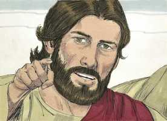
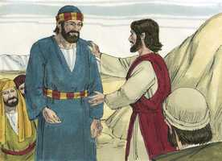
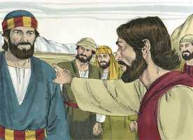
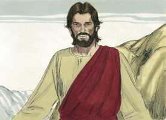
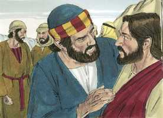
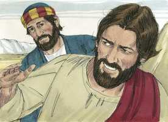

# Mateus Cap 16

**1** 	E, CHEGANDO-SE os fariseus e os saduceus, para o tentarem, pediram-lhe que lhes mostrasse algum sinal do céu.

**2** 	Mas ele, respondendo, disse-lhes: Quando é chegada a tarde, dizeis: Haverá bom tempo, porque o céu está rubro.

**3** 	E, pela manhã: Hoje haverá tempestade, porque o céu está de um vermelho sombrio. Hipócritas, sabeis discernir a face do céu, e não conheceis os sinais dos tempos?

**4** 	Uma geração má e adúltera pede um sinal, e nenhum sinal lhe será dado, senão o sinal do profeta Jonas. E, deixando-os, retirou-se.

**5** 	E, passando seus discípulos para o outro lado, tinham-se esquecido de trazer pão.

**6** 	E Jesus disse-lhes: Adverti, e acautelai-vos do fermento dos fariseus e saduceus.

**7** 	E eles arrazoavam entre si, dizendo: É porque não trouxemos pão.

**8** 	E Jesus, percebendo isso, disse: Por que arrazoais entre vós, homens de pouca fé, sobre o não terdes trazido pão?

**9** 	Não compreendeis ainda, nem vos lembrais dos cinco pães para cinco mil homens, e de quantas alcofas levantastes?

**10** 	Nem dos sete pães para quatro mil, e de quantos cestos levantastes?

**11** 	Como não compreendestes que não vos falei a respeito do pão, mas que vos guardásseis do fermento dos fariseus e saduceus?

**12** 	Então compreenderam que não dissera que se guardassem do fermento do pão, mas da doutrina dos fariseus.

**13** 	E, chegando Jesus às partes de Cesaréia de Filipe, interrogou os seus discípulos, dizendo: Quem dizem os homens ser o Filho do homem?

 

**14** 	E eles disseram: Uns, João o Batista; outros, Elias; e outros, Jeremias, ou um dos profetas.

**15** 	Disse-lhes ele: E vós, quem dizeis que eu sou?

 

**16** 	E Simão Pedro, respondendo, disse: Tu és o Cristo, o Filho do Deus vivo.

 

**17** 	E Jesus, respondendo, disse-lhe: Bem-aventurado és tu, Simão Barjonas, porque to não revelou a carne e o sangue, mas meu Pai, que está nos céus.

 

**18** 	Pois também eu te digo que tu és Pedro, e sobre esta pedra edificarei a minha igreja, e as portas do inferno não prevalecerão contra ela;

 

**19** 	E eu te darei as chaves do reino dos céus; e tudo o que ligares na terra será ligado nos céus, e tudo o que desligares na terra será desligado nos céus.

**20** 	Então mandou aos seus discípulos que a ninguém dissessem que ele era Jesus o Cristo.

 

**21** 	Desde então começou Jesus a mostrar aos seus discípulos que convinha ir a Jerusalém, e padecer muitas coisas dos anciãos, e dos principais dos sacerdotes, e dos escribas, e ser morto, e ressuscitar ao terceiro dia.

 

**22** 	E Pedro, tomando-o de parte, começou a repreendê-lo, dizendo: Senhor, tem compaixão de ti; de modo nenhum te acontecerá isso.

 

**23** 	Ele, porém, voltando-se, disse a Pedro: Para trás de mim, Satanás, que me serves de escândalo; porque não compreendes as coisas que são de Deus, mas só as que são dos homens.

 

**24** 	Então disse Jesus aos seus discípulos: Se alguém quiser vir após mim, renuncie-se a si mesmo, tome sobre si a sua cruz, e siga-me;

 

**25** 	Porque aquele que quiser salvar a sua vida, perdê-la-á, e quem perder a sua vida por amor de mim, achá-la-á.

**26** 	Pois que aproveita ao homem ganhar o mundo inteiro, se perder a sua alma? Ou que dará o homem em recompensa da sua alma?

**27** 	Porque o Filho do homem virá na glória de seu Pai, com os seus anjos; e então dará a cada um segundo as suas obras.

**28** 	Em verdade vos digo que alguns há, dos que aqui estão, que não provarão a morte até que vejam vir o Filho do homem no seu reino.

 

> **Cmt MHenry** Intro: " Um verdadeiro discípulo de Cristo é aquele que o segue no dever e o seguirá à glória. É um que anda no mesmo caminho que andou Cristo, guiado por seu Espírito, e anda em suas pegadas, onde quer que vá. "Negue-se a si mesmo". Se negar-se a si mesmo é lição dura, não é mais do que aprendeu e praticou nosso Mestre, para redimir-nos e ensinar-nos. "Tome sua cruz". Aqui se coloca cruz por todo problema que nos sobrevenha. Somos bons para pensar que poderíamos levar melhor a cruz alheia que a própria; porém melhor é o que nos foi designado, e devemos fazer nosso melhor nisso. Não devemos, por nossa precipitação e torpeza, acarretar-nos cruzes sobre nossas cabeças, senão tomá-las quando estejam em nosso caminho. Se um homem tem o nome e crédito de um discípulo, segura a Cristo na obra e o dever do discípulo. Se todas as coisas do mundo nada valem quando comparadas com a vida do corpo, quão forte o mesmo argumento acerca da alma e seu estado de felicidade ou miséria eterna! Milhares perdem suas almas pela ganância mais frívola ou a indulgência mais indigna, sim, amiúde só por preguiça ou negligência. Qualquer que seja o objeto pelo qual os homens deixam a Cristo, esse é o preço com o qual Satanás compra suas almas. Mas uma alma é mais valiosa que todo o mundo. Este é o juízo de Cristo para a matéria; conhecia o preço das almas, porque as resgatou; nem teria super-valorizado o mundo, porque o fez. O transgressor moribundo não pode comprar uma hora de alívio para buscar misericórdia para sua alma que perece. Então, aprendamos justamente a valorizar nossa alma, e a Cristo como o único Salvador delas. "> Cristo revele paulatinamente seu pensamento a seu povo. desde essa época, quando os apóstolos fizeram a confissão completa de Cristo, que era o Filho de Deus, começou a falar-lhes de seus sofrimentos. Disse isto para corrigir os erros de seus discípulos sobre a pompa e poder externos de seu reino. Os que sigam a Cristo não devem esperar grandes coisas nem elevadas neste mundo. Pedro queria que Cristo aborrecesse o sofrimento tanto como ele, mas erramos se medimos o amor e a paciência de Cristo pelos nossos. Não lemos de nada que tenha dito ou feito nenhum de seus discípulos, em algum momento, que deixasse ver que Cristo se ressentiu tanto como quando ouviu isto. Qualquer um que nos tire do que é bom e nos faça temer que estamos fazendo demasiado por Deus, fala a linguagem de Satanás. Os que renunciam a sofrer por Cristo, saboreiam mais as coisas do homem que as coisas de Deus.> " Pedro disse, por si mesmo e por seus irmãos, que estavam seguros de que nosso Senhor era o Messias prometido, o Filho do Deus vivo. Isto mostra que criam que Jesus eram mais que homem. Nosso Senhor afirma que Pedro era bem-aventurado, porque o ensinamento de Deus o fazia diferente de seus compatriotas incrédulos. Cristo agrega que o chama Pedro, aludindo a sua estabilidade ou firmeza para professar a verdade. a palavra traduzida como "pedra" não é a mesma palavra "Pedro", senão uma de significado similar. Nada pode ser mais errôneo que supor que Cristo significou que a *pessoa* de Pedro era a rocha. Sem dúvida que o próprio Cristo é a Rocha, o fundamento provado da Igreja; e aí daquele que tentar colocar outro! A confissão de Pedro é esta rocha Enquanto doutrina. Se Jesus não for o Cristo, os que Ele possui não são da Igreja, mas enganadores e enganados. Nosso Senhor declara depois a autoridade com que Pedro seria investido. Ele falou em nome de seus irmãos e isto o relacionava a eles com Ele. Eles não tinham conhecimento certeiro do caráter dos homens, e eram propensos a erros e a pecados em sua conduta; porém eles foram guardados livres de erro ao estabelecer o caminho de aceitação e de salvação, a regra da obediência, o caráter e a experiência do crente, e a condenação final dos incrédulos e hipócritas. Em tais matérias sua decisão era reta e confirmada no céu. Mas todas as pretensões de qualquer homem, sejam de desatar ou de amarrar os pecados dos homens, são blasfemas e absurdas. Ninguém pode perdoar pecados, senão somente Deus. e este amarrar e desamarrar na linguagem corriqueira dos judeus significava proibir e permitir, ou ensinar o que é legal ou ilegal. "> Cristo fala de coisas espirituais com um símile e os discípulos o entendem errado, como de coisas carnais. Levou a mal que eles pensassem que Ele se preocupava tanto do pão como eles; que estivessem tão pouco familiarizados com sua forma de pregar. Então entenderam eles o que queria dizer. Cristo ensina pelo Espírito de sabedoria no coração, abrindo o entendimento ao Espírito de revelação na palavra.> Os fariseus e os saduceus se opunham uns a outros em princípios e conduta, mas se uniram em contra de Cristo. todavia, desejavam um sinal de sua própria eleição: desprezaram os sinais que aliviavam a necessidade do enfermo e angustiado, e pediram outra coisa que gratificasse a curiosidade do orgulhoso. Grande hipocrisia é buscar sinais de nossa própria invenção, quando passamos por alto os sinais indicados por Deus.