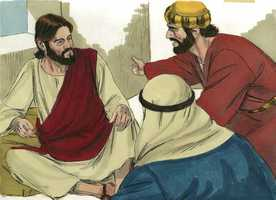
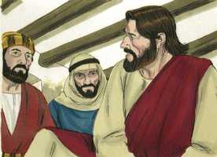
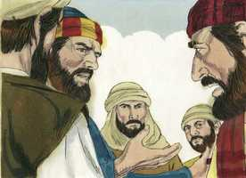
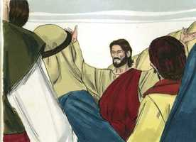
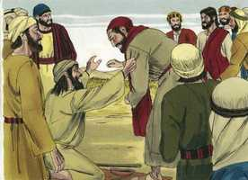

# Mateus Cap 20

**1** 	PORQUE o reino dos céus é semelhante a um homem, pai de família, que saiu de madrugada a assalariar trabalhadores para a sua vinha.

**2** 	E, ajustando com os trabalhadores a um dinheiro por dia, mandou-os para a sua vinha.

**3** 	E, saindo perto da hora terceira, viu outros que estavam ociosos na praça,

**4** 	E disse-lhes: Ide vós também para a vinha, e dar-vos-ei o que for justo. E eles foram.

**5** 	Saindo outra vez, perto da hora sexta e nona, fez o mesmo.

**6** 	E, saindo perto da hora undécima, encontrou outros que estavam ociosos, e perguntou-lhes: Por que estais ociosos todo o dia?

**7** 	Disseram-lhe eles: Porque ninguém nos assalariou. Diz-lhes ele: Ide vós também para a vinha, e recebereis o que for justo.

**8** 	E, aproximando-se a noite, diz o senhor da vinha ao seu mordomo: Chama os trabalhadores, e paga-lhes o jornal, começando pelos derradeiros, até aos primeiros.

**9** 	E, chegando os que tinham ido perto da hora undécima, receberam um dinheiro cada um.

**10** 	Vindo, porém, os primeiros, cuidaram que haviam de receber mais; mas do mesmo modo receberam um dinheiro cada um.

**11** 	E, recebendo-o, murmuravam contra o pai de família,

**12** 	Dizendo: Estes derradeiros trabalharam só uma hora, e tu os igualaste conosco, que suportamos a fadiga e a calma do dia.

**13** 	Mas ele, respondendo, disse a um deles: Amigo, não te faço agravo; não ajustaste tu comigo um dinheiro?

**14** 	Toma o que é teu, e retira-te; eu quero dar a este derradeiro tanto como a ti.

**15** 	Ou não me é lícito fazer o que quiser do que é meu? Ou é mau o teu olho porque eu sou bom?

**16** 	Assim os derradeiros serão primeiros, e os primeiros derradeiros; porque muitos são chamados, mas poucos escolhidos.

**17** 	E, subindo Jesus a Jerusalém, chamou à parte os seus doze discípulos, e no caminho disse-lhes:

**18** 	Eis que vamos para Jerusalém, e o Filho do homem será entregue aos príncipes dos sacerdotes, e aos escribas, e condená-lo-ão à morte.

**19** 	E o entregarão aos gentios para que dele escarneçam, e o açoitem e crucifiquem, e ao terceiro dia ressuscitará.

**20** 	Então se aproximou dele a mãe dos filhos de Zebedeu, com seus filhos, adorando-o, e fazendo-lhe um pedido.

 

**21** 	E ele diz-lhe: Que queres? Ela respondeu: Dize que estes meus dois filhos se assentem, um à tua direita e outro à tua esquerda, no teu reino.

 

**22** 	Jesus, porém, respondendo, disse: Não sabeis o que pedis. Podeis vós beber o cálice que eu hei de beber, e ser batizados com o batismo com que eu sou batizado? Dizem-lhe eles: Podemos.

 

**23** 	E diz-lhes ele: Na verdade bebereis o meu cálice e sereis batizados com o batismo com que eu sou batizado, mas o assentar-se à minha direita ou à minha esquerda não me pertence dá-lo, mas é para aqueles para quem meu Pai o tem preparado.

 

**24** 	E, quando os dez ouviram isto, indignaram-se contra os dois irmãos.

 

**25** 	Então Jesus, chamando-os para junto de si, disse: Bem sabeis que pelos príncipes dos gentios são estes dominados, e que os grandes exercem autoridade sobre eles.

 

**26** 	Não será assim entre vós; mas todo aquele que quiser entre vós fazer-se grande seja vosso serviçal;

 

**27** 	E, qualquer que entre vós quiser ser o primeiro, seja vosso servo;

**28** 	Bem como o Filho do homem não veio para ser servido, mas para servir, e para dar a sua vida em resgate de muitos.

 

**29** 	E, saindo eles de Jericó, seguiu-o grande multidão.

**30** 	E eis que dois cegos, assentados junto do caminho, ouvindo que Jesus passava, clamaram, dizendo: Senhor, Filho de Davi, tem misericórdia de nós!

 

**31** 	E a multidão os repreendia, para que se calassem; eles, porém, cada vez clamavam mais, dizendo: Senhor, Filho de Davi, tem misericórdia de nós!

 

**32** 	E Jesus, parando, chamou-os, e disse: Que quereis que vos faça?

 

**33** 	Disseram-lhe eles: Senhor, que os nossos olhos sejam abertos.

 

**34** 	Então Jesus, movido de íntima compaixão, tocou-lhes nos olhos, e logo seus olhos viram; e eles o seguiram.

 

> **Cmt MHenry** Intro: Bom é que os submetidos à mesma provação ou enfermidade do corpo e da mente se unam para orar a Deus por alívio, para que possam estimular-se e exortarem-se uns aos outros. Há suficiente misericórdia em Cristo para todos os que pedem. Eles oravam com fervor. Clamavam como homens pressionados. Os desejos frios mendigam negações. Foram humildes para orar, colocando-se a mercê da misericórdia do mediador e referindo-se alegremente a ela. Mostram fé ao orar pelo título que deram a Cristo. Com certeza foi pelo Espírito Santo que trataram de Senhor a Jesus. Perseveraram na oração. Quando iam em busca da misericórdia não havia tempo para a timidez ou a vacilação; clamavam com fervor. Cristo os animou. Nos sensibilizamos rapidamente ante as necessidades e as cargas do corpo, e podemos relacionar-nos com elas prontamente. Oh, que nos queixemos com tanto sentimento de nossas doenças espirituais, especialmente de nossa cegueira espiritual! muitos estão espiritualmente cegos, mas dizem que vêem. Jesus curou a estes cegos e quando receberam a visão, o seguiram. Ninguém segue cegamente a Cristo. Primeiro, por graça Ele abre os olhos dos homens, e assim atrai a Ele seus corações. Estes milagres são nosso chamado a Jesus; podemos ouvi-lo e fazê-lo nossa oração diária para crescer em graça e no conhecimento do Senhor e Salvador Jesus Cristo.> " Os filhos de Zebedeu usaram mal o que Cristo dizia para consolar os discípulos. Alguns não podem ter consolo; o transformam e utilizam para um mau propósito. O orgulho é o pecado que mais facilmente nos acossa; é uma ambição pecaminosa de superar os demais em pompa e grandeza. Para abater a vaidade e a ambição de seu pedido, Cristo os guia a pensar em seus sofrimentos. Cálice amargo é o que deve beber-se; cálice de tremor, mas não o cálice do ímpio. Não é senão um cálice, ainda que talvez seca e amarga, porém logo se esvazia; é um cálice na mão do Pai ([João 18.11](../43N-Joa/18.md#11)). O batismo é uma ordenança pela qual somos unidos ao Senhor em aliança e comunhão, e assim é o sofrimento por Cristo ([Ezequiel 20.37](../26A-Ez/20.md#37); [Isaias 48.10](../23A-Is/48.md#10)). o batismo é sinal externo e visível de uma graça espiritual int; assim é o padecimento por Cristo, que a nós é concedido ([Filipenses 1.29](../50N-Fp/01.md#29)). mas não sabiam que era o cálice de Cristo, nem que era seu batismo. Comumente os mais confiados são os que são menos familiarizados com a cruz. Nada faz mais mal entre os irmãos que o desejo de grandeza. Nunca encontramos disputando os discípulos de Cristo sem que algo disto esteja no fundo da questão. O homem que com maior diligência labuta, e com maior paciência sofre, buscando fazer o bem a seus irmãos, e fomentar a salvação das almas, mais evoca a Cristo, e recebera mais honra dEle para toda a eternidade. Nosso Senhor fala de sua morte nos termos aplicados aos sacrifícios de antigamente. É um sacrifício pelos pecados dos homens, e é aquele sacrifício verdadeiro e essencial, que os da lei representavam débil e imperfeitamente. Era um resgate de muitos, suficiente para todos, obrando sobre muitos; e, se por muitos, então a pobre alma tremente pode dizer "Por que não por mim?". "> Aqui Cristo é mais detalhado que antes para predizer seus sofrimentos. Aqui, como antes, agrega a menção de sua ressurreição e sua glória à de sua morte e seus sofrimentos, para dar ânimo a seus discípulos, e consolá-los. Uma maneira de ver a nosso Redentor uma vez crucificado e agora glorificado com fé, é boa para humilhar a disposição orgulhosa que se justifica a si mesma. Quando consideramos a necessidade da humilhação e sofrimentos do Filho de Deus para a salvação dos pecadores perecíveis, certamente devemos perceber a liberalidade e as riquezas da graça divina em nossa salvação.> " O objeto direto desta parábola parece ser demonstrar que, embora os judeus foram chamados primeiro à vinha, em longo prazo o evangelho será pregado aos gentios, que devem ser recebidos com os privilégios e vantagens em igualdade com os judeus. A parábola pode aplicar-se também em forma mais geral e mostra que: 1\) Deus não é devedor de nenhum homem.\> \ 2) Muitos que começam no final, e prometem pouco em matéria de religião, às vezes, pela bênção de Deus, chegam a muito conhecimento, graça e utilidade.\> \ 3) A recompensa será dada aos santos, mas não conforme ao tempo de sua conversão. Descreve o estado da igreja visível e explica a declaração de que os últimos serão os primeiros e os primeiros, os últimos, em suas diversas referências. Enquanto não sejamos contratados no serviço de Deus, estamos todo o dia ociosos: um estado pecaminoso, e embora para Satanás seja um estado de escravidão, pode chamar-se estado de ociosidade. O mercado é o mundo e dele fomos chamados pelo evangelho. Venham, saiam desse mercado. O trabalho para Deus não admite barganhas. O homem pode ir ocioso para o inferno, mas que vá para o céu deve ser diligente. O centavo romano eram sete centavos, pagava então o suficiente para o sustento diário. Isto não prova que a recompensa de nossa obediência a Deus seja de obras ou de dívida; quando temos feito tudo, ainda somos servos inúteis; significa que há uma recompensa colocada diante de nós, mas que ninguém, por esta suposição, postergue o arrependimento até a velhice. Alguns foram enviados à vinha na hora undécima, mas ninguém os tinha contratado antes. Os gentios entraram na hora undécima; o evangelho não tinha sido pregado antes a eles. Os que tiveram a oferta do evangelho na hora terceira ou sexta, e a rejeitaram, não poderão dizer na hora undécima, como estes, "Ninguém nos contratou". Portanto, não para desanimar a ninguém senão para acordar a todos, é que nos é lembrado que *agora* é o tempo aceitável. As riquezas da graça divina são objetadas em voz alta pelos fariseus orgulhosos e pelos cristãos nominais. Há em nós uma grande inclinação a pensar que temos demasiado pouco, e os outros muito dos sinais do favor de Deus; e que fazemos demasiado e os outros muito pouco na obra de Deus. porém se Deus dá graça a outrem, é bondade para eles, e não injustiça para conosco. As criaturas mundanas carnais estão de acordo com Deus Enquanto a sua riqueza neste mundo, e optam por sua porção nesta vida. Os crentes obedientes estão de acordo com Deus Enquanto a sua riqueza no outro mundo, e devem lembrar que estiveram de acordo. Não acordou você tomar o céu como porção sua, como seu todo, e busca agora sua felicidade na criatura? Deus não castiga mais do merecido, e premia cada serviço feito por Ele e para Ele; portanto, não faz mal algum ao mostrar graça extraordinária a outrem. Veja-se aqui a natureza da inveja. É uma avareza descontente pelo bem dos outros e que deseja seu mal. É um pecado que não tem prazer, proveito nem honra. Deixemos partir todo reclamo orgulhoso e procuremos a salvação como dádiva gratuita. Não invejemos nem murmuremos; regozijemo-nos e louvemos a Deus por sua misericórdia para com os outros e conosco. "