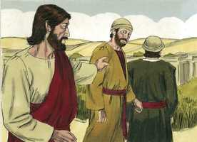
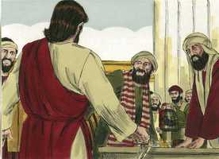
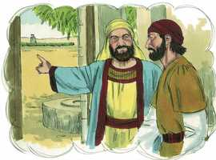
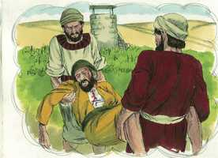

# Mateus Cap 21

**1** 	E, QUANDO se aproximaram de Jerusalém, e chegaram a Betfagé, ao Monte das Oliveiras, enviou, então, Jesus dois discípulos, dizendo-lhes:

 

**2** 	Ide à aldeia que está defronte de vós, e logo encontrareis uma jumenta presa, e um jumentinho com ela; desprendei-a, e trazei-mos.

**3** 	E, se alguém vos disser alguma coisa, direis que o Senhor os há de mister; e logo os enviará.

**4** 	Ora, tudo isto aconteceu para que se cumprisse o que foi dito pelo profeta, que diz:

**5** 	Dizei à filha de Sião: Eis que o teu Rei aí te vem, Manso, e assentado sobre uma jumenta, E sobre um jumentinho, filho de animal de carga.

**6** 	E, indo os discípulos, e fazendo como Jesus lhes ordenara,

 

**7** 	Trouxeram a jumenta e o jumentinho, e sobre eles puseram as suas vestes, e fizeram-no assentar em cima.

 

**8** 	E muitíssima gente estendia as suas vestes pelo caminho, e outros cortavam ramos de árvores, e os espalhavam pelo caminho.

 

**9** 	E a multidão que ia adiante, e a que seguia, clamava, dizendo: Hosana ao Filho de Davi; bendito o que vem em nome do Senhor. Hosana nas alturas!

 

**10** 	E, entrando ele em Jerusalém, toda a cidade se alvoroçou, dizendo: Quem é este?

**11** 	E a multidão dizia: Este é Jesus, o profeta de Nazaré da Galiléia.

**12** 	E entrou Jesus no templo de Deus, e expulsou todos os que vendiam e compravam no templo, e derribou as mesas dos cambistas e as cadeiras dos que vendiam pombas;

   

**13** 	E disse-lhes: Está escrito: A minha casa será chamada casa de oração; mas vós a tendes convertido em covil de ladrões.

 

**14** 	E foram ter com ele no templo cegos e coxos, e curou-os.

**15** 	Vendo, então, os principais dos sacerdotes e os escribas as maravilhas que fazia, e os meninos clamando no templo: Hosana ao Filho de Davi, indignaram-se,

**16** 	E disseram-lhe: Ouves o que estes dizem? E Jesus lhes disse: Sim; nunca lestes: Pela boca dos meninos e das criancinhas de peito tiraste o perfeito louvor?

**17** 	E, deixando-os, saiu da cidade para Betânia, e ali passou a noite.

**18** 	E, de manhã, voltando para a cidade, teve fome;

**19** 	E, avistando uma figueira perto do caminho, dirigiu-se a ela, e não achou nela senão folhas. E disse-lhe: Nunca mais nasça fruto de ti! E a figueira secou imediatamente.

**20** 	E os discípulos, vendo isto, maravilharam-se, dizendo: Como secou imediatamente a figueira?

**21** 	Jesus, porém, respondendo, disse-lhes: Em verdade vos digo que, se tiverdes fé e não duvidardes, não só fareis o que foi feito à figueira, mas até se a este monte disserdes: Ergue-te, e precipita-te no mar, assim será feito;

**22** 	E, tudo o que pedirdes em oração, crendo, o recebereis.

**23** 	E, chegando ao templo, acercaram-se dele, estando já ensinando, os príncipes dos sacerdotes e os anciãos do povo, dizendo: Com que autoridade fazes isto? e quem te deu tal autoridade?

**24** 	E Jesus, respondendo, disse-lhes: Eu também vos perguntarei uma coisa; se ma disserdes, também eu vos direi com que autoridade faço isto.

**25** 	O batismo de João, de onde era? Do céu, ou dos homens? E pensavam entre si, dizendo: Se dissermos: Do céu, ele nos dirá: Então por que não o crestes?

**26** 	E, se dissermos: Dos homens, tememos o povo, porque todos consideram João como profeta.

**27** 	E, respondendo a Jesus, disseram: Não sabemos. Ele disse-lhes: Nem eu vos digo com que autoridade faço isto.

**28** 	Mas, que vos parece? Um homem tinha dois filhos, e, dirigindo-se ao primeiro, disse: Filho, vai trabalhar hoje na minha vinha.

**29** 	Ele, porém, respondendo, disse: Não quero. Mas depois, arrependendo-se, foi.

**30** 	E, dirigindo-se ao segundo, falou-lhe de igual modo; e, respondendo ele, disse: Eu vou, senhor; e não foi.

**31** 	Qual dos dois fez a vontade do pai? Disseram-lhe eles: O primeiro. Disse-lhes Jesus: Em verdade vos digo que os publicanos e as meretrizes entram adiante de vós no reino de Deus.

**32** 	Porque João veio a vós no caminho da justiça, e não o crestes, mas os publicanos e as meretrizes o creram; vós, porém, vendo isto, nem depois vos arrependestes para o crer.

**33** 	Ouvi, ainda, outra parábola: Houve um homem, pai de família, que plantou uma vinha, e circundou-a de um valado, e construiu nela um lagar, e edificou uma torre, e arrendou-a a uns lavradores, e ausentou-se para longe.

  

**34** 	E, chegando o tempo dos frutos, enviou os seus servos aos lavradores, para receber os seus frutos.

 

**35** 	E os lavradores, apoderando-se dos servos, feriram um, mataram outro, e apedrejaram outro.

   

**36** 	Depois enviou outros servos, em maior número do que os primeiros; e eles fizeram-lhes o mesmo.

**37** 	E, por último, enviou-lhes seu filho, dizendo: Terão respeito a meu filho.

 

**38** 	Mas os lavradores, vendo o filho, disseram entre si: Este é o herdeiro; vinde, matemo-lo, e apoderemo-nos da sua herança.

**39** 	E, lançando mão dele, o arrastaram para fora da vinha, e o mataram.

 

**40** 	Quando, pois, vier o senhor da vinha, que fará àqueles lavradores?

**41** 	Dizem-lhe eles: Dará afrontosa morte aos maus, e arrendará a vinha a outros lavradores, que a seu tempo lhe dêem os frutos.

**42** 	Diz-lhes Jesus: Nunca lestes nas Escrituras: A pedra, que os edificadores rejeitaram, Essa foi posta por cabeça do ângulo; Pelo Senhor foi feito isto, E é maravilhoso aos nossos olhos?

 

**43** 	Portanto, eu vos digo que o reino de Deus vos será tirado, e será dado a uma nação que dê os seus frutos.

**44** 	E, quem cair sobre esta pedra, despedaçar-se-á; e aquele sobre quem ela cair ficará reduzido a pó.

**45** 	E os príncipes dos sacerdotes e os fariseus, ouvindo estas palavras, entenderam que falava deles;

 

**46** 	E, pretendendo prendê-lo, recearam o povo, porquanto o tinham por profeta.

> **Cmt MHenry** Intro: Esta parábola expressa claramente o pecado e a ruína da nação judaica; e o que se diz para acusá-los se diz para advertir a todos os que gozam dos privilégios da igreja externa. Assim como os homens tratam o povo de Deus, tratariam o próprio Cristo se estiver com eles. Como podemos, se somos fiéis a sua causa, esperar uma recepção favorável de parte de um mundo ímpio ou dos ímpios que professam o cristianismo! Perguntemo-nos se nós que temos a vinha e todas suas vantagens, damos fruto na temporada devida, como povo, família ou indivíduos. Nosso Salvador declara, em sua pergunta, que o Senhor da vinha virá, e que quando venha destruirá os maus com toda certeza. Os sumos sacerdotes e os anciãos eram os construtores e não reconheciam sua doutrina nem suas leis; os rejeitaram como pedra desprezada. Mas o que foi descartado pelos judeus, foi abraçado pelos gentios. Cristo sabe quem dará frutos do evangelho no uso dos médios do evangelho. A incredulidade dos pecadores será sua ruína, embora Deus tenha muitas formas de refrear os remanescentes da ira, como tem também muitas maneiras de fazer que isso que quebranta redunde em louvor Seu. Que Cristo chegue a ser mais e mais precioso para nossas almas, como firme Fundamento e Pedra angular de sua Igreja. Sigamo-lo ainda que sejamos odiados e desprezados por amor a Ele.> As parábolas que repreendem se dirigem claramente aos ofensores e os julgam por suas próprias bocas. A parábola dos dois filhos enviados a trabalhar na vinha é para mostrar que os que não sabiam que o batismo de João era de Deus, foram envergonhados pelos que o sabiam e o reconhecem. Toda a raça humana é como crianças as que o Senhor tem criado, mas eles se rebelaram em Sua contra, só que alguns são mais convincentes em sua desobediência que outros. Freqüentemente acontece que o rebelde atrevido é levado ao arrependimento e chega a ser um servo do Senhor, enquanto o formalista se endurece em orgulho e inimizade.> Como agora nosso Senhor se manifestou abertamente como o Messias, os sumos sacerdotes e os escribas se ofenderam muito, em especial porque expôs e eliminou os abusos que eles estimulavam. Nosso Senhor perguntou que pensavam eles do ministério e batismo de João. Muitos se assustam mais da vergonha que produz a mentira que do pecado, e, portanto, não têm escrúpulos para dizer o que sabem que é falso, como seus próprios pensamentos, afetos e intenções ou suas lembranças e esquecimentos. Nosso Senhor recusou responder sua pergunta. Melhor é evitar as disputas desnecessárias com os ímpios oponentes.> A maldição da figueira estéril representa o estado dos hipócritas em geral, e assim nos ensina que Cristo busca o poder da religião nos que a professam, e o saber dela nos que dizem tê-la. Suas justas expectativas dos professos que florescem costumam frustrar-se; vem a muitos procurando fruto e encontra somente folhas. Uma profissão falsa murcha correntemente neste mundo, e é o efeito da maldição dada por Cristo. A figueira que não tinha fruto logo perdeu suas folhas. Isto representa em particular o estado da nação e povo judaico. Nosso Senhor Jesus não achou neles nada senão folhas. Depois que rejeitaram Cristo, a cegueira e a dureza se acrescentaram neles até que foram lançados fora, e desarraigados de seu lugar e de sua nação. O Senhor foi justo nisso, temamos muito a condena pronunciada para a figueira estéril.> Cristo encontrou parte do átrio do templo convertido em mercado de gado e de coisas que se usavam nos sacrifícios, e parcialmente ocupados pelos cambistas de dinheiro. Nosso Senhor os lançou fora, como tinha feito ao iniciar seu ministério ([João 2.13-17](../43N-Joa/02.md#13)). Suas obras testemunhavam dEle mais que os Hosanas, e as curas que fez no templo foram cumprimento da promessa de que a glória da última casa seria maior que a glória da primeira. Se Cristo viesse agora a muitas partes de sua igreja visível, quantos males secretos descobriria e limparia! Quantas coisas que se praticam a diário sob o manto da religião Ele demonstraria que são mais adequadas para uma cova de ladrões que para uma casa de oração!> " Esta vinda de Cristo foi descrita pelo profeta Zacarias (9.9). quando Cristo aparecer em sua glória, é em sua mansidão e não em majestade, em misericórdia, para operar salvação. Como a mansidão e a pobreza externa foram vistas plenamente no Rei de Sião, e marcaram sua entrada triunfal em Jerusalém, quão errados estavam a cobiça, a ambição e a soberba da vida nos cidadãos de Sião! Eles levaram o jumentinho, mas Jesus não o usou sem o consentimento do dono. Os elementos para montar foram os que estavam à mão. não devemos pensar que são muito caras as roupas que vestimos como para abandoná-las pelo serviço de Cristo. os sumos sacerdotes e os anciãos depois se uniram à multidão que o tratou mal na cruz; porém nenhum deles se uniu à multidão que lhe rendeu honras. Os que tomam a Cristo como Rei deles, devem depositar a seus pés tudo o que têm. Hosana significa: "Salva agora, te rogamos!" Bendito o que vem em nome do Senhor! Mas de quão escasso valor é o aplauso da gente! A multidão instável se une ao clamor do dia, seja "Hosana!" ou "Crucifica-o!" Freqüentemente, as multidões parecem aprovar o evangelho, mas poucos chegam a ser discípulos coerentes. Quando Jesus ia entrar em Jerusalém, toda a cidade se comoveu; talvez alguns foram movidos pelo gozo, os que esperavam o Consolo de Israel; outros, dos fariseus, foram movidos pela inveja. Assim de variadas são as motivações da mente dos homens Enquanto a cercania do Reino de Cristo. "