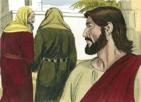

# Mateus Cap 22

**1** 	ENTÃO Jesus, tomando a palavra, tornou a falar-lhes em parábolas, dizendo:

**2** 	O reino dos céus é semelhante a um certo rei que celebrou as bodas de seu filho;

**3** 	E enviou os seus servos a chamar os convidados para as bodas, e estes não quiseram vir.

**4** 	Depois, enviou outros servos, dizendo: Dizei aos convidados: Eis que tenho o meu jantar preparado, os meus bois e cevados já mortos, e tudo já pronto; vinde às bodas.

**5** 	Eles, porém, não fazendo caso, foram, um para o seu campo, outro para o seu negócio;

**6** 	E os outros, apoderando-se dos servos, os ultrajaram e mataram.

**7** 	E o rei, tendo notícia disto, encolerizou-se e, enviando os seus exércitos, destruiu aqueles homicidas, e incendiou a sua cidade.

**8** 	Então diz aos servos: As bodas, na verdade, estão preparadas, mas os convidados não eram dignos.

**9** 	Ide, pois, às saídas dos caminhos, e convidai para as bodas a todos os que encontrardes.

**10** 	E os servos, saindo pelos caminhos, ajuntaram todos quantos encontraram, tanto maus como bons; e a festa nupcial foi cheia de convidados.

**11** 	E o rei, entrando para ver os convidados, viu ali um homem que não estava trajado com veste de núpcias.

**12** 	E disse-lhe: Amigo, como entraste aqui, não tendo veste nupcial? E ele emudeceu.

**13** 	Disse, então, o rei aos servos: Amarrai-o de pés e mãos, levai-o, e lançai-o nas trevas exteriores; ali haverá pranto e ranger de dentes.

**14** 	Porque muitos são chamados, mas poucos escolhidos.

**15** 	Então, retirando-se os fariseus, consultaram entre si como o surpreenderiam nalguma palavra;

 

**16** 	E enviaram-lhe os seus discípulos, com os herodianos, dizendo: Mestre, bem sabemos que és verdadeiro, e ensinas o caminho de Deus segundo a verdade, e de ninguém se te dá, porque não olhas a aparência dos homens.

  

**17** 	Dize-nos, pois, que te parece? É lícito pagar o tributo a César, ou não?

 

**18** 	Jesus, porém, conhecendo a sua malícia, disse: Por que me experimentais, hipócritas?

**19** 	Mostrai-me a moeda do tributo. E eles lhe apresentaram um dinheiro.

 

**20** 	E ele diz-lhes: De quem é esta efígie e esta inscrição?

 

**21** 	Dizem-lhe eles: De César. Então ele lhes disse: Dai pois a César o que é de César, e a Deus o que é de Deus.

 

**22** 	E eles, ouvindo isto, maravilharam-se, e, deixando-o, se retiraram.

 

**23** 	No mesmo dia chegaram junto dele os saduceus, que dizem não haver ressurreição, e o interrogaram,

 

**24** 	Dizendo: Mestre, Moisés disse: Se morrer alguém, não tendo filhos, casará o seu irmão com a mulher dele, e suscitará descendência a seu irmão.

**25** 	Ora, houve entre nós sete irmãos; e o primeiro, tendo casado, morreu e, não tendo descendência, deixou sua mulher a seu irmão.

**26** 	Da mesma sorte o segundo, e o terceiro, até ao sétimo;

**27** 	Por fim, depois de todos, morreu também a mulher.

**28** 	Portanto, na ressurreição, de qual dos sete será a mulher, visto que todos a possuíram?

**29** 	Jesus, porém, respondendo, disse-lhes: Errais, não conhecendo as Escrituras, nem o poder de Deus.

 

**30** 	Porque na ressurreição nem casam nem são dados em casamento; mas serão como os anjos de Deus no céu.

**31** 	E, acerca da ressurreição dos mortos, não tendes lido o que Deus vos declarou, dizendo:

**32** 	Eu sou o Deus de Abraão, o Deus de Isaque, e o Deus de Jacó? Ora, Deus não é Deus dos mortos, mas dos vivos.

 

**33** 	E, as turbas, ouvindo isto, ficaram maravilhadas da sua doutrina.

**34** 	E os fariseus, ouvindo que ele fizera emudecer os saduceus, reuniram-se no mesmo lugar.

**35** 	E um deles, doutor da lei, interrogou-o para o experimentar, dizendo:

**36** 	Mestre, qual é o grande mandamento na lei?

**37** 	E Jesus disse-lhe: Amarás o Senhor teu Deus de todo o teu coração, e de toda a tua alma, e de todo o teu pensamento.

**38** 	Este é o primeiro e grande mandamento.

**39** 	E o segundo, semelhante a este, é: Amarás o teu próximo como a ti mesmo.

**40** 	Destes dois mandamentos dependem toda a lei e os profetas.

**41** 	E, estando reunidos os fariseus, interrogou-os Jesus,

**42** 	Dizendo: Que pensais vós do Cristo? De quem é filho? Eles disseram-lhe: De Davi.

**43** 	Disse-lhes ele: Como é então que Davi, em espírito, lhe chama Senhor, dizendo:

**44** 	Disse o Senhor ao meu Senhor: Assenta-te à minha direita, Até que eu ponha os teus inimigos por escabelo de teus pés?

**45** 	Se Davi, pois, lhe chama Senhor, como é seu filho?

**46** 	E ninguém podia responder-lhe uma palavra; nem desde aquele dia ousou mais alguém interrogá-lo.

> **Cmt MHenry** Intro: " Quando Cristo deixou perplexos seus inimigos, perguntou que pensavam do Messias prometido. Como podia Ele ser o Filho de Davi e, contudo, ser seu Senhor? Cita o [Salmo 110.1](../19A-Sl/110.md#1). Se o Cristo seria um simples homens, que somente existiria muito tempo depois da morte de Davi, como podia seu antepassado tratá-lo de Senhor? Os fariseus não puderam responder a isso. nem tampouco resolver a dificuldade, a menos que reconheçam que o Messias seja o Filho de Deus e o Senhor de Davi tanto como o Pai. Ele tomou nossa natureza humana e assim se manifestou Deus na carne; neste sentido é o Filho do homem e o Filho de Davi. Nos convém sobre tudo indagar seriamente: "Que pensamos de Cristo?" É Ele completamente glorioso a nossos olhos e precioso a nossos corações? Que Cristo seja nosso gozo, nossa confiança, nosso tudo. Que diariamente sejamos feitos mais como Ele, e mais dedicados a seu serviço. "> Um intérprete da lei perguntou algo a nosso Senhor para provar não tanto seu conhecimento como seu juízo. O amor de Deus é o primeiro e grande mandamento, e o resumo de todos os mandamentos da primeira tábua. Nosso amor por Deus deve ser sincero, não só de palavra e língua. Todo nosso amor é pouco para dá-lo a Ele, portanto todos os poderes da alma devem comprometer-se com Ele e ser executados para Ele. Amar a nosso próximo cristianismo a nós mesmos é o segundo grande mandamento. Há um amor próprio que é corrompido e raiz dos pecados maiores e deve ser deixado e mortificado; mas há um amor próprio que é a regra do dever maior: devemos ter o devido interesse pelo bem-estar de nossa alma e de nosso corpo. Devemos amar a nosso próximo tão verdadeira e sinceramente como nos amamos a nós mesmos; em muitos casos devemos negar-nos a nós mesmos pelo bem do próximo. Por estes dois mandamentos se molda o nosso coração.> As doutrinas de Cristo desagradam aos infiéis saduceus e aos fariseus e herodianos. Ele leva as grandes verdades da ressurreição e o estado futuro além do que tinha revelado até então. Não há modo de deduzir do estado de coisas neste mundo o que acontecerá no além. A verdade seja colocada na luz clara e se manifeste com toda sua força. Tendo-os silenciado deste jeito, nosso Senhor procedeu a mostrar a verdade da doutrina da ressurreição a partir dos livros de Moisés. Deus declarou a Moisés que era o Deus dos patriarcas que tinham morrido muito tempo antes; isto demonstra que eles estavam então num estado do ser capaz de desfrutar de seu favor e prova que a doutrina da ressurreição é claramente ensinada no Antigo Testamento e no Novo. Mas esta doutrina estava reservada para uma revelação mais plena depois da ressurreição de Cristo, primícia dos que dormiram. Todos os erros surgem de não conhecer as Escrituras e o poder de Deus. Neste mundo a morte se leva a um após outro e assim termina com todas as esperanças, os gozes, as penas e as relações terrenas. Que desgraçados são os que não esperam nada melhor além do túmulo!> Os fariseus enviaram seus discípulos aos herodianos, um partido dos judeus que apoiava a submissão total ao imperador romano. Embora eram contrários entre si, se uniram contra Cristo. O que disseram de Cristo estava bem; seja que o soubessem ou não, bendito seja Deus que nós o sabemos. Jesus Cristo foi um mestre fiel, um que reprova diretamente. Cristo viu sua iniqüidade. Qualquer seja a máscara que se coloque o hipócrita, nosso Senhor Jesus vê através dela. Cristo não interveio como juiz em matérias desta natureza, porque seu reino não é deste mundo, mas insta a sujeitar-se pacificamente aos poderes que há. Reprovou seus adversários e ensinou a seus discípulos que a religião cristã não é inimiga do governo civil. Cristo é e será a maravilha não só de seus amigos, senão de seus inimigos. Eles admiram sua sabedoria, mas não serão guiados por ela, e seu poder, mas não se submeterão a ele.> A provisão feita para as almas perecíveis no evangelho está representada por uma festa real feita por um rei, com prodigalidade oriental, em ocasião do matrimônio de seu filho. Nosso Deus misericordioso não somente tem provido o alimento, senão um festejo real para as almas que perecem de suas rebeldes criaturas. Na salvação de seu Filho Jesus Cristo há suficiente e de sobra de tudo o que se possa agregar a nosso consolo presente e felicidade eterna. Os primeiros convidados foram os judeus. quando os profetas do Antigo Testamento não prevaleceram, nem João Batista, nem o próprio Cristo, que lhes disse que o Reino de Deus estava perto, foram enviados os apóstolos e ministros do evangelho, depois da ressurreição de Cristo, a dizer-lhes que viria, e a persuadi-los para a aceitassem a oferta. A razão do motivo pelo que os pecadores não vão a Cristo e à salvação por Ele não é que não possam, senão que não querem. Tomar com leviandade a Cristo e a grande salvação operada por Ele é o pecado que condena o mundo. Eles foram indiferentes. As multidões perecem para sempre por pura indiferença, sem mostrar aversão direta, mas são negligentes acerca de suas almas. Além disso, as atividades e o proveito das ocupações mundanas estorvam a muitos para fechar trato com o Salvador. Camponeses e mercadores devem ser diligentes, mas qualquer seja a coisa do mundo que tenhamos em nossas mãos, devemos ter cuidado de mantê-la fora de nossos corações, não seja que se coloque entre nós e Cristo. A extrema ruína que sobreveio à igreja e à nação judaica está representada aqui. A perseguição dos fiéis ministros de Cristo enche a medida da culpa de todo povo. não se esperava a oferta de Cristo e a salvação dos gentios; foi tanta a surpresa como seria que se convidasse um camponês a uma boda real. O desígnio do evangelho é recolher almas para Cristo; a todos os filhos de Deus espalhados por todas partes ([João 10.16](../43N-Joa/10.md#16); [11.52](../43N-Joa/11.md#52)). O exemplo dos hipócritas está representado pelo convidado que não tinha veste de boda. Nos concerne a todos preparar-nos para o juízo; e somente os que se vistam do Senhor Jesus, que tenham o temperamento mental cristão, que vivam pela fé em Cristo e para os quais Ele é o tudo em todo, têm a vestimenta para a boda. A justiça de Cristo que nos é imputada e a satisfação do Espírito são, ambas, igualmente necessárias. Ninguém tem as roupas de boda por natureza nem pode fazê-las por si mesmo. chega o dia em que os hipócritas serão chamados a render contas de todas suas intrusões presunçosas nas ordenanças do evangelho e da usurpação dos privilégios do evangelho. Lancem-no nas trevas de fora. Os que andam em forma indigna do cristianismo, abandonam toda a felicidade que proclamam presunçosamente. Nosso Salvador passa aqui desde a parábola a seu ensinamento. Os hipócritas andam à luz do Evangelho o mesmo caminho da extrema escuridão. Muitos são chamados à festa de bodas, isto é, à salvação, mas poucos têm as roupas da boda, a justiça de Cristo, a santificação do Espírito. Então, examinemo-nos se estamos na fé, e procuremos sermos aprovados pelo Rei.