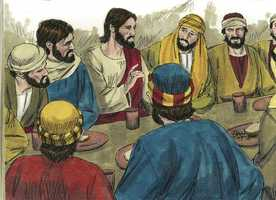
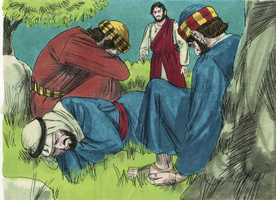

# Mateus Cap 26

**1** 	E ACONTECEU que, quando Jesus concluiu todos estes discursos, disse aos seus discípulos:

**2** 	Bem sabeis que daqui a dois dias é a páscoa; e o Filho do homem será entregue para ser crucificado.

**3** 	Depois os príncipes dos sacerdotes, e os escribas, e os anciãos do povo reuniram-se na sala do sumo sacerdote, o qual se chamava Caifás.

 

**4** 	E consultaram-se mutuamente para prenderem Jesus com dolo e o matarem.

**5** 	Mas diziam: Não durante a festa, para que não haja alvoroço entre o povo.

 

**6** 	E, estando Jesus em Betânia, em casa de Simão, o leproso,

 

**7** 	Aproximou-se dele uma mulher com um vaso de alabastro, com ungüento de grande valor, e derramou-lho sobre a cabeça, quando ele estava assentado à mesa.

**8** 	E os seus discípulos, vendo isto, indignaram-se, dizendo: Por que é este desperdício?

**9** 	Pois este ungüento podia vender-se por grande preço, e dar-se o dinheiro aos pobres.

**10** 	Jesus, porém, conhecendo isto, disse-lhes: Por que afligis esta mulher? pois praticou uma boa ação para comigo.

**11** 	Porquanto sempre tendes convosco os pobres, mas a mim não me haveis de ter sempre.

**12** 	Ora, derramando ela este ungüento sobre o meu corpo, fê-lo preparando-me para o meu sepultamento.

**13** 	Em verdade vos digo que, onde quer que este evangelho for pregado em todo o mundo, também será referido o que ela fez, para memória sua.

**14** 	Então um dos doze, chamado Judas Iscariotes, foi ter com os príncipes dos sacerdotes,

  

**15** 	E disse: Que me quereis dar, e eu vo-lo entregarei? E eles lhe pesaram trinta moedas de prata,

  

**16** 	E desde então buscava oportunidade para o entregar.

 

**17** 	E, no primeiro dia da festa dos pães ázimos, chegaram os discípulos junto de Jesus, dizendo: Onde queres que façamos os preparativos para comeres a páscoa?

  

**18** 	E ele disse: Ide à cidade, a um certo homem, e dizei-lhe: O Mestre diz: O meu tempo está próximo; em tua casa celebrarei a páscoa com os meus discípulos.

  

**19** 	E os discípulos fizeram como Jesus lhes ordenara, e prepararam a páscoa.

  

**20** 	E, chegada a tarde, assentou-se à mesa com os doze.

  

**21** 	E, comendo eles, disse: Em verdade vos digo que um de vós me há de trair.

 

**22** 	E eles, entristecendo-se muito, começaram cada um a dizer-lhe: Porventura sou eu, Senhor?

**23** 	E ele, respondendo, disse: O que põe comigo a mão no prato, esse me há de trair.

**24** 	Em verdade o Filho do homem vai, como acerca dele está escrito, mas ai daquele homem por quem o Filho do homem é traído! Bom seria para esse homem se não houvera nascido.

**25** 	E, respondendo Judas, o que o traía, disse: Porventura sou eu, Rabi? Ele disse: Tu o disseste.

**26** 	E, quando comiam, Jesus tomou o pão, e abençoando-o, o partiu, e o deu aos discípulos, e disse: Tomai, comei, isto é o meu corpo.

  

**27** 	E, tomando o cálice, e dando graças, deu-lho, dizendo: Bebei dele todos;

  

**28** 	Porque isto é o meu sangue, o sangue do novo testamento, que é derramado por muitos, para remissão dos pecados.

**29** 	E digo-vos que, desde agora, não beberei deste fruto da vide, até aquele dia em que o beba novo convosco no reino de meu Pai.

**30** 	E, tendo cantado o hino, saíram para o Monte das Oliveiras.

 

**31** 	Então Jesus lhes disse: Todos vós esta noite vos escandalizareis em mim; porque está escrito: Ferirei o pastor, e as ovelhas do rebanho se dispersarão.

 

**32** 	Mas, depois de eu ressuscitar, irei adiante de vós para a Galiléia.

 

**33** 	Mas Pedro, respondendo, disse-lhe: Ainda que todos se escandalizem em ti, eu nunca me escandalizarei.

 

**34** 	Disse-lhe Jesus: Em verdade te digo que, nesta mesma noite, antes que o galo cante, três vezes me negarás.

 

**35** 	Disse-lhe Pedro: Ainda que me seja mister morrer contigo, não te negarei. E todos os discípulos disseram o mesmo.

 

**36** 	Então chegou Jesus com eles a um lugar chamado Getsêmani, e disse a seus discípulos: Assentai-vos aqui, enquanto vou além orar.

 

**37** 	E, levando consigo Pedro e os dois filhos de Zebedeu, começou a entristecer-se e a angustiar-se muito.

 

**38** 	Então lhes disse: A minha alma está cheia de tristeza até a morte; ficai aqui, e velai comigo.

**39** 	E, indo um pouco mais para diante, prostrou-se sobre o seu rosto, orando e dizendo: Meu Pai, se é possível, passe de mim este cálice; todavia, não seja como eu quero, mas como tu queres.

 

**40** 	E, voltando para os seus discípulos, achou-os adormecidos; e disse a Pedro: Então nem uma hora pudeste velar comigo?

 

**41** 	Vigiai e orai, para que não entreis em tentação; na verdade, o espírito está pronto, mas a carne é fraca.

**42** 	E, indo segunda vez, orou, dizendo: Pai meu, se este cálice não pode passar de mim sem eu o beber, faça-se a tua vontade.

**43** 	E, voltando, achou-os outra vez adormecidos; porque os seus olhos estavam pesados.

**44** 	E, deixando-os de novo, foi orar pela terceira vez, dizendo as mesmas palavras.

**45** 	Então chegou junto dos seus discípulos, e disse-lhes: Dormi agora, e repousai; eis que é chegada a hora, e o Filho do homem será entregue nas mãos dos pecadores.

 

**46** 	Levantai-vos, partamos; eis que é chegado o que me trai.

**47** 	E, estando ele ainda a falar, eis que chegou Judas, um dos doze, e com ele grande multidão com espadas e varapaus, enviada pelos príncipes dos sacerdotes e pelos anciãos do povo.

**48** 	E o que o traía tinha-lhes dado um sinal, dizendo: O que eu beijar é esse; prendei-o.

**49** 	E logo, aproximando-se de Jesus, disse: Eu te saúdo, Rabi; e beijou-o.

 

**50** 	Jesus, porém, lhe disse: Amigo, a que vieste? Então, aproximando-se eles, lançaram mão de Jesus, e o prenderam.

**51** 	E eis que um dos que estavam com Jesus, estendendo a mão, puxou da espada e, ferindo o servo do sumo sacerdote, cortou-lhe uma orelha.

 

**52** 	Então Jesus disse-lhe: Embainha a tua espada; porque todos os que lançarem mão da espada, à espada morrerão.

**53** 	Ou pensas tu que eu não poderia agora orar a meu Pai, e que ele não me daria mais de doze legiões de anjos?

**54** 	Como, pois, se cumpririam as Escrituras, que dizem que assim convém que aconteça?

**55** 	Então disse Jesus à multidão: Saístes, como para um salteador, com espadas e varapaus para me prender? Todos os dias me assentava junto de vós, ensinando no templo, e não me prendestes.

**56** 	Mas tudo isto aconteceu para que se cumpram as escrituras dos profetas. Então, todos os discípulos, deixando-o, fugiram.

**57** 	E os que prenderam a Jesus o conduziram à casa do sumo sacerdote Caifás, onde os escribas e os anciãos estavam reunidos.

**58** 	E Pedro o seguiu de longe, até ao pátio do sumo sacerdote e, entrando, assentou-se entre os criados, para ver o fim.

 

**59** 	Ora, os príncipes dos sacerdotes, e os anciãos, e todo o conselho, buscavam falso testemunho contra Jesus, para poderem dar-lhe a morte;

 

**60** 	E não o achavam; apesar de se apresentarem muitas testemunhas falsas, não o achavam. Mas, por fim chegaram duas testemunhas falsas,

**61** 	E disseram: Este disse: Eu posso derrubar o templo de Deus, e reedificá-lo em três dias.

 

**62** 	E, levantando-se o sumo sacerdote, disse-lhe: Não respondes coisa alguma ao que estes depõem contra ti?

 

**63** 	Jesus, porém, guardava silêncio. E, insistindo o sumo sacerdote, disse-lhe: Conjuro-te pelo Deus vivo que nos digas se tu és o Cristo, o Filho de Deus.

**64** 	Disse-lhe Jesus: Tu o disseste; digo-vos, porém, que vereis em breve o Filho do homem assentado à direita do Poder, e vindo sobre as nuvens do céu.

 

**65** 	Então o sumo sacerdote rasgou as suas vestes, dizendo: Blasfemou; para que precisamos ainda de testemunhas? Eis que bem ouvistes agora a sua blasfêmia.

 

**66** 	Que vos parece? E eles, respondendo, disseram: É réu de morte.

**67** 	Então cuspiram-lhe no rosto e lhe davam punhadas, e outros o esbofeteavam,

 

**68** 	Dizendo: Profetiza-nos, Cristo, quem é o que te bateu?

**69** 	Ora, Pedro estava assentado fora, no pátio; e, aproximando-se dele uma criada, disse: Tu também estavas com Jesus, o galileu.

 

**70** 	Mas ele negou diante de todos, dizendo: Não sei o que dizes.

**71** 	E, saindo para o vestíbulo, outra criada o viu, e disse aos que ali estavam: Este também estava com Jesus, o Nazareno.

 

**72** 	E ele negou outra vez com juramento: Não conheço tal homem.

**73** 	E, daí a pouco, aproximando-se os que ali estavam, disseram a Pedro: Verdadeiramente também tu és deles, pois a tua fala te denuncia.

**74** 	Então começou ele a praguejar e a jurar, dizendo: Não conheço esse homem. E imediatamente o galo cantou.

 

**75** 	E lembrou-se Pedro das palavras de Jesus, que lhe dissera: Antes que o galo cante, três vezes me negarás. E, saindo dali, chorou amargamente.

 

> **Cmt MHenry** Intro: O pecado de Pedro é relatado com veracidade, porque as Escrituras tratam com fidelidade. As más companhias levam a pecar: os que se introduzem desnecessariamente nisso podem fazer-se a expectativa de serem tentados e capturados, como Pedro. Apenas podem desprender-se dessas companhias sem culpa ou dor, ou ambas. Grande falta é ter vergonha de Cristo e negar que o conhecemos quando somos chamados a reconhecê-lo e, em efeito, isso é negá-lo. o pecado de Pedro foi com agravantes; mas ele caiu em pecado por surpresa, não em forma intencional, como Judas. A consciência deveria ser para nós como o canto do galo para lembrar-nos dos pecados que temos esquecido. Pedro foi assim deixado cair para abater sua confiança em si mesmo e torná-lo mais modesto, humilde, compassivo e útil para os outros. O fato tem ensinado, desde então, muitas coisas aos crentes e se os infiéis, os fariseus e os hipócritas tropeçam nisto ou abusam daquilo, é por seu próprio risco. Apenas saberíamos como agir em situações muito difíceis, se deixados a nós mesmos. Portanto, que o que se crê firme, tenha cuidado que não caia; desconfiemos todos de nossos corações e confiemos totalmente no Senhor. Pedro chorou amargamente. A pena pelo pecado não deve ser ligeira senão grande e profunda. Pedro, que chorou tão amargamente por negar a Cristo, nunca tornou a negá-lo, senão que o confessou freqüentemente frente ao perigo. O arrependimento verdadeiro de qualquer pecado se demonstrará pela graça e o dever contrário; esse é o sinal de nosso pesar não somente amargo, mas sincero.> " Jesus foi levado apressadamente a Jerusalém. Luze mal, e pressagia o pior, que os dispostos a serem discípulos de Cristo não estejam dispostos a serem reconhecidos como tais. Aqui começa a negação de Pedro: porque seguir a Cristo desde longe é começar a retirar-se dEle. Nos concerne mais preparar-nos para o fim, qualquer que seja, que perguntar curiosos qual será o fim. O fato é de Deus, mas o dever é nosso. Agora foram cumpridas as Escrituras que dizem: "Se levantaram contra mim testemunhas falsas". Cristo foi acusado, para que nós não fossemos condenados; e, se em qualquer momento nós sofremos assim, lembremos que não podemos ter a expectativa de que nos vá melhor que a nosso Mestre. Quando Cristo foi feito pecado por nós, ficou calado e deixou que seu sangue falasse. Até então rara vez tinha confessado Jesus, expressamente, ser o Cristo, o Filho de Deus; o teor de sua doutrina o diz e seus milagres o provavam, mas por enquanto omitiria fazer uma confissão direta. Teria parecido que renunciava a seus sofrimentos. Assim confessou Ele, como exemplo e estímulo para que seus seguidores o confessem perante os homens, qualquer seja o perigo que corram. O desdém, a zombaria cruel e o aborrecimento são a porção segura do discípulo, como o foram do Mestre, de parte dos que desejavam bater e rir com zombaria do Senhor da glória. No capítulo cinqüenta de Isaias se predizem exatamente estas coisas. Confessemos o nome de Cristo e suportemos a recriminação, e Ele nos confessará diante do trono de seu Pai. "> Não há inimigos que sejam tão aborrecíveis como os discípulos que traem a Cristo com um beijo.\> \ Deus não necessita de nossos serviços, muito menos de nossos pecados, para realizar seus propósitos. Ainda que Cristo foi crucificado por debilidade, foi debilidade voluntária; submeteu-se à morte. Se não tiver estado disposto a sofrer, eles não o teriam vencido. Foi um grande pecado dos que deixaram tudo para seguir a Jesus deixá-lo agora pelo que não sabiam. Que torpeza fugir dEle, ao qual conheciam e reconheciam como o Manancial da vida, por medo da morte!> " O que fez expiação pelos pecados da humanidade, se submeteu no jardim do sofrimento à vontade de Deus, contra a qual tinha-se rebelado o homem no jardim dos prazeres. Cristo levou consigo, àquela parte do jardim onde sofreu sua agonia, somente aos que tinham presenciado sua glória em sua transfiguração. estão melhor preparados para sofrer com Cristo os que, pela fé, têm contemplado sua glória. As palavras usadas denotam a rejeição, assombro, angústia e horror mental mais completos; o estado de um rodeado de dores, abrumado por misérias, e quase consumido pelo terror e o desânimo. Agora começou a entristecer-se e nunca deixou de estar assim até que disse: "Está consumado". Ele orou que, se possível, o cálice fosse afastado dEle. Mas também mostrou sua perfeita vontade de levar a carga de seus sofrimentos; estava disposto a submeter-se a todo por nossa redenção e salvação. Conforme a este exemplo de Cristo, devemos beber da copa mais amarga que Deus coloque em nossas mãos; embora nossa natureza se oponha, deve submeter-se. Devemos cuidar mais de fazer que nossas tribulações sejam santificadas, e nossos corações se satisfaçam submetidos a elas, que lograr que os problemas sejam eliminados. Bom é para nós que nossa salvação está na mão de Um que não toscaneja nem dorme. Todos somos tentados, mas devemos ter grande temor de entrar em tentação. Para estar a salvo disto devemos vigiar e orar e olharmos continuamente para o Senhor, para que nos sustente e estejamos a salvo. Indubitavelmente nosso Senhor tinha uma visão completa e clara dos sofrimentos que ainda devia suportar e, ainda assim, falou com a maior calma até esse momento. Cristo é o garante que decidiu ser responsável de render as contas por nossos pecados. Em conseqüência, foi feito pecado por nós, e sofreu por nossos pecados, o Justo pelo injusto; e a Escritura atribui seus sofrimentos mais intensos à mão de Deus. Ele tinha pleno conhecimento do infinito mal do pecado e da imensa magnitude da culpa pela qual devia fazer expiação; com visões horrorosas da justiça e santidade divina, e do castigo merecido pelos pecados dos homens, tais que nenhuma língua pode expressar nem mente conceber. Ao mesmo tempo, Cristo sofreu sendo tentado; provavelmente Satanás sugeriu horríveis pensamentos todos tendentes a tirar uma conclusão sombria e espantosa: estes devem ter sido os mais difíceis de suportar por sua perfeita santidade. E a carga do pecado imputado pesou tanto na alma dAquele, de quem foi dito "Sustenta todas as coisas com a palavra de seu poder"? Em que miséria então devem afundar aqueles cujos pecados pesam sobre suas próprias cabeças! Como escaparão os que descuidam uma salvação tão grande? "> A confiança imprópria em si mesmo, como a de Pedro, é o primeiro passo rumo a uma queda. Todos somos inclinados a sermos demasiado confiados, mas caem mais cedo e pior os que mais confiados estão em si mesmos. Os que se acham mais seguros são os que estão menos a salvo. Satanás está ativo para descaminhar os tais; eles são os que estão menos em guarda: Deus os deixa a si mesmos para humilhá-los.> " A ordenança da Ceia do Senhor é para nós a ceia da Páscoa, pela qual comemoramos uma liberação muito maior que a de Israel do Egito. "Tomem, comam"; aceite a Cristo como lhe é oferecido; receba a expiação, aprove-a, submeta-se a sua graça e mando. A carne que só se olha, por muito bem apresentada que esteja no prato, não alimenta; deve ser comida: assim deve acontecer com a doutrina de Cristo. "Isto é meu corpo", isto é, que significa e representa espiritualmente seu corpo. Participamos do sol não tendo o sol colocado em nossas mãos, senão seus raios lançados para abaixo, sobre nós; assim, participamos de Cristo ao participarmos de sua graça e de seus frutos benditos da partição de seu corpo. O sangue de Cristo está significado e representado pelo vinho. Ele deu graças, para ensinar-nos a olhar a Deus em cada aspecto da ordenança. Este cálice o deu a seus discípulos com o mandamento de "Bebam todos dele". O perdão do pecado é uma grande bênção que se confere na Ceia do Senhor a todos os crentes verdadeiros; é o fundamento de todas as outras bênçãos. Ele aproveita a comunhão para assegurar a feliz reunião de novo no final: *"Até aquele dia em que o beba novo convosco"*, o que pode entender-se como as delícias e as glórias do estado futuro, do qual participarão os santos com o Senhor Jesus. Esse será o reino de seu Pai; o vinho do consolo será sempre novo ali. Enquanto olharmos os sinais externos do corpo de Cristo partido e seu sangue derramado pela remissão de nossos pecados, lembremos que a festa lhe custou tanto que teve de dar, literalmente, sua carne como comida e seu sangue como nossa bebida. "> Observe-se que o lugar para comer a Páscoa foi indicado por Cristo a seus discípulos. Ele conhece a gente, que, escondida, favorece sua causa e visita por graça a todos os que estão dispostos a recebê-lo. os discípulos fizeram como indicou Jesus. os que desejam ter a presença de Cristo na Páscoa do Evangelho, devem fazer o que Ele diz. Corresponde que os discípulos de Cristo sejam sempre zelosos de si mesmos, especialmente nos tempos de prova. Não sabemos com quanta força podemos ser tentados, nEnquanto pode Deus deixar-nos livrados a nós mesmos; portanto, temos razão para não sermos altivos, senão para temer. O exame que esquadrinha o coração e a oração fervorosa é especialmente apropriado antes da Ceia do Senhor, para que, já que Cristo, nossa Páscoa, é agora sacrificado por nós, possamos guardar esta festa, e renovar nosso arrependimento, nossa fé em seu sangue e render-nos a seu serviço.> Não há senão doze apóstolos chamados, e um deles era como um diabo; com toda certeza nunca devemos esperar que nenhuma sociedade seja absolutamente pura deste lado do céu. Enquanto mais grandiosa seja a profissão da religião que façam os homens, maior será a oportunidade que tenham de fazer o mal se seus corações não estão bem com Deus. observe-se que o próprio discípulo de Cristo, que conhecia tão bem sua doutrina e estilo de vida, foi falso com Ele, e não o pôde acusar de nenhum delito, ainda que tivesse servido para justificar sua traição. Que queria Judas? Não era bem recebido onde quer que ia seu Mestre? Não andava como andava Cristo? não é a *falta de* senão o *amor ao* dinheiro o que e a raiz de todo mal. Depois que fez essa malvada transação, Judas teve tempo de arrepender-se e revogá-la; mas quando a consciência se tem endurecido com ações menores de desonestidade, os homens fazem sem duvidar o que é mais vergonhoso.> O ungüento derramado sobre a cabeça de Cristo era um sinal do maior respeito. Onde há amor verdadeiro por Jesus Cristo no coração, nada será considerado demasiado bom para dá-lo a Ele. enquanto mais reparos se façam aos servos de Cristo e a seus serviços, mais manifesta Ele sua aprovação. Este ato de fé e amor foi tão notável que seria registrado como monumento à fé e amor de Maria para todas as eras futuras, e em todos os lugares onde se pregara o evangelho. Esta profecia se cumpre.> Nosso Senhor falou freqüentemente de Seus sofrimentos como distantes; agora fala deles como imediatos. Ao mesmo tempo, o concílio judeu consultava como poderiam matá-lo em forma secreta. Mas agradou a Deus derrotar a intenção deles. Jesus, o verdadeiro cordeiro pascoal, seria sacrificado por nós nesse mesmo momento, e sua morte e ressurreição seria públicas.