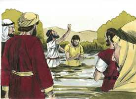
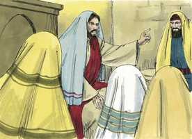
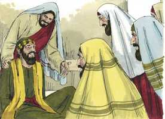
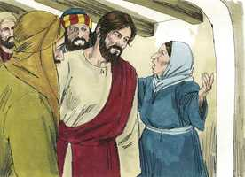
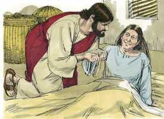
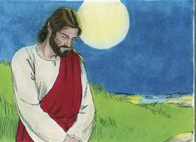

# Marcos Cap 01

**1** 	PRINCÍPIO do Evangelho de Jesus Cristo, Filho de Deus;

**2** 	Como está escrito nos profetas: Eis que eu envio o meu anjo ante a tua face, o qual preparará o teu caminho diante de ti.

**3** 	Voz do que clama no deserto: Preparai o caminho do Senhor, Endireitai as suas veredas.

**4** 	Apareceu João batizando no deserto, e pregando o batismo de arrependimento, para remissão dos pecados.

 

**5** 	E toda a província da Judéia e os de Jerusalém iam ter com ele; e todos eram batizados por ele no rio Jordão, confessando os seus pecados.

**6** 	E João andava vestido de pêlos de camelo, e com um cinto de couro em redor de seus lombos, e comia gafanhotos e mel silvestre.

 

**7** 	E pregava, dizendo: Após mim vem aquele que é mais forte do que eu, do qual não sou digno de, abaixando-me, desatar a correia das suas alparcas.

 

**8** 	Eu, em verdade, tenho-vos batizado com água; ele, porém, vos batizará com o Espírito Santo.

 

**9** 	E aconteceu naqueles dias que Jesus, tendo ido de Nazaré da Galiléia, foi batizado por João, no Jordão.

  

**10** 	E, logo que saiu da água, viu os céus abertos, e o Espírito, que como pomba descia sobre ele.

 

**11** 	E ouviu-se uma voz dos céus, que dizia: Tu és o meu Filho amado em quem me comprazo.

**12** 	E logo o Espírito o impeliu para o deserto.

 

**13** 	E ali esteve no deserto quarenta dias, tentado por Satanás. E vivia entre as feras, e os anjos o serviam.

 

**14** 	E, depois que João foi entregue à prisão, veio Jesus para a Galiléia, pregando o evangelho do reino de Deus,

**15** 	E dizendo: O tempo está cumprido, e o reino de Deus está próximo. Arrependei-vos, e crede no evangelho.

**16** 	E, andando junto do mar da Galiléia, viu Simão, e André, seu irmão, que lançavam a rede ao mar, pois eram pescadores.

**17** 	E Jesus lhes disse: Vinde após mim, e eu farei que sejais pescadores de homens.

**18** 	E, deixando logo as suas redes, o seguiram.

**19** 	E, passando dali um pouco mais adiante, viu Tiago, filho de Zebedeu, e João, seu irmão, que estavam no barco consertando as redes,

**20** 	E logo os chamou. E eles, deixando o seu pai Zebedeu no barco com os jornaleiros, foram após ele.

**21** 	Entraram em Cafarnaum e, logo no sábado, indo ele à sinagoga, ali ensinava.

 

**22** 	E maravilharam-se da sua doutrina, porque os ensinava como tendo autoridade, e não como os escribas.

**23** 	E estava na sinagoga deles um homem com um espírito imundo, o qual exclamou,

 

**24** 	Dizendo: Ah! que temos contigo, Jesus Nazareno? Vieste destruir-nos? Bem sei quem és: o Santo de Deus.

**25** 	E repreendeu-o Jesus, dizendo: Cala-te, e sai dele.

**26** 	Então o espírito imundo, convulsionando-o, e clamando com grande voz, saiu dele.

 

**27** 	E todos se admiraram, a ponto de perguntarem entre si, dizendo: Que é isto? Que nova doutrina é esta? Pois com autoridade ordena aos espíritos imundos, e eles lhe obedecem!

 

**28** 	E logo correu a sua fama por toda a província da Galiléia.

**29** 	E logo, saindo da sinagoga, foram à casa de Simão e de André com Tiago e João.

**30** 	E a sogra de Simão estava deitada com febre; e logo lhe falaram dela.

 

**31** 	Então, chegando-se a ela, tomou-a pela mão, e levantou-a; e imediatamente a febre a deixou, e servia-os.

 

**32** 	E, tendo chegado a tarde, quando já se estava pondo o sol, trouxeram-lhe todos os que se achavam enfermos, e os endemoninhados.

 

**33** 	E toda a cidade se ajuntou à porta.

**34** 	E curou muitos que se achavam enfermos de diversas enfermidades, e expulsou muitos demônios, porém não deixava falar os demônios, porque o conheciam.

**35** 	E, levantando-se de manhã, muito cedo, fazendo ainda escuro, saiu, e foi para um lugar deserto, e ali orava.

  

**36** 	E seguiram-no Simão e os que com ele estavam.

**37** 	E, achando-o, lhe disseram: Todos te buscam.

**38** 	E ele lhes disse: Vamos às aldeias vizinhas, para que eu ali também pregue; porque para isso vim.

**39** 	E pregava nas sinagogas deles, por toda a Galiléia, e expulsava os demônios.

**40** 	E aproximou-se dele um leproso que, rogando-lhe, e pondo-se de joelhos diante dele, lhe dizia: Se queres, bem podes limpar-me.

**41** 	E Jesus, movido de grande compaixão, estendeu a mão, e tocou-o, e disse-lhe: Quero, sê limpo.

**42** 	E, tendo ele dito isto, logo a lepra desapareceu, e ficou limpo.

**43** 	E, advertindo-o severamente, logo o despediu.

**44** 	E disse-lhe: Olha, não digas nada a ninguém; porém vai, mostra-te ao sacerdote, e oferece pela tua purificação o que Moisés determinou, para lhes servir de testemunho.

**45** 	Mas, tendo ele saído, começou a apregoar muitas coisas, e a divulgar o que acontecera; de sorte que Jesus já não podia entrar publicamente na cidade, mas conservava-se fora em lugares desertos; e de todas as partes iam ter com ele.

> **Cmt MHenry** Intro: " Aqui temos que Cristo limpa um leproso. Nos ensina a recorrer ao Salvador com grande humildade e com submissão total a sua vontade, dizendo: "Senhor, se queres", sem duvidar do ânimo pronto de Cristo para socorrer o angustiado. Veja-se também que se deve esperar de Cristo: que conforme a nossa fé será feito. O coitado leproso disse: Se queres. Cristo dispensa prestamente favores aos que prontamente se encomendam a sua vontade. Cristo não faz nada que possa parecer como que busca o louvor da gente. Mas agora não há razão para que duvidemos em difundir os louvores de Cristo. "> Onde quer que Cristo chega, vem para fazer o bem. Cura para que possamos ministrá-lo a Ele e ao próximo que é seu e por amor dEle. Os que não podem ir às ordenanças públicas por estar doentes ou por outros impedimentos verdadeiros, podem esperar a graça da presença do Salvador; Ele acalmará suas tristezas, e abaterá suas dores. Observe-se quão numerosos eram os pacientes. Quando outros andam bem com Cristo deveria instar-nos a ir em pós dEle. Cristo saiu para um lugar deserto. Embora não corria perigo de distrair-se ou de tentação de vanglória, de todos modos se retirava. Os que desempenham em público a maior parte de sua atividade, e da melhor classe, às vezes devem, não obstante, estar a sós com Deus.> " O diabo é um espírito imundo porque perdeu toda a pureza de sua natureza, devido a que age em oposição direta ao Espírito Santo de Deus, e por suas sugestões que contaminam os espíritos dos homens. em nossas assembléias há muitos que silenciosamente atendem a mestres puramente formais, mas se o Senhor chega com ministros fiéis e a santa doutrina, e por Seu Espírito há convicção, eles estão preparados para dizer, como este homem: *"O que queres conosco, Jesus de Nazaré?".* Nenhum transtorno capacita o homem para saber que Jesus é o Santo de Deus. Não quer ter nada a ver com Jesus, porque não espera ser salvo por Ele e teme ser destruído por Ele. Veja-se a linguagem que falam os que dizem ao Todo Poderoso: "Afasta-te de nós". Este espírito imundo odeia e teme a Cristo porque sabe que Ele é santo, porque a mente carnal é inimizade contra Deus, especialmente contra sua santidade. Quando Cristo, por sua graça, libera almas das mãos de Satanás, não é sem tumulto na alma; porque esse inimigo maligno alvoroçará e inquietará os que não pode destruir. Isto faz que todos os que o viram pensem: Que é esta nova doutrina? Agora se faz uma obra tão grande, mas os homens a trataram com desprezo e descuido. Se assim não for, a conversão de um homem notoriamente malvado a uma vida sóbria, justa e santa, pela pregação do Salvador crucificado, faria que muitos se perguntassem: Que doutrina é esta? "> Jesus começou a pregar na Galiléia, depois que João foi encarcerado. Se alguém é rejeitado, outros serão levantados para executar a mesma obra. Observem-se as grandes verdades que pregou Cristo. pelo arrependimento damos glória a nosso Criador a quem ofendemos; pela fé damos glória a nosso Redentor, que veio salvar-nos de nossos pecados. Cristo tem unido ambas (a fé e o arrependimento) e que nenhum homem pense em separá-las. Cristo dá honra aos que são diligentes em suas coisas e amáveis uns com outros ainda que sejam pouca coisa neste mundo. A laboriosidade e a unidade são boas e agradáveis, e o Senhor Jesus manda uma bênção. Aos que Cristo chama devem deixar todo para segui-lo, e por sua graça faz que eles desejem fazê-lo assim. Não que tenhamos que sair do mundo, senão que devemos soltar o mundo; abandonar todo o que seja contrário a nosso dever com Cristo, e não se pode conservar sem danificar nossas almas. Jesus guardou estritamente o dia de repouso aplicando-se a isso e abundando na obra do dia do repouso para a qual foi designado esse dia. Há muito na doutrina de Cristo que é assombroso; e quanto mais a escutamos, mais causa vemos para admirá-la.> O batismo de Cristo foi sua primeira aparição pública depois de ter vivido muito tempo ignorado. Quanto valor oculto há que não é conhecido neste mundo! Porém, mais cedo ou mais tarde, será conhecido, como o foi Cristo. tomou sobre si a semelhança da carne do pecado, e assim, por nós, se santificou a si mesmo para que também nós fossemos santificados e batizados com Ele ([João 17.19](../43N-Joa/17.md#19)). veja com quanta honra o reconheceu Deus, quando o submeteu ao batismo de João. Viu o Espírito que descia sobre Ele como uma pomba. Podemos ver que se nos abre o céu quando vemos o Espírito que desce e opera em nós. A boa obra de Deus em nós é prova certa de sua boa vontade para conosco, e de seus preparativos para conosco. Marcos comenta da tentação de Cristo que estava no deserto e que estava com as bestas selvagens. Era um exemplo do cuidado que seu Pai tinha dEle, o qual o animava mais Enquanto à provisão que seu Pai lhe daria. As proteções especiais são primícias de provisões oportunas. A serpente tentou o primeiro Adão no jardim, o segundo Adão no deserto; sem dúvida que com diferente resultado, e desde então, continua tentando os filhos de ambos em todo lugar a condição. A companhia e a conversação têm suas tentações; e estar a sós, ainda num deserto, também tem as suas. Nenhum lugar nem estado exime, nenhuma ocupação, nenhum trabalho licito, comer ou beber, e até jejuar e orar; a maioria dos assaltos costumam acontecer nestes deveres, mas neles está a vitória mais doce. O ministério dos anjos bons é coisa de grande consolo em contraste com os desígnios maus dos anjos malvados; mas consola muito mais que nossos corações sejam a morada de Deus Espírito Santo.> Isaias e Malaquias falaram sobre o começo do evangelho de Jesus Cristo no ministério de João. Do que dizem estes profetas podemos observar que Cristo, num evangelho, vem a nós trazendo consigo um tesouro de graça e um cetro de governo. Tal é a corrupção do mundo que há uma grande oposição a seu avanço. Quando Deus enviou seu Filho ao mundo, e quando o manda ao coração, se ocupou, e se ocupa, de preparar-lhe caminho. João se crê indigno do ofício mais vil ante Cristo. Os santos mais eminentes sempre foram os mais humildes. Sentem, mais que outrem, sua necessidade do sangue expiatório de Cristo e do Espírito santificador. A grande promessa que faz Cristo em seu Evangelho aos arrependidos e cujos pecados tem sido perdoados, é que serão batizados com o Espírito Santo; purificados por sua graça, e renovados por seu consolo. Usamos as ordenanças, a palavra e os sacramentos em sua maior parte sem proveito nem consolo, porque não temos a luz divina dentro de nós; e não a temos porque não a pedimos; porque diz sua palavra que não pode falhar, que nosso Pai celestial dará esta luz, seu Espírito Santo. Aos que a peçam.