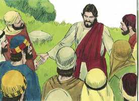
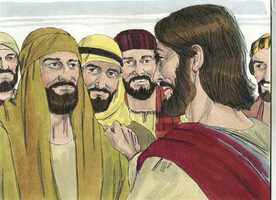
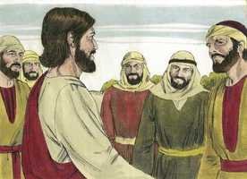
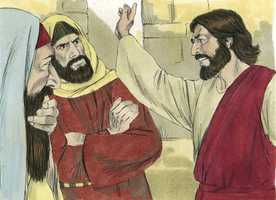
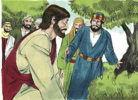

# Marcos Cap 03

**1** 	E OUTRA vez entrou na sinagoga, e estava ali um homem que tinha uma das mãos mirrada.

 

**2** 	E estavam observando-o se curaria no sábado, para o acusarem.

**3** 	E disse ao homem que tinha a mão mirrada: Levanta-te e vem para o meio.

 

**4** 	E perguntou-lhes: É lícito no sábado fazer bem, ou fazer mal? salvar a vida, ou matar? E eles calaram-se.

 

**5** 	E, olhando para eles em redor com indignação, condoendo-se da dureza do seu coração, disse ao homem: Estende a tua mão. E ele a estendeu, e foi-lhe restituída a sua mão, sã como a outra.

 

**6** 	E, tendo saído os fariseus, tomaram logo conselho com os herodianos contra ele, procurando ver como o matariam.

**7** 	E retirou-se Jesus com os seus discípulos para o mar, e seguia-o uma grande multidão da Galiléia e da Judéia,

**8** 	E de Jerusalém, e da Iduméia, e de além do Jordão, e de perto de Tiro e de Sidom; uma grande multidão que, ouvindo quão grandes coisas fazia, vinha ter com ele.

**9** 	E ele disse aos seus discípulos que lhe tivessem sempre pronto um barquinho junto dele, por causa da multidão, para que o não oprimisse,

**10** 	Porque tinha curado a muitos, de tal maneira que todos quantos tinham algum mal se arrojavam sobre ele, para lhe tocarem.

**11** 	E os espíritos imundos vendo-o, prostravam-se diante dele, e clamavam, dizendo: Tu és o Filho de Deus.

**12** 	E ele os ameaçava muito, para que não o manifestassem.

**13** 	E subiu ao monte, e chamou para si os que ele quis; e vieram a ele.

**14** 	E nomeou doze para que estivessem com ele e os mandasse a pregar,

 

**15** 	E para que tivessem o poder de curar as enfermidades e expulsar os demônios:

**16** 	A Simão, a quem pôs o nome de Pedro,

 

**17** 	E a Tiago, filho de Zebedeu, e a João, irmão de Tiago, aos quais pôs o nome de Boanerges, que significa: Filhos do trovão;

 

**18** 	E a André, e a Filipe, e a Bartolomeu, e a Mateus, e a Tomé, e a Tiago, filho de Alfeu, e a Tadeu, e a Simão, o Cananita,

 

**19** 	E a Judas Iscariotes, o que o entregou.

**20** 	E foram para uma casa. E afluiu outra vez a multidão, de tal maneira que nem sequer podiam comer pão.

**21** 	E, quando os seus ouviram isto, saíram para o prender; porque diziam: Está fora de si.

**22** 	E os escribas, que tinham descido de Jerusalém, diziam: Tem Belzebu, e pelo príncipe dos demônios expulsa os demônios.

**23** 	E, chamando-os a si, disse-lhes por parábolas: Como pode Satanás expulsar Satanás?

 

**24** 	E, se um reino se dividir contra si mesmo, tal reino não pode subsistir;

**25** 	E, se uma casa se dividir contra si mesma, tal casa não pode subsistir.

**26** 	E, se Satanás se levantar contra si mesmo, e for dividido, não pode subsistir; antes tem fim.

**27** 	Ninguém pode roubar os bens do valente, entrando-lhe em sua casa, se primeiro não maniatar o valente; e então roubará a sua casa.

**28** 	Na verdade vos digo que todos os pecados serão perdoados aos filhos dos homens, e toda a sorte de blasfêmias, com que blasfemarem;

 

**29** 	Qualquer, porém, que blasfemar contra o Espírito Santo, nunca obterá perdão, mas será réu do eterno juízo

**30** 	(Porque diziam: Tem espírito imundo).

**31** 	Chegaram, então, seus irmãos e sua mãe; e, estando fora, mandaram-no chamar.

 

**32** 	E a multidão estava assentada ao redor dele, e disseram-lhe: Eis que tua mãe e teus irmãos te procuram, e estão lá fora.

**33** 	E ele lhes respondeu, dizendo: Quem é minha mãe e meus irmãos?

**34** 	E, olhando em redor para os que estavam assentados junto dele, disse: Eis aqui minha mãe e meus irmãos.

**35** 	Porquanto, qualquer que fizer a vontade de Deus, esse é meu irmão, e minha irmã, e minha mãe.

> **Cmt MHenry** Intro: É de grande consolo para todos os cristãos verdadeiros saber que são mais queridos por Cristo que mãe, irmão ou irmã como tais, se são santos, simplesmente como seriam os familiares na carne. Bendito seja Deus, este privilégio grande e de graça é nosso já agora; porque embora não possamos desfrutar da presença corporal de Cristo, não nos é negada sua presença espiritual.> Era claro que a doutrina de Cristo tendia diretamente a romper o poder do diabo; e também era claro que sua expulsão dos corpos da gente confirmava essa doutrina; em conseqüência, Satanás não podia suportar esse desígnio. Cristo deu uma advertência espantosa contra dizer palavras tão perigosas como essas. Verdade é que o evangelho promete perdão para os pecados e pecadores maiores, porque Cristo o comprou; mas por este pecado, eles se opõem aos dons do Espírito Santo depois da ascensão de Cristo. tal é a inimizade do coração, que os inconversos pretendem que os crentes estão fazendo a obra de Satanás, quando os pecadores são levados ao arrependimento e à vida nova.> Cristo chama a quem quer, porque a graça e sua. Tinha pedido aos apóstolos que se afastassem da multidão e que fossem com Ele. Agora lhes deu poder para curar doenças e expulsar demônios. Que o Senhor envie a muitos mais dos que estiveram com Ele, e que aprenderam dEle a pregar seu evangelho, para ser instrumentos de sua obra bendita. Os que têm um coração que cresceu na obra de Deus, podem tolerar facilmente o que é inconveniente para eles, e preferirão perder-se uma comida antes que uma oportunidade de fazer o bem. Os que andam com zelo na obra de Deus devem esperar estorvos do ódio dos inimigos e dos afetos errados dos amigos, e devem cuidar-se de ambos.> Todas nossas enfermidades e calamidades vêm da ira de Deus contra nossos pecados. Sua eliminação ou sua transformação em bênçãos para nós foi adquirida para nós pelo sangue de Cristo. Porém devemos dever principalmente as pragas e enfermidades de nossa alma, de nosso coração; ele pode curá-las também por uma palavra. Que mais e mais gente se apressem a ir a Cristo para serem sarados destas pragas e ser liberados dos inimigos de suas almas.> O caso deste homem era triste; sua mão seca que o incapacitava para trabalhar e ganhar sua vida; os que têm este tipo de problema, são os objetos mais apropriados para a caridade. Os que não podem valer-se por si mesmos devem ser socorridos. Mas os infiéis obcecados, quando nada podem dizer contra a verdade, ainda assim não se rendem. Ouvimos o que foi dito errado e vemos o que foi feito errado, mas Cristo olha a raiz da amargura do coração, sua cegueira e dureza, e fica triste. Tremam os pecadores de coração duro ao pensar na ira com que os olhará dentro de pouco tempo, quando chegue o dia de sua ira. O grande dia de sanidade é agora, o dia do repouso, e o lugar da sanidade é a casa de oração, mas o poder curador é o de Cristo. o mandado do evangelho é como o registrado aqui: apesar de que as nossas mãos estejam secas, contudo, se não as estendermos, é por nossa falta que não somos curados. Porém, se formos curados, Cristo, seu poder e graça, devem ter toda a glória.