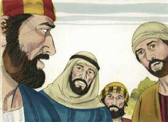
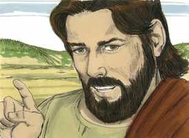
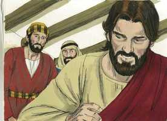
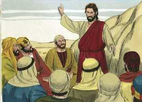
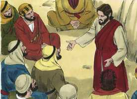
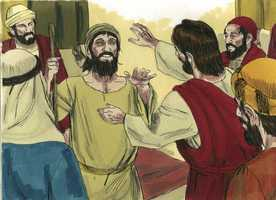

# Marcos Cap 10

**1** 	E, LEVANTANDO-SE dali, foi para os termos da Judéia, além do Jordão, e a multidão se reuniu em torno dele; e tornou a ensiná-los, como tinha por costume.

**2** 	E, aproximando-se dele os fariseus, perguntaram-lhe, tentando-o: É lícito ao homem repudiar sua mulher?

**3** 	Mas ele, respondendo, disse-lhes: Que vos mandou Moisés?

**4** 	E eles disseram: Moisés permitiu escrever carta de divórcio e repudiar.

**5** 	E Jesus, respondendo, disse-lhes: Pela dureza dos vossos corações vos deixou ele escrito esse mandamento;

**6** 	Porém, desde o princípio da criação, Deus os fez macho e fêmea.

**7** 	Por isso deixará o homem a seu pai e a sua mãe, e unir-se-á a sua mulher,

**8** 	E serão os dois uma só carne; e assim já não serão dois, mas uma só carne.

**9** 	Portanto, o que Deus ajuntou não o separe o homem.

**10** 	E em casa tornaram os discípulos a interrogá-lo acerca disto mesmo.

**11** 	E ele lhes disse: Qualquer que deixar a sua mulher e casar com outra, adultera contra ela.

**12** 	E, se a mulher deixar a seu marido, e casar com outro, adultera.

**13** 	E traziam-lhe meninos para que lhes tocasse, mas os discípulos repreendiam aos que lhos traziam.

**14** 	Jesus, porém, vendo isto, indignou-se, e disse-lhes: Deixai vir os meninos a mim, e não os impeçais; porque dos tais é o reino de Deus.

**15** 	Em verdade vos digo que qualquer que não receber o reino de Deus como menino, de maneira nenhuma entrará nele.

**16** 	E, tomando-os nos seus braços, e impondo-lhes as mãos, os abençoou.

**17** 	E, pondo-se a caminho, correu para ele um homem, o qual se ajoelhou diante dele, e lhe perguntou: Bom Mestre, que farei para herdar a vida eterna?

 

**18** 	E Jesus lhe disse: Por que me chamas bom? Ninguém há bom senão um, que é Deus.

 

**19** 	Tu sabes os mandamentos: Não adulterarás; não matarás; não furtarás; não dirás falso testemunho; não defraudarás alguém; honra a teu pai e a tua mãe.

**20** 	Ele, porém, respondendo, lhe disse: Mestre, tudo isso guardei desde a minha mocidade.

 

**21** 	E Jesus, olhando para ele, o amou e lhe disse: Falta-te uma coisa: vai, vende tudo quanto tens, e dá-o aos pobres, e terás um tesouro no céu; e vem, toma a cruz, e segue-me.

 

**22** 	Mas ele, pesaroso desta palavra, retirou-se triste; porque possuía muitas propriedades.

 

**23** 	Então Jesus, olhando em redor, disse aos seus discípulos: Quão dificilmente entrarão no reino de Deus os que têm riquezas!

**24** 	E os discípulos se admiraram destas suas palavras; mas Jesus, tornando a falar, disse-lhes: Filhos, quão difícil é, para os que confiam nas riquezas, entrar no reino de Deus!

 

**25** 	É mais fácil passar um camelo pelo fundo de uma agulha, do que entrar um rico no reino de Deus.

**26** 	E eles se admiravam ainda mais, dizendo entre si: Quem poderá, pois, salvar-se?

 

**27** 	Jesus, porém, olhando para eles, disse: Para os homens é impossível, mas não para Deus, porque para Deus todas as coisas são possíveis.

 

**28** 	E Pedro começou a dizer-lhe: Eis que nós tudo deixamos, e te seguimos.

 

**29** 	E Jesus, respondendo, disse: Em verdade vos digo que ninguém há, que tenha deixado casa, ou irmãos, ou irmãs, ou pai, ou mãe, ou mulher, ou filhos, ou campos, por amor de mim e do evangelho,

 

**30** 	Que não receba cem vezes tanto, já neste tempo, em casas, e irmãos, e irmãs, e mães, e filhos, e campos, com perseguições; e no século futuro a vida eterna.

**31** 	Porém muitos primeiros serão derradeiros, e muitos derradeiros serão primeiros.

**32** 	E iam no caminho, subindo para Jerusalém; e Jesus ia adiante deles. E eles maravilhavam-se, e seguiam-no atemorizados. E, tornando a tomar consigo os doze, começou a dizer-lhes as coisas que lhe deviam sobrevir,

 

**33** 	Dizendo: Eis que nós subimos a Jerusalém, e o Filho do homem será entregue aos príncipes dos sacerdotes, e aos escribas, e o condenarão à morte, e o entregarão aos gentios.

 

**34** 	E o escarnecerão, e açoitarão, e cuspirão nele, e o matarão; e, ao terceiro dia, ressuscitará.

 

**35** 	E aproximaram-se dele Tiago e João, filhos de Zebedeu, dizendo: Mestre, queremos que nos faças o que te pedirmos.

 

**36** 	E ele lhes disse: Que quereis que vos faça?

**37** 	E eles lhe disseram: Concede-nos que na tua glória nos assentemos, um à tua direita, e outro à tua esquerda.

 

**38** 	Mas Jesus lhes disse: Não sabeis o que pedis; podeis vós beber o cálice que eu bebo, e ser batizados com o batismo com que eu sou batizado?

 

**39** 	E eles lhe disseram: Podemos. Jesus, porém, disse-lhes: Em verdade, vós bebereis o cálice que eu beber, e sereis batizados com o batismo com que eu sou batizado;

 

**40** 	Mas, o assentar-se à minha direita, ou à minha esquerda, não me pertence a mim concedê-lo, mas isso é para aqueles a quem está reservado.

**41** 	E os dez, tendo ouvido isto, começaram a indignar-se contra Tiago e João.

 

**42** 	Mas Jesus, chamando-os a si, disse-lhes: Sabeis que os que julgam ser príncipes dos gentios, deles se assenhoreiam, e os seus grandes usam de autoridade sobre eles;

 

**43** 	Mas entre vós não será assim; antes, qualquer que entre vós quiser ser grande, será vosso serviçal;

 

**44** 	E qualquer que dentre vós quiser ser o primeiro, será servo de todos.

 

**45** 	Porque o Filho do homem também não veio para ser servido, mas para servir e dar a sua vida em resgate de muitos.

**46** 	E depois, foram para Jericó. E, saindo ele de Jericó com seus discípulos e uma grande multidão, Bartimeu, o cego, filho de Timeu, estava assentado junto do caminho, mendigando.

**47** 	E, ouvindo que era Jesus de Nazaré, começou a clamar, e a dizer: Jesus, filho de Davi, tem misericórdia de mim.

 

**48** 	E muitos o repreendiam, para que se calasse; mas ele clamava cada vez mais: Filho de Davi! tem misericórdia de mim.

 

**49** 	E Jesus, parando, disse que o chamassem; e chamaram o cego, dizendo-lhe: Tem bom ânimo; levanta-te, que ele te chama.

 

**50** 	E ele, lançando de si a sua capa, levantou-se, e foi ter com Jesus.

**51** 	E Jesus, falando, disse-lhe: Que queres que te faça? E o cego lhe disse: Mestre, que eu tenha vista.

 

**52** 	E Jesus lhe disse: Vai, a tua fé te salvou. E logo viu, e seguiu a Jesus pelo caminho.

 

> **Cmt MHenry** Intro: Bartimeu, que tinha ouvido de Jesus e seus milagres, e sabido que passaria por ali, esperava recuperar a vista. Ao ir a Cristo a pedir ajuda e saúde, devemos olhar para Ele com o Messias prometido. Os chamados de graça que Cristo nos faz para que vamos a Ele, animam nossa esperança de que se vamos a Ele teremos aquilo para o qual fomos a Ele. os que vão a Jesus devem desprezar a roupagem de sua própria suficiência, devem livrar-se de todo peso, e do pecado que, como longas vestes, os assediam mais facilmente ([Hb 12.1](../58N-Hb/12.md#1)). Ele roga que seus olhos sejam abertos. Muito desejável é ser capaz de ganhar nosso pão; e onde Deus deu aos homens suas extremidades e sentidos, é vergonhoso que, por torpeza e preguiça, se façam Efraim cegos e coxos. Seus olhos foram abertos. Tua fé te salvou: a fé em Cristo como o Filho de Davi, e em sua compaixão e poder; não tuas palavras repetidas, sena tua fé; Cristo coloca tua fé a trabalhar. Os pecadores Sejas chamados a imitar o cego Bartimeu. Jesus passa por onde se prega o evangelho ou circulam as palavras escritas da verdade, e esta é a oportunidade. Não basta com ir a Cristo por saúde espiritual, senão que, quando estejamos sarados, devemos continuar seguindo-o, para que possamos honrá-lo e receber instrução dEle. Os que têm vista espiritual vêem em Cristo essa beleza atrativa que os fará corres trás Ele.> Cristo continua adiante com sua empresa para a salvação da humanidade, coisa que foi, é e será o assombro de todos seus discípulos. A honra mundana tem um brilho com o qual podem ter-se deslumbrado muitas vezes os olhos dos discípulos mesmos de Cristo. Cuidemosde ter sabedoria e graça para saber sofrer com Ele; e que possamos confiar em que Ele proverá os graus de nossa glória. Cristo lhe mostra que geralmente se abusa do poder no mundo. Se Jesus nos concedesse todos os desejos, logo seria evidente que desejamos fama ou poder, e que não queremos beber seu cálice nem passar por seu batismo; com freqüência seria uma ruína que respondesse nossas orações. Contudo, nos ama e dará a seu povo somente o que é bom para eles.> Cristo aproveita esta ocasião para falar a seus discípulos sobre a dificuldade da salvação dos que têm abundância neste mundo. Os que assim buscam ansiosamente a riqueza do mundo, nunca valorizarão em justiça a Cristo e sua graça. Além disso, fala da grandeza da salvação dos que têm pouco deste mundo e o deixam por Cristo. a prova maior da constância de um homem bom se produz quando o amor a Jesus lhe pede que renuncie ao amor aos amigos e aos familiares. Embora vencedores por Cristo, ainda devem esperar sofrer por Ele até chegarem ao céu. Aprendamos a contentar-nos em uma situação má e a estar alerta contra o amor às riquezas em uma situação boa. Oremos para sermos capazes de deixá-lo tudo se for necessário pelo serviço de Cristo, e para usar em seu serviço todo o que nos seja permitido reter.> Este jovem rico mostrou grande honestidade. Perguntou que devia fazer agora para ser feliz para sempre. A maioria pede bens para *tê-los* neste mundo; qualquer bem ([Salmo 4.6](../19A-Sl/04.md#6)); este pede que deve *fazer-se* neste mundo para desfrutar do bem maior no outro. Cristo estimula esta pergunta assistindo sua fé e guiando sua prática. Contudo, aqui há uma separação penosa entre Jesus e este jovem. Pergunta a Cristo que deve fazer além do que já fez para obter a vida eterna; e Cristo lhe pergunta se ele tem, como parece sem dúvida, essa fé firme na vida eterna, e se lhe dá elevado valor; está disposto a suportar uma cruz presente com a expectativa de uma coroa futura? O jovem lamentou não poder ser um seguidor de Cristo em condições mais fáceis; que não pudesse obter a vida eterna e reter também suas possessões mundanas. Foi embora triste. Veja [Mateus 6.24](../40N-Mt/06.md#24): Não se pode servir a Deus e a Mamom.> Alguns pais ou babás trouxeram crianças pequenas a Cristo para que Ele os tocasse como símbolo de sua bênção sobre eles. Não parece que necessitassem sanidade corporal nem que fossem capazes de ser ensinados; porém, os encarregados de cuidá-los acreditavam que a bênção de Cristo fariam bem a suas almas; portanto, os levaram a Ele. Jesus mandou que os deixassem vir a Ele e que nada devia dizer-se ou fazer-se para impedi-lo. As crianças devem ser conduzidas ao Salvador tão logo como sejam capazes de entender suas palavras. Além do mais, devemos receber o Reino de Deus como crianças pequenas; devemos ser afetuosos com Cristo e sua graça, como os meninos com seus pais, babás e mestres.> Onde estiver Jesus o seguiam multidões, e Ele ensinava-lhes. Pregar era costume constante de Jesus. aqui indica que a razão pela qual a lei de Moisés permitiu o divórcio, era de tal natureza que eles não deviam usar essa permissão; era somente pela dureza de seus corações. Deus próprio uniu marido e mulher; os preparou para que fossem de consolo e ajuda mútuos. O que Deus uniu não deve ser desamarrado levianamente. Os que estão por rejeitar suas esposas, pensem que seria deles se Deus os tratasse do mesmo modo.