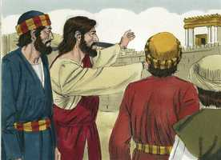
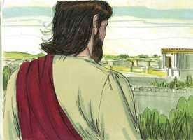

# Marcos Cap 13

**1** 	E, SAINDO ele do templo, disse-lhe um dos seus discípulos: Mestre, olha que pedras, e que edifícios!

 

**2** 	E, respondendo Jesus, disse-lhe: Vês estes grandes edifícios? Não ficará pedra sobre pedra que não seja derrubada.

 

**3** 	E, assentando-se ele no Monte das Oliveiras, defronte do templo, Pedro, e Tiago, e João e André lhe perguntaram em particular:

 

**4** 	Dize-nos, quando serão essas coisas, e que sinal haverá quando todas elas estiverem para se cumprir.

**5** 	E Jesus, respondendo-lhes, começou a dizer: Olhai que ninguém vos engane;

 

**6** 	Porque muitos virão em meu nome, dizendo: Eu sou o Cristo; e enganarão a muitos.

**7** 	E, quando ouvirdes de guerras e de rumores de guerras, não vos perturbeis; porque assim deve acontecer; mas ainda não será o fim.

**8** 	Porque se levantará nação contra nação, e reino contra reino, e haverá terremotos em diversos lugares, e haverá fomes e tribulações. Estas coisas são os princípios das dores.

**9** 	Mas olhai por vós mesmos, porque vos entregarão aos concílios e às sinagogas; e sereis açoitados, e sereis apresentados perante presidentes e reis, por amor de mim, para lhes servir de testemunho.

**10** 	Mas importa que o evangelho seja primeiramente pregado entre todas as nações.

**11** 	Quando, pois, vos conduzirem e vos entregarem, não estejais solícitos de antemão pelo que haveis de dizer, nem premediteis; mas, o que vos for dado naquela hora, isso falai, porque não sois vós os que falais, mas o Espírito Santo.

**12** 	E o irmão entregará à morte o irmão, e o pai ao filho; e levantar-se-ão os filhos contra os pais, e os farão morrer.

 

**13** 	E sereis odiados por todos por amor do meu nome; mas quem perseverar até ao fim, esse será salvo.

**14** 	Ora, quando vós virdes a abominação do assolamento, que foi predita por Daniel o profeta, estar onde não deve estar (quem lê, entenda), então os que estiverem na Judéia fujam para os montes.

**15** 	E o que estiver sobre o telhado não desça para casa, nem entre a tomar coisa alguma de sua casa;

**16** 	E o que estiver no campo não volte atrás, para tomar as suas vestes.

**17** 	Mas ai das grávidas, e das que criarem naqueles dias!

**18** 	Orai, pois, para que a vossa fuga não suceda no inverno.

**19** 	Porque naqueles dias haverá uma aflição tal, qual nunca houve desde o princípio da criação, que Deus criou, até agora, nem jamais haverá.

**20** 	E, se o Senhor não abreviasse aqueles dias, nenhuma carne se salvaria; mas, por causa dos eleitos que escolheu, abreviou aqueles dias.

**21** 	E então, se alguém vos disser: Eis aqui o Cristo; ou: Ei-lo ali; não acrediteis.

**22** 	Porque se levantarão falsos cristos, e falsos profetas, e farão sinais e prodígios, para enganarem, se for possível, até os escolhidos.

**23** 	Mas vós vede; eis que de antemão vos tenho dito tudo.

**24** 	Ora, naqueles dias, depois daquela aflição, o sol se escurecerá, e a lua não dará a sua luz.

**25** 	E as estrelas cairão do céu, e as forças que estão nos céus serão abaladas.

**26** 	E então verão vir o Filho do homem nas nuvens, com grande poder e glória.

**27** 	E ele enviará os seus anjos, e ajuntará os seus escolhidos, desde os quatro ventos, da extremidade da terra até a extremidade do céu.

**28** 	Aprendei, pois, a parábola da figueira: Quando já o seu ramo se torna tenro, e brota folhas, bem sabeis que já está próximo o verão.

**29** 	Assim também vós, quando virdes sucederem estas coisas, sabei que já está perto, às portas.

**30** 	Na verdade vos digo que não passará esta geração, sem que todas estas coisas aconteçam.

 

**31** 	Passará o céu e a terra, mas as minhas palavras não passarão.

**32** 	Mas daquele dia e hora ninguém sabe, nem os anjos que estão no céu, nem o Filho, senão o Pai.

**33** 	Olhai, vigiai e orai; porque não sabeis quando chegará o tempo.

**34** 	É como se um homem, partindo para fora da terra, deixasse a sua casa, e desse autoridade aos seus servos, e a cada um a sua obra, e mandasse ao porteiro que vigiasse.

**35** 	Vigiai, pois, porque não sabeis quando virá o senhor da casa; se à tarde, se à meia-noite, se ao cantar do galo, se pela manhã,

**36** 	Para que, vindo de improviso, não vos ache dormindo.

**37** 	E as coisas que vos digo, digo-as a todos: Vigiai.

> **Cmt MHenry** Intro: Temos a aplicação do sermão profético. Enquanto à destruição de Jerusalém, esperem que chegue dentro de muito pouco tempo. Enquanto ao fim do mundo, não perguntem quando virá, porque o dia e a hora nenhum homem os conhece. Cristo, como Deus, não podia ignorar nada, pelo que a sabedoria divina que habitava em nosso Senhor se comunicava a sua alma humana conforme ao beneplácito divino. Nosso dever a respeito das duas é estar alertas e orar. Nosso Senhor Jesus, quando ascendeu no alto, deixou algo para que todos seus servos façam. Sempre devemos estar vigilantes esperando seu regresso. Isto se aplica à vinda de Cristo a nós em nossa morte e também ao juízo geral. Não sabemos se nosso Senhor virá nos dias da juventude, na idade mediana ou na velhice, porém, tão logo como nascemos, começamos a morrer e, portanto, devemos esperar a morte. Nosso grande afã deve ser que, quando volte o Senhor, não nos encontre confiados, dando-nos o gosto em comodidade e preguiça, despreocupados de nossa obra e do dever. A todos lhes diz: Vigiem, para que sejam achados em paz, sem mácula e irrepreensíveis.> Os discípulos tinham confundido a destruição de Jerusalém com o fim do mundo. Cristo corrigiu este erro e demonstrou que o dia da vinda de Cristo e o dia do Jz serão depois daquela tribulação. Aqui anuncia a dissolução final do marco e da trama presentes do mundo. Além disso, prediz a aparição visível do Senhor Jesus que vem nas nuvens, e a reunião de todos os eleitos com Ele.> Os judeus apressaram o ritmo de sua ruína ao rebelar-se contra os romanos e perseguir os cristãos. Aqui temos uma predição da destruição que lhes sobreveio uns quarenta anos depois disto; uma destruição e um estrago como não tinham acontecido em sua história. As promessas de poder para perseverar e as advertências contra um afastamento concordam bem umas com outras. Mas enquanto mais consideremos estas coisas, veremos motivos mais abundantes para fugir sem demora a refugiar-nos em Cristo, e a renunciar a todo objeto terreno pela salvação de nossas almas.> Nosso Senhor Jesus, ao responder a pergunta dos discípulos, não faz tanto para satisfazer sua curiosidade como para dirigir suas consciências. Quando muitos são enganados, devemos por isso ser despertados para examinar-nos a nós mesmos. Os discípulos de Cristo, se não é sua própria falta, podem desfrutar de santa seguridade e paz mental quando todo em sua volta está desordenado. Mas eles devem cuidar de não ser afastados de Cristo e de seu dever para Ele pelos sofrimentos com que se encontraram por amor dEle. Serão odiados por todos os homens: problema mais que suficiente! Mas a obra para a qual eles foram chamados deve continuar avançando e prosperar. Embora eles sejam esmagados e derrubados, o Evangelho não pode sê-lo. a salvação prometida é mais que liberação do mal, é bênção eterna.> Observe-se em quão pouco valoriza Cristo a pompa externa, onde não há verdadeira pureza de coração. Olha com compaixão a ruína de almas preciosas, e chora por elas, mas nós não o encontramos olhando com pena a ruína de uma casa formosa. Então, lembremos quão necessário é que tenhamos uma habitação mais perdurável no céu e estarmos preparados para ela pela obra do Espírito Santo, buscada no uso fervoroso de todos os meios de graça.