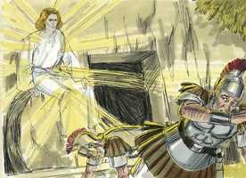
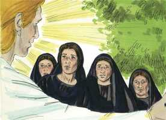
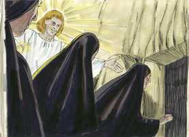
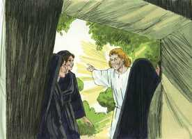
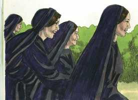
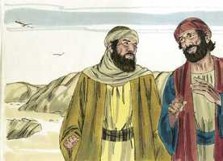
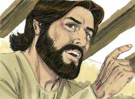

# Marcos Cap 16

**1** 	E, PASSADO o sábado, Maria Madalena, e Maria, mãe de Tiago, e Salomé, compraram aromas para irem ungi-lo.

 

**2** 	E, no primeiro dia da semana, foram ao sepulcro, de manhã cedo, ao nascer do sol.

**3** 	E diziam umas às outras: Quem nos revolverá a pedra da porta do sepulcro?

**4** 	E, olhando, viram que já a pedra estava revolvida; e era ela muito grande.

**5** 	E, entrando no sepulcro, viram um jovem assentado à direita, vestido de uma roupa comprida, branca; e ficaram espantadas.

 

**6** 	Ele, porém, disse-lhes: Não vos assusteis; buscais a Jesus Nazareno, que foi crucificado; já ressuscitou, não está aqui; eis aqui o lugar onde o puseram.

  

**7** 	Mas ide, dizei a seus discípulos, e a Pedro, que ele vai adiante de vós para a Galiléia; ali o vereis, como ele vos disse.

 

**8** 	E, saindo elas apressadamente, fugiram do sepulcro, porque estavam possuídas de temor e assombro; e nada diziam a ninguém porque temiam.

 

**9** 	E Jesus, tendo ressuscitado na manhã do primeiro dia da semana, apareceu primeiramente a Maria Madalena, da qual tinha expulsado sete demônios.

**10** 	E, partindo ela, anunciou-o àqueles que tinham estado com ele, os quais estavam tristes, e chorando.

**11** 	E, ouvindo eles que vivia, e que tinha sido visto por ela, não o creram.

**12** 	E depois manifestou-se de outra forma a dois deles, que iam de caminho para o campo.

 

**13** 	E, indo estes, anunciaram-no aos outros, mas nem ainda estes creram.

**14** 	Finalmente apareceu aos onze, estando eles assentados à mesa, e lançou-lhes em rosto a sua incredulidade e dureza de coração, por não haverem crido nos que o tinham visto já ressuscitado.

**15** 	E disse-lhes: Ide por todo o mundo, pregai o evangelho a toda criatura.

 

**16** 	Quem crer e for batizado será salvo; mas quem não crer será condenado.

**17** 	E estes sinais seguirão aos que crerem: Em meu nome expulsarão os demônios; falarão novas línguas;

**18** 	Pegarão nas serpentes; e, se beberem alguma coisa mortífera, não lhes fará dano algum; e porão as mãos sobre os enfermos, e os curarão.

**19** 	Ora, o Senhor, depois de lhes ter falado, foi recebido no céu, e assentou-se à direita de Deus.

 

**20** 	E eles, tendo partido, pregaram por todas as partes, cooperando com eles o Senhor, e confirmando a palavra com os sinais que se seguiram. Amém.

> **Cmt MHenry** Intro: Depois que o Senhor falou, subiu ao céu. Sentar-se é uma postura de repouso; tinha acabado sua obra; é postura de governo: tomou possessão de seu reino. Sentou à destra de Deus, o que denota sua soberana dignidade e poder universal. O que Deus faça conosco, nos dê ou nos aceite, é por seu Filho. Agora Ele está glorificado com a glória que teve antes que o mundo fosse. Os apóstolos foram e pregaram em todas partes, longe e perto. Embora a doutrina que pregaram era espiritual e celestial, diretamente contrária ao espírito e temperamento do mundo, ainda que acharam muita oposição, e foram absolutamente desprovidos de todos os apoios e vantagens do mundo, ainda assim, em uns quantos anos, sua voz ecoou até o último da terra. Os ministros de Cristo não necessitam agora operar milagres para provar sua mensagem; está demonstrado que as Escrituras são de origem divina, e isto faz que os que as rejeitam ou desprezam não tenham escusa. Os efeitos do Evangelho, quando se prega fielmente e se crê verdadeiramente, e quando muda os temperamentos e o caráter da humanidade, são uma prova constante, uma prova miraculosa, de que o evangelho é poder de Deus para salvação de todo aquele que crê.> As provas da verdade do evangelho são tão completas que os que não as aceitam, podem ser justamente repreendidos por sua incredulidade.\> \ Nosso bendito Senhor renova a eleição dos onze como apóstolos seus e os encarrega da missão de ir a todo o mundo e pregar o Evangelho a toda criatura. Somente o que é *verdadeiro* cristão será salvo por meio de Cristo. Simão o mago professou crer, e foi batizado, porém se declarou que estava nos laços da iniqüidade: leia-se sua história em [Atos 8.13-15](../44N-At/08.md#13). sem dúvida esta é uma declaração solene da fé verdadeira que recebe a Cristo em todos seus caracteres e ofícios, e para todos os propósitos da salvação, e produz seu bom efeito no coração e a vida; não o simples assentimento, que é fé morta e não dá proveito. A comissão dos ministros de Cristo se estende a toda criatura de todo o mundo, e as decisões do evangelho contêm não só verdades, exortações e preceitos, senão também advertências temíveis. Observe-se com que poder foram dotados os apóstolos, para confirmar a doutrina que pregariam. Estes foram milagres para confirmar a verdade do evangelho, e meios para difundi-lo nas nações que não o haviam ouvido.> Melhores notícias não poderiam ter sido levadas aos discípulos que choravam, que contá-lhes da ressurreição de Cristo. Nós deveríamos estudar para consolar os discípulos aflitos. dizendo-lhes o que temos visto de Cristo. Foi uma sábia providência que as provas da ressurreição de Cristo fossem dadas gradualmente, e recebidas com cautela, para que a seguridade com que os apóstolos pregaram esta doutrina depois fosse mais satisfatória. Contudo, quão lentos somos para admitir os consolos que a palavra de Deus tem! Então, enquanto Cristo consola a seu povo, vê que, freqüentemente, é necessário repreendê-los e corrigi-los pela dureza de coração que desconfia de sua promessa, assim como que não obedece seus santos preceitos.> " Nicodemos trouxe uma grande quantidade de especiarias, mas estas boas mulheres não acreditaram que fossem suficientes. O respeito que outros mostram a Cristo não nos deve impedir que mostremos nosso respeito. Os que são guiados pelo zelo santo a buscar com diligência a Cristo, encontrarão que os tropeços do caminho desaparecem com rapidez. Quando nos expomos a problemas e gastos por amor a Cristo, somos aceitos embora nossos esforços não tenham êxito. A vista do anjo podia tê-las animado, com justiça, mas elas se assustaram. Assim, pois, muitas vezes o que deveria ser nosso consolo, provoca terror devido a nosso próprio erro. "Ele *foi* crucificado, porém *está* glorificado. Ressuscitou, não está aqui. Não está morto, e vive no novo; mas adiante o verão, mas aqui podem ver o lugar onde foi colocado". Assim, se enviará o consolo oportuno aos que choram pelo Senhor Jesus. Pedro é mencionado em particular: "Digam a Pedro"; isto o receberá muito bem, porque está triste pelo pecado. Ver a Cristo é algo muito bem recebido por um verdadeiro arrependido, e o penitente verdadeiro é muito bem recebido quando quer ver a Cristo. os homens correram a toda pressa até onde estavam os discípulos; porém os temores inquietantes costumam impedir-nos realizar o serviço que poderíamos fazer a Cristo e às almas dos homens, se a fé e o gozo da fé fossem firmes. "