# Lucas Cap 05

**1** 	E ACONTECEU que, apertando-o a multidão, para ouvir a palavra de Deus, estava ele junto ao lago de Genesaré;

**2** 	E viu estar dois barcos junto à praia do lago; e os pescadores, havendo descido deles, estavam lavando as redes.

**3** 	E, entrando num dos barcos, que era o de Simão, pediu-lhe que o afastasse um pouco da terra; e, assentando-se, ensinava do barco a multidão.

**4** 	E, quando acabou de falar, disse a Simão: Faze-te ao mar alto, e lançai as vossas redes para pescar.

**5** 	E, respondendo Simão, disse-lhe: Mestre, havendo trabalhado toda a noite, nada apanhamos; mas, sobre a tua palavra, lançarei a rede.

**6** 	E, fazendo assim, colheram uma grande quantidade de peixes, e rompia-se-lhes a rede.

**7** 	E fizeram sinal aos companheiros que estavam no outro barco, para que os fossem ajudar. E foram, e encheram ambos os barcos, de maneira tal que quase iam a pique.

**8** 	E vendo isto Simão Pedro, prostrou-se aos pés de Jesus, dizendo: Senhor, ausenta-te de mim, que sou um homem pecador.

**9** 	Pois que o espanto se apoderara dele, e de todos os que com ele estavam, por causa da pesca de peixe que haviam feito.

**10** 	E, de igual modo, também de Tiago e João, filhos de Zebedeu, que eram companheiros de Simão. E disse Jesus a Simão: Não temas; de agora em diante serás pescador de homens.

**11** 	E, levando os barcos para terra, deixaram tudo, e o seguiram.

**12** 	E aconteceu que, quando estava numa daquelas cidades, eis que um homem cheio de lepra, vendo a Jesus, prostrou-se sobre o rosto, e rogou-lhe, dizendo: Senhor, se quiseres, bem podes limpar-me.

**13** 	E ele, estendendo a mão, tocou-lhe, dizendo: Quero, sê limpo. E logo a lepra desapareceu dele.

**14** 	E ordenou-lhe que a ninguém o dissesse. Mas vai, disse, mostra-te ao sacerdote, e oferece, pela tua purificação, o que Moisés determinou, para que lhes sirva de testemunho.

**15** 	A sua fama, porém, se propagava ainda mais, e ajuntava-se muita gente para o ouvir e para ser por ele curada das suas enfermidades.

**16** 	Ele, porém, retirava-se para os desertos, e ali orava.

**17** 	E aconteceu que, num daqueles dias, estava ensinando, e estavam ali assentados fariseus e doutores da lei, que tinham vindo de todas as aldeias da Galiléia, e da Judéia, e de Jerusalém. E a virtude do Senhor estava ali para os curar.

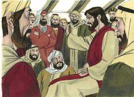 

**18** 	E eis que uns homens transportaram numa cama um homem que estava paralítico, e procuravam fazê-lo entrar e pô-lo diante dele.

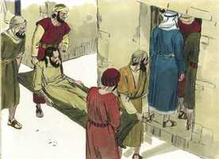 

**19** 	E, não achando por onde o pudessem levar, por causa da multidão, subiram ao telhado, e por entre as telhas o baixaram com a cama, até ao meio, diante de Jesus.

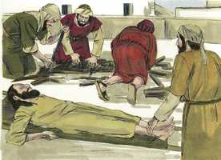 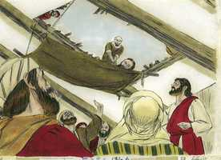 

**20** 	E, vendo ele a fé deles, disse-lhe: Homem, os teus pecados te são perdoados.

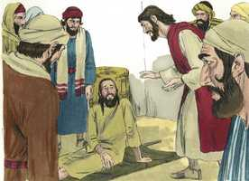 

**21** 	E os escribas e os fariseus começaram a arrazoar, dizendo: Quem é este que diz blasfêmias? Quem pode perdoar pecados, senão só Deus?

 

**22** 	Jesus, porém, conhecendo os seus pensamentos, respondeu, e disse-lhes: Que arrazoais em vossos corações?

 

**23** 	Qual é mais fácil? dizer: Os teus pecados te são perdoados; ou dizer: Levanta-te, e anda?

**24** 	Ora, para que saibais que o Filho do homem tem sobre a terra poder de perdoar pecados (disse ao paralítico), a ti te digo: Levanta-te, toma a tua cama, e vai para tua casa.

 

**25** 	E, levantando-se logo diante deles, e tomando a cama em que estava deitado, foi para sua casa, glorificando a Deus.

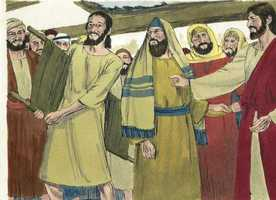 

**26** 	E todos ficaram maravilhados, e glorificaram a Deus; e ficaram cheios de temor, dizendo: Hoje vimos prodígios.

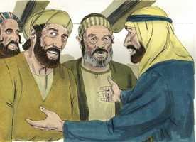 

**27** 	E, depois disto, saiu, e viu um publicano, chamado Levi, assentado na recebedoria, e disse-lhe: Segue-me.

 

**28** 	E ele, deixando tudo, levantou-se e o seguiu.

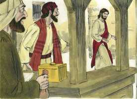 

**29** 	E fez-lhe Levi um grande banquete em sua casa; e havia ali uma multidão de publicanos e outros que estavam com eles à mesa.

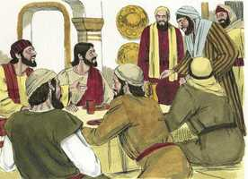 

**30** 	E os escribas deles, e os fariseus, murmuravam contra os seus discípulos, dizendo: Por que comeis e bebeis com publicanos e pecadores?

 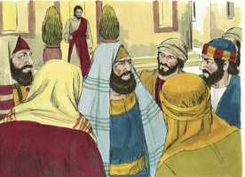 

**31** 	E Jesus, respondendo, disse-lhes: Não necessitam de médico os que estão sãos, mas, sim, os que estão enfermos;

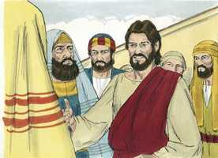 

**32** 	Eu não vim chamar os justos, mas, sim, os pecadores, ao arrependimento.

**33** 	Disseram-lhe, então, eles: Por que jejuam os discípulos de João muitas vezes, e fazem orações, como também os dos fariseus, mas os teus comem e bebem?

**34** 	E ele lhes disse: Podeis vós fazer jejuar os filhos das bodas, enquanto o esposo está com eles?

**35** 	Dias virão, porém, em que o esposo lhes será tirado, e então, naqueles dias, jejuarão.

**36** 	E disse-lhes também uma parábola: Ninguém deita um pedaço de uma roupa nova para a coser em roupa velha, pois romperá a nova e o remendo não condiz com a velha.

**37** 	E ninguém deita vinho novo em odres velhos; de outra sorte o vinho novo romperá os odres, e entornar-se-á o vinho, e os odres se estragarão;

**38** 	Mas o vinho novo deve deitar-se em odres novos, e ambos juntamente se conservarão.

**39** 	E ninguém tendo bebido o velho quer logo o novo, porque diz: Melhor é o velho.

> **Cmt MHenry** Intro: Foi um prodígio da graça de Cristo que chamasse a um publicano para que fosse seu discípulo e seguidor. Foi um prodígio de sua graça que o chamado fosse feito tão eficazmente. Foi um prodígio de sua graça que viesse a chamar pecadores ao arrependimento e que lhes assegure o perdão. Foi um prodígio de sua graça que suportasse com tanta paciência a contradição de pecadores contra si mesmo e contra seus discípulos. Foi um prodígio de sua graça que fixasse serviços de seus discípulos segundo sua força e posição. O Senhor prepara gradualmente seu povo para as provas designadas a eles; devemos imitar seu exemplo ao tratar com os fracos na fé ou com o crente em tentação.> Quantos há em nossas assembléias, onde se prega o evangelho, que não se submetem à Palavra, senão que a evitam! Para eles é como conto que lhes é contado, não uma mensagem enviada 34A-Na 43N-Joa eles*. Observem-se os deveres que nos são ensinados e recomendados pela história do paralítico. Ao apelar a Cristo devemos ser muito insistentes; isso é prova de fé, e muito agradável a Cristo, e prevalece ante Ele. Dá-nos, Senhor, a mesma classe de fé a respeito de tua habilidade e vontade para curar nossas almas. Dá-nos o desejo do perdão de pecado mais que de bênçãos terrenas ou a vida mesma. Capacita-nos para crer em teu poder de perdoar pecados; então nossas almas se levantarão alegremente e irão aonde te agradar.> " Diz-se que este homem estava coberto de lepra; tinha essa doença em alto grau, o que representa nossa contaminação natural com o pecado; estamos cheios de lepra, desde o topo da cabeça até a planta dos pés não há coisa sã em nós. A confiança forte e a humilde profunda estão unidas nas palavras deste leproso. Se qualquer pecador diz, por um sentido profundo de vileza: "Eu sei que o Senhor pode me limpar, mas, olhará para um como eu? Aplicará seu precioso sangue para minha limpeza e saúde?". Sim, ele quererá. Não fales como se duvidasses, senão humildemente refere a questão a Cristo. Tendo sido salvos da culpa e do poder de nossos pecados, difundamos por todas partes a fama de Cristo e levemos a outros a ouvi-lo e a serem sarados. "> Quando Cristo terminou de pregar disse a Pedro que se dedicasse a sua ocupação habitual. O tempo passado nos exercícios públicos da religião durante os dias da semana não deve ser estorvo Enquanto ao tempo, mas pode ser de grande ajuda Enquanto à disposição mental a respeito de nossa ocupação secular. Com que alegria podemos ocupar-nos dos deveres de nossa ocupação quando estivemos com Deus e, assim, santificamos o trabalho pela palavra e a oração! Embora não tinham pescado nada, Cristo lhes disse que lançassem de novo suas redes. não devemos deixar abruptamente nossa ocupação, porque não obtemos nela o êxito que desejamos. Provavelmente nos vá bem quando continuemos a direção da palavra de Cristo. A pesca de peixes foi um milagre. Todos devemos, como Pedro, reconhecer-nos como pecadores, e, portanto, Jesus Cristo poderia afastar-se de nós com toda justiça. Melhor roguemos-lhe que venha e more em nosso coração pela fé, para que possa transformá-lo e limpá-lo. Os pescadores abandonaram tudo e seguiram a Jesus, quando prosperou seu trabalho. Quando as riqueza aumentam, e somos tentados a depositar nelas nosso coração, deixá-las então por Cristo é digno de gratidão.