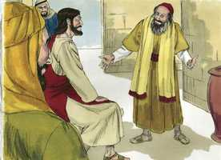
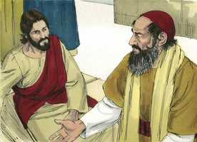
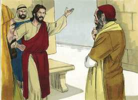
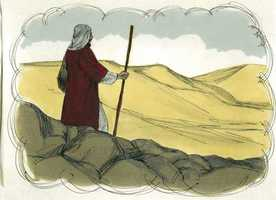
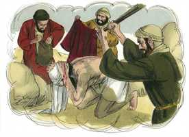
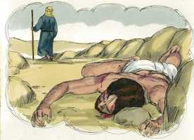
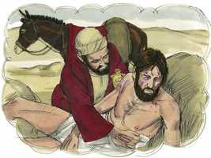
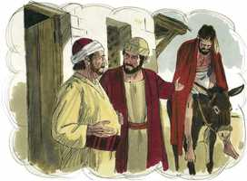
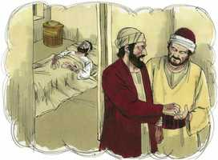
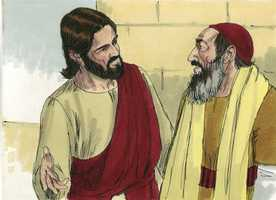

# Lucas Cap 10

**1** 	E DEPOIS disto designou o Senhor ainda outros setenta, e mandou-os adiante da sua face, de dois em dois, a todas as cidades e lugares aonde ele havia de ir.

**2** 	E dizia-lhes: Grande é, em verdade, a seara, mas os obreiros são poucos; rogai, pois, ao Senhor da seara que envie obreiros para a sua seara.

**3** 	Ide; eis que vos mando como cordeiros ao meio de lobos.

**4** 	Não leveis bolsa, nem alforje, nem alparcas; e a ninguém saudeis pelo caminho.

**5** 	E, em qualquer casa onde entrardes, dizei primeiro: Paz seja nesta casa.

**6** 	E, se ali houver algum filho de paz, repousará sobre ele a vossa paz; e, se não, voltará para vós.

**7** 	E ficai na mesma casa, comendo e bebendo do que eles tiverem, pois digno é o obreiro de seu salário. Não andeis de casa em casa.

**8** 	E, em qualquer cidade em que entrardes, e vos receberem, comei do que vos for oferecido.

**9** 	E curai os enfermos que nela houver, e dizei-lhes: É chegado a vós o reino de Deus.

**10** 	Mas em qualquer cidade, em que entrardes e vos não receberem, saindo por suas ruas, dizei:

**11** 	Até o pó, que da vossa cidade se nos pegou, sacudimos sobre vós. Sabei, contudo, isto, que já o reino de Deus é chegado a vós.

**12** 	E digo-vos que mais tolerância haverá naquele dia para Sodoma do que para aquela cidade.

**13** 	Ai de ti, Corazim, ai de ti, Betsaida! Porque, se em Tiro e em Sidom se fizessem as maravilhas que em vós foram feitas, já há muito, assentadas em saco e cinza, se teriam arrependido.

**14** 	Portanto, para Tiro e Sidom haverá menos rigor, no juízo, do que para vós.

**15** 	E tu, Cafarnaum, que te levantaste até ao céu, até ao inferno serás abatida.

**16** 	Quem vos ouve a vós, a mim me ouve; e quem vos rejeita a vós, a mim me rejeita; e quem a mim me rejeita, rejeita aquele que me enviou.

**17** 	E voltaram os setenta com alegria, dizendo: Senhor, pelo teu nome, até os demônios se nos sujeitam.

**18** 	E disse-lhes: Eu via Satanás, como raio, cair do céu.

**19** 	Eis que vos dou poder para pisar serpentes e escorpiões, e toda a força do inimigo, e nada vos fará dano algum.

**20** 	Mas, não vos alegreis porque se vos sujeitem os espíritos; alegrai-vos antes por estarem os vossos nomes escritos nos céus.

**21** 	Naquela mesma hora se alegrou Jesus no Espírito Santo, e disse: Graças te dou, ó Pai, Senhor do céu e da terra, que escondeste estas coisas aos sábios e inteligentes, e as revelaste às criancinhas; assim é, ó Pai, porque assim te aprouve.

**22** 	Tudo por meu Pai me foi entregue; e ninguém conhece quem é o Filho senão o Pai, nem quem é o Pai senão o Filho, e aquele a quem o Filho o quiser revelar.

**23** 	E, voltando-se para os discípulos, disse-lhes em particular: Bem-aventurados os olhos que vêem o que vós vedes.

**24** 	Pois vos digo que muitos profetas e reis desejaram ver o que vós vedes, e não o viram; e ouvir o que ouvis, e não o ouviram.

**25** 	E eis que se levantou um certo doutor da lei, tentando-o, e dizendo: Mestre, que farei para herdar a vida eterna?

 

**26** 	E ele lhe disse: Que está escrito na lei? Como lês?

 

**27** 	E, respondendo ele, disse: Amarás ao Senhor teu Deus de todo o teu coração, e de toda a tua alma, e de todas as tuas forças, e de todo o teu entendimento, e ao teu próximo como a ti mesmo.

 

**28** 	E disse-lhe: Respondeste bem; faze isso, e viverás.

 

**29** 	Ele, porém, querendo justificar-se a si mesmo, disse a Jesus: E quem é o meu próximo?

**30** 	E, respondendo Jesus, disse: Descia um homem de Jerusalém para Jericó, e caiu nas mãos dos salteadores, os quais o despojaram, e espancando-o, se retiraram, deixando-o meio morto.

  

**31** 	E, ocasionalmente descia pelo mesmo caminho certo sacerdote; e, vendo-o, passou de largo.

 

**32** 	E de igual modo também um levita, chegando àquele lugar, e, vendo-o, passou de largo.

 

**33** 	Mas um samaritano, que ia de viagem, chegou ao pé dele e, vendo-o, moveu-se de íntima compaixão;

 

**34** 	E, aproximando-se, atou-lhe as feridas, deitando-lhes azeite e vinho; e, pondo-o sobre o seu animal, levou-o para uma estalagem, e cuidou dele;

 

**35** 	E, partindo no outro dia, tirou dois dinheiros, e deu-os ao hospedeiro, e disse-lhe: Cuida dele; e tudo o que de mais gastares eu to pagarei quando voltar.

 

**36** 	Qual, pois, destes três te parece que foi o próximo daquele que caiu nas mãos dos salteadores?

**37** 	E ele disse: O que usou de misericórdia para com ele. Disse, pois, Jesus: Vai, e faze da mesma maneira.

 

**38** 	E aconteceu que, indo eles de caminho, entrou Jesus numa aldeia; e certa mulher, por nome Marta, o recebeu em sua casa;

**39** 	E tinha esta uma irmã chamada Maria, a qual, assentando-se também aos pés de Jesus, ouvia a sua palavra.

**40** 	Marta, porém, andava distraída em muitos serviços; e, aproximando-se, disse: Senhor, não se te dá de que minha irmã me deixe servir só? Dize-lhe que me ajude.

**41** 	E respondendo Jesus, disse-lhe: Marta, Marta, estás ansiosa e afadigada com muitas coisas, mas uma só é necessária;

**42** 	E Maria escolheu a boa parte, a qual não lhe será tirada.

> **Cmt MHenry** Intro: Um bom sermão não é pior por ser pregado numa casa; e as visitas de nossos amigos devem ser de tal modo administradas como para fazer que procurem o bem de suas almas. Sentar aos pés de Cristo significa disposição pronta para receber sua Palavra, e submissão a sua direção. Marta estava preocupada em atender a cristão e os que vinham com Ele. aqui havia respeito para com nosso Senhor Jesus na atenção correta de seus afazeres domésticos, mas havia algo de errado. Ela estava muito dedicada a servir: abundância, variedade e exatidão. A atividade mundana é uma armadilha para nós quando nos impede servir a Deus e obter o bom para nossas almas. Quanto tempo se desperdiça desnecessariamente e, volta e meia, se acumulam gastos para atender aos que professam o evangelho! Embora Marta era culpável nesta ocasião, era, contudo, crente verdadeira e sua conduta geral não descuidava a coisa necessária. O favor de Deus é necessário para nossa felicidade: a salvação de Cristo é necessária para nossa seguridade. Onde se atentar para isto, todas as outras coisas assumirão seu correto lugar. Cristo declarou: Maria tem escolhido a boa coisa. Porque uma coisa é necessária, e esta coisa fez ela, render-se à direção de Cristo. as coisas desta vida nos serão tiradas por completo quando nós sejamos tirados dela, mas nada nos separará do amor de Cristo e de termos parte nesse amor. Os homens e os demônios *não podem* tirá-lo de nós, e Deus e Cristo *não o farão*. Preocupemo-nos com mais diligência da única coisa necessária.> Se falarmos em forma descuidada da vida eterna e do caminho a ela, tomamos em vão o nome de Deus. ninguém ama a Deus nem a seu próximo com uma medida de puro amor espiritual, se não participa da graça da conversão. O orgulhoso coração humano se resiste muito contra tais convicções. Cristo dá o exemplo de um pobre judeus em apuros, socorrido por um bom samaritano. Este coitado caiu nas mãos de ladrões que o deixaram ferido e quase moribundo. Os que deveriam ser seus amigos o ignoraram, e foi atendido por um estrangeiro, um samaritano, da nação que os judeus mais desprezavam e detestavam, com os que não queriam ter tratos. É lamentável observar quanto domina o egoísmo nestes níveis; quantas escusas dão os homens para poupar-se problemas ou gastos em ajudar o próximo. O verdadeiro cristão tem escrita em seu coração a lei do amor. O Espírito de Cristo mora nele; a imagem de Cristo se renova em sua alma. A parábola é uma bela explicação da lei de amar ao próximo como a um mesmo, sem acepção de nação, partido nem outra distinção. Também estabelece a bondade e o amor de Deus nosso Salvador para com os miseráveis pecadores. Nós éramos como este coitado viajante em apuros. Satanás, nosso inimigo, nos roubou e nos feriu: tal é o mal que nos faz o pecado. o bendito Jesus se compadeceu de nós. O crente considera que Jesus o amou e deu sua vida por ele quando éramos inimigos e rebeldes; e tendo mostrado misericórdia, o exorta a ir a fazer o mesmo. é o nosso dever, em nosso trabalho e segundo a nossa capacidade, socorrer, ajudar e aliviar a todos os que estejam em apertos e necessitados.> Todas nossas vitórias sobre Satanás são logradas pelo poder derivado de Jesus Cristo, que deve ter todo o louvor. Cuidemo-nos do orgulho espiritual que tem causado a destruição de tantos. Nosso Senhor se regozijou na perspectiva da salvação de muitas almas. Era apropriado que se tomasse nota detalhada dessa hora de gozo; houve muitas poucas, pois era varão de dores: *nessa hora* na qual viu cair a Santo e ouviu o bom resultado de seus ministros, nessa hora se regozijou. Sempre tem resistido ao orgulhoso e deu graça ao humilde. Quanto mais claramente dependamos do ensinamento, ajuda e bênção do Filho de Deus, mais conhecidos seremos do Pai e do Filho; mais abençoados seremos ao ver a glória, e ouvir as palavras do Salvador divino; e mais úteis seremos para o progresso de sua causa.> Cristo enviou setenta discípulos, em duplas, para que se fortalecessem e estimulassem mutuamente. O ministério do evangelho pede aos homens que recebam a Cristo como Príncipe e Salvador; e seguramente Ele irá no poder de seu Espírito a todos os lugares onde manda a seus servos fiéis; mas a condena dos que recebem em vão a graça de Deus será temível. Os que desprezam os fiéis ministros de Cristo, os que pensam mal deles e zombam deles, serão reconhecidos como os que desprezaram a Deus e a Cristo.