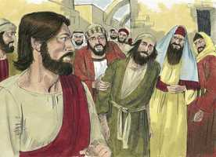

# Lucas Cap 11

**1** 	E ACONTECEU que, estando ele a orar num certo lugar, quando acabou, lhe disse um dos seus discípulos: Senhor, ensina-nos a orar, como também João ensinou aos seus discípulos.

**2** 	E ele lhes disse: Quando orardes, dizei: Pai nosso, que estás nos céus, santificado seja o teu nome; venha o teu reino; seja feita a tua vontade, assim na terra, como no céu.

**3** 	Dá-nos cada dia o nosso pão cotidiano;

**4** 	E perdoa-nos os nossos pecados, pois também nós perdoamos a qualquer que nos deve, e não nos conduzas à tentação, mas livra-nos do mal.

**5** 	Disse-lhes também: Qual de vós terá um amigo, e, se for procurá-lo à meia-noite, e lhe disser: Amigo, empresta-me três pães,

**6** 	Pois que um amigo meu chegou a minha casa, vindo de caminho, e não tenho que apresentar-lhe;

**7** 	Se ele, respondendo de dentro, disser: Não me importunes; já está a porta fechada, e os meus filhos estão comigo na cama; não posso levantar-me para tos dar;

**8** 	Digo-vos que, ainda que não se levante a dar-lhos, por ser seu amigo, levantar-se-á, todavia, por causa da sua importunação, e lhe dará tudo o que houver mister.

**9** 	E eu vos digo a vós: Pedi, e dar-se-vos-á; buscai, e achareis; batei, e abrir-se-vos-á;

 

**10** 	Porque qualquer que pede recebe; e quem busca acha; e a quem bate abrir-se-lhe-á.

**11** 	E qual o pai de entre vós que, se o filho lhe pedir pão, lhe dará uma pedra? Ou, também, se lhe pedir peixe, lhe dará por peixe uma serpente?

**12** 	Ou, também, se lhe pedir um ovo, lhe dará um escorpião?

**13** 	Pois se vós, sendo maus, sabeis dar boas dádivas aos vossos filhos, quanto mais dará o Pai celestial o Espírito Santo àqueles que lho pedirem?

**14** 	E estava ele expulsando um demônio, o qual era mudo. E aconteceu que, saindo o demônio, o mudo falou; e maravilhou-se a multidão.

 

**15** 	Mas alguns deles diziam: Ele expulsa os demônios por Belzebu, príncipe dos demônios.

 

**16** 	E outros, tentando-o, pediam-lhe um sinal do céu.

**17** 	Mas, conhecendo ele os seus pensamentos, disse-lhes: Todo o reino, dividido contra si mesmo, será assolado; e a casa, dividida contra si mesma, cairá.

 

**18** 	E, se também Satanás está dividido contra si mesmo, como subsistirá o seu reino? Pois dizeis que eu expulso os demônios por Belzebu.

**19** 	E, se eu expulso os demônios por Belzebu, por quem os expulsam vossos filhos? Eles, pois, serão os vossos juízes.

**20** 	Mas, se eu expulso os demônios pelo dedo de Deus, certamente a vós é chegado o reino de Deus.

**21** 	Quando o valente guarda, armado, a sua casa, em segurança está tudo quanto tem;

**22** 	Mas, sobrevindo outro mais valente do que ele, e vencendo-o, tira-lhe toda a sua armadura em que confiava, e reparte os seus despojos.

**23** 	Quem não é comigo é contra mim; e quem comigo não ajunta, espalha.

 

**24** 	Quando o espírito imundo tem saído do homem, anda por lugares secos, buscando repouso; e, não o achando, diz: Tornarei para minha casa, de onde saí.

**25** 	E, chegando, acha-a varrida e adornada.

**26** 	Então vai, e leva consigo outros sete espíritos piores do que ele e, entrando, habitam ali; e o último estado desse homem é pior do que o primeiro.

**27** 	E aconteceu que, dizendo ele estas coisas, uma mulher dentre a multidão, levantando a voz, lhe disse: Bem-aventurado o ventre que te trouxe e os peitos em que mamaste.

**28** 	Mas ele disse: Antes bem-aventurados os que ouvem a palavra de Deus e a guardam.

**29** 	E, ajuntando-se a multidão, começou a dizer: Maligna é esta geração; ela pede um sinal; e não lhe será dado outro sinal, senão o sinal do profeta Jonas;

**30** 	Porquanto, assim como Jonas foi sinal para os ninivitas, assim o Filho do homem o será também para esta geração.

**31** 	A rainha do sul se levantará no juízo com os homens desta geração, e os condenará; pois até dos confins da terra veio ouvir a sabedoria de Salomão; e eis aqui está quem é maior do que Salomão.

**32** 	Os homens de Nínive se levantarão no juízo com esta geração, e a condenarão; pois se converteram com a pregação de Jonas; e eis aqui está quem é maior do que Jonas.

**33** 	E ninguém, acendendo uma candeia, a põe em oculto, nem debaixo do alqueire, mas no velador, para que os que entram vejam a luz.

**34** 	A candeia do corpo é o olho. Sendo, pois, o teu olho simples, também todo o teu corpo será luminoso; mas, se for mau, também o teu corpo será tenebroso.

**35** 	Vê, pois, que a luz que em ti há não sejam trevas.

**36** 	Se, pois, todo o teu corpo é luminoso, não tendo em trevas parte alguma, todo será luminoso, como quando a candeia te ilumina com o seu resplendor.

**37** 	E, estando ele ainda falando, rogou-lhe um fariseu que fosse jantar com ele; e, entrando, assentou-se à mesa.

**38** 	Mas o fariseu admirou-se, vendo que não se lavara antes de jantar.

**39** 	E o Senhor lhe disse: Agora vós, os fariseus, limpais o exterior do copo e do prato; mas o vosso interior está cheio de rapina e maldade.

**40** 	Loucos! Quem fez o exterior não fez também o interior?

**41** 	Antes dai esmola do que tiverdes, e eis que tudo vos será limpo.

**42** 	Mas ai de vós, fariseus, que dizimais a hortelã, e a arruda, e toda a hortaliça, e desprezais o juízo e o amor de Deus. Importava fazer estas coisas, e não deixar as outras.

**43** 	Ai de vós, fariseus, que amais os primeiros assentos nas sinagogas, e as saudações nas praças.

**44** 	Ai de vós, escribas e fariseus, hipócritas! que sois como as sepulturas que não aparecem, e os homens que sobre elas andam não o sabem.

**45** 	E, respondendo um dos doutores da lei, disse-lhe: Mestre, quando dizes isso, também nos afrontas a nós.

**46** 	E ele lhe disse: Ai de vós também, doutores da lei, que carregais os homens com cargas difíceis de transportar, e vós mesmos nem ainda com um dos vossos dedos tocais essas cargas.

**47** 	Ai de vós que edificais os sepulcros dos profetas, e vossos pais os mataram.

**48** 	Bem testificais, pois, que consentis nas obras de vossos pais; porque eles os mataram, e vós edificais os seus sepulcros.

**49** 	Por isso diz também a sabedoria de Deus: Profetas e apóstolos lhes mandarei; e eles matarão uns, e perseguirão outros;

**50** 	Para que desta geração seja requerido o sangue de todos os profetas que, desde a fundação do mundo, foi derramado;

**51** 	Desde o sangue de Abel, até ao sangue de Zacarias, que foi morto entre o altar e o templo; assim, vos digo, será requerido desta geração.

**52** 	Ai de vós, doutores da lei, que tirastes a chave da ciência; vós mesmos não entrastes, e impedistes os que entravam.

**53** 	E, dizendo-lhes ele isto, começaram os escribas e os fariseus a apertá-lo fortemente, e a fazê-lo falar acerca de muitas coisas,

**54** 	Armando-lhe ciladas, e procurando apanhar da sua boca alguma coisa para o acusarem.

> **Cmt MHenry** Intro: Todos devemos olhar em nossos corações, para que sejam purificados e criados de novo; enquanto atentamos às grandes coisas da lei e do Evangelho, não devemos descuidar as coisas pequenas indicadas por Deus. Quando alguém espreita para caçar-nos em algo que dizemos, oh, Senhor, dá-nos tua prudência e tua paciência, e desbarata seus maus propósitos. Prove-nos de tal mansidão e paciência que possamos gloriar-nos nas repreensões, por amor a Cristo, e que seu Espírito Santo repouse sobre nós.> Cristo promete dar mais um sinal, o sinal do profeta Jonas; explica-se em Mateus que significa a ressurreição de Cristo; e foi-lhes advertido que deviam obter proveito de tal sinal. Mas ainda que o mesmo Cristo fosse o pregador estável de uma congregação qualquer, e operasse milagres diariamente entre eles, ainda assim, a menos que sua graça humilhe os corações, eles não se beneficiariam de sua palavra. Não desejemos mais provas nem um ensino mais completo que o que apraz ao Senhor permitir-nos. Devemos orar sem cessar que nossos corações e entendimentos sejam abertos, que possamos aproveitar a luz de que desfrutamos. Cuidemo-nos de que a luz que está em nós não sejam trevas, porque se nossos princípios diretrizes sal ruins, nosso juízo e conduta serão maus.> Ao tempo que os escribas e os fariseus desprezavam e blasfemavam dos discursos de nosso Senhor Jesus, esta boa mulher os admirava, assim como a sabedoria e o poder com que falava. Cristo conduziu à mulher a uma consideração mais elevada. Embora seja um grande privilégio ouvir a palavra de Deus, somente são abençoados de verdade os benditos do Senhor, que a ouvem, a mantêm em sua memória e a obedecem como seu caminho e lei.> A expulsão de demônios que fez Cristo foi realmente a destruição do poder deles. O coração de todo pecador inconverso é o palácio do diabo, onde este habita e onde manda. Há uma espécie de paz do coração da alma inconversa que o diabo custodia como homem forte armado. O pecador sente-se seguro, não tem dúvidas da bondade de seu estado, nem temor nenhum dos juízos vindouros. Contudo, observe-se a mudança maravilhosa efetuada na conversão. A conversão da alma a Deus é a vitória de Cristo sobre o diabo e seu poder nessa alma, restaurando a alma a sua liberdade e recuperando seu interesse nela e seu poder sobre ela. Todos os dons do corpo e da mente são agora empregados para Cristo. Esta é a condição do hipócrita. A casa é varrida dos pecados corriqueiros por uma confissão forçada, como a de Faraó; por uma condição fingida como a de Acabe; ou por uma reforma parcial como a de Herodes. A casa está varrida, mas não lavada; o coração não está santificado. O varrido tira somente o pó solto, enquanto o pecado que acossa o pecador está incólume. A casa está enfeitada com graças e dons comuns. Não está provida de nenhuma graça verdadeira; todo é tinta e verniz, nada duradouro nem real. Nunca foi entregue a Cristo nem habitada pelo Espírito. Cuidemo-nos de não descansar no que possa ter um homem e assim ficar sem alcançar o céu. Os espíritos malignos entram sem dificuldade; são recebidos e morar ali; ali labutam, ali mandam. Peçamos todos com fervor sermos livrados de tão horrendo estado.> Cristo alenta o fervor e a constância na oração. Devemos ir pelo que necessitamos, como faz o homem que açude a seu vizinho ou amigo, que é bem com ele. vamos por pão; porque é o necessário. Se Deus não responde rapidamente as nossas orações, o fará a seu devido tempo, se continuamos orando. Vejam acerca de que orar: devemos pedir o Espírito Santo, não só por necessário para orar bem, senão porque todas as bênçãos espirituais estão incluídas nisso. Porque pelo poder do Espírito Santo se nos conduz a Deus e ao arrependimento, a crer em Cristo e a amá-lo; assim somos consolados neste mundo, e destinados para a felicidade no próximo. Nosso Pai celestial está pronto para outorgar todas estas bênçãos a cada um que as peça, mais que um pai ou mãe terreno está disposto a dar comida a um menino faminto. Esta é a vantagem da oração de fé: que acalma e fixa o coração em Deus.> " "Senhor, ensina-nos a orar", é uma boa oração, e muito necessária, porque Jesus Cristo é o único que pode ensinar-nos a orar por sua palavra e seu Espírito. Senhor, ensina-me a orar; Senhor, estimula-me e vivifica-me para o dever; Senhor, dirige-me sobre que orar; ensina-me que devo dizer. Cristo lhes ensinou uma oração, em forma muito parecida à que tinha dado antes em seu sermão da montanha. Há algumas palavras que diferem entre o Pai Nosso de Mateus e o de Lucas, porém não são de grande importância. Em nossos pedidos pelo próximo e por nós mesmos, vamos a nosso Pai celestial, confiando em seu poder e bondade. "