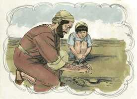
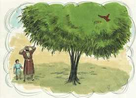

# Lucas Cap 13

**1** 	E, NAQUELE mesmo tempo, estavam presentes ali alguns que lhe falavam dos galileus, cujo sangue Pilatos misturara com os seus sacrifícios.

**2** 	E, respondendo Jesus, disse-lhes: Cuidais vós que esses galileus foram mais pecadores do que todos os galileus, por terem padecido tais coisas?

**3** 	Não, vos digo; antes, se não vos arrependerdes, todos de igual modo perecereis.

**4** 	E aqueles dezoito, sobre os quais caiu a torre de Siloé e os matou, cuidais que foram mais culpados do que todos quantos homens habitam em Jerusalém?

**5** 	Não, vos digo; antes, se não vos arrependerdes, todos de igual modo perecereis.

**6** 	E dizia esta parábola: Um certo homem tinha uma figueira plantada na sua vinha, e foi procurar nela fruto, não o achando;

**7** 	E disse ao vinhateiro: Eis que há três anos venho procurar fruto nesta figueira, e não o acho. Corta-a; por que ocupa ainda a terra inutilmente?

**8** 	E, respondendo ele, disse-lhe: Senhor, deixa-a este ano, até que eu a escave e a esterque;

**9** 	E, se der fruto, ficará e, se não, depois a mandarás cortar.

**10** 	E ensinava no sábado, numa das sinagogas.

**11** 	E eis que estava ali uma mulher que tinha um espírito de enfermidade, havia já dezoito anos; e andava curvada, e não podia de modo algum endireitar-se.

**12** 	E, vendo-a Jesus, chamou-a a si, e disse-lhe: Mulher, estás livre da tua enfermidade.

**13** 	E pôs as mãos sobre ela, e logo se endireitou, e glorificava a Deus.

**14** 	E, tomando a palavra o príncipe da sinagoga, indignado porque Jesus curava no sábado, disse à multidão: Seis dias há em que é mister trabalhar; nestes, pois, vinde para serdes curados, e não no dia de sábado.

**15** 	Respondeu-lhe, porém, o Senhor, e disse: Hipócrita, no sábado não desprende da manjedoura cada um de vós o seu boi, ou jumento, e não o leva a beber?

**16** 	E não convinha soltar desta prisão, no dia de sábado, esta filha de Abraão, a qual há dezoito anos Satanás tinha presa?

**17** 	E, dizendo ele isto, todos os seus adversários ficaram envergonhados, e todo o povo se alegrava por todas as coisas gloriosas que eram feitas por ele.

**18** 	E dizia: A que é semelhante o reino de Deus, e a que o compararei?

 

**19** 	É semelhante ao grão de mostarda que um homem, tomando-o, lançou na sua horta; e cresceu, e fez-se grande árvore, e em seus ramos se aninharam as aves do céu.

 

**20** 	E disse outra vez: A que compararei o reino de Deus?

**21** 	É semelhante ao fermento que uma mulher, tomando-o, escondeu em três medidas de farinha, até que tudo levedou.

**22** 	E percorria as cidades e as aldeias, ensinando, e caminhando para Jerusalém.

**23** 	E disse-lhe um: Senhor, são poucos os que se salvam? E ele lhe respondeu:

**24** 	Porfiai por entrar pela porta estreita; porque eu vos digo que muitos procurarão entrar, e não poderão.

**25** 	Quando o pai de família se levantar e cerrar a porta, e começardes, de fora, a bater à porta, dizendo: Senhor, Senhor, abre-nos; e, respondendo ele, vos disser: Não sei de onde vós sois;

**26** 	Então começareis a dizer: Temos comido e bebido na tua presença, e tu tens ensinado nas nossas ruas.

**27** 	E ele vos responderá: Digo-vos que não vos conheço nem sei de onde vós sois; apartai-vos de mim, vós todos os que praticais a iniqüidade.

**28** 	Ali haverá choro e ranger de dentes, quando virdes Abraão, e Isaque, e Jacó, e todos os profetas no reino de Deus, e vós lançados fora.

**29** 	E virão do oriente, e do ocidente, e do norte, e do sul, e assentar-se-ão à mesa no reino de Deus.

**30** 	E eis que derradeiros há que serão os primeiros; e primeiros há que serão os derradeiros.

**31** 	Naquele mesmo dia chegaram uns fariseus, dizendo-lhe: Sai, e retira-te daqui, porque Herodes quer matar-te.

**32** 	E respondeu-lhes: Ide, e dizei àquela raposa: Eis que eu expulso demônios, e efetuo curas, hoje e amanhã, e no terceiro dia sou consumado.

**33** 	Importa, porém, caminhar hoje, amanhã, e no dia seguinte, para que não suceda que morra um profeta fora de Jerusalém.

**34** 	Jerusalém, Jerusalém, que matas os profetas, e apedrejas os que te são enviados! Quantas vezes quis eu ajuntar os teus filhos, como a galinha os seus pintos debaixo das asas, e não quiseste?

**35** 	Eis que a vossa casa se vos deixará deserta. E em verdade vos digo que não me vereis até que venha o tempo em que digais: Bendito aquele que vem em nome do Senhor.

> **Cmt MHenry** Intro: " Cristo, ao tratar de raposa a Herodes, deu-lhe seu caráter verdadeiro. Os maiores homens eram responsáveis de render contas a Deus, portanto, lhes correspondia chamar a este rei orgulhoso por seu nome próprio, mas não é exemplo para nós. "Sei", disse nosso Senhor, "que eu devo morrer daqui a pouco; quando morrer, serei aperfeiçoado, terei completado minha tarefa". Bom é olharmos o tempo que tempo diante de nós como muito curto, para que isso nos estimule para realizar a obra do dia em seu dia. A maldade das pessoas e dos lugares que mais que outros professam a religião e relação com Deus, desagrada e entristece especialmente o Senhor Jesus. o juízo do grande dia convencerá os incrédulos, mas aprendamos com agradecimento a acolher bem, e beneficiar-nos, de todos os que vêm em nome do Senhor a chamar-nos para participar de sua grande salvação. "> " Nosso Salvador veio guiar a consciência dos homens, não a satisfazer sua curiosidade. Não perguntes "Quantos serão salvos?" senão "Serei salvo?". Não perguntes "Que será de tal e tal pessoa?", senão "Que farei eu e que será de mim?". Esforça-te por entrar pela porta estreita. Isto se manda a cada um de nós: Esforça-te. Todo o que será salvo deve entrar pela porta estreita, deve empreender uma mudança de todo o homem. Os que entrem por ela, devem esforçar-se por entrar. Eis aqui considerações vivificadoras para reforçar esta exortação. Oh, sejamos todos despertados por elas! Eles respondem a pergunta, são poucos os que se salvam? Mas que ninguém despreze a si mesmo ou aos outros, pois há últimos que serão primeiros, e primeiros que serão últimos. Se chegarmos ao céu, encontraremos a muitos lá aos que não pensamos encontrar, e estranharemos de não ver a muitos que esperávamos achar. "> Aqui temos o progresso do evangelho anunciado em duas parábolas, como em [Mateus 13](../40N-Mt/13.md#0). o reino do Messias é o Reino de Deus. que a graça cresça em nossos corações; que nossa fé e amor cresçam abundantemente para dar prova indubitável de sua realidade. Que o exemplo dos santos de Deus seja de bênção entre os que vivem; e que sua graça flua de coração a coração, até que o pequeno se torne milhares.> Nosso Senhor Jesus assistia ao serviço público de adoração os dias de repouso. Ainda as doenças corporais, a menos que sejam muito graves, não devem impedir-nos ir ao serviço público de adoração os dias de repouso. Esta mulher veio para ser ensinada por Cristo e para receber bem para sua alma, e então Ele aliviou sua doença corporal. Quando as almas tortas se endireitam, o demonstram glorificando a Deus. Cristo sabia que este príncipe tinha uma verdadeira inimizade contra Ele e seu Evangelho, e que somente o ocultava com um zelo fingido pelo dia do repouso; realmente ele não desejava que fossem sarados em nenhum dia; mas se Jesus diz a palavra, e dá seu poder curador, os pecadores são deixados em liberdade. Esta liberação costuma operar-se no dia do Senhor, e qualquer seja a tarefa que se coloque aos homens no caminho da bênção, concorda com o objeto desse dia.> A parábola da figueira estéril tem o propósito de reforçar a advertência recém dada: a figueira estéril, a menos que dê fruto, será cortada. Esta parábola se refere, em primeiro lugar, à nação e ao povo judeu. Porém, sem dúvida, é para despertar a todos os que desfrutam dos meios de graça, e aos privilegiados da igreja visível. Quando Deus tenha suportado por muito tempo, podemos esperar que nos tolere mais um pouco, mas não podemos ter a esperança de que sempre suportará.> Falam a Cristo da morte de uns galileus. Esta trágica história se relata brevemente aqui e não a mencionam os historiadores. Ao responder, Cristo fala de outro fato que era como este, outro caso de gente afetada por uma morte repentina. As torres, que se constroem para segurança, costumam ser a destruição dos homens. os adverte que não culpem os grandes sofredores como se tivessem sido grandes pecadores. Como nenhum posto nem emprego pode assegurar-nos em contra do golpe da morte, devemos considerar as partidas súbitas dos outros como advertência para nós. Nestes relatos, Cristo fundamento um chamado ao arrependimento. O próprio Jesus que nos pede arrependimento, porque o Reino dos Céus está à porta, nos pede para que nos arrependamos, pois do contrário pereceremos.