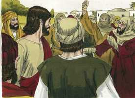
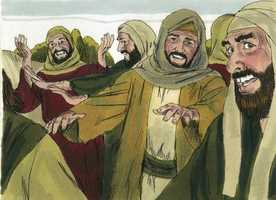
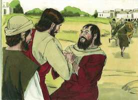
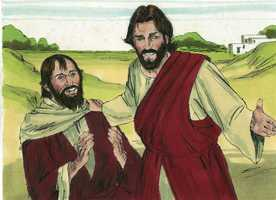

# Lucas Cap 17

**1** 	E DISSE aos discípulos: É impossível que não venham escândalos, mas ai daquele por quem vierem!

**2** 	Melhor lhe fora que lhe pusessem ao pescoço uma mó de atafona, e fosse lançado ao mar, do que fazer tropeçar um destes pequenos.

**3** 	Olhai por vós mesmos. E, se teu irmão pecar contra ti, repreende-o e, se ele se arrepender, perdoa-lhe.

**4** 	E, se pecar contra ti sete vezes no dia, e sete vezes no dia vier ter contigo, dizendo: Arrependo-me; perdoa-lhe.

**5** 	Disseram então os apóstolos ao Senhor: Acrescenta-nos a fé.

**6** 	E disse o Senhor: Se tivésseis fé como um grão de mostarda, diríeis a esta amoreira: Desarraiga-te daqui, e planta-te no mar; e ela vos obedeceria.

**7** 	E qual de vós terá um servo a lavrar ou a apascentar gado, a quem, voltando ele do campo, diga: Chega-te, e assenta-te à mesa?

**8** 	E não lhe diga antes: Prepara-me a ceia, e cinge-te, e serve-me até que tenha comido e bebido, e depois comerás e beberás tu?

**9** 	Porventura dá graças ao tal servo, porque fez o que lhe foi mandado? Creio que não.

**10** 	Assim também vós, quando fizerdes tudo o que vos for mandado, dizei: Somos servos inúteis, porque fizemos somente o que devíamos fazer.

**11** 	E aconteceu que, indo ele a Jerusalém, passou pelo meio de Samaria e da Galiléia;

**12** 	E, entrando numa certa aldeia, saíram-lhe ao encontro dez homens leprosos, os quais pararam de longe;

 

**13** 	E levantaram a voz, dizendo: Jesus, Mestre, tem misericórdia de nós.

**14** 	E ele, vendo-os, disse-lhes: Ide, e mostrai-vos aos sacerdotes. E aconteceu que, indo eles, ficaram limpos.

 

**15** 	E um deles, vendo que estava são, voltou glorificando a Deus em alta voz;

**16** 	E caiu aos seus pés, com o rosto em terra, dando-lhe graças; e este era samaritano.

 

**17** 	E, respondendo Jesus, disse: Não foram dez os limpos? E onde estão os nove?

 

**18** 	Não houve quem voltasse para dar glória a Deus senão este estrangeiro?

**19** 	E disse-lhe: Levanta-te, e vai; a tua fé te salvou.

 

**20** 	E, interrogado pelos fariseus sobre quando havia de vir o reino de Deus, respondeu-lhes, e disse: O reino de Deus não vem com aparência exterior.

**21** 	Nem dirão: Ei-lo aqui, ou: Ei-lo ali; porque eis que o reino de Deus está entre vós.

**22** 	E disse aos discípulos: Dias virão em que desejareis ver um dos dias do Filho do homem, e não o vereis.

**23** 	E dir-vos-ão: Ei-lo aqui, ou: Ei-lo ali. Não vades, nem os sigais;

**24** 	Porque, como o relâmpago ilumina desde uma extremidade inferior do céu até à outra extremidade, assim será também o Filho do homem no seu dia.

**25** 	Mas primeiro convém que ele padeça muito, e seja reprovado por esta geração.

**26** 	E, como aconteceu nos dias de Noé, assim será também nos dias do Filho do homem.

**27** 	Comiam, bebiam, casavam, e davam-se em casamento, até ao dia em que Noé entrou na arca, e veio o dilúvio, e os consumiu a todos.

**28** 	Como também da mesma maneira aconteceu nos dias de Ló: Comiam, bebiam, compravam, vendiam, plantavam e edificavam;

**29** 	Mas no dia em que Ló saiu de Sodoma choveu do céu fogo e enxofre, e os consumiu a todos.

**30** 	Assim será no dia em que o Filho do homem se há de manifestar.

**31** 	Naquele dia, quem estiver no telhado, tendo as suas alfaias em casa, não desça a tomá-las; e, da mesma sorte, o que estiver no campo não volte para trás.

**32** 	Lembrai-vos da mulher de Ló.

**33** 	Qualquer que procurar salvar a sua vida, perdê-la-á, e qualquer que a perder, salvá-la-á.

**34** 	Digo-vos que naquela noite estarão dois numa cama; um será tomado, e outro será deixado.

**35** 	Duas estarão juntas, moendo; uma será tomada, e outra será deixada.

**36** 	Dois estarão no campo; um será tomado, e o outro será deixado.

**37** 	E, respondendo, disseram-lhe: Onde, Senhor? E ele lhes disse: Onde estiver o corpo, aí se ajuntarão as águias.

> **Cmt MHenry** Intro: O Reino de Deus estava entre os judeus ou, melhor, em alguns. Era um reino espiritual, estabelecido no com pelo poder da graça divina. Atentem como tinha sido anteriormente com os pecadores, e em que estado os acharam os juízos de Deus, dos quais tinham sido advertidos. Aqui se mostra que surpresa temível será esta destruição para o seguro e o sensual. Assim será no dia em que se revele o Filho do Homem. Quando Cristo veio a destruir a nação judaica por meio dos exércitos romanos, essa nação foi achada em tal estado de falsa segurança como o aqui mencionado. De forma similar, quando Jesus Cristo veia julgar o mundo, os pecadores serão achados totalmente descuidados, pois, de forma semelhante, os pecadores de toda época vão com certeza por seus maus caminhos, sem lembrar seu final último. Onde quer que estejam os ímpios, marcados para a ruína eterna, serão alcançados pelos juízos de Deus.> A consciência de ser leprosos espirituais deveria fazer-nos mais humildes cada vez que nos aproximamos de Cristo. basta que nos submetamos à compaixão de Cristo, pois não falham. Podemos esperar que Deus nos satisfaça com misericórdia quando sejamos achados no caminho da obediência. Somente um dos curados voltou para agradecer. Nos corresponde, como a ele, ser muito humildes nas ações de graças e nas orações. Cristo destacou ao que assim se distinguiu: era um samaritano. Os outros obtiveram a cura externa, mas somente este teve a bênção espiritual.> Não há desculpa para os que cometem uma ofensa, nem diminuirá o castigo o fato de que deve haver ofensas. A fé na misericórdia de Deus que perdoa nos capacitará para superar as dificuldades maiores que haja para perdoar a nossos irmãos. Como para Deus nada é impossível, assim todas as coisas são possíveis para o que pode crer. Nosso Senhor mostrou a seus discípulos a necessidade de ter uma profunda humildade. O Senhor tem direito sobre toda criatura como nenhum homem pode tê-lo sobre outro; Ele não pode estar endividado com eles por seus serviços, nem eles merecem nenhuma recompensa sua.