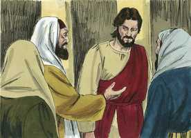
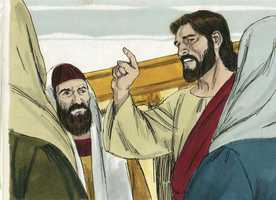
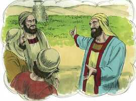
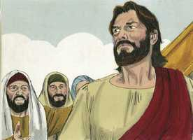
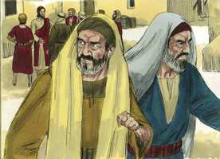

# Lucas Cap 20

**1** 	E ACONTECEU num daqueles dias que, estando ele ensinando o povo no templo, e anunciando o evangelho, sobrevieram os principais dos sacerdotes e os escribas com os anciãos,

**2** 	E falaram-lhe, dizendo: Dize-nos, com que autoridade fazes estas coisas? Ou, quem é que te deu esta autoridade?

 

**3** 	E, respondendo ele, disse-lhes: Também eu vos farei uma pergunta: Dizei-me pois:

 

**4** 	O batismo de João era do céu ou dos homens?

**5** 	E eles arrazoavam entre si, dizendo: Se dissermos: Do céu, ele nos dirá: Então por que o não crestes?

 

**6** 	E se dissermos: Dos homens; todo o povo nos apedrejará, pois têm por certo que João era profeta.

**7** 	E responderam que não sabiam de onde era.

**8** 	E Jesus lhes disse: Tampouco vos direi com que autoridade faço isto.

 

**9** 	E começou a dizer ao povo esta parábola: Certo homem plantou uma vinha, e arrendou-a a uns lavradores, e partiu para fora da terra por muito tempo;

 

**10** 	E no tempo próprio mandou um servo aos lavradores, para que lhe dessem dos frutos da vinha; mas os lavradores, espancando-o, mandaram-no vazio.

 

**11** 	E tornou ainda a mandar outro servo; mas eles, espancando também a este, e afrontando-o, mandaram-no vazio.

 

**12** 	E tornou ainda a mandar um terceiro; mas eles, ferindo também a este, o expulsaram.

**13** 	E disse o senhor da vinha: Que farei? Mandarei o meu filho amado; talvez, vendo-o, seja respeitado.

 

**14** 	Mas, vendo-o os lavradores, arrazoaram entre si, dizendo: Este é o herdeiro; vinde, matemo-lo, para que a herança seja nossa.

**15** 	E, lançando-o fora da vinha, o mataram. Que lhes fará, pois, o senhor da vinha?

 

**16** 	Irá, e destruirá estes lavradores, e dará a outros a vinha. E, ouvindo eles isto, disseram: Não seja assim!

**17** 	Mas ele, olhando para eles, disse: Que é isto, pois, que está escrito? A pedra, que os edificadores reprovaram, Essa foi feita cabeça da esquina.

 

**18** 	Qualquer que cair sobre aquela pedra ficará em pedaços, e aquele sobre quem ela cair será feito em pó.

**19** 	E os principais dos sacerdotes e os escribas procuravam lançar mão dele naquela mesma hora; mas temeram o povo; porque entenderam que contra eles dissera esta parábola.

**20** 	E, observando-o, mandaram espias, que se fingissem justos, para o apanharem nalguma palavra, e o entregarem à jurisdição e poder do presidente.

 

**21** 	E perguntaram-lhe, dizendo: Mestre, nós sabemos que falas e ensinas bem e retamente, e que não consideras a aparência da pessoa, mas ensinas com verdade o caminho de Deus.

 

**22** 	É-nos lícito dar tributo a César ou não?

 

**23** 	E, entendendo ele a sua astúcia, disse-lhes: Por que me tentais?

 

**24** 	Mostrai-me uma moeda. De quem tem a imagem e a inscrição? E, respondendo eles, disseram: De César.

 

**25** 	Disse-lhes então: Dai, pois, a César o que é de César, e a Deus o que é de Deus.

 

**26** 	E não puderam apanhá-lo em palavra alguma diante do povo; e, maravilhados da sua resposta, calaram-se.

 

**27** 	E, chegando-se alguns dos saduceus, que dizem não haver ressurreição, perguntaram-lhe,

**28** 	Dizendo: Mestre, Moisés nos deixou escrito que, se o irmão de algum falecer, tendo mulher, e não deixar filhos, o irmão dele tome a mulher, e suscite posteridade a seu irmão.

**29** 	Houve, pois, sete irmãos, e o primeiro tomou mulher, e morreu sem filhos;

**30** 	E tomou-a o segundo por mulher, e ele morreu sem filhos.

**31** 	E tomou-a o terceiro, e igualmente também os sete; e morreram, e não deixaram filhos.

**32** 	E por último, depois de todos, morreu também a mulher.

**33** 	Portanto, na ressurreição, de qual deles será a mulher, pois que os sete por mulher a tiveram?

**34** 	E, respondendo Jesus, disse-lhes: Os filhos deste mundo casam-se, e dão-se em casamento;

**35** 	Mas os que forem havidos por dignos de alcançar o mundo vindouro, e a ressurreição dentre os mortos, nem hão de casar, nem ser dados em casamento;

**36** 	Porque já não podem mais morrer; pois são iguais aos anjos, e são filhos de Deus, sendo filhos da ressurreição.

**37** 	E que os mortos hão de ressuscitar também o mostrou Moisés junto da sarça, quando chama ao Senhor Deus de Abraão, e Deus de Isaque, e Deus de Jacó.

**38** 	Ora, Deus não é Deus de mortos, mas de vivos; porque para ele vivem todos.

**39** 	E, respondendo alguns dos escribas, disseram: Mestre, disseste bem.

**40** 	E não ousavam perguntar-lhe mais coisa alguma.

 

**41** 	E ele lhes disse: Como dizem que o Cristo é filho de Davi?

**42** 	Visto como o mesmo Davi diz no livro dos Salmos: Disse o SENHOR ao meu Senhor: Assenta-te à minha direita,

**43** 	Até que eu ponha os teus inimigos por escabelo de teus pés.

**44** 	Se Davi lhe chama Senhor, como é ele seu filho?

**45** 	E, ouvindo-o todo o povo, disse Jesus aos seus discípulos:

**46** 	Guardai-vos dos escribas, que querem andar com vestes compridas; e amam as saudações nas praças, e as principais cadeiras nas sinagogas, e os primeiros lugares nos banquetes;

**47** 	Que devoram as casas das viúvas, fazendo, por pretexto, longas orações. Estes receberão maior condenação.

> **Cmt MHenry** Intro: Os escribas elogiaram a resposta de Cristo aos saduceus sobre a ressurreição, porém foram silenciados por uma pergunta sobre o Messias. Cristo, como Deus, era o Senhor de Davi, mas Cristo, como homem, era Filho de Davi. Os escribas receberam o juízo mais severo por enganar as viúvas pobres e por abusar da religião, em particular da oração, que usavam como pretexto para executar planos ímpios e mundanos. A piedade fingida é duplo pecado. então, roguemos a Deus que nos impeça o orgulho, a ambição, a cobiça e toda coisa má; e que nos ensine a buscar essa honra que somente vem dEle.> É comum que os que concebem a sabotagem da verdade de Deus, a carreguem com dificuldades. Erramos e danificamos a verdade de Cristo quando formamos nossas idéias do mundo dos espíritos pelo mundo dos sentidos. Existem mais mundos que o mundo visível atual e o mundo invisível futuro; que todos comparem este mundo e esse mundo e dêem preferência, em seus pensamentos e interesses, ao que os mereça. Os crentes terão a ressurreição dos mortos; essa é a ressurreição bendita. Não podemos expressar nem conceber qual será o estado afortunado dos habitantes desse mundo ([1 Co 2.9](../46N-1Co/02.md#9)). Os que entram no gozo de seu Senhor, estão totalmente entusiasmados com isso; quando seja perfeita a santidade, não haverá ocasião para as previsões contra o pecado. quando Deus se diz Deus dos patriarcas, quer dizer que foi o Deus absolutamente suficiente para eles ([Gn 17.1](../01A-Gn/17.md#1)); o excelente galardão deles ([Gn 15.1](../01A-Gn/15.md#1)). Ele nunca fez isso por eles neste mundo, o qual respondia à plena magnitude de seu esforço; portanto, deve haver outra vida na que Ele fará isso por eles, que cumprirá completamente a promessa.> Os que são muito espertos em seus desígnios contra Cristo e seu Evangelho não podem ocultá-lo. não deu resposta direta, porém os repreendeu por oferecer impor-se por acima dEle; e não puderam achar nada com que incitar o governador ou o povo em sua contra. A sabedoria que é do alto dirigirá a todos os que ensinam verdadeiramente o caminho de Deus, para que evitem as armadilhas tendidas contra eles pelos homens ímpios; e ensinarão nosso dever para com Deus aos nossos governantes e a todos os homens, tão claramente que os opositores não terão nada de mal a dizer de nós.> Cristo disse esta parábola contra os que resolveram não reconhecer sua autoridade, apesar de ser tão completa a prova dela. Quantos se parecem com os judeus que assassinaram os profetas e crucificaram a Cristo, em sua inimizade contra Deus e a aversão a seu serviço, porque desejam viver descontroladamente em conformidade com suas concupiscências! Que todos os favorecidos com a palavra de Deus a olhem para usar proveitosamente suas vantagens. Espantosa será a condena dos que rejeitam o Filho e dos que professam reverenciá-lo, mas não dão os frutos a seu devido tempo. Apesar de que não podiam senão reconhecer tal pecado, o castigo era justo, porém eles não puderam suportar ouvi-lo. A torpeza dos pecadores é que perseveram nos caminhos pecaminosos ainda que temam a destruição no final desses caminhos.> Repetidas vezes, os homens pretendem examinar as provas da revelação e da verdade do evangelho, quando somente andam buscando escusas para sua própria incredulidade e desobediência. Cristo responde a estes sacerdotes e escribas com uma simples pergunta sobre o batismo de João, que a gente comum podia responder. Todos sabiam que era do céu, nada nele tinha alguma tendência terrena. Aos que enterram o conhecimento que têm, lhes é negado com justiça um conhecimento superior. Foi justo que Cristo recusasse dar contas de sua autoridade aos que sabiam que o batismo de João era do céu, mas não criam nele nem reconheciam o que sabiam.