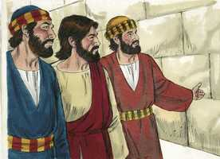

# Lucas Cap 21

**1** 	E, OLHANDO ele, viu os ricos lançarem as suas ofertas na arca do tesouro;

  

**2** 	E viu também uma pobre viúva lançar ali duas pequenas moedas;

 

**3** 	E disse: Em verdade vos digo que lançou mais do que todos, esta pobre viúva;

  

**4** 	Porque todos aqueles deitaram para as ofertas de Deus do que lhes sobeja; mas esta, da sua pobreza, deitou todo o sustento que tinha.

**5** 	E, dizendo alguns a respeito do templo, que estava ornado de formosas pedras e dádivas, disse:

 

**6** 	Quanto a estas coisas que vedes, dias virão em que não se deixará pedra sobre pedra, que não seja derrubada.

 

**7** 	E perguntaram-lhe, dizendo: Mestre, quando serão, pois, estas coisas? E que sinal haverá quando isto estiver para acontecer?

 

**8** 	Disse então ele: Vede não vos enganem, porque virão muitos em meu nome, dizendo: Sou eu, e o tempo está próximo. Não vades, portanto, após eles.

 

**9** 	E, quando ouvirdes de guerras e sedições, não vos assusteis. Porque é necessário que isto aconteça primeiro, mas o fim não será logo.

**10** 	Então lhes disse: Levantar-se-á nação contra nação, e reino contra reino;

 

**11** 	E haverá em vários lugares grandes terremotos, e fomes e pestilências; haverá também coisas espantosas, e grandes sinais do céu.

**12** 	Mas antes de todas estas coisas lançarão mão de vós, e vos perseguirão, entregando-vos às sinagogas e às prisões, e conduzindo-vos à presença de reis e presidentes, por amor do meu nome.

**13** 	E vos acontecerá isto para testemunho.

**14** 	Proponde, pois, em vossos corações não premeditar como haveis de responder;

**15** 	Porque eu vos darei boca e sabedoria a que não poderão resistir nem contradizer todos quantos se vos opuserem.

**16** 	E até pelos pais, e irmãos, e parentes, e amigos sereis entregues; e matarão alguns de vós.

**17** 	E de todos sereis odiados por causa do meu nome.

**18** 	Mas não perecerá um único cabelo da vossa cabeça.

**19** 	Na vossa paciência possuí as vossas almas.

**20** 	Mas, quando virdes Jerusalém cercada de exércitos, sabei então que é chegada a sua desolação.

**21** 	Então, os que estiverem na Judéia, fujam para os montes; os que estiverem no meio da cidade, saiam; e os que nos campos não entrem nela.

**22** 	Porque dias de vingança são estes, para que se cumpram todas as coisas que estão escritas.

**23** 	Mas ai das grávidas, e das que criarem naqueles dias! porque haverá grande aperto na terra, e ira sobre este povo.

**24** 	E cairão ao fio da espada, e para todas as nações serão levados cativos; e Jerusalém será pisada pelos gentios, até que os tempos dos gentios se completem.

**25** 	E haverá sinais no sol e na lua e nas estrelas; e na terra angústia das nações, em perplexidade pelo bramido do mar e das ondas.

**26** 	Homens desmaiando de terror, na expectação das coisas que sobrevirão ao mundo; porquanto as virtudes do céu serão abaladas.

**27** 	E então verão vir o Filho do homem numa nuvem, com poder e grande glória.

**28** 	Ora, quando estas coisas começarem a acontecer, olhai para cima e levantai as vossas cabeças, porque a vossa redenção está próxima.

**29** 	E disse-lhes uma parábola: Olhai para a figueira, e para todas as árvores;

**30** 	Quando já têm rebentado, vós sabeis por vós mesmos, vendo-as, que perto está já o verão.

**31** 	Assim também vós, quando virdes acontecer estas coisas, sabei que o reino de Deus está perto.

**32** 	Em verdade vos digo que não passará esta geração até que tudo aconteça.

**33** 	Passará o céu e a terra, mas as minhas palavras não hão de passar.

**34** 	E olhai por vós, não aconteça que os vossos corações se carreguem de glutonaria, de embriaguez, e dos cuidados da vida, e venha sobre vós de improviso aquele dia.

**35** 	Porque virá como um laço sobre todos os que habitam na face de toda a terra.

**36** 	Vigiai, pois, em todo o tempo, orando, para que sejais havidos por dignos de evitar todas estas coisas que hão de acontecer, e de estar em pé diante do Filho do homem.

 

**37** 	E de dia ensinava no templo, e à noite, saindo, ficava no monte chamado das Oliveiras.

**38** 	E todo o povo ia ter com ele ao templo, de manhã cedo, para o ouvir.

> **Cmt MHenry** Intro: Cristo diz a seus discípulos que observem os sinais dos tempos para que julguem por eles. Os encarrega para que considerem próxima a ruína da nação judaica. Contudo, esta raça e família de Abraão não será desarraigada; sobreviverá como nação e será achada segundo foi profetizado, quando seja revelado o Filho do Homem. Os adverte contra estar confiados em sua sensualidade. Este mandamento é dado a todos os discípulos de Cristo. cuidem-se de não ser abrumados pelas tentações nem traídos por suas próprias corrupções. Não podemos estar a salvo se estamos carnalmente seguros. Nosso perigo é que nos sobrevenha o dia da morte e o juízo quando não estejamos preparados. Não seja que quando sejamos chamados a encontrar-nos com nosso Senhor, o que deveria estar mais perto de nossos corações seja o que está mais longe de nossos pensamentos. Pois assim será para a maioria dos homens que habitam a terra e que unicamente pensam nas coisas terrenas e não têm comunicação com o céu. Será terror e destruição para eles. Veja-se aqui a que deveria ser nossa mira para sermos tidos por dignos de escapar de todas essas coisas; para que quando os juízos de Deus estejam por todas partes, nós não estejamos na calamidade comum, ou que não seja para nós o que é para os outros. Você se pergunta como pode ser achado digno de comparecer ante Cristo naquele dia? Os que nunca têm buscado a Cristo, que agora vão a Ele; os que nunca se humilharam por seus pecados, que comecem agora; os que já começaram, que continuem e se conservem humildes. Portanto, vigiem e orem sempre. Estejam alerta contra o pecado; alertas em todo dever, e aproveitem ao máximo toda oportunidade de fazer o bem. Orem sempre: serão tidos por dignos de viver uma vida de louvor no outro mundo os que vivem uma vida de oração neste mundo. Comecemos, utilizemos e concluamos cada dia atendendo a palavra de Cristo, obedecendo seus preceitos, e seguindo seu exemplo, para que quando Ele chegue, nós sejamos achados vigiando.> Podemos ver ante nós uma profecia muito parecida às do Antigo Testamento que, juntas com seu grande objeto, abrangem ou dão uma luz a um objeto mais próximo de importância para a Igreja. Tendo dado uma idéia dos tempos dos seguintes trinta e oito anos, Cristo mostra que todas essas coisas terminarão na destruição de Jerusalém e a completa dispersão da nação judaica; o qual será tipo e figura da segunda vinda de Jesus Cristo. Os judeus dispersos a nosso redor pregam a verdade do cristianismo e demonstram que as palavras de Jesus não passarão, embora o céu e a terra passarão. Também nos lembram que oremos pelos tempos em que a verdadeira Jerusalém e a espiritual não serão já mais pisoteadas pelos gentios, e quando judeus e gentios sejam voltados ao Senhor. Quando Cristo veio a destruir os judeus, veio redimir os cristãos que eram perseguidos e oprimidos por eles; e então tiveram repouso as igrejas. Quando venha a julgar o mundo, redimirá de suas tribulações a todos os seus. Tão completamente caíram os juízos divinos sobre os judeus que sua cidade é colocada como exemplo ante nós para mostrar que os pecados não passarão sem castigo; e que os terrores do Senhor e todas suas ameaças contra os pecadores que não se arrependeram serão executados, assim como sua palavra sobre Jerusalém foi verdade, e grande sua ira contra ela.> Os mais próximos de Cristo perguntam com muita curiosidade quando será a grande desolação. Ele responde clara e completamente na medida que era necessário para ensiná-lhes seu dever; pois todo conhecimento é desejável na medida que seja para ser colocado por obra. Embora os juízos espirituais são os mais corriqueiros dos tempos do Evangelho, Deus também faz uso dos juízos temporais. Cristo lhes diz que coisas duras vão sofrer por amor de seu nome e os exorta a suportar suas provações, e continuar com sua obra, apesar da oposição que acharão. Deus estará com vocês, e os reconhecerá e assistirá. Isto se cumpriu notavelmente depois do derramamento do Espírito Santo, pelo qual Cristo deu sabedoria e eloqüência a seus discípulos. embora sejamos perdedores *por* Cristo, não seremos nem podermos ser perdedores *para* Ele no final. Nosso dever e interesse em todo tempo, especialmente nos perigos de provações, é garantir a seguridade de nossas almas. Mantemos a possessão de nossas almas pela paciência cristã e deixamos fora todas aquelas impressões que nos fariam perder o caráter.> Da oferta desta viúva pobre aprendamos que o que damos em justiça para ajuda do pobre, e para o sustentamento do culto de Deus, se dá a Deus; e que nosso Salvador vê com agrado o que temos em nossos corações quando damos para ajuda de seus membros ou para seu serviço. Bendito Senhor! O mais pobre de teus servos tem dois centavos, eles têm uma alma e um corpo; convence-nos e capacita-nos para oferecer ambos a Ti; quão ditosos seremos se os aceitas!