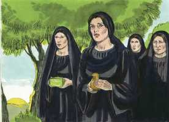
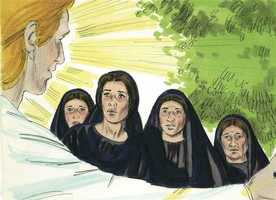
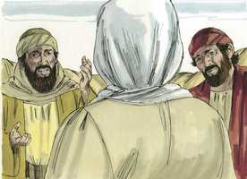
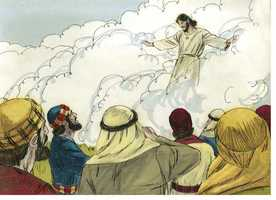

# Lucas Cap 24

**1** 	E NO primeiro dia da semana, muito de madrugada, foram elas ao sepulcro, levando as especiarias que tinham preparado, e algumas outras com elas.

 

**2** 	E acharam a pedra revolvida do sepulcro.

 

**3** 	E, entrando, não acharam o corpo do Senhor Jesus.

**4** 	E aconteceu que, estando elas muito perplexas a esse respeito, eis que pararam junto delas dois homens, com vestes resplandecentes.

**5** 	E, estando elas muito atemorizadas, e abaixando o rosto para o chão, eles lhes disseram: Por que buscais o vivente entre os mortos?

 

**6** 	Não está aqui, mas ressuscitou. Lembrai-vos como vos falou, estando ainda na Galiléia,

 

**7** 	Dizendo: Convém que o Filho do homem seja entregue nas mãos de homens pecadores, e seja crucificado, e ao terceiro dia ressuscite.

 

**8** 	E lembraram-se das suas palavras.

 

**9** 	E, voltando do sepulcro, anunciaram todas estas coisas aos onze e a todos os demais.

**10** 	E eram Maria Madalena, e Joana, e Maria, mãe de Tiago, e as outras que com elas estavam, as que diziam estas coisas aos apóstolos.

**11** 	E as suas palavras lhes pareciam como desvario, e não as creram.

**12** 	Pedro, porém, levantando-se, correu ao sepulcro e, abaixando-se, viu só os lençóis ali postos; e retirou-se, admirando consigo aquele caso.

**13** 	E eis que no mesmo dia iam dois deles para uma aldeia, que distava de Jerusalém sessenta estádios, cujo nome era Emaús.

 

**14** 	E iam falando entre si de tudo aquilo que havia sucedido.

**15** 	E aconteceu que, indo eles falando entre si, e fazendo perguntas um ao outro, o mesmo Jesus se aproximou, e ia com eles.

 

**16** 	Mas os olhos deles estavam como que fechados, para que o não conhecessem.

**17** 	E ele lhes disse: Que palavras são essas que, caminhando, trocais entre vós, e por que estais tristes?

**18** 	E, respondendo um, cujo nome era Cléopas, disse-lhe: És tu só peregrino em Jerusalém, e não sabes as coisas que nela têm sucedido nestes dias?

 

**19** 	E ele lhes perguntou: Quais? E eles lhe disseram: As que dizem respeito a Jesus Nazareno, que foi homem profeta, poderoso em obras e palavras diante de Deus e de todo o povo;

 

**20** 	E como os principais dos sacerdotes e os nossos príncipes o entregaram à condenação de morte, e o crucificaram.

**21** 	E nós esperávamos que fosse ele o que remisse Israel; mas agora, sobre tudo isso, é já hoje o terceiro dia desde que essas coisas aconteceram.

**22** 	É verdade que também algumas mulheres dentre nós nos maravilharam, as quais de madrugada foram ao sepulcro;

 

**23** 	E, não achando o seu corpo, voltaram, dizendo que também tinham visto uma visão de anjos, que dizem que ele vive.

**24** 	E alguns dos que estavam conosco foram ao sepulcro, e acharam ser assim como as mulheres haviam dito; porém, a ele não o viram.

 

**25** 	E ele lhes disse: Ó néscios, e tardos de coração para crer tudo o que os profetas disseram!

 

**26** 	Porventura não convinha que o Cristo padecesse estas coisas e entrasse na sua glória?

**27** 	E, começando por Moisés, e por todos os profetas, explicava-lhes o que dele se achava em todas as Escrituras.

 

**28** 	E chegaram à aldeia para onde iam, e ele fez como quem ia para mais longe.

**29** 	E eles o constrangeram, dizendo: Fica conosco, porque já é tarde, e já declinou o dia. E entrou para ficar com eles.

 

**30** 	E aconteceu que, estando com eles à mesa, tomando o pão, o abençoou e partiu-o, e lho deu.

 

**31** 	Abriram-se-lhes então os olhos, e o conheceram, e ele desapareceu-lhes.

**32** 	E disseram um para o outro: Porventura não ardia em nós o nosso coração quando, pelo caminho, nos falava, e quando nos abria as Escrituras?

**33** 	E na mesma hora, levantando-se, tornaram para Jerusalém, e acharam congregados os onze, e os que estavam com eles,

 

**34** 	Os quais diziam: Ressuscitou verdadeiramente o Senhor, e já apareceu a Simão.

**35** 	E eles lhes contaram o que lhes acontecera no caminho, e como deles fora conhecido no partir do pão.

**36** 	E falando eles destas coisas, o mesmo Jesus se apresentou no meio deles, e disse-lhes: Paz seja convosco.

**37** 	E eles, espantados e atemorizados, pensavam que viam algum espírito.

**38** 	E ele lhes disse: Por que estais perturbados, e por que sobem tais pensamentos aos vossos corações?

**39** 	Vede as minhas mãos e os meus pés, que sou eu mesmo; apalpai-me e vede, pois um espírito não tem carne nem ossos, como vedes que eu tenho.

**40** 	E, dizendo isto, mostrou-lhes as mãos e os pés.

**41** 	E, não o crendo eles ainda por causa da alegria, e estando maravilhados, disse-lhes: Tendes aqui alguma coisa que comer?

**42** 	Então eles apresentaram-lhe parte de um peixe assado, e um favo de mel;

 

**43** 	O que ele tomou, e comeu diante deles.

**44** 	E disse-lhes: São estas as palavras que vos disse estando ainda convosco: Que convinha que se cumprisse tudo o que de mim estava escrito na lei de Moisés, e nos profetas e nos Salmos.

 

**45** 	Então abriu-lhes o entendimento para compreenderem as Escrituras.

**46** 	E disse-lhes: Assim está escrito, e assim convinha que o Cristo padecesse, e ao terceiro dia ressuscitasse dentre os mortos,

 

**47** 	E em seu nome se pregasse o arrependimento e a remissão dos pecados, em todas as nações, começando por Jerusalém.

**48** 	E destas coisas sois vós testemunhas.

**49** 	E eis que sobre vós envio a promessa de meu Pai; ficai, porém, na cidade de Jerusalém, até que do alto sejais revestidos de poder.

**50** 	E levou-os fora, até Betânia; e, levantando as suas mãos, os abençoou.

**51** 	E aconteceu que, abençoando-os ele, se apartou deles e foi elevado ao céu.

 

**52** 	E, adorando-o eles, tornaram com grande júbilo para Jerusalém.

**53** 	E estavam sempre no templo, louvando e bendizendo a Deus. Amém.

> **Cmt MHenry** Intro: Cristo ascendeu desde Betânia, perto do Monte das Oliveiras. Ali estava o jardim onde começaram seus sofrimentos; ali esteve sua agonia. Os que vão ao céu devem ascender desde a casa dos sofrimentos e das dores. Os discípulos não o viram sair do túmulo; sua ressurreição pôde ser provada vendo-o vivo depois; porém o viram ascender ao céu; do contrário, não teriam tido provas de sua ascensão. Levantou as mãos e os abençoou. Não partiu descontente, senão com amor, deixando uma bênção após de sim. Como ressuscitou, assim ascendia, por seu poder. Eles o adoraram. Esta nova mostra da glória de Cristo tirou deles novos reconhecimentos. Voltaram a Jerusalém com grande gozo. a glória de Cristo é o gozo de todos os crentes verdadeiros, já neste mundo. Enquanto esperamos as promessas de Deus, devemos sair a recebê-las com louvores. Nada prepara melhor a mente para receber o Espírito Santo. Os temores são silenciados, as penas adoçadas e aliviadas, e se conservam as esperanças. Esta é a base da confiança do cristão ante o trono da graça; sim, o trono do Pai é o trono da graça para nós, porque também é o trono de nosso Mediador, Jesus Cristo. descansemos em suas promessas, e invoquemo-las. Atendamos a suas ordenanças, louvemos e abençoemos a Deus por suas misericórdias, coloquemos nossos afetos nas coisas de cima, e esperemos a vinda do Redentor para completar nossa felicidade. Amém. Sim, Senhor Jesus, vem logo.> Jesus se apareceu de maneira miraculosa, assegurando aos discípulos sua paz, embora eles tinham-no esquecido tão recentemente, e prometendo-lhes paz espiritual com cada bênção. Muitos pensamentos conflitantes que surgem em nossos corações em qualquer momento são conhecidos pelo Senhor Jesus, e lhe desagradam. Falou com eles sobre sua incredulidade irracional. Nada tem acontecido, senão o anunciado pelos profetas, e o necessário para a salvação dos pecadores. Agora, deve ser ensinada a todos os homens a natureza e a necessidade do arrependimento para o perdão de seus pecados. Devem-se procurar estas bênçãos por fé no nome de Jesus. Cristo, por seu Espírito, opera nas mentes dos homens. até os homens bons necessitam que se abra seu entendimento, mas para que pensem bem de Cristo, nada é mais necessário que entendam as Escrituras.> Se desejarmos ter a Cristo habitando em nós, devemos ser honestos com Ele. os que têm experimentado o prazer e o proveito da comunhão com Ele, somente podem desejar mais de sua companhia. Tomou o pão, o abençoou e o deu a eles. Isto fez com a autoridade e afeto costumeiros, na mesma forma, talvez com as mesmas palavras. Aqui nos ensina a desejar uma bênção para cada comida. Veja-se como Cristo, por seu Espírito e sua graça,se dá a conhecer às almas de seu povo. Abre as Escrituras para eles. Reúne-se com eles em sua mesa, na ordenança da Ceia do Senhor; se dá a conhecer a eles ao partir o pão, mas a obra se completa abrindo-lhes os olhos do entendimento; temos breves visões de Cristo neste mundo, mas quando entremos no céu o veremos para sempre. Eles tinham encontrado poderosa a pregação, embora não reconheceram o pregador. As Escrituras que falam de Cristo farão arder os corações de seus verdadeiros discípulos. provavelmente nos faça o maior bem o que nos afeta com o amor de Jesus ao morrer por nós. É dever daqueles aos que se tem mostrado, dar a conhecer ao próximo o que Ele tem feito por suas almas. De grande utilidade para os discípulos de Cristo é comparar suas experiências e contá-las uns a outros.> Esta aparição de Jesus aos dois discípulos que iam para Emaús aconteceu no mesmo dia em que ressuscitou dentre os mortos. Muito bem corresponde aos discípulos de Cristo falar de sua morte e ressurreição, quando estão juntos; deste modo podem beneficiar-se do conhecimento mútuo, refrescar-se mutuamente a memória e estimular-se uns a outros em seus afetos devotos. Onde há somente dois que estejam ocupados neste tipo de obra, Ele virá a eles e será o terceiro. Os que buscam a Cristo o acharão: Ele se manifestará aos que perguntam por ele; e dará conhecimento aos que usam as ajudas que têm por o conhecimento. Não importa como foi, mas acontece que eles não o conheceram; Ele o ordenou assim para que eles pudessem conversar mais livremente com Ele. os discípulos de Cristo costumam entristecer-se e apenar-se apesar de terem razão para regozijar-se, mas pela debilidade de sua fé, não podem tomar o consolo oferecido. Ainda que Cristo entrou em seu estado de exaltação, ainda percebe a tristeza de seus discípulos e se aflige de suas aflições. São forasteiros em Jerusalém os que não sabem da morte e dos padecimentos de Jesus. Os que têm o conhecimento de Cristo crucificado devem tratar de difundir esse saber. Nosso Senhor Jesus lhes recriminou a debilidade de sua fé nas Escrituras do Antigo Testamento. Se soubermos mais dos conselhos divinos segundo têm sido dados a conhecer nas Escrituras, não estaríamos sujeitos às confusões nas que volta e meia nos enredamos. Mostra-lhes que os padecimentos de Cristo era, realmente, o caminho designado a sua glória, mas a cruz de Cristo era aquilo no que eles não se podiam reconciliar por si mesmos. Começando por Moisés, o primeiro escritor inspirado do Antigo Testamento, Jesus lhes expõe coisas acerca de si mesmo. há muitas passagens em todas as Escrituras com referência a Cristo, e é muito proveitoso reuni-las. Não nos adentramos em nenhum texto sem achar algo referido a Cristo, uma profecia, uma promessa, uma oração, um tipo ou outra coisa. O fio de ouro da graça do evangelho recorre toda a trama do Antigo Testamento. Cristo é o melhor expositor da Escritura e, ainda depois de sua ressurreição, conduziu as pessoas a conhecer o mistério acerca de si mesmo; não pela apresentação de noções novas, senão mostrando-lhes como se cumpriu a Escritura, e voltando-os ao estudo fervoroso delas.> Veja-se o afeto e o respeito que as mulheres demonstraram para com Cristo, depois que morreu e foi sepultado. Observe-se a surpresa quando encontraram a pedra removida e o túmulo vazio. Os cristãos costumam ficar confundidos com o que deveria consolá-los e animá-los. Esperavam achar a seu Mestre em seu sudário, em vez de anjos em roupagens refulgentes. Os anjos lhes asseguraram que tinha ressuscitado dentre os mortos; ressuscitou por seu poder. Estes anjos do céu não trazem um evangelho novo, porém lembram às mulheres as palavras de Cristo, e lhes ensinam a aplicá-las. Podemos maravilhar-nos destes discípulos, que criam que Jesus era o Filho de Deus e o Messias verdadeiro, aos que tão freqüentemente tinha-lhes falado que devia morrer e ressuscitar, e depois entrar em sua glória, e que em mais de uma ocasião o tinham visto ressuscitar mortos, pudessem demorar tanto em acreditar em sua ressurreição por seu poder. Todos nossos erros na religião surgem de ignorar ou esquecer as palavras que Cristo disse. Agora Pedro corre ao sepulcro, ele que tão recentemente tinha fugido de seu Mestre. Estava assombrado. Há muitas coisas que nos causam estupefação e confusão, e que seriam claras e proveitosas se entendêssemos corretamente as palavras de Cristo.