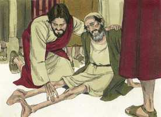
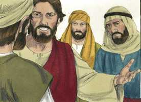
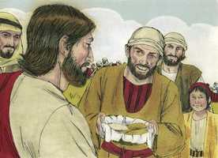
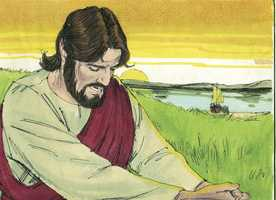
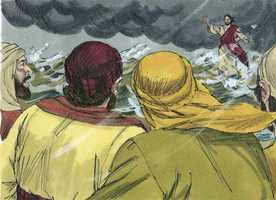

# João Cap 06

**1** 	DEPOIS disto partiu Jesus para o outro lado do mar da Galiléia, que é o de Tiberíades.

 

**2** 	E grande multidão o seguia, porque via os sinais que operava sobre os enfermos.

 

**3** 	E Jesus subiu ao monte, e assentou-se ali com os seus discípulos.

**4** 	E a páscoa, a festa dos judeus, estava próxima.

**5** 	Então Jesus, levantando os olhos, e vendo que uma grande multidão vinha ter com ele, disse a Filipe: Onde compraremos pão, para estes comerem?

 

**6** 	Mas dizia isto para o experimentar; porque ele bem sabia o que havia de fazer.

 

**7** 	Filipe respondeu-lhe: Duzentos dinheiros de pão não lhes bastarão, para que cada um deles tome um pouco.

 

**8** 	E um dos seus discípulos, André, irmão de Simão Pedro, disse-Lhe:

 

**9** 	Está aqui um rapaz que tem cinco pães de cevada e dois peixinhos; mas que é isto para tantos?

**10** 	E disse Jesus: Mandai assentar os homens. E havia muita relva naquele lugar. Assentaram-se, pois, os homens em número de quase cinco mil.

 

**11** 	E Jesus tomou os pães e, havendo dado graças, repartiu-os pelos discípulos, e os discípulos pelos que estavam assentados; e igualmente também dos peixes, quanto eles queriam.

  

**12** 	E, quando estavam saciados, disse aos seus discípulos: Recolhei os pedaços que sobejaram, para que nada se perca.

**13** 	Recolheram-nos, pois, e encheram doze alcofas de pedaços dos cinco pães de cevada, que sobejaram aos que haviam comido.

 

**14** 	Vendo, pois, aqueles homens o milagre que Jesus tinha feito, diziam: Este é verdadeiramente o profeta que devia vir ao mundo.

**15** 	Sabendo, pois, Jesus que haviam de vir arrebatá-lo, para o fazerem rei, tornou a retirar-se, ele só, para o monte.

**16** 	E, quando veio a tarde, os seus discípulos desceram para o mar.

 

**17** 	E, entrando no barco, atravessaram o mar em direção a Cafarnaum; e era já escuro, e ainda Jesus não tinha chegado ao pé deles.

 

**18** 	E o mar se levantou, porque um grande vento assoprava.

 

**19** 	E, tendo navegado uns vinte e cinco ou trinta estádios, viram a Jesus, andando sobre o mar e aproximando-se do barco; e temeram.

  

**20** 	Mas ele lhes disse: Sou eu, não temais.

  

**21** 	Então eles de boa mente o receberam no barco; e logo o barco chegou à terra para onde iam.

**22** 	No dia seguinte, a multidão que estava do outro lado do mar, vendo que não havia ali mais do que um barquinho, a não ser aquele no qual os discípulos haviam entrado, e que Jesus não entrara com os seus discípulos naquele barquinho, mas que os seus discípulos tinham ido sozinhos

**23** 	(Contudo, outros barquinhos tinham chegado de Tiberíades, perto do lugar onde comeram o pão, havendo o Senhor dado graças).

**24** 	Vendo, pois, a multidão que Jesus não estava ali nem os seus discípulos, entraram eles também nos barcos, e foram a Cafarnaum, em busca de Jesus.

**25** 	E, achando-o no outro lado do mar, disseram-lhe: Rabi, quando chegaste aqui?

**26** 	Jesus respondeu-lhes, e disse: Na verdade, na verdade vos digo que me buscais, não pelos sinais que vistes, mas porque comestes do pão e vos saciastes.

**27** 	Trabalhai, não pela comida que perece, mas pela comida que permanece para a vida eterna, a qual o Filho do homem vos dará; porque a este o Pai, Deus, o selou.

**28** 	Disseram-lhe, pois: Que faremos para executarmos as obras de Deus?

**29** 	Jesus respondeu, e disse-lhes: A obra de Deus é esta: Que creiais naquele que ele enviou.

**30** 	Disseram-lhe, pois: Que sinal, pois, fazes tu, para que o vejamos, e creiamos em ti? Que operas tu?

**31** 	Nossos pais comeram o maná no deserto, como está escrito: Deu-lhes a comer o pão do céu.

**32** 	Disse-lhes, pois, Jesus: Na verdade, na verdade vos digo: Moisés não vos deu o pão do céu; mas meu Pai vos dá o verdadeiro pão do céu.

**33** 	Porque o pão de Deus é aquele que desce do céu e dá vida ao mundo.

**34** 	Disseram-lhe, pois: Senhor, dá-nos sempre desse pão.

**35** 	E Jesus lhes disse: Eu sou o pão da vida; aquele que vem a mim não terá fome, e quem crê em mim nunca terá sede.

**36** 	Mas já vos disse que também vós me vistes, e contudo não credes.

**37** 	Todo o que o Pai me dá virá a mim; e o que vem a mim de maneira nenhuma o lançarei fora.

**38** 	Porque eu desci do céu, não para fazer a minha vontade, mas a vontade daquele que me enviou.

**39** 	E a vontade do Pai que me enviou é esta: Que nenhum de todos aqueles que me deu se perca, mas que o ressuscite no último dia.

**40** 	Porquanto a vontade daquele que me enviou é esta: Que todo aquele que vê o Filho, e crê nele, tenha a vida eterna; e eu o ressuscitarei no último dia.

**41** 	Murmuravam, pois, dele os judeus, porque dissera: Eu sou o pão que desceu do céu.

**42** 	E diziam: Não é este Jesus, o filho de José, cujo pai e mãe nós conhecemos? Como, pois, diz ele: Desci do céu?

**43** 	Respondeu, pois, Jesus, e disse-lhes: Não murmureis entre vós.

**44** 	Ninguém pode vir a mim, se o Pai que me enviou o não trouxer; e eu o ressuscitarei no último dia.

**45** 	Está escrito nos profetas: E serão todos ensinados por Deus. Portanto, todo aquele que do Pai ouviu e aprendeu vem a mim.

**46** 	Não que alguém visse ao Pai, a não ser aquele que é de Deus; este tem visto ao Pai.

**47** 	Na verdade, na verdade vos digo que aquele que crê em mim tem a vida eterna.

**48** 	Eu sou o pão da vida.

**49** 	Vossos pais comeram o maná no deserto, e morreram.

**50** 	Este é o pão que desce do céu, para que o que dele comer não morra.

**51** 	Eu sou o pão vivo que desceu do céu; se alguém comer deste pão, viverá para sempre; e o pão que eu der é a minha carne, que eu darei pela vida do mundo.

**52** 	Disputavam, pois, os judeus entre si, dizendo: Como nos pode dar este a sua carne a comer?

**53** 	Jesus, pois, lhes disse: Na verdade, na verdade vos digo que, se não comerdes a carne do Filho do homem, e não beberdes o seu sangue, não tereis vida em vós mesmos.

**54** 	Quem come a minha carne e bebe o meu sangue tem a vida eterna, e eu o ressuscitarei no último dia.

**55** 	Porque a minha carne verdadeiramente é comida, e o meu sangue verdadeiramente é bebida.

**56** 	Quem come a minha carne e bebe o meu sangue permanece em mim e eu nele.

**57** 	Assim como o Pai, que vive, me enviou, e eu vivo pelo Pai, assim, quem de mim se alimenta, também viverá por mim.

**58** 	Este é o pão que desceu do céu; não é o caso de vossos pais, que comeram o maná e morreram; quem comer este pão viverá para sempre.

**59** 	Ele disse estas coisas na sinagoga, ensinando em Cafarnaum.

**60** 	Muitos, pois, dos seus discípulos, ouvindo isto, disseram: Duro é este discurso; quem o pode ouvir?

**61** 	Sabendo, pois, Jesus em si mesmo que os seus discípulos murmuravam disto, disse-lhes: Isto escandaliza-vos?

**62** 	Que seria, pois, se vísseis subir o Filho do homem para onde primeiro estava?

**63** 	O espírito é o que vivifica, a carne para nada aproveita; as palavras que eu vos digo são espírito e vida.

**64** 	Mas há alguns de vós que não crêem. Porque bem sabia Jesus, desde o princípio, quem eram os que não criam, e quem era o que o havia de entregar.

**65** 	E dizia: Por isso eu vos disse que ninguém pode vir a mim, se por meu Pai não lhe for concedido.

**66** 	Desde então muitos dos seus discípulos tornaram para trás, e já não andavam com ele.

**67** 	Então disse Jesus aos doze: Quereis vós também retirar-vos?

**68** 	Respondeu-lhe, pois, Simão Pedro: Senhor, para quem iremos nós? Tu tens as palavras da vida eterna.

**69** 	E nós temos crido e conhecido que tu és o Cristo, o Filho do Deus vivente.

**70** 	Respondeu-lhe Jesus: Não vos escolhi a vós os doze? e um de vós é um diabo.

**71** 	E isto dizia ele de Judas Iscariotes, filho de Simão; porque este o havia de entregar, sendo um dos doze.

> **Cmt MHenry** Intro: Quando admitimos em nossa mente duros pensamentos acerca das palavras e obras de Jesus, entramos na tentação de modo que, se o Senhor não o evitasse em sua misericórdia, terminaríamos retrocedendo. O coração corrupto e mau do homem faz com que o que é matéria de maior consolo seja uma ocasião de ofensa. Nosso Senhor tinha prometido vida eterna a seus seguidores no sermão anterior; os discípulos aderiram a essa palavra simples e resolveram aferrar-se a Ele, quando os outros se aderiram às palavras duras e o abandonaram. A doutrina de Cristo é a palavra de vida eterna, portanto, devemos viver e morrer por ela. Se abandonarmos a Cristo, abandonamos nossas próprias misericórdias. Eles acreditaram que este Jesus era o Messias prometido a seus pais, o Filho do Deus vivo. Quando sejamos tentados a descaminhar-nos, bom é que lembremos os princípios antigos e nos mantenhamos neles. Lembremos sempre a pergunta de nosso Senhor. Nos afastaremos e abandonaremos a nosso Redentor? A quem poderemos acudir? Somente Ele pode dar salvação pelo perdão dos pecados. Isto só dá confiança, consolo e gozo, e faz que o temor e o abatimento fujam. Ganha a única alegria firme neste mundo e abre o caminho à felicidade do próximo.> A natureza humana de Cristo não tinha estado antes no céu, porém, sendo Deus e homem, se diz com veracidade que essa maravilhosa Pessoa desceu do céu. O reino do Messias não era deste mundo; eles deviam entender por fé o que disse de um viver espiritual nEle e em sua plenitude. Assim como sem a alma do homem, a carne não vale de nada, do mesmo modo, sem o Espírito de Deus que vivifica, todas as formas de religião são mortas e nulas. O que fez esta provisão para nossas almas é o único que pode ensinar-nos estas coisas e atrair-nos a Cristo para que vivamos pela fé nEle. Acudamos a Cristo, agradecidos que tenha sido declarado que todo aquele que quiser ir a Ele será recebido.> A carne e o sangue do Filho do Homem denotam o Redentor em sua natureza humana; Cristo, e Ele crucificado, e a redenção operada por Ele, com todos os benefícios preciosos da redenção: o perdão do pecado, a aceitação de Deus, o caminho ao trono de graça, as promessas da aliança, e a vida eterna. São chamados carne e sangue de Cristo, porque foram comprados devido a que seu corpo foi partido e seu sangue, derramado. Além disso, porque são comida e bebida para a nossa alma. comer esta carne e beber este sangue significa crer em Cristo. Participamos de Cristo e seus benefícios por fé. A alma que conhece corretamente seu estado e sua necessidade, encontra no Redentor, em Deus manifestado em carne, todas as coisas que podem acalmar a consciência e fomentar a santidade verdadeira. Meditar na cruz de Cristo dá vida a nosso arrependimento, amor e gratidão. Vivemos por Ele, assim como nossos corpos vivem pela comida. Vivemos por Ele como as extremidades dependem da cabeça, os ramos da raiz: porque Ele vive, nós também vivemos.> O descobrimento da culpa, perigo e remédio para eles, por meio do ensino do Espírito Santo, faz que os homens se disponham e alegrem de ir, e rendam tudo o que impede ir a Ele em busca de salvação. A vontade do Pai é que nenhum dos que foram dados ao Filho sejam rejeitados ou perdidos por Ele. ninguém irá até que a graça divina o subjugue e, em parte, mude seu coração; portanto, ninguém que acuda será lançado fora. O evangelho não acha a ninguém disposto a ser salvado na forma santa e humilhante que aqui se dá a conhecer, porém Deus atrai com sua palavra e o Espírito Santo; e o dever do homem é ouvir e aprender; isto é, receber a graça oferecida e assentir à promessa. Ninguém viu o Pai senão seu amado Filho; e os judeus devem esperar ser ensinados por seu poder interior exercido sobre sua mente, e por sua palavra e os ministros que lhes mande.> O descobrimento da culpa, perigo e remédio para eles, por meio do ensino do Espírito Santo, faz que os homens se disponham e alegrem de ir, e rendam tudo o que impede ir a Ele em busca de salvação. A vontade do Pai é que nenhum dos que foram dados ao Filho sejam rejeitados ou perdidos por Ele. ninguém irá até que a graça divina o subjugue e, em parte, mude seu coração; portanto, ninguém que acuda será lançado fora. O evangelho não acha a ninguém disposto a ser salvado na forma santa e humilhante que aqui se dá a conhecer, porém Deus atrai com sua palavra e o Espírito Santo; e o dever do homem é ouvir e aprender; isto é, receber a graça oferecida e assentir à promessa. Ninguém viu o Pai senão seu amado Filho; e os judeus devem esperar ser ensinados por seu poder interior exercido sobre sua mente, e por sua palavra e os ministros que lhes mande.> O exercício constante da fé em Cristo é a parte mais importante e difícil da obediência exigida de nós, Enquanto a pecadores que buscam salvação. Quando somos capacitados por sua graça para levar uma vida de fé no Filho de Deus, seguem os temperamentos santos e podem fazer-se serviços aceitáveis. Deus, seu próprio Pai, que deu esse alimento do céu a seus antepassados para sustentar sua vida natural, agora lhes deu o Pão *verdadeiro* para a salvação de suas almas. Ir a Jesus e crer nEle significa o mesmo. Cristo mostra que Ele é o Pão verdadeiro; é para a alma o que o pão é para o corpo, nutre e sustenta a vida espiritual. É o Pão de Deus. o pão que dá o Pai, é o que tem feito para alimento de nossas almas. O pão nutre somente pelos poderes do corpo vivo, porém Cristo mesmo é o Pão vivo e nutre por seu próprio poder. A doutrina de Cristo crucificado é agora tão fortalecedora e consoladora para o crente como sempre tem sido. Ele é o Pão que veio do céu. Denota a divindade da pessoa de Cristo e sua autoridade; além disso, a origem divina de todo o de bom que nos chega por meio dEle. Digamos, com inteligência e fervor: Senhor, dá-nos sempre deste Pão.> Em vez de responder à pergunta de como chegou ali, Jesus os repreende por perguntar. A maior seriedade deveria utilizar-se para buscar a salvação no uso dos meios indicados, mas deve buscar-se somente como dom do Filho do homem. Ao que o Pai tem selado, lhe prova que é Deus. Ele declara que o Filho do homem é o Filho de Deus com poder.> " Aqui estavam os discípulos de Cristo no caminho do dever, e Cristo ora por eles; contudo, estão afligidos. Pode haver perigos e aflições deste tempo presente onde há interesse em Cristo. as nuvens e as trevas costumam rodear os filhos da luz e do dia. Vêem a Jesus caminhando sobre o mar. Ainda quando se aproximam o consolo e a liberação, costumam entendê-lo tão mal que se convertem em ocasião para temer. Nada é mais forte para convencer a pecadores que a palavra "Eu sou Jesus, o que persegues"; nada mais forte para consolar os santos que isto: "Eu sou Jesus a quem amas". Se temos recebido a Cristo Jesus, o Senhor, embora a noite seja escura e o vento, forte, ainda assim podemos consolar-nos que estaremos na margem antes que passe muito tempo. "> João narra o milagre de alimentar à multidão para referir-se ao sermão que segue. Observe-se o efeito deste milagre sobre a gente. Até os judeus comuns esperavam que o Messias viesse ao mundo e fosse um grande Profeta. Os fariseus o desprezavam por não conhecer a lei, mas eles sabiam mais dAquele que é o fim da lei. Não obstante, os homens podem admitir que Cristo é esse Profeta e ainda fazer ouvidos surdos.