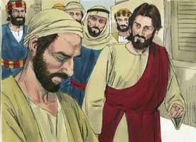
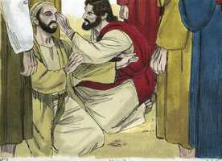
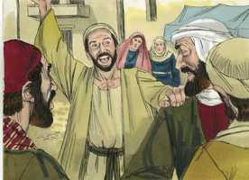
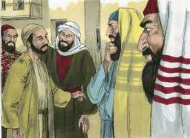
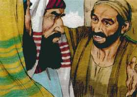
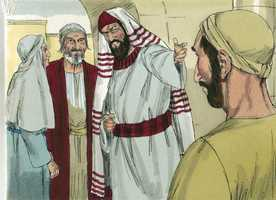
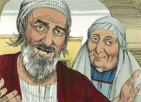
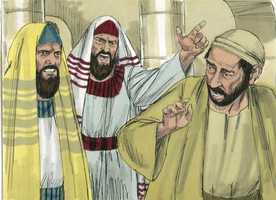
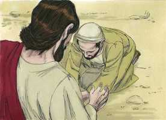

# João Cap 09

**1** 	E, PASSANDO Jesus, viu um homem cego de nascença.

 

**2** 	E os seus discípulos lhe perguntaram, dizendo: Rabi, quem pecou, este ou seus pais, para que nascesse cego?

**3** 	Jesus respondeu: Nem ele pecou nem seus pais; mas foi assim para que se manifestem nele as obras de Deus.

**4** 	Convém que eu faça as obras daquele que me enviou, enquanto é dia; a noite vem, quando ninguém pode trabalhar.

**5** 	Enquanto estou no mundo, sou a luz do mundo.

**6** 	Tendo dito isto, cuspiu na terra, e com a saliva fez lodo, e untou com o lodo os olhos do cego.

 

**7** 	E disse-lhe: Vai, lava-te no tanque de Siloé (que significa o Enviado). Foi, pois, e lavou-se, e voltou vendo.

**8** 	Então os vizinhos, e aqueles que dantes tinham visto que era cego, diziam: Não é este aquele que estava assentado e mendigava?

 

**9** 	Uns diziam: É este. E outros: Parece-se com ele. Ele dizia: Sou eu.

**10** 	Diziam-lhe, pois: Como se te abriram os olhos?

**11** 	Ele respondeu, e disse: O homem, chamado Jesus, fez lodo, e untou-me os olhos, e disse-me: Vai ao tanque de Siloé, e lava-te. Então fui, e lavei-me, e vi.

**12** 	Disseram-lhe, pois: Onde está ele? Respondeu: Não sei.

**13** 	Levaram, pois, aos fariseus o que dantes era cego.

**14** 	E era sábado quando Jesus fez o lodo e lhe abriu os olhos.

**15** 	Tornaram, pois, também os fariseus a perguntar-lhe como vira, e ele lhes disse: Pôs-me lodo sobre os olhos, lavei-me, e vejo.

**16** 	Então alguns dos fariseus diziam: Este homem não é de Deus, pois não guarda o sábado. Diziam outros: Como pode um homem pecador fazer tais sinais? E havia dissensão entre eles.

 

**17** 	Tornaram, pois, a dizer ao cego: Tu, que dizes daquele que te abriu os olhos? E ele respondeu: Que é profeta.

 

**18** 	Os judeus, porém, não creram que ele tivesse sido cego, e que agora visse, enquanto não chamaram os pais do que agora via.

**19** 	E perguntaram-lhes, dizendo: É este o vosso filho, que vós dizeis ter nascido cego? Como, pois, vê agora?

 

**20** 	Seus pais lhes responderam, e disseram: Sabemos que este é o nosso filho, e que nasceu cego;

 

**21** 	Mas como agora vê, não sabemos; ou quem lhe tenha aberto os olhos, não sabemos. Tem idade, perguntai-lho a ele mesmo; e ele falará por si mesmo.

**22** 	Seus pais disseram isto, porque temiam os judeus. Porquanto já os judeus tinham resolvido que, se alguém confessasse ser ele o Cristo, fosse expulso da sinagoga.

**23** 	Por isso é que seus pais disseram: Tem idade, perguntai-lho a ele mesmo.

**24** 	Chamaram, pois, pela segunda vez o homem que tinha sido cego, e disseram-lhe: Dá glória a Deus; nós sabemos que esse homem é pecador.

**25** 	Respondeu ele pois, e disse: Se é pecador, não sei; uma coisa sei, é que, havendo eu sido cego, agora vejo.

**26** 	E tornaram a dizer-lhe: Que te fez ele? Como te abriu os olhos?

**27** 	Respondeu-lhes: Já vo-lo disse, e não ouvistes; para que o quereis tornar a ouvir? Quereis vós porventura fazer-vos também seus discípulos?

 

**28** 	Então o injuriaram, e disseram: Discípulo dele sejas tu; nós, porém, somos discípulos de Moisés.

**29** 	Nós bem sabemos que Deus falou a Moisés, mas este não sabemos de onde é.

**30** 	O homem respondeu, e disse-lhes: Nisto, pois, está a maravilha, que vós não saibais de onde ele é, e contudo me abrisse os olhos.

**31** 	Ora, nós sabemos que Deus não ouve a pecadores; mas, se alguém é temente a Deus, e faz a sua vontade, a esse ouve.

**32** 	Desde o princípio do mundo nunca se ouviu que alguém abrisse os olhos a um cego de nascença.

**33** 	Se este não fosse de Deus, nada poderia fazer.

**34** 	Responderam eles, e disseram-lhe: Tu és nascido todo em pecados, e nos ensinas a nós? E expulsaram-no.

 

**35** 	Jesus ouviu que o tinham expulsado e, encontrando-o, disse-lhe: Crês tu no Filho de Deus?

 

**36** 	Ele respondeu, e disse: Quem é ele, Senhor, para que nele creia?

**37** 	E Jesus lhe disse: Tu já o tens visto, e é aquele que fala contigo.

**38** 	Ele disse: Creio, Senhor. E o adorou.

 

**39** 	E disse-lhe Jesus: Eu vim a este mundo para juízo, a fim de que os que não vêem vejam, e os que vêem sejam cegos.

**40** 	E aqueles dos fariseus, que estavam com ele, ouvindo isto, disseram-lhe: Também nós somos cegos?

**41** 	Disse-lhes Jesus: Se fôsseis cegos, não teríeis pecado; mas como agora dizeis: Vemos; por isso o vosso pecado permanece.

> **Cmt MHenry** Intro: Cristo veio ao mundo a dar vista aos espirituais cegos. Além disso, para que os que vêem sejam cegados; para que os que têm um elevado conceito de sua própria sabedoria, sejam selados em sua ignorância. A pregação da cruz era considerada loucura pelos que não conheceram a Deus pela sabedoria carnal. Nada fortifica os corações corruptos dos homens contra as convicções da palavra mais que a elevada opinião que os outros têm deles; como se tudo o que os homens aplaudem devesse ser aceito por Deus. Cristo os silenciou, no entanto persiste o pecado do vaidoso e do que confia em si mesmo; eles rejeitam o evangelho da graça, portanto, a culpa de seu pecado continua sem ser perdoada, e o poder de seu pecado continua intacto.> Cristo reconhece aos que o reconhecem a Ele, sua verdade e seus caminhos. Nota-se em particular os que sofrem na causa de Cristo e do testemunho de uma boa consciência. Nosso Senhor Jesus se revela por graça ao homem. Agora este foi feito sensato; que misericórdia inexpressável foi ser curado de sua cegueira, para que pudesse ver o Filho de Deus. Ninguém senão Deus deve ser adorado; assim que, ao adorar a Jesus, o reconheceu como Deus. o adorarão todos os que crêem nEle.> Como as misericórdias de Cristo são de valor supremo para os que percebem suas necessidades, eram cegos e agora vêem; assim, os afetos mais poderosos e duradouros por Cristo surgem de conhecê-lo verdadeiramente.\> \ Embora não possamos dizer quando, como e por quais passos se operou a mudança bendita da obra de graça na alma, ainda assim podemos ter o consolo, sem por graça podemos dizer: Eu era cego, mas agora enxergo. Eu levava uma vida mundana sensual, mas agora, graças a Deus, é o contrário ([Ef 5.8](../49N-Ef/05.md#8)). Indubitavelmente prodigiosa é a incredulidade dos que desfrutam os meios de conhecimento e convicção. Todos os que sentiram o poder e a graça do Senhor Jesus se maravilham ante a disposição voluntária de outros que a rejeitam. Este lhes discute com força que nosso só Jesus não era pecador, senão que era de Deus. Que cada um de nós possa saber por isso se somos ou não de Deus: Que fazemos? Que fazemos por Deus? Que fazemos por nossa alma? Que fazemos mais que outros?> Os fariseus esperaram em vão refutar este notável milagre. Esperavam a um Messias, mas não toleravam pensar que este Jesus fosse Aquele, pois seus preceitos eram de todo contrários às tradições deles, e porque tinham à expectativa de um Messias com pompa e esplendor externos. O temor do homem colocará laço ([Pv 29.25](../20A-Pv/29.md#25)) e, freqüentemente, faz que gente negue e desconheça a Cristo, suas verdades e caminhos, e atue contra suas consciências. O inculto e pobre, que são de coração simples, extraem prestemente inferências apropriadas das provas da luz do evangelho, mas aqueles cujos desejos são de outro caminho, apesar de estarem sempre aprendendo, nunca chegam ao conhecimento da verdade.> Cristo não somente operou milagres no dia de descanso, mas seu modo fez com que se ofendesses os judeus, pois pareceu não ceder ante os escribas e fariseus. O zelo deles pelos puros ritos consumiu os assuntos importantes da religião; portanto, Cristo não quis dá-lhes cabida. Além do mais, se permitem as obras de necessidade e de misericórdia e o repouso sabático deve guardar-se para a obra do dia de descanso. Quantos olhos cegados têm sido abertos pregando o evangelho no dia do Senhor! Quantas almas impotentes são curadas nesse dia! Muitos juízos ímpios e impiedosos vêm dos homens que agregam suas próprias fantasias aos desígnios de Deus. que perfeito em sabedoria e santidade é nosso Redentor, quando seus inimigos não puderam achar nada em sua contra, senão a acusação de violentar o dia de repouso, tão freqüentemente refutada! Sejamos capazes de silenciar a ignorância dos homens néscios fazendo o bem,> Sabe-se que aqueles cujos alhos são abertos e seus corações limpados pela graça, são as mesmas pessoas, mas de caráter completamente diferente, e vivem como monumentos da glória do Redentor e recomendam sua graça a todos os que desejam a mesma preciosa salvação. Bom é olhar no caminho e no método das obras de Deus, e se verão mais maravilhosas. Aplique-se isto espiritualmente. Na obra de graça operada na alma vemos a mudança, mas não vemos a mão que a efetua: o caminho do Espírito é como o do vento, do qual a gente ouve o som, mas não pode dizer de onde vem nem para onde vai.> Cristo curou a muitos que eram cegos por doença ou acidente; aqui sara a um que nascera cego. Assim mostrou seu poder para socorrer nos casos mais desesperados, e a obra de sua graça nas almas dos pecadores, que dá vista aos que são cegos por natureza. Este coitado homem não podia ver a Cristo, porém Cristo o viu a ele. e se sabemos ou captamos algo de Cristo, deve-se a que primeiramente fomos conhecidos por Ele. Cristo fala de calamidades extraordinárias, que nem sempre devem considerar-se como castigos especiais do pecado; às vezes, são para a glória de Deus e para manifestar suas obras. Nossa vida é nosso dia no que nos corresponde fazer o trabalho do dia. Devemos estar ocupados e não desperdiçar o tempo do dia; o tempo de repouso será quando nosso dia estiver terminado, porque não é senão um dia. A aproximação da morte deveria estimular-nos para aproveitar todas as oportunidades de fazer e receber o bem. Devemos fazer rapidamente o bem que tenhamos oportunidade de fazer. E aquele que nunca faz uma boa obra até que não haja nada que objetar contra ela, deixará mais de uma boa obra sem ser feita ([Ec 11.4](../21A-Ec/11.md#4)). Cristo magnificou seu poder ao fazer que um cego enxergasse, fazendo o que alguém pensaria como mais provável para cegar a um que vê. A razão humana não pode julgar os métodos do Senhor, que usa meios e instrumentos que os homens desprezam. Os que serão sarados por Cristo devem ser governados por Ele. regressou desde o tanque maravilhando-se e maravilhado; foi embora vendo. Isto representa os benefícios de prestar atenção às ordenanças indicadas por Cristo; as almas chegam fracas e partem fortalecidas; chegam duvidando e vão embora satisfeitas; chegam de luto e partem jubilosas; chegam cegas e se retiram enxergando.