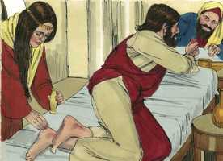
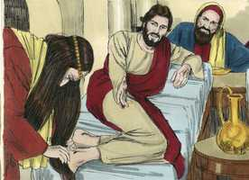

# João Cap 12

**1** 	FOI, pois, Jesus seis dias antes da páscoa a Betânia, onde estava Lázaro, o que falecera, e a quem ressuscitara dentre os mortos.

**2** 	Fizeram-lhe, pois, ali uma ceia, e Marta servia, e Lázaro era um dos que estavam à mesa com ele.

**3** 	Então Maria, tomando um arrátel de ungüento de nardo puro, de muito preço, ungiu os pés de Jesus, e enxugou-lhe os pés com os seus cabelos; e encheu-se a casa do cheiro do ungüento.

 

**4** 	Então, um dos seus discípulos, Judas Iscariotes, filho de Simão, o que havia de traí-lo, disse:

 

**5** 	Por que não se vendeu este ungüento por trezentos dinheiros e não se deu aos pobres?

**6** 	Ora, ele disse isto, não pelo cuidado que tivesse dos pobres, mas porque era ladrão e tinha a bolsa, e tirava o que ali se lançava.

**7** 	Disse, pois, Jesus: Deixai-a; para o dia da minha sepultura guardou isto;

 

**8** 	Porque os pobres sempre os tendes convosco, mas a mim nem sempre me tendes.

**9** 	E muita gente dos judeus soube que ele estava ali; e foram, não só por causa de Jesus, mas também para ver a Lázaro, a quem ressuscitara dentre os mortos.

**10** 	E os principais dos sacerdotes tomaram deliberação para matar também a Lázaro;

**11** 	Porque muitos dos judeus, por causa dele, iam e criam em Jesus.

**12** 	No dia seguinte, ouvindo uma grande multidão, que viera à festa, que Jesus vinha a Jerusalém,

**13** 	Tomaram ramos de palmeiras, e saíram-lhe ao encontro, e clamavam: Hosana! Bendito o Rei de Israel que vem em nome do Senhor.

 

**14** 	E achou Jesus um jumentinho, e assentou-se sobre ele, como está escrito:

 

**15** 	Não temas, ó filha de Sião; eis que o teu Rei vem assentado sobre o filho de uma jumenta.

**16** 	Os seus discípulos, porém, não entenderam isto no princípio; mas, quando Jesus foi glorificado, então se lembraram de que isto estava escrito dele, e que isto lhe fizeram.

**17** 	A multidão, pois, que estava com ele quando Lázaro foi chamado da sepultura, testificava que ele o ressuscitara dentre os mortos.

**18** 	Por isso a multidão lhe saiu ao encontro, porque tinham ouvido que ele fizera este sinal.

**19** 	Disseram, pois, os fariseus entre si: Vedes que nada aproveitais? Eis que toda a gente vai após ele.

**20** 	Ora, havia alguns gregos, entre os que tinham subido a adorar no dia da festa.

**21** 	Estes, pois, dirigiram-se a Filipe, que era de Betsaida da Galiléia, e rogaram-lhe, dizendo: Senhor, queríamos ver a Jesus.

**22** 	Filipe foi dizê-lo a André, e então André e Filipe o disseram a Jesus.

**23** 	E Jesus lhes respondeu, dizendo: É chegada a hora em que o Filho do homem há de ser glorificado.

**24** 	Na verdade, na verdade vos digo que, se o grão de trigo, caindo na terra, não morrer, fica ele só; mas se morrer, dá muito fruto.

**25** 	Quem ama a sua vida perdê-la-á, e quem neste mundo odeia a sua vida, guardá-la-á para a vida eterna.

**26** 	Se alguém me serve, siga-me, e onde eu estiver, ali estará também o meu servo. E, se alguém me servir, meu Pai o honrará.

**27** 	Agora a minha alma está perturbada; e que direi eu? Pai, salva-me desta hora; mas para isto vim a esta hora.

**28** 	Pai, glorifica o teu nome. Então veio uma voz do céu que dizia: Já o tenho glorificado, e outra vez o glorificarei.

**29** 	Ora, a multidão que ali estava, e que a ouvira, dizia que havia sido um trovão. Outros diziam: Um anjo lhe falou.

**30** 	Respondeu Jesus, e disse: Não veio esta voz por amor de mim, mas por amor de vós.

**31** 	Agora é o juízo deste mundo; agora será expulso o príncipe deste mundo.

**32** 	E eu, quando for levantado da terra, todos atrairei a mim.

**33** 	E dizia isto, significando de que morte havia de morrer.

**34** 	Respondeu-lhe a multidão: Nós temos ouvido da lei, que o Cristo permanece para sempre; e como dizes tu que convém que o Filho do homem seja levantado? Quem é esse Filho do homem?

**35** 	Disse-lhes, pois, Jesus: A luz ainda está convosco por um pouco de tempo. Andai enquanto tendes luz, para que as trevas não vos apanhem; pois quem anda nas trevas não sabe para onde vai.

**36** 	Enquanto tendes luz, crede na luz, para que sejais filhos da luz. Estas coisas disse Jesus e, retirando-se, escondeu-se deles.

**37** 	E, ainda que tinha feito tantos sinais diante deles, não criam nele;

**38** 	Para que se cumprisse a palavra do profeta Isaías, que diz: Senhor, quem creu na nossa pregação? E a quem foi revelado o braço do Senhor?

**39** 	Por isso não podiam crer, então Isaías disse outra vez:

**40** 	Cegou-lhes os olhos, e endureceu-lhes o coração, A fim de que não vejam com os olhos, e compreendam no coração, E se convertam, E eu os cure.

**41** 	Isaías disse isto quando viu a sua glória e falou dele.

**42** 	Apesar de tudo, até muitos dos principais creram nele; mas não o confessavam por causa dos fariseus, para não serem expulsos da sinagoga.

**43** 	Porque amavam mais a glória dos homens do que a glória de Deus.

**44** 	E Jesus clamou, e disse: Quem crê em mim, crê, não em mim, mas naquele que me enviou.

**45** 	E quem me vê a mim, vê aquele que me enviou.

**46** 	Eu sou a luz que vim ao mundo, para que todo aquele que crê em mim não permaneça nas trevas.

**47** 	E se alguém ouvir as minhas palavras, e não crer, eu não o julgo; porque eu vim, não para julgar o mundo, mas para salvar o mundo.

**48** 	Quem me rejeitar a mim, e não receber as minhas palavras, já tem quem o julgue; a palavra que tenho pregado, essa o há de julgar no último dia.

**49** 	Porque eu não tenho falado de mim mesmo; mas o Pai, que me enviou, ele me deu mandamento sobre o que hei de dizer e sobre o que hei de falar.

**50** 	E sei que o seu mandamento é a vida eterna. Portanto, o que eu falo, falo-o como o Pai mo tem dito.

> **Cmt MHenry** Intro: Nosso Senhor proclamou publicamente que todo aquele que cresse nEle, como seu discípulo verdadeiro, não acreditaria somente nEle, senão no Pai que o enviou. Contemplando em Jesus a glória do Pai, aprendemos a obedecer, amar e confiar nEle. Olhando diariamente Àquele que veio como Luz ao mundo, somos liberados crescentemente das trevas da ignorância, do erro, do pecado e da miséria; aprendemos que o mandamento de Deus nosso Salvador é vida eterna, embora a mesma palavra selará a condenação de todos os que a desprezam ou a rejeitam.> Observe-se o método de conversão aqui implicado. Os pecadores são levados a ver a realidade das coisas divinas e a ter um certo conhecimento delas; para que se convertam e se tornem verdadeiramente do pecado a Cristo, como sua Alegria e Porção. Deus os curará, os justificará e santificará; perdoará seus pecados, que são como feridas que sangram, e mortificará as corrupções, que são como doenças que espreitam.\> \ Veja-se aqui o poder do mundo para amortiçar a convicção de pecado, levando em conta o aplauso ou a censura dos homens. o amor ao elogio dos homens, como subproduto do bom, fará hipócrita ao homem quando a religião está de moda e por ela se obtém mérito; o amor ao elogio dos homens, como princípio vil do mau, fará um apóstata do homem quando a religião caia em desgraça e se perca o mérito por ela.> A gente tirou noções falsas das Escrituras porque passaram por alto as profecias que falam dos sofrimentos e da morte de Cristo. nosso Senhor os advertiu que a luz não seguiria com eles por muito tempo mais, e os exortou a caminhar nela antes que a escuridão os alcançasse. Os que desejam andar na luz devem crer nela e seguir as instruções de Cristo. mas os que não têm fé, não podem contemplar o que se apresenta em Jesus, levantado na cruz, e são alheios a sua influência, como o dá a conhecer o Espírito Santo; acham milhares de objeções para escusar sua incredulidade.> O pecado de nossas almas foi a angústia da alma de Cristo quando empreendeu nossa redenção e salvação, fazendo de sua alma a oferta pelo pecado. Cristo estava disposto a sofrer, mas orou pedindo ser salvado de sofrer. A oração pedindo ser livrado da tribulação pode concordar bem com a paciência que há trás eles, e com a submissão à vontade de Deus neles. Nosso Senhor Jesus decidiu satisfazer a honra de Deus injuriado, e o fez humilhando-se a si mesmo. A voz do Pai desde o céu, que o tinha declarado seu amado Filho, em seu batismo e na transfiguração, se ouviu proclamando que havia glorificado seu nome e que o voltaria a glorificar. Reconciliando o mundo com Deus pelo mérito de sua morte, Cristo rompeu o poder da morte, e lançou fora a Satanás como destruidor. Levando o mundo a Deus pela doutrina de sua cruz, Cristo quebrantou o poder do pecado e expulsou a Satanás como enganador. A alma que estava distanciada de Cristo é levada a amá-lo e a confiar nEle. Agora Jesus ia para o céu, e levaria para lá os corações dos homens. Há poder na morte de Cristo para atrair as almas a Ele. Temos ouvido do evangelho o que enaltece a livre graça, e também temos ouvido o que chama ao dever; devemos aceitar ambos de todo coração sem separá-los.> O grande desejo de nossa alma será ver a Jesus ao participar nas santas ordenanças, em particular da Páscoa do evangelho; vê-lo como nosso, tendo comunhão com Ele e derivando graça dEle.\> \ O chamado aos gentios magnificou o Redentor. Uma semente de trigo não produz a menos que seja sepultada. Assim Cristo poderia ter possuído somente sua glória celestial sem tornar-se homem. Ou, depois de ter assumida a natureza humana, poderia ter entrado sozinho no céu, por sua justiça perfeita, sem sofrimentos nem morte; mas então, nenhum pecador da raça humana teria podido ser salvo. A salvação de nossas almas até agora e daqui em diante até o final do tempo, deve-se à morte desse grão de trigo. Busquemos se Cristo é em nós a esperança de glória; roguemos-lhe que nos faça indiferentes aos esforços triviais desta vida, para que sirvamos o Senhor Jesus com mente disposta, e para seguir seu santo exemplo.> A entrada triunfal de Cristo em Jerusalém é registrada por todos os evangelistas.\> \ Os discípulos não entendem muitas coisas excelentes da palavra e da providência de Deus, na primeira instância de seu conhecimento das coisas de Deus. o entendimento reto da natureza espiritual do Reino de Cristo impede que apliquemos mal as Escrituras que falam a respeito.> Cristo tinha repreendido a Marta anteriormente porque se esforçava com muito serviço, mas ela não deixou de servir, como alguns que, com belicosidade, vão ao outro extremo quando são achados em falta por exagerar uma coisa; ela continuou servindo, mas dentro do alcance das palavras da graça de Cristo.\> \ Maria deu um sinal de amor a Cristo, que lhe tinha dado verdadeiros sinais de seu amor por ela e por sua família. O Ungido de Deus será nosso Ungido. Como Deus derramou o óleo da alegria sobre Ele, mais ainda que aos seus companheiros, assim nós derramemos o ungüento de nossos melhores afetos sobre Ele. O pecado néscio é embelezado com um pretexto crível por Judas. Não devemos pensar que os que não fazem o serviço a nosso jeito não o fazem de forma aceitável. O amor ao dinheiro que reina é roubo de coração. A graça de Cristo faz comentários bondosos das palavras e ações piedosas, obtendo o melhor do que está errado, e o máximo do bom. Devem-se aproveitar as oportunidades; e primeiro e com maior vigor as que provavelmente sejam as mais breves. Confabular-se para impedir o efeito ulterior do milagre, matando a Lázaro, é tanta iniqüidade, malícia e tolice que não se podem entender, salvo pela inimizade acérrima do coração humano contra Deus. eles resolveram que devia morrer o homem que o Senhor havia ressuscitado. O êxito do Evangelho costuma irritar tanto os ímpios que falam e agem como se esperassem triunfar sobre o mesmo Todo Poderoso.