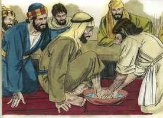
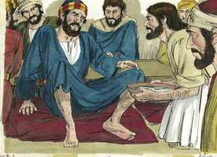
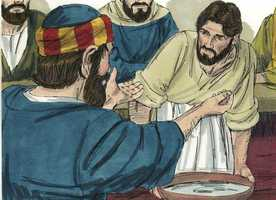
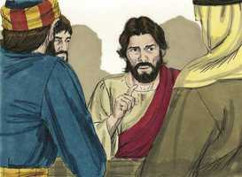
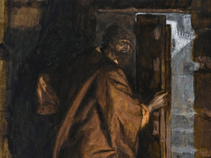
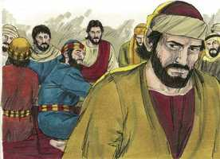
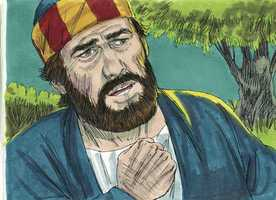
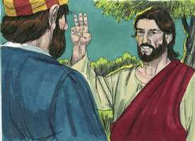

# João Cap 13

**1** 	ORA, antes da festa da páscoa, sabendo Jesus que já era chegada a sua hora de passar deste mundo para o Pai, como havia amado os seus, que estavam no mundo, amou-os até o fim.

**2** 	E, acabada a ceia, tendo já o diabo posto no coração de Judas Iscariotes, filho de Simão, que o traísse,

**3** 	Jesus, sabendo que o Pai tinha depositado nas suas mãos todas as coisas, e que havia saído de Deus e ia para Deus,

 

**4** 	Levantou-se da ceia, tirou as vestes, e, tomando uma toalha, cingiu-se.

**5** 	Depois deitou água numa bacia, e começou a lavar os pés aos discípulos, e a enxugar-lhos com a toalha com que estava cingido.

 

**6** 	Aproximou-se, pois, de Simão Pedro, que lhe disse: Senhor, tu lavas-me os pés a mim?

 

**7** 	Respondeu Jesus, e disse-lhe: O que eu faço não o sabes tu agora, mas tu o saberás depois.

**8** 	Disse-lhe Pedro: Nunca me lavarás os pés. Respondeu-lhe Jesus: Se eu te não lavar, não tens parte comigo.

**9** 	Disse-lhe Simão Pedro: Senhor, não só os meus pés, mas também as mãos e a cabeça.

 

**10** 	Disse-lhe Jesus: Aquele que está lavado não necessita de lavar senão os pés, pois no mais todo está limpo. Ora vós estais limpos, mas não todos.

**11** 	Porque bem sabia ele quem o havia de trair; por isso disse: Nem todos estais limpos.

**12** 	Depois que lhes lavou os pés, e tomou as suas vestes, e se assentou outra vez à mesa, disse-lhes: Entendeis o que vos tenho feito?

 

**13** 	Vós me chamais Mestre e Senhor, e dizeis bem, porque eu o sou.

**14** 	Ora, se eu, Senhor e Mestre, vos lavei os pés, vós deveis também lavar os pés uns aos outros.

**15** 	Porque eu vos dei o exemplo, para que, como eu vos fiz, façais vós também.

**16** 	Na verdade, na verdade vos digo que não é o servo maior do que o seu senhor, nem o enviado maior do que aquele que o enviou.

**17** 	Se sabeis estas coisas, bem-aventurados sois se as fizerdes.

**18** 	Não falo de todos vós; eu bem sei os que tenho escolhido; mas para que se cumpra a Escritura: O que come o pão comigo, levantou contra mim o seu calcanhar.

 

**19** 	Desde agora vo-lo digo, antes que aconteça, para que, quando acontecer, acrediteis que eu sou.

**20** 	Na verdade, na verdade vos digo: Se alguém receber o que eu enviar, me recebe a mim, e quem me recebe a mim, recebe aquele que me enviou.

**21** 	Tendo Jesus dito isto, turbou-se em espírito, e afirmou, dizendo: Na verdade, na verdade vos digo que um de vós me há de trair.

 

**22** 	Então os discípulos olhavam uns para os outros, duvidando de quem ele falava.

**23** 	Ora, um de seus discípulos, aquele a quem Jesus amava, estava reclinado no seio de Jesus.

**24** 	Então Simão Pedro fez sinal a este, para que perguntasse quem era aquele de quem ele falava.

**25** 	E, inclinando-se ele sobre o peito de Jesus, disse-lhe: Senhor, quem é?

**26** 	Jesus respondeu: É aquele a quem eu der o bocado molhado. E, molhando o bocado, o deu a Judas Iscariotes, filho de Simão.

 

**27** 	E, após o bocado, entrou nele Satanás. Disse, pois, Jesus: O que fazes, faze-o depressa.

 

**28** 	E nenhum dos que estavam assentados à mesa compreendeu a que propósito lhe dissera isto.

**29** 	Porque, como Judas tinha a bolsa, pensavam alguns que Jesus lhe tinha dito: Compra o que nos é necessário para a festa; ou que desse alguma coisa aos pobres.

**30** 	E, tendo Judas tomado o bocado, saiu logo. E era já noite.

 

**31** 	Tendo ele, pois, saído, disse Jesus: Agora é glorificado o Filho do homem, e Deus é glorificado nele.

**32** 	Se Deus é glorificado nele, também Deus o glorificará em si mesmo, e logo o há de glorificar.

**33** 	Filhinhos, ainda por um pouco estou convosco. Vós me buscareis, mas, como tenho dito aos judeus: Para onde eu vou não podeis vós ir; eu vo-lo digo também agora.

**34** 	Um novo mandamento vos dou: Que vos ameis uns aos outros; como eu vos amei a vós, que também vós uns aos outros vos ameis.

**35** 	Nisto todos conhecerão que sois meus discípulos, se vos amardes uns aos outros.

**36** 	Disse-lhe Simão Pedro: Senhor, para onde vais? Jesus lhe respondeu: Para onde eu vou não podes agora seguir-me, mas depois me seguirás.

 

**37** 	Disse-lhe Pedro: Por que não posso seguir-te agora? Por ti darei a minha vida.

 

**38** 	Respondeu-lhe Jesus: Tu darás a tua vida por mim? Na verdade, na verdade te digo que não cantará o galo enquanto não me tiveres negado três vezes.

 

> **Cmt MHenry** Intro: Pedro passou por alto o que Cristo dissera sobre o amor fraternal, mas falou daquilo sobre o qual Cristo os manteve ignorantes. Comum é ter mais zelo por saber coisas secretas, que correspondem somente a Deus, que por coisas reveladas que nos correspondem a nós e a nossos filhos; ter mais desejo de satisfazer nossa curiosidade que dirigir nossa consciência; saber o que se faz no céu mais do que devemos fazer nós para chegar lá. Quão logo se deixa de falar sobre o que é claro e edificante, enquanto se continua o debate duvidoso como luta interminável de palavras! Somos dados a levar a mal que nos digam que não podemos fazer isto ou aquilo, embora sem Cristo nada podemos fazer. Cristo nos conhece melhor que nós mesmos, e tem muitas maneiras de descobrir aos que ama, e esconder o orgulho para eles. Dediquemo-nos a manter a unidade do Espírito no vínculo da paz, a amar-nos fervorosamente uns a outros com coração puro, e a andar humildemente com nosso Deus.> Cristo tinha sido glorificado em muitos milagres que operou, porém fala de ser glorificado, agora, em seus sofrimentos, como se isso fosse mais que todas suas outras glórias em seu estado de humilhação. Assim foi feita satisfação pelo mal feito a Deus por causa do pecado do homem. Não podemos seguir a nosso Senhor a sua felicidade celestial, mas se crermos verdadeiramente nEle, o seguiremos no além; nesse ínterim, devemos esperar seu tempo e fazer sua obra. Antes que Cristo deixasse os discípulos, lhes daria um novo mandamento. Eles deviam amar-se uns a outros por amor a Cristo e, conforme com seu exemplo, buscar o que beneficia o próximo, e fomenta a causa do evangelho, como um só corpo animado por uma só alma. este mandamento ainda parece *novo* para muitos professantes. Em geral, os homens percebem qualquer outra palavra de Cristo antes destas. Por isto é revelado, que se os seguidores de Cristo não se demonstram amor uns a outros, dão causa para suspeitar de sua sinceridade.> Nosso Senhor tinha falado, freqüentemente, de seus sofrimentos e morte, sem essa turvação de espírito como a que agora revela quando fala de Judas. Os pecados dos cristãos são a tristeza de Cristo. Não devemos limitar nossa atenção a Judas. A profecia de sua traição pode aplicar-se a todos os que participam das misericórdias de Deus e as recebem com ingratidão. Veja-se o infiel que somente atenta às Escrituras com o desejo de eliminar sua autoridade e destruir sua influência; o hipócrita que professa crer nas Escrituras, mas não se governa por elas; e o apóstata que se afasta de Cristo por uma ninharia. Assim, pois, a humanidade, sustentada pela providência de Deus, depois de comer pão com Ele, alça contra Ele seu calcanhar! Judas saiu como um cansado de Jesus e de seus apóstolos. Aqueles cujas obras são más amam as trevas mais que a luz.> Nosso Senhor Jesus tem um povo no mundo que é seu; o comprou e pagou caro por eles, e os separou para sim; eles se rendem a Ele como povo peculiar. Aos que Cristo ama, os ama até o sumo. Nada pode separar do amor de Cristo o crente verdadeiro. Não sabemos quando chegará nossa hora, por isso, o que devemos fazer como preparativo constante para ela, nunca deve ficar sem ser feito. Não podemos saber que caminho de acesso aos corações dos homens tem o diabo, mas alguns pecados são tão excessivamente pecaminosos, e é tão pouca a tentação a eles de parte do mundo e a carne, que é evidente que vêm diretamente de parte de Satanás. Jesus lavou os pés dos discípulos para ensinar-nos a pensar que nada nos rebaixa se podemos fomentar a glória de Deus e o bem de nossos irmãos. Devemos dirigir-nos ao dever e deixar de lado todo o que impede o que devemos fazer. Cristo lavou os pés dos discípulos para representá-lhes o valor do lavamento espiritual, e a limpeza da alma das contaminações do pecado. Nosso Senhor Jesus faz muitas coisas cujo significado nem seus discípulos sabem no presente, mas o saberão depois. Ao final vemos que era o bom dos fatos que pareciam piores. Não é humildade, senão incredulidade rejeitar a oferta do evangelho como se fossem demasiado ricos para que seja para nós, ou notícia demasiado boa para ser verdadeira. Todos os que são espiritualmente lavados por Cristo têm parte nEle, e somente eles. A todos os que Cristo reconhece e salva, os justifica e santifica. Pedro se submete mais do requerido; roga ser lavado por Cristo. Quão fervoroso é pela graça purificadora do Senhor Jesus, e o efeito total dela, até em suas mãos e cabeça! Os que desejam verdadeiramente ser santificados, desejam ser santificados por completo, e que seja purificado todo o homem, em todas suas partes e poderes. O crente verdadeiro é assim lavado quando recebe a Cristo para sua salvação. Então, veja-se qual deve ser o afã diário dos que, pela graça, estão num estado justificado, isto é, lavar seus pés; limpar a culpa diária, e estar alertas contra toda coisa contaminante. Isto deve fazer-nos sumamente cautos. Desde o perdão de ontem devemos ser fortalecidos contra a tentação deste dia. Quando se descobrem hipócritas, não deve ser surpresa nem causa de tropeço para nós. Atentem na lição que ensina aqui Cristo. Os deveres são mútuos; devemos aceitar ajuda de nossos irmãos e devemos dar-lhes ajuda. Quando vemos que nosso Mestre serve, não podemos senão ver quão inconveniente é dominar para nós. E o mesmo amor que levou a Cristo a resgatar e reconciliar a seus discípulos, quando eram inimigos, ainda influi sobre Ele.