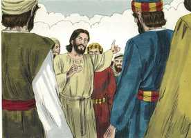

# Atos dos Apóstolos Cap 01

**1** 	FIZ o primeiro tratado, ó Teófilo, acerca de tudo que Jesus começou, não só a fazer, mas a ensinar,

**2** 	Até ao dia em que foi recebido em cima, depois de ter dado mandamentos, pelo Espírito Santo, aos apóstolos que escolhera;

**3** 	Aos quais também, depois de ter padecido, se apresentou vivo, com muitas e infalíveis provas, sendo visto por eles por espaço de quarenta dias, e falando das coisas concernentes ao reino de Deus.

**4** 	E, estando com eles, determinou-lhes que não se ausentassem de Jerusalém, mas que esperassem a promessa do Pai, que, disse ele, de mim ouvistes.

 

**5** 	Porque, na verdade, João batizou com água, mas vós sereis batizados com o Espírito Santo, não muito depois destes dias.

**6** 	Aqueles, pois, que se haviam reunido perguntaram-lhe, dizendo: Senhor, restaurarás tu neste tempo o reino a Israel?

 

**7** 	E disse-lhes: Não vos pertence saber os tempos ou as estações que o Pai estabeleceu pelo seu próprio poder.

 

**8** 	Mas recebereis a virtude do Espírito Santo, que há de vir sobre vós; e ser-me-eis testemunhas, tanto em Jerusalém como em toda a Judéia e Samaria, e até aos confins da terra.

**9** 	E, quando dizia isto, vendo-o eles, foi elevado às alturas, e uma nuvem o recebeu, ocultando-o a seus olhos.

 

**10** 	E, estando com os olhos fitos no céu, enquanto ele subia, eis que junto deles se puseram dois homens vestidos de branco.

**11** 	Os quais lhes disseram: Homens galileus, por que estais olhando para o céu? Esse Jesus, que dentre vós foi recebido em cima no céu, há de vir assim como para o céu o vistes ir.

 

**12** 	Então voltaram para Jerusalém, do monte chamado das Oliveiras, o qual está perto de Jerusalém, à distância do caminho de um sábado.

**13** 	E, entrando, subiram ao cenáculo, onde habitavam Pedro e Tiago, João e André, Filipe e Tomé, Bartolomeu e Mateus, Tiago, filho de Alfeu, Simão, o Zelote, e Judas, irmão de Tiago.

 

**14** 	Todos estes perseveravam unanimemente em oração e súplicas, com as mulheres, e Maria mãe de Jesus, e com seus irmãos.

**15** 	E naqueles dias, levantando-se Pedro no meio dos discípulos (ora a multidão junta era de quase cento e vinte pessoas) disse:

 

**16** 	Homens irmãos, convinha que se cumprisse a Escritura que o Espírito Santo predisse pela boca de Davi, acerca de Judas, que foi o guia daqueles que prenderam a Jesus;

**17** 	Porque foi contado conosco e alcançou sorte neste ministério.

**18** 	Ora, este adquiriu um campo com o galardão da iniqüidade; e, precipitando-se, rebentou pelo meio, e todas as suas entranhas se derramaram.

 

**19** 	E foi notório a todos os que habitam em Jerusalém; de maneira que na sua própria língua esse campo se chama Aceldama, isto é, Campo de Sangue.

**20** 	Porque no livro dos Salmos está escrito: Fique deserta a sua habitação, E não haja quem nela habite, e: Tome outro o seu bispado.

**21** 	É necessário, pois, que, dos homens que conviveram conosco todo o tempo em que o Senhor Jesus entrou e saiu dentre nós,

**22** 	Começando desde o batismo de João até ao dia em que de entre nós foi recebido em cima, um deles se faça conosco testemunha da sua ressurreição.

**23** 	E apresentaram dois: José, chamado Barsabás, que tinha por sobrenome o Justo, e Matias.

 

**24** 	E, orando, disseram: Tu, Senhor, conhecedor dos corações de todos, mostra qual destes dois tens escolhido,

 

**25** 	Para que tome parte neste ministério e apostolado, de que Judas se desviou, para ir para o seu próprio lugar.

**26** 	E, lançando-lhes sortes, caiu a sorte sobre Matias. E por voto comum foi contado com os onze apóstolos.

 

> **Cmt MHenry** Intro: " A grande coisa da que os apóstolos deviam testificar ante o mundo era a ressurreição de Cristo, porque era a grande prova de que Ele era o Messias, e o fundamento de nossa esperança nEle. Os apóstolos foram ordenados não para assumirem dignidades e poderes mundanos, senão para pregar a Cristo e o poder de sua ressurreição. Foi feita uma apelação a Deus: "Tu, Senhor, que conheces os corações de todos", coisa que nós não, e é melhor que eles conheçam o seu. É adequado que Deus escolha seus servos e, na medida em que Ele, pelas disposições de sua providência ou os dons do Espírito, mostra a quem tem escolhido, ou que tem escolhido para nós, devemos adequar-nos a sua vontade. Reconheçamos sua mão na determinação de cada coisa que nos sobrevenha, especialmente em alguma comissão que nos seja encarregada. "> Deus pode achar lugares de refúgio para seu povo. Eles suplicaram. Todo o povo de Deus é um povo de oração. Agora era o momento dos problemas e perigos para os discípulos de Cristo; contudo, se alguém está afligido, ore; isso silenciará suas preocupações e temores. Agora tinham uma grande obra que fazer e, antes que a começassem, oraram fervorosamente a Deus pedindo sua presença. Esperando o derramamento do Espírito e abundando em oração. Os que estão orando são os que estão em melhor situação para receber bênçãos espirituais. Cristo tinha prometido enviar logo o Espírito Santo; essa promessa não devia eliminar a oração, senão vivificá-la e alentá-la. Um grupo pequeno unido em amor, de conduta exemplar, fervoroso para orar, e sabiamente zeloso para o progresso da causa de Cristo, provavelmente cresça com rapidez.> Apressaram-se para perguntar o que seu Mestre nunca lhes mandou nem os animou a procurar. Nosso Senhor sabia que sua ascensão e o ensino do Espírito Santo logo dariam fim a essas expectativas e, portanto, somente os repreendeu; todavia isto é uma advertência para sua Igreja de todos os tempos: cuidar-se de desejar conhecimentos proibidos. Tinha dado instruções a seus discípulos para que cumprissem seu dever, tanto antes de sua morte e desde sua ressurreição, e este conhecimento basta para o cristão. Basta que Ele tenha-se proposto dar aos crentes uma força igual a suas provações e serviços; que, sob o poder do Espírito Santo, sejam de uma ou de outra forma testemunhas de Cristo na terra, enquanto no céu Ele cuida com perfeita sabedoria, verdade e amor de seus interesses. Quando ficamos olhando e preocupados em ninharias, que o pensar na segunda vinda de nosso Mestre nos estimule e acorde: quando fiquemos olhando e tremendo, que nos consolem e animem. Que nossa expectativa assim seja constante e jubilosa, tendo diligência para sermos achados irrepreensíveis por Ele.> Nosso Senhor disse aos discípulos a obra que tinham que fazer. Os apóstolos se reuniram em Jerusalém, tendo-lhes mandado Cristo que não saíssem dali, senão que esperassem o derramamento do Espírito Santo. Isto seria um batismo pelo Espírito Santo, que lhes daria poder para fazer milagres e iluminaria e santificaria suas almas. Isto confirma a promessa divina e nos anima para dependermos dela, porque a ouvimos de Cristo e nEle todas as promessas de Deus são sim e amém.