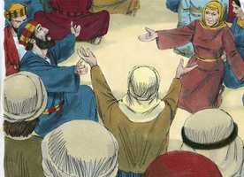
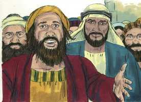
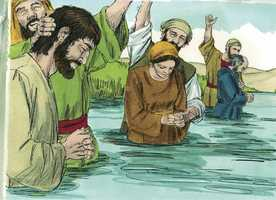

# Atos dos Apóstolos Cap 02

**1** 	E, CUMPRINDO-SE o dia de Pentecostes, estavam todos concordemente no mesmo lugar;

 

**2** 	E de repente veio do céu um som, como de um vento veemente e impetuoso, e encheu toda a casa em que estavam assentados.

**3** 	E foram vistas por eles línguas repartidas, como que de fogo, as quais pousaram sobre cada um deles.

 

**4** 	E todos foram cheios do Espírito Santo, e começaram a falar noutras línguas, conforme o Espírito Santo lhes concedia que falassem.

**5** 	E em Jerusalém estavam habitando judeus, homens religiosos, de todas as nações que estão debaixo do céu.

**6** 	E, quando aquele som ocorreu, ajuntou-se uma multidão, e estava confusa, porque cada um os ouvia falar na sua própria língua.

 

**7** 	E todos pasmavam e se maravilhavam, dizendo uns aos outros: Pois quê! não são galileus todos esses homens que estão falando?

 

**8** 	Como, pois, os ouvimos, cada um, na nossa própria língua em que somos nascidos?

**9** 	Partos e medos, elamitas e os que habitam na Mesopotâmia, Judéia, Capadócia, Ponto e Ásia,

**10** 	E Frígia e Panfília, Egito e partes da Líbia, junto a Cirene, e forasteiros romanos, tanto judeus como prosélitos,

**11** 	Cretenses e árabes, todos nós temos ouvido em nossas próprias línguas falar das grandezas de Deus.

**12** 	E todos se maravilhavam e estavam suspensos, dizendo uns para os outros: Que quer isto dizer?

**13** 	E outros, zombando, diziam: Estão cheios de mosto.

**14** 	Pedro, porém, pondo-se em pé com os onze, levantou a sua voz, e disse-lhes: Homens judeus, e todos os que habitais em Jerusalém, seja-vos isto notório, e escutai as minhas palavras.

 

**15** 	Estes homens não estão embriagados, como vós pensais, sendo a terceira hora do dia.

 

**16** 	Mas isto é o que foi dito pelo profeta Joel:

 

**17** 	E nos últimos dias acontecerá, diz Deus, Que do meu Espírito derramarei sobre toda a carne; E os vossos filhos e as vossas filhas profetizarão, Os vossos jovens terão visões, E os vossos velhos sonharão sonhos;

**18** 	E também do meu Espírito derramarei sobre os meus servos e as minhas servas naqueles dias, e profetizarão;

**19** 	E farei aparecer prodígios em cima, no céu; E sinais em baixo na terra, Sangue, fogo e vapor de fumo.

**20** 	O sol se converterá em trevas, E a lua em sangue, Antes de chegar o grande e glorioso dia do Senhor;

**21** 	E acontecerá que todo aquele que invocar o nome do Senhor será salvo.

**22** 	Homens israelitas, escutai estas palavras: A Jesus Nazareno, homem aprovado por Deus entre vós com maravilhas, prodígios e sinais, que Deus por ele fez no meio de vós, como vós mesmos bem sabeis;

 

**23** 	A este que vos foi entregue pelo determinado conselho e presciência de Deus, prendestes, crucificastes e matastes pelas mãos de injustos;

**24** 	Ao qual Deus ressuscitou, soltas as ânsias da morte, pois não era possível que fosse retido por ela;

**25** 	Porque dele disse Davi: Sempre via diante de mim o Senhor, Porque está à minha direita, para que eu não seja comovido;

**26** 	Por isso se alegrou o meu coração, e a minha língua exultou; E ainda a minha carne há de repousar em esperança;

**27** 	Pois não deixarás a minha alma no inferno, Nem permitirás que o teu Santo veja a corrupção;

**28** 	Fizeste-me conhecidos os caminhos da vida; Com a tua face me encherás de júbilo.

**29** 	Homens irmãos, seja-me lícito dizer-vos livremente acerca do patriarca Davi, que ele morreu e foi sepultado, e entre nós está até hoje a sua sepultura.

**30** 	Sendo, pois, ele profeta, e sabendo que Deus lhe havia prometido com juramento que do fruto de seus lombos, segundo a carne, levantaria o Cristo, para o assentar sobre o seu trono,

**31** 	Nesta previsão, disse da ressurreição de Cristo, que a sua alma não foi deixada no inferno, nem a sua carne viu a corrupção.

**32** 	Deus ressuscitou a este Jesus, do que todos nós somos testemunhas.

**33** 	De sorte que, exaltado pela destra de Deus, e tendo recebido do Pai a promessa do Espírito Santo, derramou isto que vós agora vedes e ouvis.

**34** 	Porque Davi não subiu aos céus, mas ele próprio diz: Disse o Senhor ao meu Senhor: Assenta-te à minha direita,

**35** 	Até que ponha os teus inimigos por escabelo de teus pés.

**36** 	Saiba, pois, com certeza toda a casa de Israel que a esse Jesus, a quem vós crucificastes, Deus o fez Senhor e Cristo.

**37** 	E, ouvindo eles isto, compungiram-se em seu coração, e perguntaram a Pedro e aos demais apóstolos: Que faremos, homens irmãos?

 

**38** 	E disse-lhes Pedro: Arrependei-vos, e cada um de vós seja batizado em nome de Jesus Cristo, para perdão dos pecados; e recebereis o dom do Espírito Santo;

 

**39** 	Porque a promessa vos diz respeito a vós, a vossos filhos, e a todos os que estão longe, a tantos quantos Deus nosso Senhor chamar.

**40** 	E com muitas outras palavras isto testificava, e os exortava, dizendo: Salvai-vos desta geração perversa.

**41** 	De sorte que foram batizados os que de bom grado receberam a sua palavra; e naquele dia agregaram-se quase três mil almas,

 

**42** 	E perseveravam na doutrina dos apóstolos, e na comunhão, e no partir do pão, e nas orações.

**43** 	E em toda a alma havia temor, e muitas maravilhas e sinais se faziam pelos apóstolos.

**44** 	E todos os que criam estavam juntos, e tinham tudo em comum.

**45** 	E vendiam suas propriedades e bens, e repartiam com todos, segundo cada um havia de mister.

**46** 	E, perseverando unânimes todos os dias no templo, e partindo o pão em casa, comiam juntos com alegria e singeleza de coração,

 

**47** 	Louvando a Deus, e caindo na graça de todo o povo. E todos os dias acrescentava o Senhor à igreja aqueles que se haviam de salvar.

> **Cmt MHenry** Intro: Nestes versículos temos a história da igreja verdadeiramente primitiva, de seus primeiros tempos; seu estado de verdadeira infância, mas como aquele, seu estado de maior inocência. Mantiveram-se perto das ordenanças santas e abundaram em piedade e devoção; porque o cristianismo, uma vez que se admite em seu poder, dispõe a alma à comunhão com Deus em todas essas formas estabelecidas para que nos encontremos com Ele, e em que tem prometido reunir-se conosco. A grandeza do acontecimento os elevou por acima do mundo, e o Espírito Santo os encheu com tal amor que fez que cada um fosse para outro como para si mesmo e, assim, fez que todas as coisas foram em comum, sem destruir a propriedade, senão suprimindo o egoísmo e provocando o amor. Deus, que os moveu a isso, sabia que eles seriam rapidamente expulsos de suas possessões na Judéia. O Senhor, de dia em dia, inclinava mais os corações a abraçar o evangelho; não simples professantes, senão os que eram realmente levados a um estado de aceitação ante Deus, sendo partícipes da graça regeneradora. Os que Deus tem designado para a salvação eterna, serão eficazmente conduzidos a Cristo até que a terra seja enchida do conhecimento de sua glória.> Desde a primeira entrega da mensagem divina foi visto que nele havia poder divino; milhares foram levados à obediência da fé. Porém, nem as palavras de Pedro nem o milagre presenciado puderam produzir tais efeitos se não tivesse sido entregue o Espírito Santo. Quando os olhos dos pecadores são abertos, não podem sentir senão contrição de coração pelo pecado, não podem menos que sentir uma inquietude interior. O apóstolo os exorta a arrepender-se de seus pecados e confessar abertamente sua fé em Jesus como o Messias, e a serem batizados em seu nome. Assim, pois, professando sua fé nEle, receberiam a remissão de seus pecados, e participariam dos dons e graças do Espírito Santo. Separar-se da gente ímpia é a única maneira de salvar-nos deles. Os que se arrependem de seus pecados e se entregam a Jesus Cristo, devem provar sua sinceridade desembaraçando-se dos ímpios. Devemos salvar-nos deles, o qual supõe evitá-los com horror e santo temor. Pela graça de Deus, três mil pessoas aceitaram o convite do evangelho. Não pode existir dúvida de que o dom do Espírito Santo, que todos receberam, e do qual nenhum crente verdadeiro tem sido jamais excetuado, era esse Espírito de adoção, essa graça que converte, guia e santifica, a qual se dá a todos os membros da família de nosso Pai celestial. O arrependimento e a remissão dos pecados ainda se pregam aos principais dos pecadores em nome do Redentor; o Espírito Santo ainda sela a bênção no coração do crente; as promessas alentadoras ainda são para nós e para nossos filhos; e ainda se oferecem as bênçãos a todos os que estão longe.> A partir deste dom do Espírito Santo, Pedro lhes prega a Jesus: e eis a história de Cristo. Há aqui um relato de sua morte e seus sofrimentos, que eles presenciaram umas poucas semanas antes. Sua morte é considerada como ato de Deus, e de maravilhosa graça e sabedoria. De modo que a justiça divina deve ser satisfeita, Deus e o homem reunidos de novo, e Cristo mesmo glorificado, conforme o conselho eterno que não pode ser modificado. Enquanto à ação das pessoas, foi um ato de pecado e tolice horrendos deles. A ressurreição de Cristo suprime a reprimenda de sua morte; Pedro fala muito disso. Cristo era o Santo de Deus, santificado e separado para seu serviço na obra da redenção. Sua morte e sofrimento devem ser a entrada a uma vida abençoada para sempre jamais, não só para Ele senão para todos os seus. Este fato teve lugar segundo estava profetizado e os apóstolos foram testemunhas. A ressurreição não se apoiou somente sobre isto; Cristo tinha derramado dons miraculosos e influências divinas sobre seus discípulos e eles foram testemunhas de seus efeitos. Mediante o Salvador se dão a conhecer os caminhos da vida e somos exortados a esperar a presença de Deus e seu favor para sempre. tudo isso surge da crença segura de que Jesus é o Senhor e o Salvador ungido.> O sermão de Pedro mostra que estava completamente recuperado de sua queda e cabalmente restaurado ao favor divino; porque o que tinha negado a Cristo, agora o confessava ousadamente. Seu relato do derramamento miraculoso do Espírito Santo estava concebido para estimular a seus ouvintes a que abraçassem a fé de Cristo e se unissem a sua Igreja. Foi cumprimento da Escritura e fruto da ressurreição e ascensão de Cristo, e prova de ambos. Embora Pedro estava cheio do Espírito Santo e falava em línguas conforme o Espírito lhe dava que falasse, não pensou em deixar de lado as Escrituras. Os sábios de Cristo nunca aprendem mais que sua Bíblia; e o Espírito é entregue não para suprimir as Escrituras, senão para capacitar-nos para entendê-las, aprová-las e obedecê-las. Com toda seguridade ninguém escapará da condenação do grande dia, salvo os que invocarem o nome do dinheiro, em e por meio de seu Filho Jesus Cristo, como o Salvador de pecadores, e o Juiz de toda a humanidade.> A diferença de línguas que surgiu em Babel tem incomodado muito a difusão do conhecimento e da religião. Os instrumentos que o Senhor empregou primeiro para difundir a religião cristã, não poderiam ter progredido sem este dom, o qual provou que sua autoridade era de Deus.> Não podemos esquecer com quanta freqüência, apesar de que seu Mestre estava com eles, houve discussões entre os discípulos sobre qual seria o maior, porém agora todas essas discórdias haviam terminado. Tinham orado juntos mais que antes. Se desejarmos que o Espírito seja derramado sobre nós desde o alto, tenhamos unanimidade. Pese às diferenças de sentimentos e interesses, como havia entre esses discípulos, fiquemos de acordo para amar-nos uns a outros, porque onde os irmãos habitam juntos em unidade, ali manda o Senhor sua bênção. Um vento potente chegou com muita forca. Isto era para significar as influências e a obra poderosa do Espírito de Deus nas mentes dos homens, e por meio deles, no mundo. Deste modo, as convicções do Espírito dão lugar a suas consolações; e as rachadas rigorosas desse vento abençoado preparam a alma para seus zéfiros suaves e amáveis. Houve uma aparência de algo como chamas de fogo, que iluminou a cada um deles, segundo o que João Batista dizia de Cristo: Ele os batizará com o Espírito e com fogo. O Espírito, como fogo, derrete o coração, queima a escória e acende afetos piedosos e devotos na alma, na qual, como o fogo do altar, são oferecidos os sacrifícios espirituais. Foram cheios do Espírito Santo mais que antes. Foram cheios das graças do Espírito, e mais que antes, colocados sob sua influência santificadora; mais separados deste mundo, e mais familiarizados com o outro. Foram cheios mais com as consolações do Espírito, e se regozijaram mais que antes no amor de Cristo e na esperança do céu: nisso foram absorvidos todos seus temores e suas penas. Foram cheios dos dons do Espírito Santo; tiveram poderes miraculosos para o avanço do evangelho. Falaram, não de pensamentos ou meditações prévios, senão como o Espírito lhes dava que falassem.