# Atos dos Apóstolos Cap 04

**1** 	E, ESTANDO eles falando ao povo, sobrevieram os sacerdotes, e o capitão do templo, e os saduceus,

**2** 	Doendo-se muito de que ensinassem o povo, e anunciassem em Jesus a ressurreição dentre os mortos.

**3** 	E lançaram mão deles, e os encerraram na prisão até ao dia seguinte, pois já era tarde.

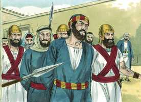 

**4** 	Muitos, porém, dos que ouviram a palavra creram, e chegou o número desses homens a quase cinco mil.

**5** 	E aconteceu, no dia seguinte, reunirem-se em Jerusalém os seus principais, os anciãos, os escribas,

**6** 	E Anás, o sumo sacerdote, e Caifás, e João, e Alexandre, e todos quantos havia da linhagem do sumo sacerdote.

**7** 	E, pondo-os no meio, perguntaram: Com que poder ou em nome de quem fizestes isto?

 

**8** 	Então Pedro, cheio do Espírito Santo, lhes disse: Principais do povo, e vós, anciãos de Israel,

**9** 	Visto que hoje somos interrogados acerca do benefício feito a um homem enfermo, e do modo como foi curado,

**10** 	Seja conhecido de vós todos, e de todo o povo de Israel, que em nome de Jesus Cristo, o Nazareno, aquele a quem vós crucificastes e a quem Deus ressuscitou dentre os mortos, em nome desse é que este está são diante de vós.

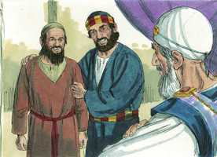 

**11** 	Ele é a pedra que foi rejeitada por vós, os edificadores, a qual foi posta por cabeça de esquina.

 

**12** 	E em nenhum outro há salvação, porque também debaixo do céu nenhum outro nome há, dado entre os homens, pelo qual devamos ser salvos.

**13** 	Então eles, vendo a ousadia de Pedro e João, e informados de que eram homens sem letras e indoutos, maravilharam-se e reconheceram que eles haviam estado com Jesus.

 

**14** 	E, vendo estar com eles o homem que fora curado, nada tinham que dizer em contrário.

**15** 	Todavia, mandando-os sair fora do conselho, conferenciaram entre si,

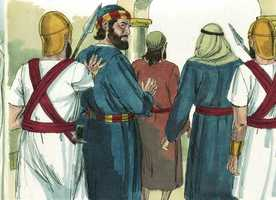 

**16** 	Dizendo: Que havemos de fazer a estes homens? porque a todos os que habitam em Jerusalém é manifesto que por eles foi feito um sinal notório, e não o podemos negar;

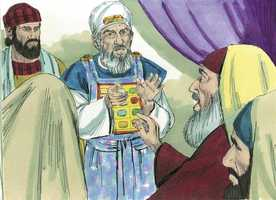 

**17** 	Mas, para que não se divulgue mais entre o povo, ameacemo-los para que não falem mais nesse nome a homem algum.

**18** 	E, chamando-os, disseram-lhes que absolutamente não falassem, nem ensinassem, no nome de Jesus.

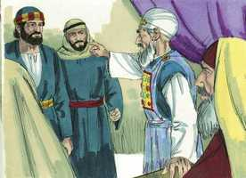 

**19** 	Respondendo, porém, Pedro e João, lhes disseram: Julgai vós se é justo, diante de Deus, ouvir-vos antes a vós do que a Deus;

 

**20** 	Porque não podemos deixar de falar do que temos visto e ouvido.

**21** 	Mas eles ainda os ameaçaram mais e, não achando motivo para os castigar, deixaram-nos ir, por causa do povo; porque todos glorificavam a Deus pelo que acontecera;

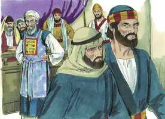 

**22** 	Pois tinha mais de quarenta anos o homem em quem se operara aquele milagre de saúde.

**23** 	E, soltos eles, foram para os seus, e contaram tudo o que lhes disseram os principais dos sacerdotes e os anciãos.

**24** 	E, ouvindo eles isto, unânimes levantaram a voz a Deus, e disseram: Senhor, tu és o Deus que fizeste o céu, e a terra, e o mar e tudo o que neles há;

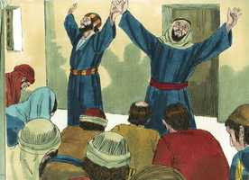 

**25** 	Que disseste pela boca de Davi, teu servo: Por que bramaram os gentios, e os povos pensaram coisas vãs?

**26** 	Levantaram-se os reis da terra, E os príncipes se ajuntaram à uma, Contra o Senhor e contra o seu Ungido.

**27** 	Porque verdadeiramente contra o teu santo Filho Jesus, que tu ungiste, se ajuntaram, não só Herodes, mas Pôncio Pilatos, com os gentios e os povos de Israel;

**28** 	Para fazerem tudo o que a tua mão e o teu conselho tinham anteriormente determinado que se havia de fazer.

**29** 	Agora, pois, ó Senhor, olha para as suas ameaças, e concede aos teus servos que falem com toda a ousadia a tua palavra;

**30** 	Enquanto estendes a tua mão para curar, e para que se façam sinais e prodígios pelo nome de teu santo Filho Jesus.

**31** 	E, tendo orado, moveu-se o lugar em que estavam reunidos; e todos foram cheios do Espírito Santo, e anunciavam com ousadia a palavra de Deus.

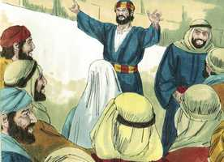 

**32** 	E era um o coração e a alma da multidão dos que criam, e ninguém dizia que coisa alguma do que possuía era sua própria, mas todas as coisas lhes eram comuns.

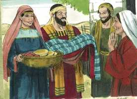 

**33** 	E os apóstolos davam, com grande poder, testemunho da ressurreição do Senhor Jesus, e em todos eles havia abundante graça.

**34** 	Não havia, pois, entre eles necessitado algum; porque todos os que possuíam herdades ou casas, vendendo-as, traziam o preço do que fora vendido, e o depositavam aos pés dos apóstolos.

**35** 	E repartia-se a cada um, segundo a necessidade que cada um tinha.

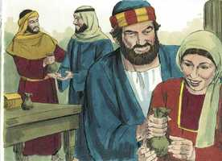 

**36** 	Então José, cognominado pelos apóstolos Barnabé (que, traduzido, é filho da consolação), levita, natural de Chipre,

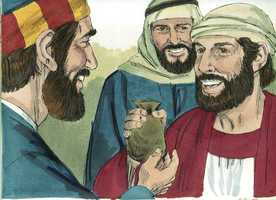 

**37** 	Possuindo uma herdade, vendeu-a, e trouxe o preço, e o depositou aos pés dos apóstolos.

> **Cmt MHenry** Intro: Os discípulos se amavam uns a outros. Isto era o bendito fruto do preceito da morte de Cristo para seus discípulos, e sua oração por eles quando estava a ponto de morrer. Assim foi então e assim será outra vez, quando o Espírito seja derramado sobre nós desde o alto. A doutrina pregada era a ressurreição de Cristo; um fato cumprido que, quando explicado devidamente, é o resumo de todos os deveres, privilégios e consolos dos cristãos. Havia frutos evidentes da graça de Cristo em todo o que diziam e faziam. Estavam mortos para este mundo. Isto era um grande prova da graça de Deus neles. Não se apoderavam da propriedade alheia, senão que eram indiferentes a ela. Não o chamavam de próprio, porque com afeto tinham abandonado tudo por Cristo, e esperavam ser despojados de tudo para aferrar-se a Ele. não assombra, pois, que fossem de um só coração e uma só alma, quando se desprenderam desse jeito da riqueza deste mundo. Em efeito, tinham todo em comum, de modo que não havia entre eles nenhum necessário, e cuidavam da provisão para eles. O dinheiro era colocado aos pés dos apóstolos. Deve-se exercer grande cuidado na distribuição da caridade pública para dar aos necessitados, já que não são capazes de procurar-se o sustento para si mesmos; deve-se prover aos que estão reduzidos à necessidade por fazer o bem, e pelo testemunho de uma boa consciência. Eis aqui um mencionado em particular, notável por esta caridade generosa: era Barnabé. Como quem é nomeado para ser um pregador do evangelho, ele se desembaraçou e soltou os assuntos desta vida. Quando prevalecem tais disposições, e são exercidas conforme às circunstâncias dos tempos, o testemunho terá um poder muito grande sobre o próximo.> " Os seguidores de Cristo andam em melhor forma quando vão em companhia, sempre e quando a companhia seja a de outros como eles. Estimula aos servos de Deus tanto ao realizar a obra como ao sofrer o trabalho, saber que servem ao Deus que fez todas as coisas e, portanto, dispõe todos os acontecimentos; e que as Escrituras devem cumprir-se. Jesus foi ungido para ser Salvador; portanto, estava determinado que fosse sacrifício expiatório pelo pecado. mas o pecado não é o mal menor para que Deus obtenha bem dele. Nas épocas ameaçadoras, nosso interesse não deve ser tanto evitar os problemas como poder continuar adiante com júbilo e valor em nossa obra e dever. Eles não oram: "Senhor, deixa-nos afastar-nos de nossa tarefa agora que se tornou perigosa", senão: "Senhor, dá-nos rua graça para seguir adiante com constância em nossa obra, e não temer o rosto do homem". Aqueles que desejam ajuda e exortação divinas, podem depender de que as têm, e devem sair e seguir avançando no poder do Senhor Deus. Ele deu um sinal de aceitar suas orações. O lugar tremeu para que a fé deles se estabilizasse e não fosse vacilante. Deus lhes deu maior grau de seu Espírito e todos eles foram cheios com o Espírito Santo mais que nunca; por isso não só foram estimulados, senão capacitados para falar com ousadia a Palavra de Deus. quando acham que o Senhor Deus os ajuda por seu Espírito, sabem que não serão confundidos ([Is 50.7](../23A-Is/50.md#7)). "> Todo o interesse dos governantes é que a doutrina de Cristo não se difunda entre o povo, embora não possam dizer que seja falsa ou perigosa ou de alguma má tendência; e se envergonham de reconhecer a razão verdadeira: que testifica contra sua hipocrisia, iniqüidade e tirania. Os que sabem valorar com justiça as promessas de Cristo, sabem desprezar, com justiça, as ameaças do mundo. Os apóstolos olham preocupados as almas que perecem e sabem que não podem fugir da ruína eterna senão por Jesus Cristo; portanto, são fiéis ao advertir e mostrar o caminho reto. Ninguém desfrutará de paz mental nem agirá retamente até que tenha aprendido a conduzir sua conduta pela norma da verdade, e não pelas opiniões e fantasias vacilantes dos homens. Cuidem-se especialmente da vã tentativa de servir a dois amos, a Deus e ao mundo; o final será que não se pode servir fielmente a nenhum.> Estando cheio do Espírito Santo, Pedro desejava que todos compreendessem que o milagre tinha sido operado no nome e no poder de Jesus de Nazaré, o Messias, ao qual eles haviam crucificado; e isso confirmava o testemunho de sua ressurreição dentre os mortos, o qual provava que era o Messias. Estes dirigentes deviam ser salvos por esse Jesus ao que haviam crucificado, ou perecer para sempre. o nome de Jesus é dado aos homens de toda idade e nação, porque os crentes são salvos da ira vindoura somente por Ele. Entretanto, quando a cobiça, o orgulho ou qualquer paixão corrupta reina por dentro, os homens fecham seus olhos e seus corações, com inimizade contra a luz, considerando ignorantes e incultos a todos os que desejam não saber nada se não é Cristo crucificado. Os seguidores de Cristo agirão dessa forma para que todos os que falem com eles saibam que têm estado com Jesus. isto o faz santos, celestiais, espirituais e jubilosos, e os eleva por acima deste mundo.> Os apóstolos pregaram a ressurreição dos mortos por meio de Jesus. Inclui toda a felicidade do estado futuro; eles pregaram isto através de justiça, porque somente por meio dEle pode ser obtida. Miserável é o caso daqueles para os quais é uma dor a glória do Reino de Cristo, porque, já que a glória desse reino é eterna, a dor deles também será eterna. Os servos inofensivos e úteis de Cristo, como os apóstolos, costumam ver-se afligidos por seu trabalho de fé e obra de amor, quando os ímpios escaparam. Até o presente não faltam casos em que a leitura das Escrituras, a oração em grupo e a conversação sobre temas religiosos encontram caras carrancudas e restrições, porém, se obedecermos aos preceitos de Cristo, Ele nos sustentará.