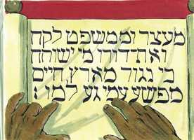
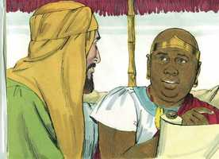
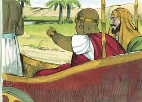

# Atos dos Apóstolos Cap 08

**1** 	E TAMBÉM Saulo consentiu na morte dele. E fez-se naquele dia uma grande perseguição contra a igreja que estava em Jerusalém; e todos foram dispersos pelas terras da Judéia e de Samaria, exceto os apóstolos.

 

**2** 	E uns homens piedosos foram enterrar Estêvão, e fizeram sobre ele grande pranto.

**3** 	E Saulo assolava a igreja, entrando pelas casas; e, arrastando homens e mulheres, os encerrava na prisão.

**4** 	Mas os que andavam dispersos iam por toda a parte, anunciando a palavra.

**5** 	E, descendo Filipe à cidade de Samaria lhes pregava a Cristo.

 

**6** 	E as multidões unanimemente prestavam atenção ao que Filipe dizia, porque ouviam e viam os sinais que ele fazia;

**7** 	Pois que os espíritos imundos saíam de muitos que os tinham, clamando em alta voz; e muitos paralíticos e coxos eram curados.

 

**8** 	E havia grande alegria naquela cidade.

**9** 	E estava ali um certo homem, chamado Simão, que anteriormente exercera naquela cidade a arte mágica, e tinha iludido o povo de Samaria, dizendo que era uma grande personagem;

 

**10** 	Ao qual todos atendiam, desde o menor até ao maior, dizendo: Este é a grande virtude de Deus.

**11** 	E atendiam-no, porque já desde muito tempo os havia iludido com artes mágicas.

**12** 	Mas, como cressem em Filipe, que lhes pregava acerca do reino de Deus, e do nome de Jesus Cristo, se batizavam, tanto homens como mulheres.

 

**13** 	E creu até o próprio Simão; e, sendo batizado, ficou de contínuo com Filipe; e, vendo os sinais e as grandes maravilhas que se faziam, estava atônito.

 

**14** 	Os apóstolos, pois, que estavam em Jerusalém, ouvindo que Samaria recebera a palavra de Deus, enviaram para lá Pedro e João.

 

**15** 	Os quais, tendo descido, oraram por eles para que recebessem o Espírito Santo

**16** 	(Porque sobre nenhum deles tinha ainda descido; mas somente eram batizados em nome do Senhor Jesus).

**17** 	Então lhes impuseram as mãos, e receberam o Espírito Santo.

 

**18** 	E Simão, vendo que pela imposição das mãos dos apóstolos era dado o Espírito Santo, lhes ofereceu dinheiro,

 

**19** 	Dizendo: Dai-me também a mim esse poder, para que aquele sobre quem eu puser as mãos receba o Espírito Santo.

**20** 	Mas disse-lhe Pedro: O teu dinheiro seja contigo para perdição, pois cuidaste que o dom de Deus se alcança por dinheiro.

 

**21** 	Tu não tens parte nem sorte nesta palavra, porque o teu coração não é reto diante de Deus.

**22** 	Arrepende-te, pois, dessa tua iniqüidade, e ora a Deus, para que porventura te seja perdoado o pensamento do teu coração;

**23** 	Pois vejo que estás em fel de amargura, e em laço de iniqüidade.

**24** 	Respondendo, porém, Simão, disse: Orai vós por mim ao Senhor, para que nada do que dissestes venha sobre mim.

**25** 	Tendo eles, pois, testificado e falado a palavra do Senhor, voltaram para Jerusalém e em muitas aldeias dos samaritanos anunciaram o evangelho.

 

**26** 	E o anjo do Senhor falou a Filipe, dizendo: Levanta-te, e vai para o lado do sul, ao caminho que desce de Jerusalém para Gaza, que está deserta.

**27** 	E levantou-se, e foi; e eis que um homem etíope, eunuco, mordomo-mor de Candace, rainha dos etíopes, o qual era superintendente de todos os seus tesouros, e tinha ido a Jerusalém para adoração,

 

**28** 	Regressava e, assentado no seu carro, lia o profeta Isaías.

 

**29** 	E disse o Espírito a Filipe: Chega-te, e ajunta-te a esse carro.

**30** 	E, correndo Filipe, ouviu que lia o profeta Isaías, e disse: Entendes tu o que lês?

 

**31** 	E ele disse: Como poderei entender, se alguém não me ensinar? E rogou a Filipe que subisse e com ele se assentasse.

 

**32** 	E o lugar da Escritura que lia era este: Foi levado como a ovelha para o matadouro; e, como está mudo o cordeiro diante do que o tosquia, Assim não abriu a sua boca.

 

**33** 	Na sua humilhação foi tirado o seu julgamento; E quem contará a sua geração? Porque a sua vida é tirada da terra.

 

**34** 	E, respondendo o eunuco a Filipe, disse: Rogo-te, de quem diz isto o profeta? De si mesmo, ou de algum outro?

 

**35** 	Então Filipe, abrindo a sua boca, e começando nesta Escritura, lhe anunciou a Jesus.

 

**36** 	E, indo eles caminhando, chegaram ao pé de alguma água, e disse o eunuco: Eis aqui água; que impede que eu seja batizado?

 

**37** 	E disse Filipe: É lícito, se crês de todo o coração. E, respondendo ele, disse: Creio que Jesus Cristo é o Filho de Deus.

**38** 	E mandou parar o carro, e desceram ambos à água, tanto Filipe como o eunuco, e o batizou.

 

**39** 	E, quando saíram da água, o Espírito do Senhor arrebatou a Filipe, e não o viu mais o eunuco; e, jubiloso, continuou o seu caminho.

 

**40** 	E Filipe se achou em Azoto e, indo passando, anunciava o evangelho em todas as cidades, até que chegou a Cesaréia.

> **Cmt MHenry** Intro: Felipe recebeu instruções de ir ao deserto. Às vezes, Deus abre uma porta de oportunidade a seus ministros nos lugares menos prováveis. Não devemos ser tão tímidos com os estranhos, como alguns afetam sê-lo. Enquanto a esses, dos quais nada sabemos, sabemos isto: têm almas. Sabedoria dos homens de negócios é redimir o tempo para os deveres santos; encher cada minuto com algo que resultará ser uma boa conta que render. Ao ler a palavra de Deus devemos fazer freqüentes pausas para perguntar de quem e de que falam os escritores sagrados, mas nossos pensamentos devem ocupar-se especialmente do Redentor. O etíope foi convencido pelos ensinamentos do Espírito Santo, do cumprimento exato da Escritura; foi-lhe feito compreender a natureza do reino do Messias e sua salvação, e desejou ser contado entre os discípulos de Cristo. os que buscam a verdade e dedicam tempo para esquadrinhar as Escrituras, estarão seguros de colher vantagens. A aceitação do etíope deve entender-se como que expressa uma confiança simples em Cristo para a salvação, e uma devoção sem limites a Ele. não nos basta obtermos fé, como o etíope, por meio do estudo diligente das Sagradas Escrituras, e o ensino do Espírito de Deus; não nos demos por satisfeitos até ter estabelecido em nossos corações seus princípios. Tão logo como o etíope foi batizado, o Espírito de Deus levou a Felipe, e não tornou a vê-lo. porém isso ajudou a confirmar sua fé. Quando o que busca a salvação chega a familiarizar-se com Jesus e seu evangelho, ira por seu caminho regozijando-se, e desempenhará seu posto na sociedade, cumprindo seus deveres, por outros motivos e de outra maneira que até então. Embora estejamos batizados com água no nome do Pai, do Filho e do Espírito Santo, não é suficiente sem o Bartolomeu do Espírito Santo. Senhor, concede isto a cada um de nós; então iremos por nosso caminho regozijando-nos.> O Espírito Santo ainda não tinha sido derramado sobre nenhum desses convertidos, com os poderes extraordinários transmitidos pelo derramamento do Espírito no dia de Pentecostes. Nós podemos cobrar ânimo deste exemplo, orando a Deus que de as graças renovadoras do Espírito Santo a todos aqueles por cujo bem-estar espiritual estamos interessados, porque elas incluem todas as bênçãos. Nenhum homem pode dar o Espírito Santo impondo suas mãos, mas devemos usar os melhores esforços para instruir àqueles pelos quais oramos. Simão o mago ambicionava ter a honra de um apóstolo, mas não estava em absoluto interessado em ter o espírito e a disposição do Cristo. Desejava mais ter honra para sim que fazer o bem ao próximo. Pedro lhe censura seu delito. Estimava a riqueza deste mundo como se correspondessem com as coisas que se relacionam com a outra vida, e desejava comprar o perdão do pecado, o dom do Espírito Santo e a vida eterna. Este era um erro condenatório de tal magnitude que de nenhuma maneira harmoniza com um estado de graça. Nossos corações são o que são ante os olhos de Deus, que não pode ser enganado e, se não podem ser justos ante seus olhos, nossa religião é vã e de nada nos serve. O coração orgulhoso e cobiçoso não pode ser justo diante de Deus. Pode que um homem continue sob o poder do pecado mesmo que se revista de uma forma de santidade. Quando sejas tentado com dinheiro a fazer o mal, vê quão perecível é o dinheiro e despreza-o. não penses que o cristianismo é um ofício do qual viver neste mundo. Existe muita maldade no pensamento do coração, noções falsas, afetos corruptos, e maus projetos dos quais um deve arrepender-se ou estamos acabados. Mas ao arrepender-nos serão perdoados. Aqui se duvida da sinceridade do arrependimento de Simão, não de seu perdão, se o seu arrependimento foi sincero. Concede-nos, Senhor, uma classe de fé diferente da que fez somente assombrar-se a Simão, sem santificar seu coração. Faze que aborreçamos todo pensamento de fazer que a religião sirva aos propósitos do orgulho ou da ambição. Guarda-nos contra esse veneno sutil do orgulho espiritual que busca a glória para si mesmo ainda por meio da humildade. Faze que somente procuremos a honra que vem de Deus.> " Enquanto o evangelho prevalece, são desalojados os espíritos malignos, em particular os espíritos imundos. Estes são todas as inclinações às luxúrias da carne que batalham contra a alma. Aqui se mencionam os transtornos que mais custa curar seguindo o curso da natureza e os que melhor expressam a doença do pecado. Orgulho, ambição e desejos de grandeza sempre têm provocado abundante mal ao mundo e à igreja.\ A gente dizia de Simão: "Este homem tem grande poder de Deus". veja-se nisto em que forma ignorante e irreflexiva erra a gente, mas quão grande é o poder da graça divina, pela qual são levados a Cristo, que é a Verdade mesma! A gente não somente ouvia o que dizia Felipe; foram plenamente convencidos de que era de Deus, e não dos homens, e se deixaram ser dirigidos por isso. até os homens maus, e esses com corações que ainda andam em pós da cobiça, podem ir perante Deus como vai seu povo, e por um tempo, continuar com eles. Muitos que se assombram ante as provas das verdades divinas, nunca experimentaram o poder delas. O evangelho pregado põe efetuar uma operação comum numa alma onde nunca produziu santidade interior. Nem todos os que professam crer no evangelho são convertidos para salvação. "> Embora a perseguição não deve afastar-nos de nossa obra, pode, não obstante, enviar-nos a trabalhar a outra parte. Onde seja levado o crente estável, leva consigo o conhecimento do evangelho e dá a conhecer o precioso de Cristo em todo lugar. onde o simples desejo de fazer o bem influa sobre o coração, será impossível impedir que o homem não use todas as oportunidades para servir.