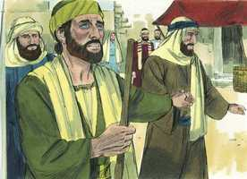
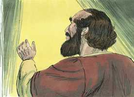
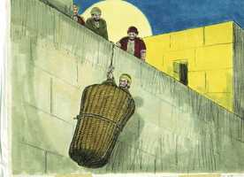
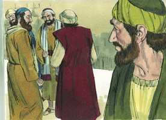

# Atos dos Apóstolos Cap 09

**1** 	E SAULO, respirando ainda ameaças e mortes contra os discípulos do Senhor, dirigiu-se ao sumo sacerdote.

**2** 	E pediu-lhe cartas para Damasco, para as sinagogas, a fim de que, se encontrasse alguns deste Caminho, quer homens quer mulheres, os conduzisse presos a Jerusalém.

 

**3** 	E, indo no caminho, aconteceu que, chegando perto de Damasco, subitamente o cercou um resplendor de luz do céu.

 

**4** 	E, caindo em terra, ouviu uma voz que lhe dizia: Saulo, Saulo, por que me persegues?

**5** 	E ele disse: Quem és, Senhor? E disse o Senhor: Eu sou Jesus, a quem tu persegues. Duro é para ti recalcitrar contra os aguilhões.

 

**6** 	E ele, tremendo e atônito, disse: Senhor, que queres que eu faça? E disse-lhe o Senhor: Levanta-te, e entra na cidade, e lá te será dito o que te convém fazer.

**7** 	E os homens, que iam com ele, pararam espantados, ouvindo a voz, mas não vendo ninguém.

**8** 	E Saulo levantou-se da terra, e, abrindo os olhos, não via a ninguém. E, guiando-o pela mão, o conduziram a Damasco.

  

**9** 	E esteve três dias sem ver, e não comeu nem bebeu.

**10** 	E havia em Damasco um certo discípulo chamado Ananias; e disse-lhe o Senhor em visão: Ananias! E ele respondeu: Eis-me aqui, Senhor.

 

**11** 	E disse-lhe o Senhor: Levanta-te, e vai à rua chamada Direita, e pergunta em casa de Judas por um homem de Tarso chamado Saulo; pois eis que ele está orando;

 

**12** 	E numa visão ele viu que entrava um homem chamado Ananias, e punha sobre ele a mão, para que tornasse a ver.

**13** 	E respondeu Ananias: Senhor, a muitos ouvi acerca deste homem, quantos males tem feito aos teus santos em Jerusalém;

 

**14** 	E aqui tem poder dos principais dos sacerdotes para prender a todos os que invocam o teu nome.

**15** 	Disse-lhe, porém, o Senhor: Vai, porque este é para mim um vaso escolhido, para levar o meu nome diante dos gentios, e dos reis e dos filhos de Israel.

 

**16** 	E eu lhe mostrarei quanto deve padecer pelo meu nome.

**17** 	E Ananias foi, e entrou na casa e, impondo-lhe as mãos, disse: Irmão Saulo, o Senhor Jesus, que te apareceu no caminho por onde vinhas, me enviou, para que tornes a ver e sejas cheio do Espírito Santo.

 

**18** 	E logo lhe caíram dos olhos como que umas escamas, e recuperou a vista; e, levantando-se, foi batizado.

**19** 	E, tendo comido, ficou confortado. E esteve Saulo alguns dias com os discípulos que estavam em Damasco.

 

**20** 	E logo nas sinagogas pregava a Cristo, que este é o Filho de Deus.

   

**21** 	E todos os que o ouviam estavam atônitos, e diziam: Não é este o que em Jerusalém perseguia os que invocavam este nome, e para isso veio aqui, para os levar presos aos principais dos sacerdotes?

**22** 	Saulo, porém, se esforçava muito mais, e confundia os judeus que habitavam em Damasco, provando que aquele era o Cristo.

 

**23** 	E, tendo passado muitos dias, os judeus tomaram conselho entre si para o matar.

**24** 	Mas as suas ciladas vieram ao conhecimento de Saulo; e como eles guardavam as portas, tanto de dia como de noite, para poderem tirar-lhe a vida,

 

**25** 	Tomando-o de noite os discípulos o desceram, dentro de um cesto, pelo muro.

 

**26** 	E, quando Saulo chegou a Jerusalém, procurava ajuntar-se aos discípulos, mas todos o temiam, não crendo que fosse discípulo.

 

**27** 	Então Barnabé, tomando-o consigo, o trouxe aos apóstolos, e lhes contou como no caminho ele vira ao Senhor e lhe falara, e como em Damasco falara ousadamente no nome de Jesus.

 

**28** 	E andava com eles em Jerusalém, entrando e saindo,

**29** 	E falava ousadamente no nome do Senhor Jesus. Falava e disputava também contra os gregos, mas eles procuravam matá-lo.

 

**30** 	Sabendo-o, porém, os irmãos, o acompanharam até Cesaréia, e o enviaram a Tarso.

  

**31** 	Assim, pois, as igrejas em toda a Judéia, e Galiléia e Samaria tinham paz, e eram edificadas; e se multiplicavam, andando no temor do Senhor e consolação do Espírito Santo.

**32** 	E aconteceu que, passando Pedro por toda a parte, veio também aos santos que habitavam em Lida.

 

**33** 	E achou ali certo homem, chamado Enéias, jazendo numa cama havia oito anos, o qual era paralítico.

 

**34** 	E disse-lhe Pedro: Enéias, Jesus Cristo te dá saúde; levanta-te e faze a tua cama. E logo se levantou.

  

**35** 	E viram-no todos os que habitavam em Lida e Sarona, os quais se converteram ao Senhor.

**36** 	E havia em Jope uma discípula chamada Tabita, que traduzido se diz Dorcas. Esta estava cheia de boas obras e esmolas que fazia.

 

**37** 	E aconteceu naqueles dias que, enfermando ela, morreu; e, tendo-a lavado, a depositaram num quarto alto.

 

**38** 	E, como Lida era perto de Jope, ouvindo os discípulos que Pedro estava ali, lhe mandaram dois homens, rogando-lhe que não se demorasse em vir ter com eles.

 

**39** 	E, levantando-se Pedro, foi com eles; e quando chegou o levaram ao quarto alto, e todas as viúvas o rodearam, chorando e mostrando as túnicas e roupas que Dorcas fizera quando estava com elas.

 

**40** 	Mas Pedro, fazendo sair a todos, pôs-se de joelhos e orou: e, voltando-se para o corpo, disse: Tabita, levanta-te. E ela abriu os olhos, e, vendo a Pedro, assentou-se.

  

**41** 	E ele, dando-lhe a mão, a levantou e, chamando os santos e as viúvas, apresentou-lha viva.

 

**42** 	E foi isto notório por toda a Jope, e muitos creram no Senhor.

**43** 	E ficou muitos dias em Jope, com um certo Simão curtidor.

> **Cmt MHenry** Intro: Muitos dos que estão cheios de boas palavras estão vazios e estéreis de boas obras; porém Tabita era uma grande feitora, não uma grande conversadora. Os cristãos que não tem propriedade para dar como caridade podem, ainda, ser capazes de fazer obras de caridade , trabalhando com suas mãos ou indo com seus pés para o bem do próximo. São certamente melhor elogiados aqueles cujas obras os elogiam, seja que as palavras dos outros o façam ou não. Sem dúvida são ingratos os que não reconhecem o bem que se lhes faz mostrando a bondade feita a eles. Enquanto vivemos da plenitude de Cristo para nossa plena salvação, devemos desejar estar cheios de boas obras para glória de seu nome e para benefício de seus santos. Caracteres como Dorcas são úteis onde morem, porque mostram a excelência da palavra da verdade por meio de suas vidas. Quão vis são, então, as preocupações de tantas mulheres que não buscam distinção senão no ornamento externo, e desperdiçam suas vidas ns frívola busca de vestidos e vaidades!\ O poder se uniu à palavra e Dorcas voltou à vida. Assim é na ressurreição das almas mortas à vida espiritual: o primeiro sinal de vida é abrir os olhos da mente. Aqui vemos que o Senhor pode compensar toda perda; que Ele governa cada fato para o bem dos que confiam nEle, e para glória de Seu nome.> Os cristãos são santos ou povo santo; não só os eminentes como são Pedro e são Paulo, senão todo sincero professante da fé em Cristo. Cristo escolheu a pacientes com doenças incuráveis segundo o curso natural, para mostrar quão desesperada é a situação da humanidade caída. Quando éramos completamente fracos, como este coitado homem, Ele mandou sua palavra para curar-nos. Pedro não pretende sarar por poder próprio, mas dirige a Enéias a olhar a Cristo em busca de ajuda. Ninguém diga que por quanto é Cristo o que pelo poder de sua graça opera todas nossas obras em nós, não temos obra que fazer, nem dever que cumprir; porque, embora Jesus Cristo seja íntegro, tu deves levantar-te, e usar o poder que Ele te dá.> Quando entramos no caminho de Deus devemos esperar provações; mas o Senhor sabe livrar o santo e também dará, junto com a provação, a saída. Embora a conversão de Saulo foi e é prova da verdade do cristianismo, ainda assim não podia, por si só, converter uma alma inimizada com a verdade; porque nada pode produzir fé verdadeira senão esse poder que cria de novo o coração. Os crentes são dados a suspeitar demasiado daqueles em contra dos quais têm prejuízos. O mundo está cheio de engano e é necessário ser cauto, mas devemos exercer caridade ([1 Co 13.5](../46N-1Co/13.md#5)). O Senhor esclarece o caráter dos crentes verdadeiros, os une a seu povo, e freqüentemente lhes dá a oportunidade de dar testemunho de sua verdade, ante os que foram testemunhas de seu ódio. Agora Cristo se apareceu a Saulo e o mandou que saísse rapidamente de Jerusalém, porque devia ser enviado aos gentios (veja-se o capítulo 22.21). as testemunhas de Cristo não podem ser mortas enquanto não tenham acabado de dar seu testemunho. As perseguições foram suportadas. Os professantes do evangelho estiveram retamente e gozaram de muito consolo de parte do Espírito Santo na esperança e a paz do evangelho, e outros foram ganhos para eles. Viveram do consolo do Espírito Santo não só nos dias de transtorno e aflição, senão nos dias de repouso e prosperidade. É mais provável que caminhem gozosamente os que caminham com cautela.> " Uma boa obra foi começada em Saulo quando foi levado aos pés de Cristo com estas palavras: "Senhor, que queres que eu faça?" Nunca Cristo deixou a ninguém chegar a esse ponto. Contemple-se o fariseu orgulhoso, o opressor desapiedado, o blasfemo atrevido, orando! Ainda agora acontece o mesmo com o infiel orgulhoso e o pecador abandonado. Que novas felizes são aquelas para todos os que entendem a natureza e o poder da oração, de uma oração como a que apresenta o pecador humilhado rogando as bênçãos da salvação gratuita! Agora começou a orar de uma forma diferente do que antes fazia; então *dizia* suas orações, porém agora as *ora*. A graça regeneradora faz orar a gente; mais fácil é que ache a um homem vivo que não respira que a um cristão vivo que não ora. Mas até os discípulos eminentes como Ananias vacilam, às vezes, ante as ordens de seu Senhor. Contudo, é a glória do Senhor superar nossas baixas expectativas e mostrar que são vasos de sua misericórdia os que consideramos objetivos de sua vingança. O ensino do Espírito Santo elimina do entendimento as escamas de ignorância e orgulho; então, o pecador chega a ser uma nova criatura e se dedica a recomendar ao Salvador ungido, o Filho de Deus, a seus companheiros de antes. "> Tão mal informado estava Saulo que pensava que devia fazer todo o que puder contra o nome de Cristo, e que com isso lhe fazia um serviço a Deus; parecia que nisto estava em seu elemento. Não percamos a esperança da graça renovadora para a conversão dos piores pecadores, nem deixemos que eles percam a esperança na misericórdia do Deus que perdão os maiores pecados. É sinal de favor divino impedir-nos, por meio da obra interior de sua graça ou pelos acontecimentos externos de sua providência, continuar ou executar objetivos pecaminosos. Saulo viu o Justo (capítulo 22.14 e capítulo 26.13). Quão perto de nós está o mundo invisível! Se Deus somente correr o véu, os objetos se apresentam à vista, comparados com os quais, o que mais se admira na terra resulta vil e desprezível. Saulo se submeteu sem reservas, desejoso de saber o que queria o Senhor Jesus que ele fizesse. As revelações de Cristo às pobres almas são humilhantes; as abatem profundamente com pobres pensamentos sobre si mesmas. Saulo não comeu durante três dias, e agradou a Deus deixá-lo sem alívio durante esse tempo. agora seus pecados foram colocados em ordem diante dele; estava em trevas acerca de seu próprio estado espiritual, e ferido no espírito pelo pecado. quando o pecador é levado a uma percepção adequada de seu estado e conduta, se lança totalmente à misericórdia do Salvador, perguntando que deseja que faça. Deus dirige o pecador humilhado, e apesar de que não costume levar os transgressores ao gozo e à paz de crer sem dor nem intranqüilidade de consciência, sob as quais a alma é profundamente comprometida com as coisas eternas, de todos modos são bem-aventurados os que semeiam com lágrimas, porque colherão com gozo.