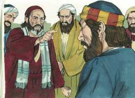

# Atos dos Apóstolos Cap 11

**1** 	E OUVIRAM os apóstolos, e os irmãos que estavam na Judéia, que também os gentios tinham recebido a palavra de Deus.

**2** 	E, subindo Pedro a Jerusalém, disputavam com ele os que eram da circuncisão,

 

**3** 	Dizendo: Entraste em casa de homens incircuncisos, e comeste com eles.

**4** 	Mas Pedro começou a fazer-lhes uma exposição por ordem, dizendo:

**5** 	Estando eu orando na cidade de Jope, tive, num arrebatamento dos sentidos, uma visão; via um vaso, como um grande lençol que descia do céu e vinha até junto de mim.

**6** 	E, pondo nele os olhos, considerei, e vi animais da terra, quadrúpedes, e feras, e répteis e aves do céu.

**7** 	E ouvi uma voz que me dizia: Levanta-te, Pedro; mata e come.

**8** 	Mas eu disse: De maneira nenhuma, Senhor; pois, nunca em minha boca entrou coisa alguma comum ou imunda.

**9** 	Mas a voz respondeu-me do céu segunda vez: Não chames tu comum ao que Deus purificou.

**10** 	E sucedeu isto por três vezes; e tudo tornou a recolher-se ao céu.

**11** 	E eis que, na mesma hora, pararam, junto da casa em que eu estava, três homens que me foram enviados de Cesaréia.

**12** 	E disse-me o Espírito que fosse com eles, nada duvidando; e também estes seis irmãos foram comigo, e entramos em casa daquele homem;

**13** 	E contou-nos como vira em pé um anjo em sua casa, e lhe dissera: Envia homens a Jope, e manda chamar a Simão, que tem por sobrenome Pedro,

**14** 	O qual te dirá palavras com que te salves, tu e toda a tua casa.

**15** 	E, quando comecei a falar, caiu sobre eles o Espírito Santo, como também sobre nós ao princípio.

**16** 	E lembrei-me do dito do Senhor, quando disse: João certamente batizou com água; mas vós sereis batizados com o Espírito Santo.

**17** 	Portanto, se Deus lhes deu o mesmo dom que a nós, quando havemos crido no Senhor Jesus Cristo, quem era então eu, para que pudesse resistir a Deus?

**18** 	E, ouvindo estas coisas, apaziguaram-se, e glorificaram a Deus, dizendo: Na verdade até aos gentios deu Deus o arrependimento para a vida.

 

**19** 	E os que foram dispersos pela perseguição que sucedeu por causa de Estêvão caminharam até à Fenícia, Chipre e Antioquia, não anunciando a ninguém a palavra, senão somente aos judeus.

**20** 	E havia entre eles alguns homens cíprios e cirenenses, os quais entrando em Antioquia falaram aos gregos, anunciando o Senhor Jesus.

**21** 	E a mão do Senhor era com eles; e grande número creu e se converteu ao Senhor.

**22** 	E chegou a fama destas coisas aos ouvidos da igreja que estava em Jerusalém; e enviaram Barnabé a Antioquia.

**23** 	O qual, quando chegou, e viu a graça de Deus, se alegrou, e exortou a todos a que permanecessem no Senhor, com propósito de coração;

**24** 	Porque era homem de bem e cheio do Espírito Santo e de fé. E muita gente se uniu ao Senhor.

**25** 	E partiu Barnabé para Tarso, a buscar Saulo; e, achando-o, o conduziu para Antioquia.

**26** 	E sucedeu que todo um ano se reuniram naquela igreja, e ensinaram muita gente; e em Antioquia foram os discípulos, pela primeira vez, chamados cristãos.

**27** 	E naqueles dias desceram profetas de Jerusalém para Antioquia.

**28** 	E, levantando-se um deles, por nome Ágabo, dava a entender pelo Espírito, que haveria uma grande fome em todo o mundo, e isso aconteceu no tempo de Cláudio César.

**29** 	E os discípulos determinaram mandar, cada um conforme o que pudesse, socorro aos irmãos que habitavam na Judéia.

**30** 	O que eles com efeito fizeram, enviando-o aos anciãos por mão de Barnabé e de Saulo.

> **Cmt MHenry** Intro: Até agora os seguidores de Cristo eram chamados discípulos, isto é, aprendizes, estudantes, mas desde essa época foram chamados cristãos. O significado apropriado deste nome é seguidor de Cristo; denota a um que, com pensamento sério, abraça a religião de Cristo, crê em suas promessas, e faz que sua principal tarefa seja formar sua vida pelos preceitos e o exemplo de Cristo. Daqui, pois, resulta claro que existam multidões que adotam o nome de cristãos, às quais não lhes corresponde corretamente, porque o nome sem a realidade somente agrega a nossa culpa. Enquanto a só profissão de fé não outorga proveito nem deleite, a possessão dela da promessa para a vida presente a vindoura. Concede, Senhor, que os cristãos se esqueçam de outros nome e distinções e se amem uns a outros como devem fazer os seguidores de Cristo. os cristãos verdadeiros sentirão compaixão por seus irmãos que passam por aflições. Assim se leva o fruto para o louvor e a glória de Deus. se toda a humanidade fosse verdadeiramente cristã, com quanto júbilo se ajudariam uns a outros! Toda a terra seria como uma grande família, esforçando-se cada membro por cumprir seu dever e ser bondoso.> Os primeiros pregadores do evangelho na Antioquia foram dispersados desde Jerusalém pela perseguição; deste modo o que pretendia danificar a Igreja, se fez que operasse para seu bem. A ira do homem se converte em louvor a Deus.\ Que devem pregar os ministros de Cristo senão a Cristo? A Cristo, e crucificado? A Cristo, e glorificado? A pregação deles foi acompanhada do poder divino. A mão do Senhor estava com eles para levar aos corações e as consciências dos homens o que somente se podia dizer ao ouvido externo. Eles acreditaram, foram convencidos da verdade do evangelho. Converteram-se desde uma forma de viver carnal e indolente a uma vida santa, espiritual e celestial. Converteram-se de adorar a Deus para serem vistos e por formalismo a adorá-lo em Espírito e em verdade. Converteram-se ao Senhor Jesus que chegou a ser tudo em todo para eles. Esta foi a obra de conversão realizada neles e a que deve efetuar-se em cada um de nós. Foi fruto de sua fé; todos os que crêem sinceramente, se converterão ao Senhor. Quando se prega o Senhor Jesus com clareza, e conforme às Escrituras, Ele dará êxito; e quando os pecadores são deste modo conduzidos ao Senhor, os homens realmente bons que estão cheios de fé e do Espírito Santo, admirarão e se regozijarão na graça de Deus concedida a eles. Barnabé estava cheio de fé; cheio da graça da fé, e cheio dos frutos da fé que opera por amor.> O estado imperfeito da natureza humana se manifesta com muita força, quando pessoas santas se incomodam até de ouvir que se tem recebido a Palavra de Deus, porque não se prestou atenção a seu método. Somos muito dados a desesperar de fazer o bem aos que, ao prová-los, mostram que têm desejos de serem ensinados. Causa da ruína e dano da igreja é excluir dela, e do benefício doa meios da graça, aos que não são como nós em tudo. Pedro contou todo o acontecido. Em todo momento devemos suportar as debilidades de nossos irmãos e, em lugar de ofender-nos ou de responder com tibieza, devemos explicar os motivos e mostrar a natureza de nossos procedimentos.\ Certamente é correta a predição com a que se dá o Espírito Santo. Ainda que os homens sejam muito zelosos de seus próprios regulamentos, devem cuidar-se de não resistir a Deus; e os que amam ao Senhor o glorificarão quando se assegurem de terem outorgado arrependimento para a vida a todos seus congêneres pecadores. O arrependimento é dom de Deus; não só o aceita sua livre graça; sua graça onipotente opera em nós, a graça elimina o coração de pedra e nos dá um de carne. O sacrifício de Deus é um espírito quebrantado.