# Atos dos Apóstolos Cap 12

**1** 	E POR aquele mesmo tempo o rei Herodes estendeu as mãos sobre alguns da igreja, para os maltratar;

**2** 	E matou à espada Tiago, irmão de João.

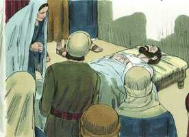 

**3** 	E, vendo que isso agradara aos judeus, continuou, mandando prender também a Pedro. E eram os dias dos ázimos.

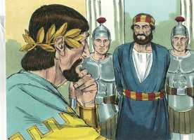 

**4** 	E, havendo-o prendido, o encerrou na prisão, entregando-o a quatro quaternos de soldados, para que o guardassem, querendo apresentá-lo ao povo depois da páscoa.

**5** 	Pedro, pois, era guardado na prisão; mas a igreja fazia contínua oração por ele a Deus.

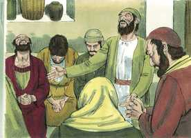 

**6** 	E quando Herodes estava para o fazer comparecer, nessa mesma noite estava Pedro dormindo entre dois soldados, ligado com duas cadeias, e os guardas diante da porta guardavam a prisão.

**7** 	E eis que sobreveio o anjo do Senhor, e resplandeceu uma luz na prisão; e, tocando a Pedro na ilharga, o despertou, dizendo: Levanta-te depressa. E caíram-lhe das mãos as cadeias.

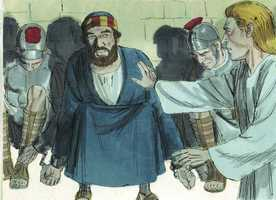 

**8** 	E disse-lhe o anjo: Cinge-te, e ata as tuas alparcas. E ele assim o fez. Disse-lhe mais: Lança às costas a tua capa, e segue-me.

**9** 	E, saindo, o seguia. E não sabia que era real o que estava sendo feito pelo anjo, mas cuidava que via alguma visão.

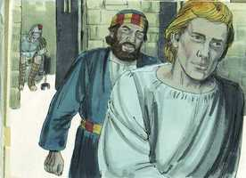 

**10** 	E, quando passaram a primeira e segunda guardas, chegaram à porta de ferro, que dá para a cidade, a qual se lhes abriu por si mesma; e, tendo saído, percorreram uma rua, e logo o anjo se apartou dele.

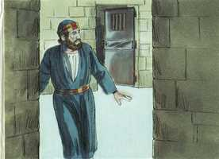 

**11** 	E Pedro, tornando a si, disse: Agora sei verdadeiramente que o Senhor enviou o seu anjo, e me livrou da mão de Herodes, e de tudo o que o povo dos judeus esperava.

**12** 	E, considerando ele nisto, foi à casa de Maria, mãe de João, que tinha por sobrenome Marcos, onde muitos estavam reunidos e oravam.

**13** 	E, batendo Pedro à porta do pátio, uma menina chamada Rode saiu a escutar;

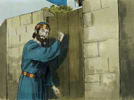 

**14** 	E, conhecendo a voz de Pedro, de gozo não abriu a porta, mas, correndo para dentro, anunciou que Pedro estava à porta.

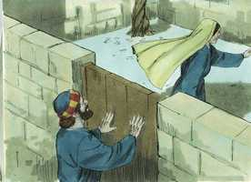 

**15** 	E disseram-lhe: Estás fora de ti. Mas ela afirmava que assim era. E diziam: É o seu anjo.

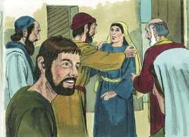 

**16** 	Mas Pedro perseverava em bater e, quando abriram, viram-no, e se espantaram.

**17** 	E acenando-lhes ele com a mão para que se calassem, contou-lhes como o Senhor o tirara da prisão, e disse: Anunciai isto a Tiago e aos irmãos. E, saindo, partiu para outro lugar.

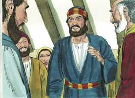 

**18** 	E, sendo já dia, houve não pouco alvoroço entre os soldados sobre o que seria feito de Pedro.

**19** 	E, quando Herodes o procurou e o não achou, feita inquirição aos guardas, mandou-os justiçar. E, partindo da Judéia para Cesaréia, ficou ali.

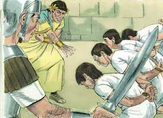 

**20** 	E ele estava irritado com os de Tiro e de Sidom; mas estes, vindo de comum acordo ter com ele, e obtendo a amizade de Blasto, que era o camarista do rei, pediam paz; porquanto o seu país se abastecia do país do rei.

**21** 	E num dia designado, vestindo Herodes as vestes reais, estava assentado no tribunal e lhes fez uma prática.

**22** 	E o povo exclamava: Voz de Deus, e não de homem.

**23** 	E no mesmo instante feriu-o o anjo do Senhor, porque não deu glória a Deus e, comido de bichos, expirou.

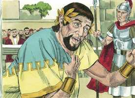 

**24** 	E a palavra de Deus crescia e se multiplicava.

**25** 	E Barnabé e Saulo, havendo terminado aquele serviço, voltaram de Jerusalém, levando também consigo a João, que tinha por sobrenome Marcos.

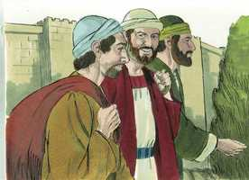 

> **Cmt MHenry** Intro: Muitos príncipes pagãos reclamaram e receberam honras divinas, mas a impiedade de Herodes, que conhecia a palavra e a adoração do Deus vivo, foi muito pior que tudo quando aceitou honras idólatras sem repreender a blasfêmia. Os homens como Herodes que se inflamam com orgulho e vaidade, estão amadurecendo rapidamente para a vingança para a qual estão destinados. Deus é muito zeloso de sua honra e será glorificado *em* aqueles *por* quem não é glorificado. Note-se que corpos vis temos conosco; têm neles a semente de sua dissolução pela qual logo serão destruídos, basta que Deus diga uma simples palavra. Aprenda sabedoria da gente de Tiro e Sidom, porque temos ofendido o Senhor com nossos pecados. Dependemos dEle para viver, respirar e para todas as coisas; certamente nos corresponde humilhar-nos diante dEle, para que, por meio do Mediador designado que sempre está pronto para ser nosso Amigo, possamos ser reconciliados com Ele, não seja que a ira nos caia com todo seu rigor.> A providência de Deus dá lugar para a utilização de nossa prudência, embora Ele tenha empreendido a execução e aperfeiçoamento do que começou. Estes cristãos continuaram orando por Pedro, pois eram verdadeiramente fervorosos. Deste modo, os homens devem orar sempre sem desfalecer. Na medida que nos seja mantida a espera de uma misericórdia, devemos continuar orando por ela. Às vezes, o que desejamos com maior fervor é o que menos cremos. A lei cristã de negar-se e sofrer por Cristo não ab-roga a lei natural de cuidar nossa seguridade por meios lícitos. Nas épocas de perigo público, todos os crentes têm como refúgio a Deus, que é tão secreto que o mundo não pode achá-los. Além disso, os mesmos instrumentos da perseguição estão expostos a perigo; a ira de Deus pende sobre todos os que se dedicam a esta aborrecível obra. A ira dos perseguidores costuma ventilar-se sobre tudo o que acham em seu caminho.> A consciência tranqüila, a esperança viva e a consolação do Espírito, podem manter em paz os homens ante a perspectiva total da morte; até as mesmas pessoas que estavam muito confundidas com os terrores dela. Quando as coisas são levadas ao último extremo, chega o tempo de Deus para ajudar. Pedro tinha a certeza de que o Senhor daria fim a esta prova na forma em que desse ma glória a Deus.\ Os que são livrados do encarceramento espiritual devem seguir a seu Libertador, como os israelitas quando saíram da casa da escravidão. Não sabiam para onde iam, porém sabiam a quem seguiam. Quando Deus opera a salvação de seu povo, superam-se todos os obstáculos de seu caminho, até as portas de ferro se abrirão por si sós. Esta libertação de Pedro representa nossa liberação por meio de Cristo, quem não só proclama liberdade aos cativos, senão que os tira da prisão. Pedro captou quão grandes coisas tinha feito Deus por ele quando recuperou sua consciência. Deste modo, as almas livradas da escravidão espiritual não percebem num princípio o que Deus tem operado nelas; muitos que têm a verdade da graça necessitam provas dela. Quando vem o Consolador, enviado pelo Pai, lhes fará saber, cedo ou tarde, que mudança bendita foi operada.> Tiago era um dos filhos de Zebedeu, a quem Cristo disse que beberia do cálice que Ele beberia, e que seria batizado com o batismo com que Ele seria batizado ([Mt 20.23](../40N-Mt/20.md#23)). agora se cumpriram bem nele as palavras de Cristo: se sofrermos com Cristo, reinaremos com Ele. Herodes mandou encarcerar a Pedro: o caminho da perseguição é em declive, como o de outros pecados; quando os homens estão nele não podem deter-se com facilidade. Se convertem em presa fácil para Satanás os que se ocupam em comprazer aos homens. assim terminou Tiago sua carreira, mas Pedro, estando destinado a novos serviços, estava a salvo embora agora parecesse indicado para um próximo sacrifício.\ Aos que vivemos numa geração fria que não ora, nos custa muito trabalho formar-nos uma idéia do fervor dos santos homens de antigamente. Mas se o Senhor trouxer à Igreja uma perseguição horrorosa, como a de Herodes, os fiéis de Cristo aprenderiam o que é orar com toda a alma.