# Atos dos Apóstolos Cap 13

**1** 	E NA igreja que estava em Antioquia havia alguns profetas e doutores, a saber: Barnabé e Simeão chamado Níger, e Lúcio, cireneu, e Manaém, que fora criado com Herodes o tetrarca, e Saulo.

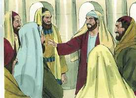 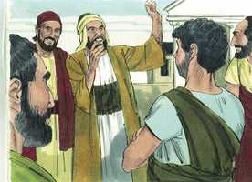 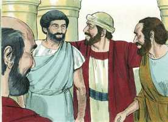 

**2** 	E, servindo eles ao Senhor, e jejuando, disse o Espírito Santo: Apartai-me a Barnabé e a Saulo para a obra a que os tenho chamado.

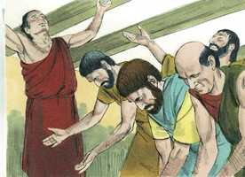 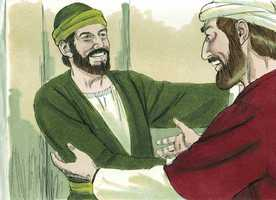 

**3** 	Então, jejuando e orando, e pondo sobre eles as mãos, os despediram.

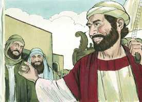  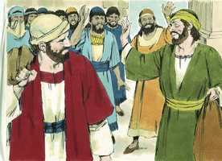 

**4** 	E assim estes, enviados pelo Espírito Santo, desceram a Selêucia e dali navegaram para Chipre.

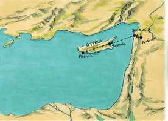 

**5** 	E, chegados a Salamina, anunciavam a palavra de Deus nas sinagogas dos judeus; e tinham também a João como cooperador.

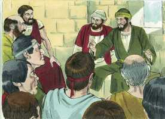 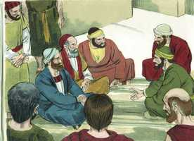 

**6** 	E, havendo atravessado a ilha até Pafos, acharam um certo judeu mágico, falso profeta, chamado Barjesus,

**7** 	O qual estava com o procônsul Sérgio Paulo, homem prudente. Este, chamando a si Barnabé e Saulo, procurava muito ouvir a palavra de Deus.

**8** 	Mas resistia-lhes Elimas, o encantador (porque assim se interpreta o seu nome), procurando apartar da fé o procônsul.

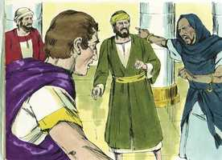 

**9** 	Todavia Saulo, que também se chama Paulo, cheio do Espírito Santo, e fixando os olhos nele,

**10** 	Disse: Ó filho do diabo, cheio de todo o engano e de toda a malícia, inimigo de toda a justiça, não cessarás de perturbar os retos caminhos do Senhor?

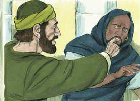 

**11** 	Eis aí, pois, agora contra ti a mão do Senhor, e ficarás cego, sem ver o sol por algum tempo. E no mesmo instante a escuridão e as trevas caíram sobre ele e, andando à roda, buscava a quem o guiasse pela mão.

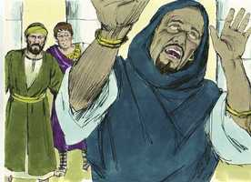 

**12** 	Então o procônsul, vendo o que havia acontecido, creu, maravilhado da doutrina do Senhor.

**13** 	E, partindo de Pafos, Paulo e os que estavam com ele chegaram a Perge, da Panfília. Mas João, apartando-se deles, voltou para Jerusalém.

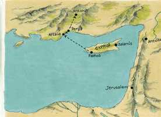 

**14** 	E eles, saindo de Perge, chegaram a Antioquia, da Pisídia, e, entrando na sinagoga, num dia de sábado, assentaram-se;

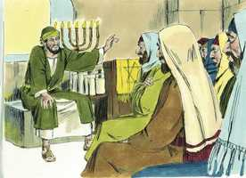 

**15** 	E, depois da lição da lei e dos profetas, lhes mandaram dizer os principais da sinagoga: Homens irmãos, se tendes alguma palavra de consolação para o povo, falai.

**16** 	E, levantando-se Paulo, e pedindo silêncio com a mão, disse: Homens israelitas, e os que temeis a Deus, ouvi:

 

**17** 	O Deus deste povo de Israel escolheu a nossos pais, e exaltou o povo, sendo eles estrangeiros na terra do Egito; e com braço poderoso os tirou dela;

**18** 	E suportou os seus costumes no deserto por espaço de quase quarenta anos.

**19** 	E, destruindo a sete nações na terra de Canaã, deu-lhes por sorte a terra deles.

**20** 	E, depois disto, por quase quatrocentos e cinqüenta anos, lhes deu juízes, até ao profeta Samuel.

**21** 	E depois pediram um rei, e Deus lhes deu por quarenta anos, a Saul filho de Quis, homem da tribo de Benjamim.

**22** 	E, quando este foi retirado, levantou-lhes como rei a Davi, ao qual também deu testemunho, e disse: Achei a Davi, filho de Jessé, homem conforme o meu coração, que executará toda a minha vontade.

**23** 	Da descendência deste, conforme a promessa, levantou Deus a Jesus para Salvador de Israel;

**24** 	Tendo primeiramente João, antes da vinda dele, pregado a todo o povo de Israel o batismo de arrependimento.

**25** 	Mas João, quando completava a carreira, disse: Quem pensais vós que eu sou? Eu não sou o Cristo; mas eis que após mim vem aquele a quem não sou digno de desatar as alparcas dos pés.

**26** 	Homens irmãos, filhos da geração de Abraão, e os que dentre vós temem a Deus, a vós vos é enviada a palavra desta salvação.

**27** 	Por não terem conhecido a este, os que habitavam em Jerusalém, e os seus príncipes, condenaram-no, cumprindo assim as vozes dos profetas que se lêem todos os sábados.

**28** 	E, embora não achassem alguma causa de morte, pediram a Pilatos que ele fosse morto.

**29** 	E, havendo eles cumprido todas as coisas que dele estavam escritas, tirando-o do madeiro, o puseram na sepultura;

**30** 	Mas Deus o ressuscitou dentre os mortos.

**31** 	E ele por muitos dias foi visto pelos que subiram com ele da Galiléia a Jerusalém, e são suas testemunhas para com o povo.

**32** 	E nós vos anunciamos que a promessa que foi feita aos pais, Deus a cumpriu a nós, seus filhos, ressuscitando a Jesus;

**33** 	Como também está escrito no salmo segundo: Meu Filho és tu, hoje te gerei.

**34** 	E que o ressuscitaria dentre os mortos, para nunca mais tornar à corrupção, disse-o assim: As santas e fiéis bênçãos de Davi vos darei.

**35** 	Por isso também em outro salmo diz: Não permitirás que o teu santo veja corrupção.

**36** 	Porque, na verdade, tendo Davi no seu tempo servido conforme a vontade de Deus, dormiu, foi posto junto de seus pais e viu a corrupção.

**37** 	Mas aquele a quem Deus ressuscitou nenhuma corrupção viu.

**38** 	Seja-vos, pois, notório, homens irmãos, que por este se vos anuncia a remissão dos pecados.

**39** 	E de tudo o que, pela lei de Moisés, não pudestes ser justificados, por ele é justificado todo aquele que crê.

**40** 	Vede, pois, que não venha sobre vós o que está dito nos profetas:

**41** 	Vede, ó desprezadores, e espantai-vos e desaparecei; Porque opero uma obra em vossos dias, Obra tal que não crereis, se alguém vo-la contar.

**42** 	E, saídos os judeus da sinagoga, os gentios rogaram que no sábado seguinte lhes fossem ditas as mesmas coisas.

**43** 	E, despedida a sinagoga, muitos dos judeus e dos prosélitos religiosos seguiram Paulo e Barnabé; os quais, falando-lhes, os exortavam a que permanecessem na graça de Deus.

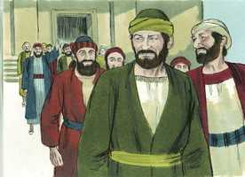 

**44** 	E no sábado seguinte ajuntou-se quase toda a cidade para ouvir a palavra de Deus.

**45** 	Então os judeus, vendo a multidão, encheram-se de inveja e, blasfemando, contradiziam o que Paulo falava.

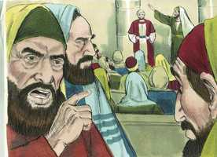 

**46** 	Mas Paulo e Barnabé, usando de ousadia, disseram: Era mister que a vós se vos pregasse primeiro a palavra de Deus; mas, visto que a rejeitais, e não vos julgais dignos da vida eterna, eis que nos voltamos para os gentios;

**47** 	Porque o Senhor assim no-lo mandou: Eu te pus para luz dos gentios, A fim de que sejas para salvação até os confins da terra.

**48** 	E os gentios, ouvindo isto, alegraram-se, e glorificavam a palavra do Senhor; e creram todos quantos estavam ordenados para a vida eterna.

**49** 	E a palavra do Senhor se divulgava por toda aquela província.

**50** 	Mas os judeus incitaram algumas mulheres religiosas e honestas, e os principais da cidade, e levantaram perseguição contra Paulo e Barnabé, e os lançaram fora dos seus termos.

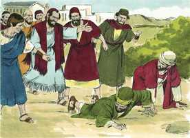 

**51** 	Sacudindo, porém, contra eles o pó dos seus pés, partiram para Icônio.

**52** 	E os discípulos estavam cheios de alegria e do Espírito Santo.

> **Cmt MHenry** Intro: Os judeus se opunham à doutrina que pregavam os apóstolos e, quando não puderam achar o que objetar, blasfemaram de Cristo de seu evangelho. Correntemente os que começam por contradizer, terminam por blasfemar. Quando os adversários da causa de Cristo são ousados, seus advogados devem ser ainda mais atrevidos. Enquanto muitos não se julgam dignos da vida eterna, outros que parecem menos prováveis, desejam ouvir mais da boa nova da salvação. Isso é conforme ao que foi anunciado no Antigo Testamento. Que luz, que poder, que tesouro traz consigo este evangelho! Quão excelentes são suas verdades, seus preceitos, suas promessas! Vieram a Cristo aqueles aos que trouxe o Pai, e aos que o Espírito fez o chamado eficaz ([Rm 8.30](../45N-Rm/08.md#30)). Todos os que estavam ordenados para a vida eterna, todos eles acreditaram em Cristo, em quem Deus tinha guardado a vida, e é o único Caminho a ela; e foi a graça de Deus a que operou neles. Bom é ver que mulheres devotas nobres, quanto menos tenham a fazer no mundo, mais devem fazer por suas próprias almas, e as almas do próximo, porém entristece que elas tratem de mostrar ódio a Cristo sob o matiz da devoção a Deus. Quanto mais nos deleitemos com as consolações e exortações que achamos no poder da santidade, e quanto mais cheios estejam nosso corações com isso, melhor preparados estaremos para enfrentar as dificuldades da profissão de santidade.> Todos os que ouvem o evangelho de Cristo saibam estas duas coisas:\ 1) Que através deste Homem, que morreu e ressuscitou, se prega o perdão do pecado. seus pecados, apesar de muitos e grandes, podem ser perdoados, e podem sê-lo sem prejuízo da honra de Deus.\ 2) Por Cristo só, e por ninguém mais, são justificados de todas as coisas os que crêem nEle; justificados de toda a culpa e mácula do pecado do qual não puderam ser justificados pela lei de Moisés. O grande interesse dos pecadores convictos é ser justificados, ser exonerados de toda sua culpa e aceitos como justos ante os olhos de Deus, porque se algo restar a cargo do pecador, estará acabado. Por Jesus Cristo podemos obter a justificação completa; porque por Ele foi feita a completa expiação pelo pecado. somos justificados não só por Ele como nosso Juiz, senão por Ele como Jeová Justiça nossa. O que era lei não podia fazer por nós, porquanto era fraco, o que faz o Evangelho de Cristo. esta é a bênção mais necessária que traz todas as outras.> A ressurreição de Cristo era a grande prova de que é o Filho de Deus. não era possível que fosse retido pela morte, porque era o Filho de Deus e, portanto, tinha vida em si mesmo, a qual não podia entregar sem o propósito de voltar a tomá-la. A seguridade das misericórdias de Davi é a vida eterna, da qual era sinal seguro a ressurreição; e as bênçãos da redenção em Cristo são um primícia certa ainda neste mundo. Davi foi uma grande bênção para a época em que viveu. Não nascemos para nós mesmos, senão que em ao nosso redor vive gente, aos que devemos ter presentes para servir. Mas aqui radica a diferença: Cristo serviria a todas as gerações. Olhemos Àquele que é declarado ser Filho de Deus por sua ressurreição dentre os mortos para que, por fé nEle, possamos andar com Deus, e servir a nossa geração segundo sua vontade; e quando chegar a morte, durmamos nEle com a esperança gozosa de uma bendita ressurreição.> Quando nos reunimos para adorar a Deus devemos fazê-lo não só com oração e louvor, senão para ler e ouvir a palavra de Deus. Não basta a só leitura das Escrituras nas assembléias públicas; elas devem ser expostas e deve-se exortar à gente com elas. Isto é ajudar a que a gente faça o necessário para obter proveito da palavra, para aplicá-la a si mesmos.\ Neste sermão se toca tudo quanto deveria convencer da melhor forma aos judeus para receber e abraçar a Cristo como o Messias prometido. Toda opinião, não importa quão breve ou fraca seja, sobre os tratos do Senhor com sua Igreja, nos lembra sua misericórdia e paciência, e a ingratidão e perversidade do homem.\ Paulo vai desde Davi até ao Filho de Davi, e demonstra que este Jesus é sua Semente prometida; o Salvador que faz por eles, seus piores inimigos, o que não podiam fazer os juízes de antes, para salvá-los de seus pecados. Quando os apóstolos pregavam a Cristo como o Salvador, distavam muito de ocultar sua morte, tanto que sempre pregavam a Cristo crucificado.\ Nossa completa separação do pecado a representa o fato de que somos sepultados com Cristo. mas Ele ressuscitou dentre os mortos e não viu corrupção: esta era a grande verdade que havia que pregar.> Satanás está especialmente ocupado com os grandes homens e os homens que estão no poder para impedir que sejam religiosos, porque seu exemplo influi a muitos.\ Aqui por primeira vez Saulo é chamado Paulo, e nunca mais de Saulo. Quando era hebreu, seu nome era Saulo; como cidadão de Roma, seu nome era Paulo. Sob a influência direta do Espírito Santo, deu a Elimas seu caráter verdadeiro, mas não em forma apaixonada. A plenitude do engano e a maldade reunidas podem fazer, sem dúvida, que um homem seja filho do diabo. Os que são inimigos da doutrina de Jesus são inimigos de toda justiça, porque nela se cumpre toda justiça. Os caminhos do Senhor Jesus são os únicos caminhos retos ao céu e à felicidade. Existem muitos que não só se descaminham dessas sendas, senão que também colocam o próximo contra esses caminhos. Eles estão freqüentemente tão endurecidos que não cessarão de fazer o mal. O pró-cônsul ficou assombrado pela força da doutrina em seu Pai coração e consciência, e pelo poder de Deus com que foi confirmada. A doutrina de Cristo deixa atônito; e quanto mais sabemos dela, mais razão veremos para maravilhar-nos dela.\ Os que colocam sua mão no arado e olham para trás, não são aptos para o reino de Deus. os que não estão preparados para enfrentar oposição e suportar dificuldades, não são aptos para a obra do ministro.> Que time temos aqui! Vemos neste nomes que o Senhor levanta instrumentos para sua obra de diversos lugares e estados sociais; o zelo por sua glória induz aos homens a renunciarem a relações e perspectivas bajuladoras para fomentar sua causa. Os ministros de Cristo estão capacitados e dispostos para seu serviço por seu Espírito, e lhes são retirados outros interesses que os estorvam. Os ministros de Cristo devem dedicar-se à obra de Cristo é, debaixo da direção do Espírito, agir para a glória de Deus Pai. São separados para empreender trabalhos com dor e não para assumir categorias.\ Buscaram a bênção para Paulo e Barnabé em sua presente empresa, para que fossem cheios com o Espírito Santo em sua obra. Não importa que meios se usem ou que regras se observem, somente o Espírito Santo pode equipar os ministros para sua importante obra, e chamá-los a ela.