# Atos dos Apóstolos Cap 16

**1** 	E CHEGOU a Derbe e Listra. E eis que estava ali um certo discípulo por nome Timóteo, filho de uma judia que era crente, mas de pai grego;

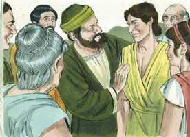 

**2** 	Do qual davam bom testemunho os irmãos que estavam em Listra e em Icônio.

**3** 	Paulo quis que este fosse com ele; e tomando-o, o circuncidou, por causa dos judeus que estavam naqueles lugares; porque todos sabiam que seu pai era grego.

**4** 	E, quando iam passando pelas cidades, lhes entregavam, para serem observados, os decretos que haviam sido estabelecidos pelos apóstolos e anciãos em Jerusalém.

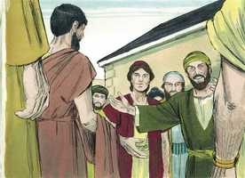 

**5** 	De sorte que as igrejas eram confirmadas na fé, e cada dia cresciam em número.

**6** 	E, passando pela Frígia e pela província da Galácia, foram impedidos pelo Espírito Santo de anunciar a palavra na Ásia.

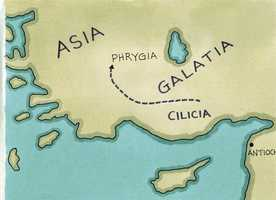 

**7** 	E, quando chegaram a Mísia, intentavam ir para Bitínia, mas o Espírito não lho permitiu.

**8** 	E, tendo passado por Mísia, desceram a Trôade.

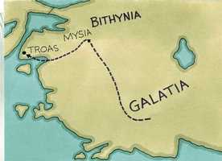 

**9** 	E Paulo teve de noite uma visão, em que se apresentou um homem da Macedônia, e lhe rogou, dizendo: Passa à Macedônia, e ajuda-nos.

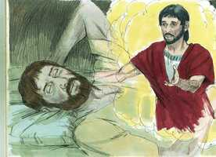 

**10** 	E, logo depois desta visão, procuramos partir para a Macedônia, concluindo que o Senhor nos chamava para lhes anunciarmos o evangelho.

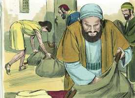 

**11** 	E, navegando de Trôade, fomos correndo em caminho direito para a Samotrácia e, no dia seguinte, para Neápolis;

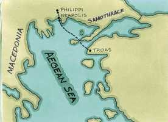 

**12** 	E dali para Filipos, que é a primeira cidade desta parte da Macedônia, e é uma colônia; e estivemos alguns dias nesta cidade.

**13** 	E no dia de sábado saímos fora das portas, para a beira do rio, onde se costumava fazer oração; e, assentando-nos, falamos às mulheres que ali se ajuntaram.

 

**14** 	E uma certa mulher, chamada Lídia, vendedora de púrpura, da cidade de Tiatira, e que servia a Deus, nos ouvia, e o Senhor lhe abriu o coração para que estivesse atenta ao que Paulo dizia.

**15** 	E, depois que foi batizada, ela e a sua casa, nos rogou, dizendo: Se haveis julgado que eu seja fiel ao Senhor, entrai em minha casa, e ficai ali. E nos constrangeu a isso.

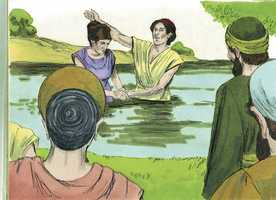 

**16** 	E aconteceu que, indo nós à oração, nos saiu ao encontro uma jovem, que tinha espírito de adivinhação, a qual, adivinhando, dava grande lucro aos seus senhores.

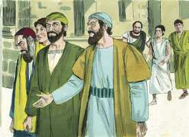 

**17** 	Esta, seguindo a Paulo e a nós, clamava, dizendo: Estes homens, que nos anunciam o caminho da salvação, são servos do Deus Altíssimo.

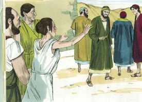 

**18** 	E isto fez ela por muitos dias. Mas Paulo, perturbado, voltou-se e disse ao espírito: Em nome de Jesus Cristo, te mando que saias dela. E na mesma hora saiu.

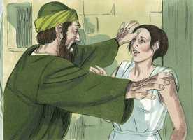 

**19** 	E, vendo seus senhores que a esperança do seu lucro estava perdida, prenderam Paulo e Silas, e os levaram à praça, à presença dos magistrados.

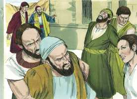 

**20** 	E, apresentando-os aos magistrados, disseram: Estes homens, sendo judeus, perturbaram a nossa cidade,

**21** 	E nos expõem costumes que não nos é lícito receber nem praticar, visto que somos romanos.

**22** 	E a multidão se levantou unida contra eles, e os magistrados, rasgando-lhes as vestes, mandaram açoitá-los com varas.

**23** 	E, havendo-lhes dado muitos açoites, os lançaram na prisão, mandando ao carcereiro que os guardasse com segurança.

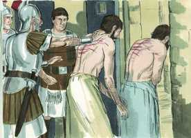 

**24** 	O qual, tendo recebido tal ordem, os lançou no cárcere interior, e lhes segurou os pés no tronco.

**25** 	E, perto da meia-noite, Paulo e Silas oravam e cantavam hinos a Deus, e os outros presos os escutavam.

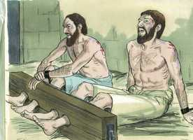 

**26** 	E de repente sobreveio um tão grande terremoto, que os alicerces do cárcere se moveram, e logo se abriram todas as portas, e foram soltas as prisões de todos.

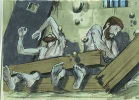 

**27** 	E, acordando o carcereiro, e vendo abertas as portas da prisão, tirou a espada, e quis matar-se, cuidando que os presos já tinham fugido.

**28** 	Mas Paulo clamou com grande voz, dizendo: Não te faças nenhum mal, que todos aqui estamos.

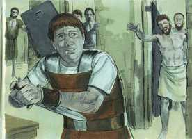 

**29** 	E, pedindo luz, saltou dentro e, todo trêmulo, se prostrou ante Paulo e Silas.

**30** 	E, tirando-os para fora, disse: Senhores, que é necessário que eu faça para me salvar?

**31** 	E eles disseram: Crê no Senhor Jesus Cristo e serás salvo, tu e a tua casa.

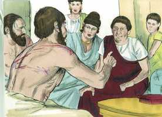 

**32** 	E lhe pregavam a palavra do Senhor, e a todos os que estavam em sua casa.

**33** 	E, tomando-os ele consigo naquela mesma hora da noite, lavou-lhes os vergões; e logo foi batizado, ele e todos os seus.

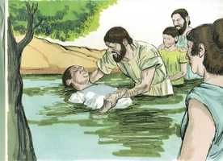 

**34** 	E, levando-os à sua casa, lhes pôs a mesa; e, na sua crença em Deus, alegrou-se com toda a sua casa.

**35** 	E, sendo já dia, os magistrados mandaram quadrilheiros, dizendo: Soltai aqueles homens.

**36** 	E o carcereiro anunciou a Paulo estas palavras, dizendo: Os magistrados mandaram que vos soltasse; agora, pois, saí e ide em paz.

**37** 	Mas Paulo replicou: Açoitaram-nos publicamente e, sem sermos condenados, sendo homens romanos, nos lançaram na prisão, e agora encobertamente nos lançam fora? Não será assim; mas venham eles mesmos e tirem-nos para fora.

**38** 	E os quadrilheiros foram dizer aos magistrados estas palavras; e eles temeram, ouvindo que eram romanos.

**39** 	E, vindo, lhes dirigiram súplicas; e, tirando-os para fora, lhes pediram que saíssem da cidade.

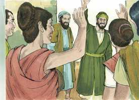 

**40** 	E, saindo da prisão, entraram em casa de Lídia e, vendo os irmãos, os confortaram, e depois partiram.

> **Cmt MHenry** Intro: Apesar de que Paulo estava disposto a sofrer pela causa de Cristo, e sem nenhum desejo de vingar-se, preferiu não partir levando a acusação errada de ter merecido um castigo; portanto, pediu ser despedido de forma honorável. Não foi uma mera questão de honra na qual o apóstolo insistiu, senão de justiça, e não para ele tanto como para sua causa. Quando se dá a desculpa apropriada, os cristãos nunca devem expressar raiva pessoal nem insistir estritamente nas reparações pessoais. O Senhor os fará mais que vencedores em todo conflito; em vez de serem esmagados por seus sofrimentos, eles se tornarão consoladores de seus irmãos.> " Não são poucos nem pequenos os consolos de Deus para seus servos que sofrem. Quanto mais felizes são os cristãos verdadeiros que seus prósperos inimigos! Desde o profundo e desde as trevas devemos clamar a Deus. Não há lugar, nem há tempo que sejam maus para orar se o coração vai ser elevado a Deus. nenhum problema, por penoso que seja, deve impedir-nos de louvar. Fica demonstrado que o cristianismo é de Deus em que nos obriga a sermos retos com nossa vida.\ Paulo gritou forte para que o carcereiro o ouvisse, e para fazê-lo obedecer, dizendo: "Não te facas dano". Todas as advertências da Palavra de Deus contra o pecado e todas suas aparências, e todas suas aproximações, têm esta tendência. Homem, mulher, não te facas dano; não te firas, porque ninguém mais pode ferir-te; não peques, porque nada pode prejudicar-te senão isso. ainda com referência ao corpo, somos advertidos contra os pecados que o danificam. A graça que converte muda a linguagem da gente para a linguagem das boas pessoas e dos bons ministros.\ Quão grave é a pergunta do carcereiro! Sua salvação se converte em seu grande interesse; o que jaz mais perto de seu coração é o que antes distava mais de seus pensamentos. Está preocupado por sua alma preciosa. Os que estão inteiramente convencidos de seu pecado e verdadeiramente interessados em sua salvação, se entregarão a Cristo. aqui está o resumo de todo o evangelho, a aliança de graça em poucas palavras: "Crê no Senhor Jesus e serás salvo, tu e tua casa".\ O Senhor abençoou tanto a palavra que o carcereiro foi de imediato amolecido e humilhado. Os tratou com bondade e compaixão, e ao professar fé em Cristo foi batizado nesse nome, com sua família. O Espírito de graça operou uma fé tão forte neles, que dissipou toda dúvida ulterior; e Paulo e Silas souberam pelo Espírito que Deus tinha feito uma obra neles. Quando os pecadores assim se convertem, amarão e honrarão aos que antes desprezavam e odiavam, e procurarão diminuir os sofrimentos que antes desejavam acrescentar. Quando os frutos da fé começam a aparecer, os terrores serão substituídos pela confiança e o gozo em Deus. "> Embora seja o pai das mentiras, Satanás declara as verdades mais importantes quando delas pose se servir para seus propósitos. Muita maldade fazem aos servos verdadeiros de Cristo os ímpios e falsos pregadores do evangelho, que são confundidos com aqueles pelos observadores indiferentes. Os que fazem o bem tirando o pecado dos homens, podem esperar ser insultados como agitadores da cidade. enquanto ensinem aos homens a temer a Deus, a crer em Cristo, a abandonar o pecado e a levar vidas santas, serão acusados de ensinar maus costumes.> O itinerário dos ministros e seu trabalho na dispensação dos meios de graça estão submetidos particularmente à condução e direção divinas. Devemos seguir a providência e qualquer coisa que procuremos fazer, se nos Faraó permitida, devemos submeter-nos e crer que é para melhor.\ A gente necessita muita ajuda para suas almas e é seu dever buscá-la e convidar dentre os ministros aos que possam ajudá-los. Os chamados de Deus devem cumprir-se com presteza.\ Os adoradores de Deus devem ter, se possível, uma assembléia solene no dia de descanso. Se não temos sinagoga devemos agradecer os lugares mais privados e recorrer a eles sem abandonar as reuniões segundo sejam nossas oportunidades.\ Entre os ouvintes de Paulo havia uma mulher de nome Lídia. Tinha um trabalho honesto que o historiador registra para elogio dela. Apesar de ter que desempenhar esse trabalho, achava tempo para aproveitar as vantagens para sua alma. Não nos desculpará dos deveres religiosos dizer que temos um negócio que administrar, porque, não temos também um Deus que servir, e almas que cuidar? A religião não nos tira Notas Bíblia de Estudo NVI-out_images.txt Simple_Bible_Reader_v2.9-bible_converter.exe nossos negócios no mundo, senão que nos dirige *neles*. O orgulho, o prejuízo e o pecado deixam fora as verdades de Deus até que sua graça lhes abre caminho no entendimento e nos afetos; somente o Senhor pode abrir o coração para que recebas e acredites em sua Palavra. Devemos crer em Jesus Cristo; não há acesso a Deus como Pai senão pelo Filho como Mediador.> A Igreja bem pode esperar muito serviço de ministros jovens que tenham o mesmo espírito que Timóteo. Contudo, quando os homens não se sujeitam em nada nem se obrigam a nada, parece que faltassem os principais elementos do caráter cristão; e há muita razão para acreditar que não ensinarão com êxito as doutrinas e os preceitos do evangelho. Sendo o desígnio do decreto deixar de lado a lei cerimonial, e suas ordenanças na carne, os crentes foram confirmados na fé cristã porque estabeleceu uma forma espiritual de servir a Deus, adequada para a natureza de Deus e do homem. Assim, a Igreja crescia diariamente em número.