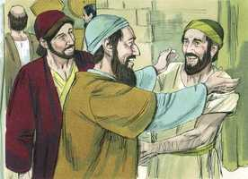
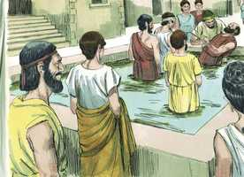
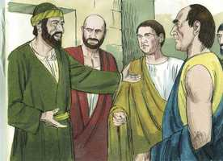
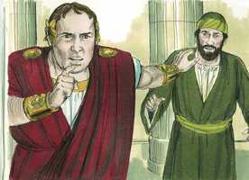
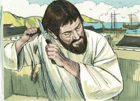
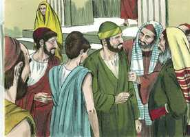
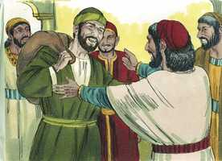
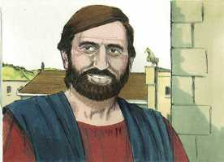
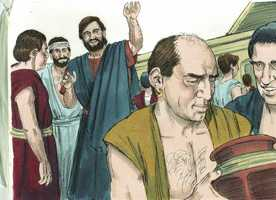

# Atos dos Apóstolos Cap 18

**1** 	E DEPOIS disto partiu Paulo de Atenas, e chegou a Corinto.

**2** 	E, achando um certo judeu por nome Áqüila, natural do Ponto, que havia pouco tinha vindo da Itália, e Priscila, sua mulher (pois Cláudio tinha mandado que todos os judeus saíssem de Roma), ajuntou-se com eles,

 

**3** 	E, como era do mesmo ofício, ficou com eles, e trabalhava; pois tinham por ofício fazer tendas.

 

**4** 	E todos os sábados disputava na sinagoga, e convencia a judeus e gregos.

**5** 	E, quando Silas e Timóteo desceram da Macedônia, foi Paulo impulsionado no espírito, testificando aos judeus que Jesus era o Cristo.

 

**6** 	Mas, resistindo e blasfemando eles, sacudiu as vestes, e disse-lhes: O vosso sangue seja sobre a vossa cabeça; eu estou limpo, e desde agora parto para os gentios.

 

**7** 	E, saindo dali, entrou em casa de um homem chamado Justo, que servia a Deus, e cuja casa estava junto da sinagoga.

 

**8** 	E Crispo, principal da sinagoga, creu no Senhor com toda a sua casa; e muitos dos coríntios, ouvindo-o, creram e foram batizados.

 

**9** 	E disse o Senhor em visão a Paulo: Não temas, mas fala, e não te cales;

 

**10** 	Porque eu sou contigo, e ninguém lançará mão de ti para te fazer mal, pois tenho muito povo nesta cidade.

**11** 	E ficou ali um ano e seis meses, ensinando entre eles a palavra de Deus.

 

**12** 	Mas, sendo Gálio procônsul da Acaia, levantaram-se os judeus concordemente contra Paulo, e o levaram ao tribunal,

**13** 	Dizendo: Este persuade os homens a servir a Deus contra a lei.

 

**14** 	E, querendo Paulo abrir a boca, disse Gálio aos judeus: Se houvesse, ó judeus, algum agravo ou crime enorme, com razão vos sofreria,

 

**15** 	Mas, se a questão é de palavras, e de nomes, e da lei que entre vós há, vede-o vós mesmos; porque eu não quero ser juiz dessas coisas.

**16** 	E expulsou-os do tribunal.

 

**17** 	Então todos os gregos agarraram Sóstenes, principal da sinagoga, e o feriram diante do tribunal; e a Gálio nada destas coisas o incomodava.

**18** 	E Paulo, ficando ainda ali muitos dias, despediu-se dos irmãos, e dali navegou para a Síria, e com ele Priscila e Áqüila, tendo rapado a cabeça em Cencréia, porque tinha voto.

  

**19** 	E chegou a Éfeso, e deixou-os ali; mas ele, entrando na sinagoga, disputava com os judeus.

**20** 	E, rogando-lhe eles que ficasse por mais algum tempo, não conveio nisso.

 

**21** 	Antes se despediu deles, dizendo: É-me de todo preciso celebrar a solenidade que vem em Jerusalém; mas querendo Deus, outra vez voltarei a vós. E partiu de Éfeso.

 

**22** 	E, chegando a Cesaréia, subiu a Jerusalém e, saudando a igreja, desceu a Antioquia.

 

**23** 	E, estando ali algum tempo, partiu, passando sucessivamente pela província da Galácia e da Frígia, confirmando a todos os discípulos.

 

**24** 	E chegou a Éfeso um certo judeu chamado Apolo, natural de Alexandria, homem eloqüente e poderoso nas Escrituras.

 

**25** 	Este era instruído no caminho do Senhor e, fervoroso de espírito, falava e ensinava diligentemente as coisas do Senhor, conhecendo somente o batismo de João.

 

**26** 	Ele começou a falar ousadamente na sinagoga; e, quando o ouviram Priscila e Áqüila, o levaram consigo e lhe declararam mais precisamente o caminho de Deus.

 

**27** 	Querendo ele passar à Acaia, o animaram os irmãos, e escreveram aos discípulos que o recebessem; o qual, tendo chegado, aproveitou muito aos que pela graça criam.

 

**28** 	Porque com grande veemência, convencia publicamente os judeus, mostrando pelas Escrituras que Jesus era o Cristo.

 

> **Cmt MHenry** Intro: Apolo ensinava o evangelho de Cristo até onde o ministério de João o havia deixado, e não além disso. Não podemos deixar de pensar que sabia da morte e ressurreição de Cristo, mas não estava informado acerca de seu mistério. Mesmo que não tinha os dons miraculosos do Espírito, como os apóstolos, usava os dons que tinha. A dispensação do Espírito, qualquer que seja sua medida, é dada a cada homem para proveito inteiro. Era um pregador vivaz e afetuoso, de espírito fervoroso. Estava cheio de zelo pela glória de Deus e a salvação de almas preciosas. Aqui havia um homem de Deus completo, cabalmente dotado para a obra.\ Áquila e Priscila animaram seu ministério e o assistiram. Não desprezaram a Apolo nem o valorizaram em pouco diante de outros, mas consideraram as desvantagens sob as quais trabalhava. Tendo eles mesmos obtido conhecimento das verdades do Evangelho por sua longa relação com Paulo, lhe disseram o que sabiam. Os estudantes jovens podem ganhar muito conversando com cristãos velhos.\ Os que crêem por meio da graça continuam necessitando ajuda. Na medida em que estejam neste mundo, haverá vestígios de incredulidade e algo que falta em sua fé para ser aperfeiçoada e para completar o trabalho da fé.\ Se os judeus se tiverem convencido de que Jesus era o Cristo, até sua própria lei os teria ensinado a ouvi-lo. o trabalho dos ministros é pregar a Cristo. não só pregar a verdade, senão prová-la e defendê-la, com mansidão, ainda que com poder.> Enquanto Paulo achava que seu trabalho não era em vão, continuava trabalhando. Nossos tempos estão na mão de Deus; nós propomos, mas Ele dispõe; portanto, devemos prometer em sujeição com à vontade de Deus; não somente se a providência o permite, senão se Deus não dirigir nossos movimentos de outro modo.\ Um refrigério muito grato para o ministro fiel é ter a companhia de seus irmãos por um tempo.\ Os discípulos estão cercados pela doença; os ministros devem fazer o que possam para fortalecê-los, dirigindo-os a Cristo, que é a Força deles. Procuremos fervorosamente em nossos diversos postos lograr o avanço da causa de Cristo, fazendo planos que nos pareçam os mais apropriados, mas confiando em que o Senhor fará que se concretizem segundo lhe aprouver.> Paulo estava por demonstrar que ele não ensinava aos homens que adorar a Deus era contrário à lei, mas o juiz não permitiu que os judeus se queixassem ante ele do que não estava dentro de seu ofício. Era correto que Gálio deixasse os judeus livrados a si mesmos em matérias relacionadas com sua religião, mas não deveria ter permitido que perseguissem a outros com esse pretexto. Era ruim que falasse com leviandade de uma lei e religião que poderia ter sabido que eram de Deus, e com as quais deveria ter-se familiarizado. Em que modo deve adorar-se a Deus, sem Jesus for o Messias, e se o Evangelho é revelação divina, não são questões de palavra e de nomes; são questões de tremenda importância. Gálio fala como se jactando-se de sua ignorância das Escrituras, como se a lei de Deus não fosse digna de que ele a levasse em conta.\ Gálio não se interessou em nenhuma dessas coisas. Se não se interessar nas afrontas feitas aos homens malvados, isso seria elogiável, porém, se não se interessar nos abusos cometidos com os homens bons, sua indiferença era exagerada. Os que vêem e ouvem os sofrimentos do povo de Deus e não sentem nada por eles, ou não se interessam por eles, ou não os compadecem nem oram por eles, são do mesmo espírito que Gálio, que não se interessava por nenhuma dessas coisas.> O Senhor conhece os que são Seus, sim, e os que o serão, porque por sua obra neles é que chegam a serem Seus. Não desesperemos acerca de algum lugar, porque Cristo tinha a muitos ainda na malvada Corinto. Reunirá seu rebanho escolhido desde os lugares onde estão espalhados. Assim animado, o espirituais continuou em Corinto e cresceu uma igreja numerosa e florescente.> Embora tinha direito de ser sustentado pelas igrejas que plantou, e pelas pessoas as quais pregava, Paulo trabalhava em seu ofício. Ninguém deve olhar com desprezo o ofício honesto, pelo qual um homem pode obter seu pão. Embora lhes davam fortuna ou conhecimentos, os judeus tinham por costume fazer que seus filhos aprendessem um ofício. Paulo teve cuidado de evitar prejuízos, até os mais irracionais. O amor de Cristo é o vínculo perfeito dos santos; e a comunhão dos santos entre si adoça o trabalho, o desprezo e até a perseguição.\ A maioria dos judeus persistiu em contradizer o Evangelho de Cristo e blasfemaram. Eles mesmos não acreditavam e faziam tudo quanto podiam para impedir que outros cressem. Paulo os deixou ali. Não renunciou a sua obra, porque apesar de que Israel não for reunido, Cristo e seu evangelho são gloriosos. Os judeus não podem queixar-se, porque tiveram a primeira oferta. Quando alguém se resiste ao evangelho, devemos voltar-nos a outras pessoas. O pesar porque muitos persistam na incredulidade não deve impedir a gratidão pela conversão de alguns a Cristo.