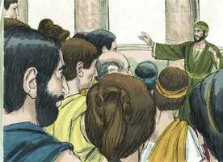

# Atos dos Apóstolos Cap 19

**1** 	E SUCEDEU que, enquanto Apolo estava em Corinto, Paulo, tendo passado por todas as regiões superiores, chegou a Éfeso; e achando ali alguns discípulos,

 

**2** 	Disse-lhes: Recebestes vós já o Espírito Santo quando crestes? E eles disseram-lhe: Nós nem ainda ouvimos que haja Espírito Santo.

**3** 	Perguntou-lhes, então: Em que sois batizados então? E eles disseram: No batismo de João.

 

**4** 	Mas Paulo disse: Certamente João batizou com o batismo de arrependimento, dizendo ao povo que cresse no que após ele havia de vir, isto é, em Jesus Cristo.

 

**5** 	E os que ouviram foram batizados em nome do Senhor Jesus.

**6** 	E, impondo-lhes Paulo as mãos, veio sobre eles o Espírito Santo; e falavam línguas, e profetizavam.

 

**7** 	E estes eram, ao todo, uns doze homens.

**8** 	E, entrando na sinagoga, falou ousadamente por espaço de três meses, disputando e persuadindo-os acerca do reino de Deus.

**9** 	Mas, como alguns deles se endurecessem e não obedecessem, falando mal do Caminho perante a multidão, retirou-se deles, e separou os discípulos, disputando todos os dias na escola de um certo Tirano.

 

**10** 	E durou isto por espaço de dois anos; de tal maneira que todos os que habitavam na Ásia ouviram a palavra do Senhor Jesus, assim judeus como gregos.

**11** 	E Deus pelas mãos de Paulo fazia maravilhas extraordinárias.

**12** 	De sorte que até os lenços e aventais se levavam do seu corpo aos enfermos, e as enfermidades fugiam deles, e os espíritos malignos saíam.

 

**13** 	E alguns dos exorcistas judeus ambulantes tentavam invocar o nome do Senhor Jesus sobre os que tinham espíritos malignos, dizendo: Esconjuro-vos por Jesus a quem Paulo prega.

 

**14** 	E os que faziam isto eram sete filhos de Ceva, judeu, principal dos sacerdotes.

**15** 	Respondendo, porém, o espírito maligno, disse: Conheço a Jesus, e bem sei quem é Paulo; mas vós quem sois?

 

**16** 	E, saltando neles o homem que tinha o espírito maligno, e assenhoreando-se de todos, pôde mais do que eles; de tal maneira que, nus e feridos, fugiram daquela casa.

 

**17** 	E foi isto notório a todos os que habitavam em Éfeso, tanto judeus como gregos; e caiu temor sobre todos eles, e o nome do Senhor Jesus era engrandecido.

**18** 	E muitos dos que tinham crido vinham, confessando e publicando os seus feitos.

**19** 	Também muitos dos que seguiam artes mágicas trouxeram os seus livros, e os queimaram na presença de todos e, feita a conta do seu preço, acharam que montava a cinqüenta mil peças de prata.

 

**20** 	Assim a palavra do Senhor crescia poderosamente e prevalecia.

**21** 	E, cumpridas estas coisas, Paulo propôs, em espírito, ir a Jerusalém, passando pela Macedônia e pela Acaia, dizendo: Depois que houver estado ali, importa-me ver também Roma.

**22** 	E, enviando à Macedônia dois daqueles que o serviam, Timóteo e Erasto, ficou ele por algum tempo na Ásia.

 

**23** 	E, naquele mesmo tempo, houve um não pequeno alvoroço acerca do Caminho.

**24** 	Porque um certo ourives da prata, por nome Demétrio, que fazia de prata nichos de Diana, dava não pouco lucro aos artífices,

 

**25** 	Aos quais, havendo-os ajuntado com os oficiais de obras semelhantes, disse: Senhores, vós bem sabeis que deste ofício temos a nossa prosperidade;

 

**26** 	E bem vedes e ouvis que não só em Éfeso, mas até quase em toda a Ásia, este Paulo tem convencido e afastado uma grande multidão, dizendo que não são deuses os que se fazem com as mãos.

**27** 	E não somente há o perigo de que a nossa profissão caia em descrédito, mas também de que o próprio templo da grande deusa Diana seja estimado em nada, vindo a ser destruída a majestade daquela que toda a Ásia e o mundo veneram.

**28** 	E, ouvindo-o, encheram-se de ira, e clamaram, dizendo: Grande é a Diana dos efésios.

 

**29** 	E encheu-se de confusão toda a cidade e, unânimes, correram ao teatro, arrebatando a Gaio e a Aristarco, macedônios, companheiros de Paulo na viagem.

 

**30** 	E, querendo Paulo apresentar-se ao povo, não lho permitiram os discípulos.

 

**31** 	E também alguns dos principais da Ásia, que eram seus amigos, lhe rogaram que não se apresentasse no teatro.

**32** 	Uns, pois, clamavam de uma maneira, outros de outra, porque o ajuntamento era confuso; e os mais deles não sabiam por que causa se tinham ajuntado.

 

**33** 	Então tiraram Alexandre dentre a multidão, impelindo-o os judeus para diante; e Alexandre, acenando com a mão, queria dar razão disto ao povo.

 

**34** 	Mas quando conheceram que era judeu, todos unanimemente levantaram a voz, clamando por espaço de quase duas horas: Grande é a Diana dos efésios.

**35** 	Então o escrivão da cidade, tendo apaziguado a multidão, disse: Homens efésios, qual é o homem que não sabe que a cidade dos efésios é a guardadora do templo da grande deusa Diana, e da imagem que desceu de Júpiter?

 

**36** 	Ora, não podendo isto ser contraditado, convém que vos aplaqueis e nada façais temerariamente;

**37** 	Porque estes homens que aqui trouxestes nem são sacrílegos nem blasfemam da vossa deusa.

**38** 	Mas, se Demétrio e os artífices que estão com ele têm alguma coisa contra alguém, há audiências e há procônsules; que se acusem uns aos outros;

 

**39** 	E, se alguma outra coisa demandais, averiguar-se-á em legítima assembléia.

 

**40** 	Na verdade até corremos perigo de que, por hoje, sejamos acusados de sedição, não havendo causa alguma com que possamos justificar este concurso.

**41** 	E, tendo dito isto, despediu a assembléia.

 

> **Cmt MHenry** Intro: Os judeus passaram à frente neste tumulto. Os que assim se preocupam em distinguir-se dos servos de Cristo agora, temendo serem confundidos com eles, terão sua correspondente condenação no grande dia. Um que tinha autoridade fez silenciar, finalmente, o barulho. Muito boa regra em todo tempo, tanto nos assuntos públicos como privados, é não se apressar em agir, senão tomar-se tempo para pensar e manter sempre controladas nossas paixões. Devemos conservar a serenidade e não fazer nada com aspereza, nem precipitação, do que venhamos a arrepender-nos depois. Os métodos habituais da lei sempre devem deter os tumultos populares, coisa que assim será nas nações bem governadas. A maioria da gente se maravilha ante os juízos dos homens mais que do juízo de Deus. que bom seria se silenciássemos deste modo nossas paixões e apetites desordenados, considerando a conta que devemos render daqui a pouco ao Juiz do céu e da terra! Note-se como mantém a paz pública a providência suprema de Deus, por um poder inexplicável sobre os espíritos dos homens. assim se mantém ao mundo com certa ordem e se refreia aos homens para que não se comam uns a outros. apenas olhamos a nosso redor sem vermos homens que se comportam como Demetrio e os artífices. Contender com bestas selvagens é tão seguro como fazê-lo com os homens enfurecidos pelo zelo partidário e a cobiça desencantada, que pensam que todos os argumentos ficam sem resposta, quando se têm demonstrado que eles se enriquecem por meio das práticas às quais surgiu a oposição. Qualquer que seja o bando que este espírito adote nas disputas religiosas, ou qualquer que seja o nome que assuma, é tão mundano que deve ser repudiado por todos os que guardam a verdade e a piedade. Não desfaleçamos: o Senhor, do alto, é mais poderoso que o barulho de muitas águas; Ele pode acalmar a fúria da gente.> A gente que vinha desde longe a render culto no templo de Éfeso comprava pequenos santuários de prata ou maquetes do templo, para levá-los a sua casa. Note-se aqui como os artesões se aproveitam da superstição da gente, e servem a seus propósitos mundanos com isso. os homens são zelosos daquilo pelo qual obtêm suas riquezas, e muitos são em contra do evangelho de Cristo porque tira os homens de todas as más artes, por muito que seja o lucro que obtenham com elas. Há pessoas que defendem o que é mais grosseiramente absurdo, irracional e falso pelo simples fato de que sustenta o interesse mundano, como neste caso o era o fato de que se tratava de deuses feitos com suas próprias mãos. Toda a cidade estava cheia de confusão, que é o efeito comum e natural do zelo pela falsa religião.\ O zelo pela honra de Cristo e o amor pelos irmãos exorta aos crentes zelosos a correrem riscos. Freqüentemente surgem amigos dentre aqueles que são alheios à verdadeira religião, mas que viram a conduta honesta e coerente dos cristãos.> Era comum, em especial entre os judeus, que as pessoas tratassem de expulsar espíritos malignos. Se resistirmos ao diabo pela fé em Cristo, ele fugirá de nós; porém se pensamos em resisti-lo usando o nome de Cristo, ou suas obras como conjuro ou encantamento, Satanás nos vencerá. Onde há verdadeira contrição do pecado, haverá uma livre confissão de pecado a Deus em toda oração; e confissão à pessoa que tenhamos ofendido, quando o caso assim o requer. Se a palavra de Deus tem prevalecido entre nós, com toda certeza que muitos livros licenciosos, infiéis e maus serão queimados por seus donos. Estes convertidos de Éfeso não se levantarão em juízo contra os professantes que traficam com tais obras por amor a um lucro ou que se permitem ter tais livros? Se desejarmos ser honestos na grande obra da salvação, devemos renunciar a toda empresa e desejo que estorve o efeito do evangelho na mente ou que amoleça seu domínio no coração.> Quando as discussões e as persuasões somente endurecem aos homens na incredulidade e na blasfêmia, devemos separar-nos, nós e outros, dessa ímpia companhia. Agradou a Deus confirmar o ensino desses santos varões de antigamente para que, caso seus ouvintes não acreditassem neles, pudessem acreditar por suas obras.> " Paulo achou em Éfeso algumas pessoas religiosas que consideravam a Jesus como o Messias. Não tinham sido levados a esperar os poderes miraculosos do Espírito Santo, nem os haviam informado que o evangelho era, especialmente, a ministração do Espírito. Contudo, pareciam dispostos a receber bem esta notícia. Paulo lhes demonstra que João nunca pretendeu que aqueles aos quais ele batizava ficassem ali, senão que lhes dizia que deviam crer nAquele que viria depois dele, isto é, em Cristo Jesus. Eles aceitaram, agradecidos, essa revelação e foram batizados no nome do Senhor Jesus.\ O Espírito Santo desceu a eles de modo surpreendente e arrepiante: falaram em línguas e profetizaram, como faziam os apóstolos e os primeiros convertidos gentios. Embora agora não esperamos poderes miraculosos, todos os que professam ser discípulos de Cristo devem ser chamados a examinar se têm recebido o selo do Espírito Santo com suas influências santificadoras, para a sinceridade de sua fé. Muitos não parecem ter ouvido que há um Espírito Santo, e muitos consideram que é uma ilusão todo o que se diz de sua graça e de suas consolações. Dos tais pode perguntar-se com propriedade: "Em que, pois, fostes batizados?". Porque, evidentemente, desconhecem o significado deste sinal externo do qual tanto dependem. "