# Atos dos Apóstolos Cap 20

**1** 	E, DEPOIS que cessou o alvoroço, Paulo chamou a si os discípulos e, abraçando-os, saiu para a Macedônia.

**2** 	E, havendo andado por aquelas terras, exortando-os com muitas palavras, veio à Grécia.

**3** 	E, passando ali três meses, e sendo-lhe pelos judeus postas ciladas, como tivesse de navegar para a Síria, determinou voltar pela Macedônia.

**4** 	E acompanhou-o, até à Ásia, Sópater, de Beréia, e, dos de Tessalônica, Aristarco, e Segundo, e Gaio de Derbe, e Timóteo, e, dos da Ásia, Tíquico e Trófimo.

**5** 	Estes, indo adiante, nos esperaram em Trôade.

**6** 	E, depois dos dias dos pães ázimos, navegamos de Filipos, e em cinco dias fomos ter com eles a Trôade, onde estivemos sete dias.

**7** 	E no primeiro dia da semana, ajuntando-se os discípulos para partir o pão, Paulo, que havia de partir no dia seguinte, falava com eles; e prolongou a prática até à meia-noite.

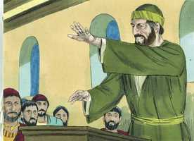 

**8** 	E havia muitas luzes no cenáculo onde estavam juntos.

**9** 	E, estando um certo jovem, por nome Êutico, assentado numa janela, caiu do terceiro andar, tomado de um sono profundo que lhe sobreveio durante o extenso discurso de Paulo; e foi levantado morto.

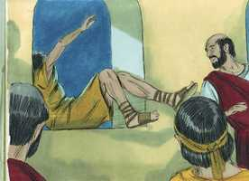 

**10** 	Paulo, porém, descendo, inclinou-se sobre ele e, abraçando-o, disse: Não vos perturbeis, que a sua alma nele está.

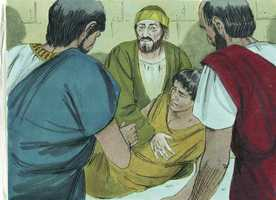 

**11** 	E subindo, e partindo o pão, e comendo, ainda lhes falou largamente até à alvorada; e assim partiu.

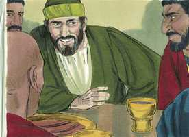 

**12** 	E levaram vivo o jovem, e ficaram não pouco consolados.

**13** 	Nós, porém, subindo ao navio, navegamos até Assôs, onde devíamos receber a Paulo, porque assim o ordenara, indo ele por terra.

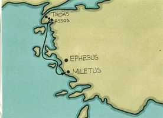 

**14** 	E, logo que se ajuntou conosco em Assôs, o recebemos, e fomos a Mitilene.

**15** 	E, navegando dali, chegamos no dia seguinte defronte de Quios, e no outro aportamos a Samos e, ficando em Trogílio, chegamos no dia seguinte a Mileto.

**16** 	Porque já Paulo tinha determinado passar ao largo de Éfeso, para não gastar tempo na Ásia. Apressava-se, pois, para estar, se lhe fosse possível, em Jerusalém no dia de Pentecostes.

**17** 	E de Mileto mandou a Éfeso, a chamar os anciãos da igreja.

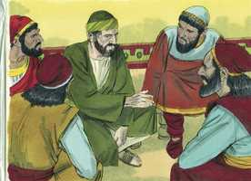 

**18** 	E, logo que chegaram junto dele, disse-lhes: Vós bem sabeis, desde o primeiro dia em que entrei na Ásia, como em todo esse tempo me portei no meio de vós,

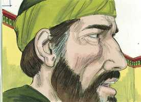 

**19** 	Servindo ao Senhor com toda a humildade, e com muitas lágrimas e tentações, que pelas ciladas dos judeus me sobrevieram;

**20** 	Como nada, que útil seja, deixei de vos anunciar, e ensinar publicamente e pelas casas,

**21** 	Testificando, tanto aos judeus como aos gregos, a conversão a Deus, e a fé em nosso Senhor Jesus Cristo.

**22** 	E agora, eis que, ligado eu pelo espírito, vou para Jerusalém, não sabendo o que lá me há de acontecer,

**23** 	Senão o que o Espírito Santo de cidade em cidade me revela, dizendo que me esperam prisões e tribulações.

**24** 	Mas de nada faço questão, nem tenho a minha vida por preciosa, contanto que cumpra com alegria a minha carreira, e o ministério que recebi do Senhor Jesus, para dar testemunho do evangelho da graça de Deus.

**25** 	E agora, na verdade, sei que todos vós, por quem passei pregando o reino de Deus, não vereis mais o meu rosto.

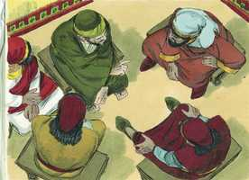 

**26** 	Portanto, no dia de hoje, vos protesto que estou limpo do sangue de todos.

**27** 	Porque nunca deixei de vos anunciar todo o conselho de Deus.

**28** 	Olhai, pois, por vós, e por todo o rebanho sobre que o Espírito Santo vos constituiu bispos, para apascentardes a igreja de Deus, que ele resgatou com seu próprio sangue.

**29** 	Porque eu sei isto que, depois da minha partida, entrarão no meio de vós lobos cruéis, que não pouparão ao rebanho;

**30** 	E que de entre vós mesmos se levantarão homens que falarão coisas perversas, para atraírem os discípulos após si.

**31** 	Portanto, vigiai, lembrando-vos de que durante três anos, não cessei, noite e dia, de admoestar com lágrimas a cada um de vós.

**32** 	Agora, pois, irmãos, encomendo-vos a Deus e à palavra da sua graça; a ele que é poderoso para vos edificar e dar herança entre todos os santificados.

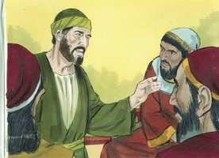 

**33** 	De ninguém cobicei a prata, nem o ouro, nem o vestuário.

**34** 	Sim, vós mesmos sabeis que para o que me era necessário a mim, e aos que estão comigo, estas mãos me serviram.

**35** 	Tenho-vos mostrado em tudo que, trabalhando assim, é necessário auxiliar os enfermos, e recordar as palavras do Senhor Jesus, que disse: Mais bem-aventurada coisa é dar do que receber.

**36** 	E, havendo dito isto, pôs-se de joelhos, e orou com todos eles.

**37** 	E levantou-se um grande pranto entre todos e, lançando-se ao pescoço de Paulo, o beijavam,

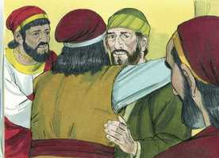 

**38** 	Entristecendo-se muito, principalmente pela palavra que dissera, que não veriam mais o seu rosto. E acompanharam-no até o navio.

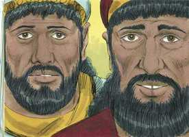 

> **Cmt MHenry** Intro: " Se o Espírito Santo tem feito ministros supervisores do rebanho, isto é, pastores, eles devem ser leais a seu cometido. Que considerem o interesse de seu Mestre pelo rebanho encarregado a seu cuidado: é a Igreja que Ele comprou com seu sangue. O sangue era o seu Enquanto Homem; tão íntima é a união da natureza divina e a humana, que aqui é chamado de sangue de Deus, porque era o sangue dAquele que é Deus. Isso lhe confere tal valor e dignidade como para resgatar os crentes de todo mal e adquirir todo o bom. Paulo falou de suas almas com afeto e preocupação.\ Estavam muito preocupados pelo que seria deles. Paulo os conduz a olhar a Deus com fé, e os encomenda à palavra da graça de Deus, não só como fundamento de sua esperança e sua fonte de gozo, senão como a regra de seu andar. Os cristãos mais amadurecidos são capazes de crescer e acharão que a palavra de graça ajuda a seu crescimento. Como os que não estão santificados não podem ser hóspedes bem-vindos para o santo Deus, assim o céu não será céu para eles, mas está assegurado para todos os que nasçam de novo, e nos quais se tem renovado a imagem de Deus, já que o poder onipotente e a verdade eterna assim o fazem. Ele se coloca a si mesmo como exemplo para eles, em não preocupar-se pelas coisas deste mundo atual; acharão que isso os ajudará para um passo cômodo através dele. Poderia parecer um ditame duro, pelo o que Paulo agrega um ditado de seu Mestre, que deseja que sempre lembrem: "Mais bem-aventurado é dar que receber". Parece que eram palavras usadas com freqüência pelos discípulos. a opinião dos filhos deste mundo é contrária a isso; eles temem dar, a menos que esperem receber. O ganho claro é para eles a coisa mais bendita que posa existir; porém Cristo nos diz que é mais bem-aventurado, mais excelente. Nos faz mais como Deus, que dá a todos e não recebe de ninguém; e como o Senhor Jesus, que andava fazendo o bem. Que também esteja em nós o sentir que havia em Cristo Jesus.\ Quando os amigos se separam, é bom que se separem orando. Os que exortam e oram, os uns pelos outros, podem ter muitas temporadas de choro e separações dolorosas, mas se reunirão perante o trono de Deus para nunca mais separar-se. Para todos foi consolo que a presença de Cristo fosse com ele e ficasse com eles. "> Os anciãos sabiam que Paulo não era homem interessado em si mesmo nem manipulador. Os que servem o Senhor em algum ofício em forma aceitável e proveitosa para o próximo, devem fazê-lo com humildade. Ele era um pregador *simples*, um que dizia a mensagem para que fosse entendida. Ele era um pregador *poderoso*, pregava o Evangelho como testemunho *em favor deles* se o recebiam, e também como testemunho *contra eles* se o rejeitavam. Era um pregador *de proveito*, que tinha o alvo de informar seus juízos e reformar seus corações e vidas. Era um pregador *fiel*, que não escondia as repreensões quando eram necessárias, nem deixava de pregar a cruz. Era um pregador verdadeiramente *cristão* *evangélico*, que não pregava acerca de temas ou noções duvidosas, nem dos assuntos de estado ou do governo civil; pregava a fé e o arrependimento. Não pode dar-se um melhor resumo dessas coisas sem as quais não há salvação: o arrependimento para com Deus, e a fé em nosso Senhor Jesus Cristo, com seus frutos e efeitos. Nenhum pecador pode escapar sem eles, e ninguém ficará fora da vida eterna com eles. Que não se pense que Paulo partiu da Ásia por medo da perseguição; ele estava esperando problemas, porém resolveu seguir avançando bem seguro de que era por mandado divino. Graças a Deus que não sabemos as coisas que nos acontecerão durante o ano, a semana, ou o dia que começou. Para o filho de Deus basta com saber que sua força será igual a seu dia. Não sabe nem quer saber que lhe trará o dia por diante. As influências poderosas do Espírito Santo enlaçam o cristão verdadeiro com seu dever. Embora espere perseguição e aflição, o amor de Cristo o constrange a seguir. Nenhuma destas coisas tirou a Paulo de sua tarefa; não o privaram de seu consolo. A atividade de nossa vida é prover para uma morte gozosa. Crendo que esta era a última vez que o veriam, ele apela a sua integridade. Tinha-lhes pregado todo o conselho de Deus. Ao pregá-lhes puramente o evangelho, o havia pregado assim, completo; ele fez fielmente sua obra, já fosse que os homens o suportassem ou o rejeitassem.> Paulo se apressou a partir para Jerusalém, mas tratou de fazer o bem no caminho, quando iam de lugar em lugar, como deve fazer todo homem bom. Muito freqüentemente devemos contrariar nossa vontade e a de nossos amigos ao fazer a obra de Deus; não devemos perder tempo com eles quando o dever nos chama a outro lugar.> Embora os discípulos liam, e meditavam, e oravam e cantavam a sós, e assim mantinham sua comunhão com Deus, de todos modos se reuniam para adorar a Deus e assim manter a comunhão de uns com outros. Reuniam-se no primeiro dia da semana, o dia do Senhor. Deve ser observado religiosamente por todos os discípulos de Cristo. ao partir o pão se comemora não só o Corpo de Cristo partido por nós, para ser sacrifício por nossos pecados; representa o corpo de Cristo partido para nós como alimento e festa para nossas almas. Nos primeiros tempos era costume receber a Ceia do Senhor a cada dia do Senhor, celebrando assim a memória da morte de Cristo.\ Paulo pregou nesta assembléia. A pregação do evangelho deve ir unida aos sacramentos. Eles estavam dispostos a ouvir, ele viu que era assim, e alargou seu sermão até a meia-noite.\ Dormir-se quando se escuta a palavra é mau indício, sinal de pouca estima da palavra de Deus. devemos fazer o que pudermos para não dormir; não dormir, senão lograr que nosso coração seja afetado pela palavra que ouvimos de forma que lancemos fora de nós o sono. a doença requer ternura, mas o desprezo merece severidade. Interrompeu a pregação do espiritual, mas para confirmar sua pregação.\ Êutico foi devolvido à vida. Como não sabiam quando teriam novamente a companhia de Paulo, a aproveitaram o melhor que puderam e reconheceram que perder uma noite de sono era bom para tal propósito. Quão raramente se perdem horas de repouso com o propósito da devoção, mas com quanta freqüência se faz pela mera diversão ou passatempo pecaminoso! Tanto custa que a vida espiritual floresça no coração do homem, e tão natural é que ali floresçam os costumes carnais!> Os tumultos ou a resistência podem constranger o cristão para sair de seu local de trabalho ou mudar seu propósito, porém sua obra e seu prazer serão os mesmos onde quer que vá. Paulo pensou que valia a pena empregar cinco dias para ir a Trôade, apesar de que deveu permanecer por sete dias, mas sabia, e assim deveríamos sabê-lo nós, redimir até o tempo de sua viagem, fazendo que se tornasse em algo proveitoso.