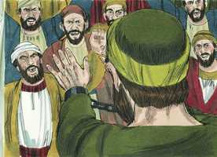
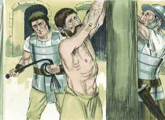
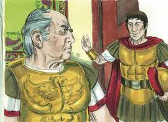
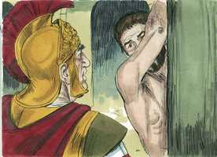

# Atos dos Apóstolos Cap 22

**1** 	HOMENS, irmãos e pais, ouvi agora a minha defesa perante vós

 

**2** 	(E, quando ouviram falar-lhes em língua hebraica, maior silêncio guardaram). E disse:

**3** 	Quanto a mim, sou judeu, nascido em Tarso da Cilícia, e nesta cidade criado aos pés de Gamaliel, instruído conforme a verdade da lei de nossos pais, zeloso de Deus, como todos vós hoje sois.

**4** 	E persegui este caminho até à morte, prendendo, e pondo em prisões, tanto homens como mulheres,

**5** 	Como também o sumo sacerdote me é testemunha, e todo o conselho dos anciãos. E, recebendo destes cartas para os irmãos, fui a Damasco, para trazer maniatados para Jerusalém aqueles que ali estivessem, a fim de que fossem castigados.

**6** 	Ora, aconteceu que, indo eu já de caminho, e chegando perto de Damasco, quase ao meio-dia, de repente me rodeou uma grande luz do céu.

**7** 	E caí por terra, e ouvi uma voz que me dizia: Saulo, Saulo, por que me persegues?

**8** 	E eu respondi: Quem és, Senhor? E disse-me: Eu sou Jesus Nazareno, a quem tu persegues.

**9** 	E os que estavam comigo viram, em verdade, a luz, e se atemorizaram muito, mas não ouviram a voz daquele que falava comigo.

 

**10** 	Então disse eu: Senhor, que farei? E o Senhor disse-me: Levanta-te, e vai a Damasco, e ali se te dirá tudo o que te é ordenado fazer.

**11** 	E, como eu não via, por causa do esplendor daquela luz, fui levado pela mão dos que estavam comigo, e cheguei a Damasco.

**12** 	E um certo Ananias, homem piedoso conforme a lei, que tinha bom testemunho de todos os judeus que ali moravam,

**13** 	Vindo ter comigo, e apresentando-se, disse-me: Saulo, irmão, recobra a vista. E naquela mesma hora o vi.

**14** 	E ele disse: O Deus de nossos pais de antemão te designou para que conheças a sua vontade, e vejas aquele Justo e ouças a voz da sua boca.

**15** 	Porque hás de ser sua testemunha para com todos os homens do que tens visto e ouvido.

**16** 	E agora por que te deténs? Levanta-te, e batiza-te, e lava os teus pecados, invocando o nome do Senhor.

**17** 	E aconteceu que, tornando eu para Jerusalém, quando orava no templo, fui arrebatado para fora de mim.

**18** 	E vi aquele que me dizia: Dá-te pressa e sai apressadamente de Jerusalém; porque não receberão o teu testemunho acerca de mim.

**19** 	E eu disse: Senhor, eles bem sabem que eu lançava na prisão e açoitava nas sinagogas os que criam em ti.

**20** 	E quando o sangue de Estêvão, tua testemunha, se derramava, também eu estava presente, e consentia na sua morte, e guardava as capas dos que o matavam.

**21** 	E disse-me: Vai, porque hei de enviar-te aos gentios de longe.

**22** 	E ouviram-no até esta palavra, e levantaram a voz, dizendo: Tira da terra um tal homem, porque não convém que viva.

 

**23** 	E, clamando eles, e arrojando de si as vestes, e lançando pó para o ar,

**24** 	O tribuno mandou que o levassem para a fortaleza, dizendo que o examinassem com açoites, para saber por que causa assim clamavam contra ele.

 

**25** 	E, quando o estavam atando com correias, disse Paulo ao centurião que ali estava: É-vos lícito açoitar um romano, sem ser condenado?

 

**26** 	E, ouvindo isto, o centurião foi, e anunciou ao tribuno, dizendo: Vê o que vais fazer, porque este homem é romano.

 

**27** 	E, vindo o tribuno, disse-lhe: Dize-me, és tu romano? E ele disse: Sim.

 

**28** 	E respondeu o tribuno: Eu com grande soma de dinheiro alcancei este direito de cidadão. Paulo disse: Mas eu o sou de nascimento.

**29** 	E logo dele se apartaram os que o haviam de examinar; e até o tribuno teve temor, quando soube que era romano, visto que o tinha ligado.

**30** 	E no dia seguinte, querendo saber ao certo a causa por que era acusado pelos judeus, soltou-o das prisões, e mandou vir os principais dos sacerdotes, e todo o seu conselho; e, trazendo Paulo, o apresentou diante deles.

> **Cmt MHenry** Intro: " Os judeus ouviram o relato que Paulo fez de sua conversão, mas a menção de que era enviado aos gentios era tão cristã a todos seus prejuízos nacionais que não quiseram ouvir mais. A frenética conduta deles assombrou ao oficial romano, que supôs que Paulo tinha perpetrado um terrível delito.\ Paulo alegou seu privilégio de cidadão romano que o eximia de todos os juízos e castigos que pudessem forçá-lo a confessar-se culpável. Sua maneira de falar demonstra claramente quanta seguridade santa e serenidade mental desfrutava.\ Como Paulo era judeu em circunstâncias adversas, o oficial romano o interrogou acerca de como tinha obtido tão valiosa distinção, mas o apóstolo lhe disse que tinha nascido livre. Valoremos a liberdade na qual nascem todos os filhos de Deus, que nenhuma soma de dinheiro, por grande que seja, pode comprar para os que continuam sem ser regenerados. Isto logo deu fim a seu problema. Deste modo, a muitos lhes é impedido fazer coisas más por temor ao homem, quando não seriam impedidos pelo temor a Deus. O apóstolo pergunta, simplesmente, "É lícito?". Sabia que o Deus ao qual servia o sustentaria em todos os sofrimentos por amor de Seu nome, porém se não era lícito, a religião do apóstolo o dirigia a evitá-lo, se possível. Ele nunca se retraiu de uma cruz que seu Mestre divino lhe colocasse em seu caminho para frente; e nunca deu um passo fora desse caminho para tomar outra. "> O apóstolo passa a relatar como foi confirmado na mudança que tinha acontecido. Tendo escolhido o Senhor o pecador, para que conheça sua vontade, é humilhado, iluminado e levado ao conhecimento de Cristo e de seu bendito Evangelho. Aqui se chama a Cristo de Justo, porque é Jesus Cristo o Justo. Os que Deus escolhe para que conheçam sua vontade, devem olhar para Jesus, porque por Ele Deus nos deu a conhecer sua boa vontade.\ O grande privilégio do evangelho, selado em nós pelo batismo, é o perdão dos pecados. Batizem-se e lavem-se de seus pecados, isto é, recebam o consolo do perdão de seus pecados em e por meio de Jesus Cristo, recebam sua justiça para esse fim, e recebam poder contra o pecado, para mortificação de suas corrupções. Batizem-se, mas não se apóiem nesse sinal, mas assegurem-se da coisa significada, da eliminação da imundícia do pecado. o grande dever do evangelho, ao qual estamos ligados por nosso batismo, é buscar o perdão de nossos pecados em nome de Cristo, dependendo dEle e de sua justiça.\ Deus designa a seus trabalhadores seu dia e lugar, e é apropriado que eles desempenhem sua designação, apesar de ser contrária à sua vontade. A providência nos administra melhor que nós mesmos; devemos encomendar-nos à direção de Deus. se Cristo mandar alguém, seu Espírito vai com ele e lhe concede que veja o fruto de seus trabalhos, mas nada pode reconciliar o coração do homem com o evangelho fora da graça especial de Deus.> O apóstolo se dirigiu à multidão enfurecida com seu estilo costumeiro de respeito e boa vontade. Paulo relata com muito detalhe a história de sua vida anterior, comenta que sua conversão foi por completo um ato de Deus. Os pecadores condenados são cegados pelo poder das trevas, e a cegueira é perdurável, como a dos judeus incrédulos. Os pecadores em convicção de pecado são cegados, como Paulo, não pelas trevas senão pela luz. Por um tempo são levados a perda dentro de si mesmos, mas é para que seu ser seja iluminado. O simples relato dos tratamentos do Senhor conosco, levando-nos da oposição a professar e fomentar seu evangelho, se for feito com um espírito e modo corretos, costuma impressionar mais que os discursos elaborados, mesmo que não equivalha a uma prova plena da verdade, como se demonstra na mudança operada no apóstolo.